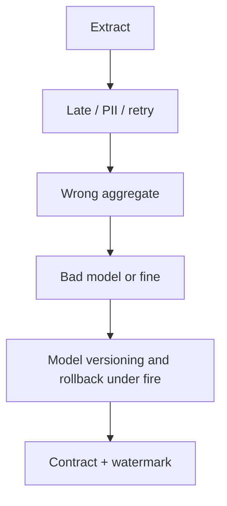

> **Lesson 179 · advanced** - A checkpoint file is not a version - you need the code, the feature spec, the label snapshot, and a one-command way back.

## Why it matters

- Training-serving skew is the polite name for “the model never saw production nulls”.
- PII in a pipeline log is a compliance incident that looks like a debug line.
- Orchestrator retries that are not idempotent duplicate billable warehouse scans.
- This lesson is specifically about **Model versioning and rollback under fire**. Tags: mlops, versioning, rollback, registry, shadow-deploy.

## Symptoms

| Signal | What you observe |
| --- | --- |
| Skew | Offline F1 0.81, online 0.54 |
| Late data | Yesterday’s events arrive after today’s aggregate closed |
| PII leak | Email in a “debug” parquet dropped in S3 |
| Retry bill | Airflow rerun scans the same partition twice |

## How it breaks



The named technology is rarely the villain. Two code paths (often a Vue/Quasar screen and a Laravel write) assume opposite contracts. Production finds the race. For this topic that contract is: A checkpoint file is not a version - you need the code, the feature spec, the label snapshot, and a one-command way back.

## Root causes

1. Feature code copied, not shared, between train and serve.
2. No watermark / allowed lateness on the job.
3. Logs stored raw request bodies.
4. Retry policy ignored destination uniqueness.

## How to solve it

### 1. Write the invariant in one sentence

A checkpoint file is not a version - you need the code, the feature spec, the label snapshot, and a one-command way back. Put that sentence in the PR, the Pinia action, and the Laravel class.

### 2. Guard the edge in code

```ts
// Admin: show pipeline run id so support can trace a bad batch
export async function pipelineStatus(runId: string) {
  return api.get(`/api/pipelines/${runId}`)
}
```

```php
ProcessPipelineJob::dispatch($runId)->onQueue('pipelines');
```

### 3. Keep a chart you will actually look at

Freshness, duplicate partition writes, and PII-scan findings. If the chart cannot catch a regression in **Model versioning and rollback under fire**, the lesson is not done.

## Worked example

A nightly job used `created_at` in local time. DST made two “days” overlap and one vanish. Storing UTC plus a watermark stopped the gap in the Quasar ops chart.

On this topic, start from the symptom in the table that matches your last incident, then walk the diagram until the guard above would have fired.

## Check before you ship

- [ ] The invariant for **Model versioning and rollback under fire** is written in one sentence.
- [ ] Empty, duplicate, timeout, or permission paths have a test or a staged rehearsal.
- [ ] A dashboard or log query would catch a regression within one deploy.
- [ ] Related reading still makes sense: training-serving-skew, feature-store-consistency, imbalanced-classification-strategies.

## What not to do

- Copy a blog snippet that retries forever or caches the error as success.
- Treat Pinia as the source of truth for a Laravel row.
- Skip the previous numbered lesson if this one feels dense — the path is beginner → intermediate → advanced on purpose.
