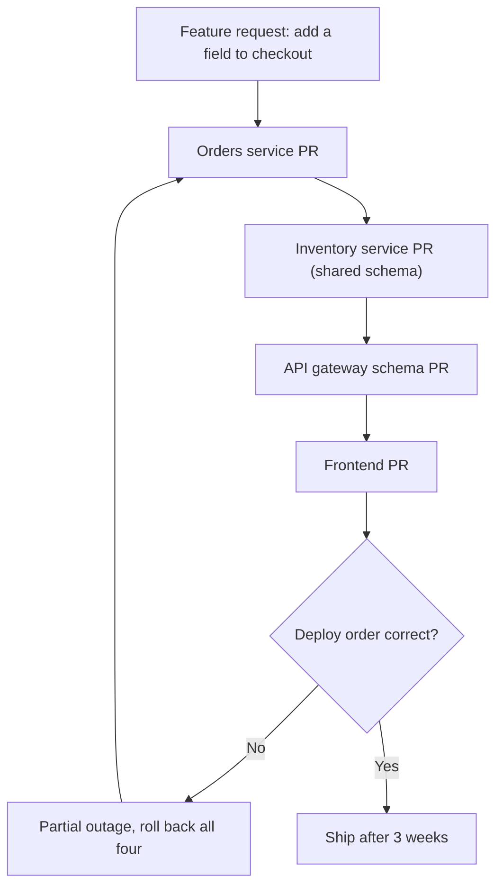
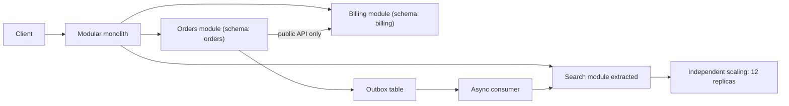

> **Scenario** - নয় জন engineer-এর একটি দল তাদের Laravel application এগারোটি service-এ ভাগ করে। ছয় মাস পর checkout flow-তে একটা field যোগ করতে চারটি repository-তে সমন্বিত deploy লাগে, local development-এ ১৪GB RAM দরকার, আর "orders" service database transaction-এর ভেতরেই "inventory" service-কে synchronously ডাকে। Feature lead time তিন দিন থেকে তিন সপ্তাহ হয়েছে।

## Why it matters

- দুই module-এর মাঝে network call function call-এর চেয়ে ১,০০০ গুণ দামি, আর এমনভাবে fail করতে পারে যা function call পারে না। আপনি compile-time error-কে runtime incident-এ বদলাচ্ছেন।
- Service boundary মানে versioned contract। ভাগের পর boundary সরাতে সমন্বিত migration লাগে; monolith-এর ভেতরে সেটা IDE-তে একটা rename।
- Team topology আর service topology একে অপরের দিকে ঝোঁকে। নয় engineer-এর এগারো service মানে কারও কিছুতে মালিকানা নেই, আর pager যায় যে জেগে আছে তার কাছে।
- Founder-দের জন্য: microservice-এর কর দেওয়া হয় feature lead time-এ, যেটা investor আর customer সত্যিই টের পান। স্বাধীন দলের স্বাধীন deploy কিনলে তা মূল্যবান - তার আগে নয়।
- উল্টো migration ভাগ করার চেয়ে অনেক বেশি দামি, তাই default হওয়া উচিত সেই option যা সিদ্ধান্তকে সস্তা রাখে।

## Symptoms

| Signal | What you observe |
|---|---|
| Deploy coupling | এক field-এর change-এ তিন বা তার বেশি repository-তে নির্দিষ্ট ক্রমে PR merge লাগে |
| Local dev | App চালাতে ডজনখানেক container সহ Docker Compose আর laptop-এর চেয়ে বেশি RAM |
| Distributed transaction | এক service নিজের transaction-এর ভেতরে অন্যকে synchronously ডাকে, network জুড়ে lock ধরে |
| Trace depth | এক user request-এ ৯ hop-এর trace আর তিনটি retry |
| Shared database | দুই "স্বাধীন" service একই টেবিল পড়ে ও লেখে |
| Change lead time | আগে দিনের কাজ এখন সপ্তাহ, scope না বেড়েই |

## How it breaks

ভাগ সাধারণত ভুল seam ধরে হয়। দল boundary আঁকে technical layer ঘিরে ("API service", "worker service") বা database টেবিল ঘিরে, একসাথে বদলায় এমন business capability ঘিরে নয়। Boundary যখন transaction কেটে যায়, তখন ভাগ ACID write-কে compensating action সহ saga বানিয়ে দেয় - আর বেশিরভাগ দল এটা জানে ভাগের পর, production-এ, যখন partial failure-এ order paid কিন্তু fulfil হয়নি অবস্থায় আটকে থাকে।

দ্বিতীয় failure shared database। দল কোড ভাগ করে কিন্তু data নয়, কারণ data ভাগ করা সত্যিই কঠিন। ফল দুই দিকের সবচেয়ে খারাপ: monolith-এর coupling (এক schema change দুই deploy ভাঙে) আর distribution-এর operational খরচ (network call, আলাদা pipeline, আলাদা on-call)। এই আকৃতির নাম আছে - distributed monolith - আর এটা যে monolith-কে সরিয়েছে তার চেয়েও খারাপ।



## Root causes

1. Business capability নয়, technical layer বা টেবিল ঘিরে boundary আঁকা।
2. কোড ভাগের পরও shared database রাখা, ফলে service-রা schema দিয়ে coupled।
3. Transaction-এর ভেতরে synchronous call, যা local consistency-কে কেউ ডিজাইন করেনি এমন distributed consistency-তে বদলায়।
4. দলের চেয়ে বেশি service, ফলে ownership পাতলা আর কোনো service-এর স্পষ্ট on-call owner নেই।
5. যে component কখনো bottleneck ছিল না, তাকে scale করার জন্য ভাগ।
6. আগে monolith-এর ভেতরে module boundary না থাকা, তাই seam স্থায়ী করার আগে সেগুলো আবিষ্কারই হয়নি।

## How to solve it

### 1. আগে monolith-এর ভেতরেই module boundary enforce করুন

Diagram দেখে সঠিক service boundary পাওয়া যায় না। Internal boundary enforce করে দেখুন কোথায় violation জমে - সেখানেই উত্তর।

```json
// .eslintrc.json - modules may only import each other's public entry point.
{
  "rules": {
    "no-restricted-imports": ["error", {
      "patterns": [
        {
          "group": ["@app/billing/internal/*", "@app/orders/internal/*"],
          "message": "Import the module's public index, not its internals."
        }
      ]
    }]
  }
}
```

PHP-তে Deptrac দিয়ে একই শৃঙ্খলা:

```yaml
# deptrac.yaml - a dependency violation fails CI, exactly like a type error.
deptrac:
  layers:
    - name: Orders
      collectors: [{ type: directory, value: app/Domain/Orders/.* }]
    - name: Billing
      collectors: [{ type: directory, value: app/Domain/Billing/.* }]
  ruleset:
    Orders: [Billing]   # Orders may call Billing's public API.
    Billing: []         # Billing may not call Orders at all.
```

ছয় মাস এভাবে চালালে যে module কখনো ruleset ভাঙে না সেটাই extraction candidate। যেটা প্রতিনিয়ত ভাঙে সেটা বলছে ওরা দুই নয়, এক module।

### 2. কোডের আগে data ভাগ করুন, নয়তো ভাগ করবেন না

যে service নিজের data-র মালিক নয় সেটা service নয়। Extract করার আগে module-কে নিজের schema দিন আর প্রতিটি cross-schema join সরান।

```sql
-- Step 1: the module gets its own schema, still in the same physical database.
CREATE SCHEMA billing;
ALTER TABLE invoices SET SCHEMA billing;

-- Step 2: revoke the other module's access. Cross-module reads must go through code.
REVOKE ALL ON ALL TABLES IN SCHEMA billing FROM orders_role;

-- Step 3: any query that now fails was an undeclared coupling. Fix it in the monolith,
-- where fixing it is a refactor rather than a distributed migration.
```

বেশিরভাগ ভাগের এখানেই থেমে যাওয়া উচিত। Schema ownership enforce করা modular monolith সাংগঠনিক সুবিধার বেশিরভাগটাই দেয়, operational খরচ ছাড়াই।

### 3. লিখিত আসল কারণ সহ একটি service extract করুন

বৈধ কারণ: মাপা সংখ্যাসহ স্বাধীন scaling profile, ভিন্ন compliance boundary, ভিন্ন runtime প্রয়োজন, বা এমন দল যাদের সত্যিই স্বাধীন deploy cadence লাগে। "Microservice হলো best practice" কোনো কারণ নয়। যে measurement সিদ্ধান্তটি এনেছে তা সহ ADR লিখে রাখুন।

### 4. Transaction-এর ভেতরে কখনো synchronous call নয়

```php
// Wrong: holds a row lock across a network call with a 30s timeout.
DB::transaction(function () use ($order) {
    $order->markPaid();
    $this->inventoryClient->reserve($order->items);  // network inside the lock
});

// Right: commit locally, publish an event from the same transaction via the outbox.
DB::transaction(function () use ($order) {
    $order->markPaid();
    Outbox::publish('order.paid', ['order_id' => $order->id, 'items' => $order->items]);
});
// A consumer reserves inventory and emits order.reservation_failed for compensation.
```

### 5. যে কর দিচ্ছেন তা মাপুন

```promql
# Fan-out per user request. Above ~5 downstream calls, tail latency is dominated
# by the slowest dependency and every retry multiplies load.
histogram_quantile(0.95,
  sum by (le, route) (rate(request_downstream_calls_bucket[10m]))
)
```

প্রতিটি service-এর change lead time-ও মাপুন। কোনো "microservice" অন্যটি ছাড়া deploy না হলে সেটা স্বাধীন নয় - সুবিধা ছাড়াই খরচ দিচ্ছেন।

## Target design



## Tradeoffs

| Option | Pros | Cons | Choose when |
|---|---|---|---|
| Module ছাড়া একক monolith | দ্রুততম; refactor সহজ | Coupling নীরবে বাড়ে; এক দল আরেক দলকে আটকায় | Product-market fit-এর আগে, ~৫ engineer-এর কম |
| Enforced boundary সহ modular monolith | Compile-time boundary check; এক deploy; ফেরানো সস্তা | Shared runtime ও blast radius; এক ভাষা | ৫-৫০ জনের দলের default |
| বাছাই করা extraction | যেখানে মাপা হয়েছে সেখানে স্বাধীন scaling; ছোট operational surface | একসাথে দুই operating model | সত্যিই ভিন্ন profile-এর component |
| পূর্ণ microservices | দল-প্রতি স্বাধীন deploy ও scaling | Distributed transaction, tracing, service-প্রতি on-call | যাদের deploy cadence সত্যিই সংঘাত করে এমন অনেক দল |

## Verification checklist

- [ ] Dependency linter (Deptrac, ESLint boundaries, ArchUnit) CI-তে চলে আর ইচ্ছাকৃত violation-এ fail করে।
- [ ] প্রতিটি module এমন schema-র মালিক যা অন্য module সরাসরি পড়তে পারে না; revoked grant দিয়ে যাচাই করা।
- [ ] খোলা database transaction-এর ভেতরে কোনো synchronous cross-service call নেই; trace query দিয়ে দেখুন।
- [ ] Module বা service-প্রতি change lead time মাপা হয় আর শেষ extraction-এর পর খারাপ হয়নি।
- [ ] প্রতিটি extracted service-এর নামসহ owning team ও নিজস্ব on-call rotation আছে।
- [ ] সবচেয়ে সাধারণ workflow-এর local development বিশেষ hardware ছাড়া laptop-এ চলে।

## Anti-patterns

- এক shared database রেখে service-এ ভাগ করা - সব খরচ, কোনো সুবিধা নেই এমন distributed monolith।
- Conference talk-এর পরামর্শে service extract করা, মাপা scaling বা সাংগঠনিক কারণ ছাড়া।
- দলের চেয়ে বেশি service বানানো, ফলে ownership নামমাত্র।
- Function call-কে synchronous HTTP call বানিয়ে সেটাকে decoupling বলা; boundary নয়, একটা failure mode যোগ করেছেন।
- একটা service extract করে শেখার বদলে পুরো সিস্টেম একবারে "big bang" ভাগ করা।

## Related

- [Architecture decision records that get read](/systems/product-platform/architecture-decision-records)
- [Strangler fig migrations that finish](/systems/product-platform/strangler-fig-migration)
- [Running an internal platform as a product](/systems/product-platform/internal-platform-as-product)
