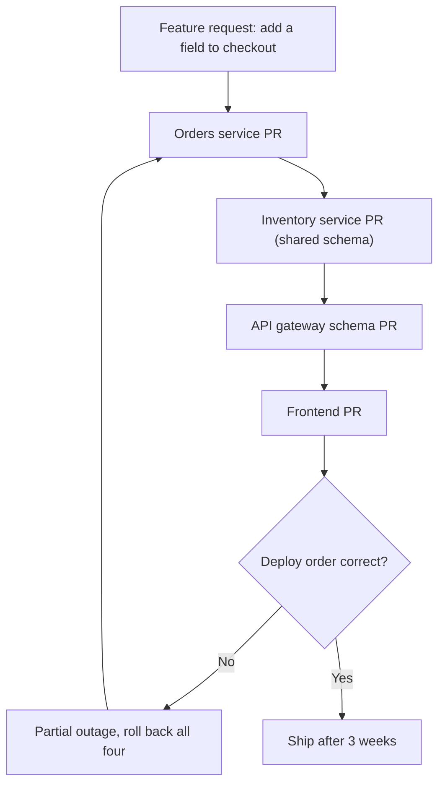
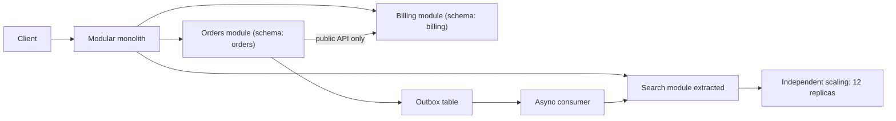

> **Scenario** — A nine-engineer team splits its Laravel application into eleven services. Six months later, adding a field to the checkout flow requires coordinated deploys across four repositories, local development needs 14GB of RAM, and the "orders" service calls the "inventory" service synchronously inside a database transaction. Feature lead time has gone from three days to three weeks.

## Why it matters

- A network call between two modules costs 1,000x more than a function call and can fail in ways a function call cannot. You are trading compile-time errors for runtime incidents.
- Service boundaries are versioned contracts. Moving a boundary after the split requires a coordinated migration; moving it inside a monolith is a rename in your IDE.
- Team topology and service topology tend to converge. Eleven services owned by nine engineers means nobody owns anything, and the pager routes to whoever is awake.
- For founders: the microservice tax is paid in feature lead time, which is the metric investors and customers actually feel. It is worth paying when it buys independent deploys for independent teams — and not before.
- The reverse migration is far more expensive than the split, so the default should be the option that keeps the decision cheap.

## Symptoms

| Signal | What you observe |
|---|---|
| Deploy coupling | A one-field change requires merging PRs in three or more repositories in a specific order |
| Local dev | Running the app needs Docker Compose with a dozen containers and more RAM than a laptop has |
| Distributed transactions | A service calls another synchronously inside its own transaction, holding locks across the network |
| Trace depth | A single user request produces a 9-hop trace with three retries |
| Shared database | Two "independent" services read and write the same table |
| Change lead time | Weeks for changes that used to take days, with no increase in scope |

## How it breaks

The split usually happens along the wrong seams. Teams draw boundaries around technical layers ("the API service", "the worker service") or around database tables, rather than around business capabilities that change together. When a boundary cuts through a transaction, the split converts an ACID write into a saga with compensating actions — and most teams discover this after the split, in production, when a partial failure leaves an order paid but not fulfilled.

The second failure is the shared database. Teams split the code but not the data because splitting data is genuinely hard. The result is the worst of both: the coupling of a monolith (one schema change breaks two deploys) plus the operational cost of distribution (network calls, separate pipelines, separate on-call). This shape is common enough to have a name — the distributed monolith — and it is strictly worse than the monolith it replaced.



## Root causes

1. Boundaries drawn around technical layers or tables instead of business capabilities.
2. A shared database retained after the code split, so services are coupled through the schema.
3. Synchronous calls inside transactions, converting local consistency into a distributed one nobody designed.
4. More services than teams, so ownership is diluted and no service has a clear on-call owner.
5. The split motivated by scaling a component that was never the bottleneck.
6. No module boundaries inside the monolith first, so the seams were never discovered before they were made permanent.

## How to solve it

### 1. Enforce module boundaries inside the monolith first

You cannot find the right service boundaries by reading a diagram. Find them by enforcing internal boundaries and observing where the violations pile up.

```json
// .eslintrc.json — modules may only import each other's public entry point.
{
  "rules": {
    "no-restricted-imports": ["error", {
      "patterns": [
        {
          "group": ["@app/billing/internal/*", "@app/orders/internal/*"],
          "message": "Import the module's public index, not its internals."
        }
      ]
    }]
  }
}
```

For PHP, the same discipline with Deptrac:

```yaml
# deptrac.yaml — a dependency violation fails CI, exactly like a type error.
deptrac:
  layers:
    - name: Orders
      collectors: [{ type: directory, value: app/Domain/Orders/.* }]
    - name: Billing
      collectors: [{ type: directory, value: app/Domain/Billing/.* }]
  ruleset:
    Orders: [Billing]   # Orders may call Billing's public API.
    Billing: []         # Billing may not call Orders at all.
```

After six months of this, the modules that never violate the ruleset are your extraction candidates. The ones that violate it constantly are telling you they are one module, not two.

### 2. Split data before code, or do not split

A service that does not own its data is not a service. Before extracting, give the module its own schema and remove every cross-schema join.

```sql
-- Step 1: the module gets its own schema, still in the same physical database.
CREATE SCHEMA billing;
ALTER TABLE invoices SET SCHEMA billing;

-- Step 2: revoke the other module's access. Cross-module reads must go through code.
REVOKE ALL ON ALL TABLES IN SCHEMA billing FROM orders_role;

-- Step 3: any query that now fails was an undeclared coupling. Fix it in the monolith,
-- where fixing it is a refactor rather than a distributed migration.
```

This step is where most splits should stop. A modular monolith with enforced schema ownership captures most of the organisational benefit at none of the operational cost.

### 3. Extract one service, with a real reason written down

Valid reasons: an independent scaling profile with measured numbers, a different compliance boundary, a different runtime requirement, or a team that genuinely needs an independent deploy cadence. "Microservices are best practice" is not a reason. Record the choice as an ADR with the measurement that motivated it.

### 4. Never call synchronously inside a transaction

```php
// Wrong: holds a row lock across a network call with a 30s timeout.
DB::transaction(function () use ($order) {
    $order->markPaid();
    $this->inventoryClient->reserve($order->items);  // network inside the lock
});

// Right: commit locally, publish an event from the same transaction via the outbox.
DB::transaction(function () use ($order) {
    $order->markPaid();
    Outbox::publish('order.paid', ['order_id' => $order->id, 'items' => $order->items]);
});
// A consumer reserves inventory and emits order.reservation_failed for compensation.
```

### 5. Measure the tax you are paying

```promql
# Fan-out per user request. Above ~5 downstream calls, tail latency is dominated
# by the slowest dependency and every retry multiplies load.
histogram_quantile(0.95,
  sum by (le, route) (rate(request_downstream_calls_bucket[10m]))
)
```

Track change lead time per service too. If a "microservice" cannot be deployed without another one, it is not independent, and you are paying the cost without the benefit.

## Target design



## Tradeoffs

| Option | Pros | Cons | Choose when |
|---|---|---|---|
| Single monolith, no modules | Fastest to build; trivial refactoring | Coupling grows silently; one team blocks another | Pre-product-market fit, under ~5 engineers |
| Modular monolith with enforced boundaries | Compile-time boundary checks; one deploy; cheap to reverse | Shared runtime and blast radius; one language | Default for teams of 5-50 |
| Selective extraction | Independent scaling where it is measured; small operational surface | Two operating models to run at once | A component with a genuinely different profile |
| Full microservices | Independent deploys and scaling per team | Distributed transactions, tracing, per-service on-call | Many teams whose deploy cadences actually conflict |

## Verification checklist

- [ ] A dependency linter (Deptrac, ESLint boundaries, ArchUnit) runs in CI and currently fails on a deliberate violation.
- [ ] Every module owns a schema no other module can read directly; verified by revoked grants.
- [ ] No synchronous cross-service call happens inside an open database transaction; check with a trace query.
- [ ] Change lead time is tracked per module or service and has not regressed since the last extraction.
- [ ] Each extracted service has a named owning team and its own on-call rotation.
- [ ] Local development for the most common workflow runs on a laptop without special hardware.

## Anti-patterns

- Splitting into services while keeping one shared database — a distributed monolith with all costs and no benefits.
- Extracting a service because a conference talk recommended it, without a measured scaling or organisational driver.
- Creating more services than you have teams, so ownership is nominal.
- Replacing a function call with a synchronous HTTP call and calling it decoupling; you added a failure mode, not a boundary.
- Doing a "big bang" split of the whole system at once instead of extracting one service and learning from it.

## Related

- [Architecture decision records that get read](/systems/product-platform/architecture-decision-records)
- [Strangler fig migrations that finish](/systems/product-platform/strangler-fig-migration)
- [Running an internal platform as a product](/systems/product-platform/internal-platform-as-product)
