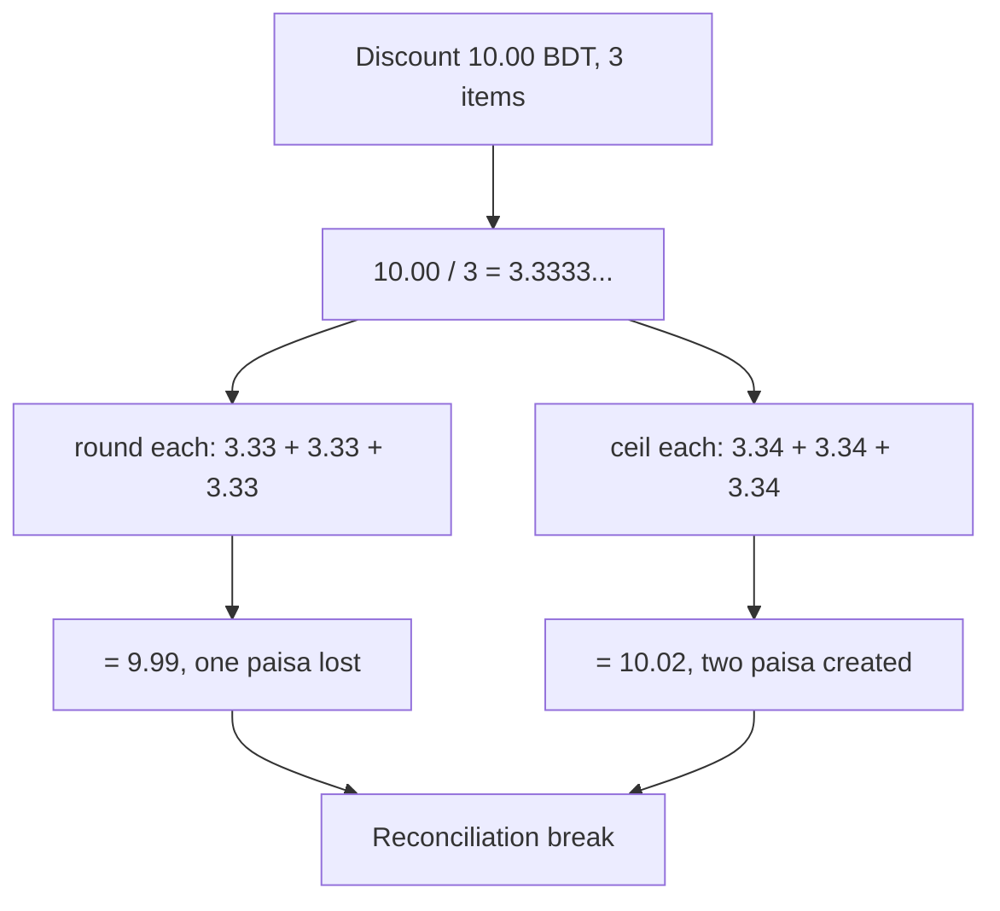
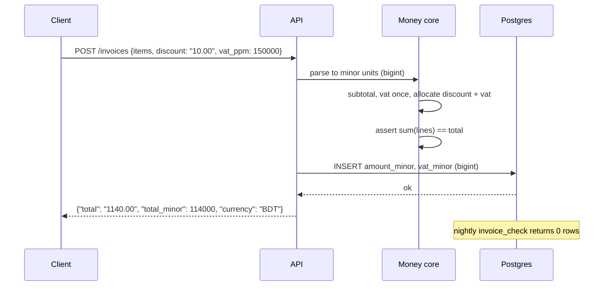

> **Scenario** - An invoice for 1,000.00 BDT has a 15% VAT line and a 10.00 BDT discount split across three items. Finance reports that 1,140 invoices in March are off by 0.01 BDT, and 12 are off by 0.03. Nothing crashed. The sum of the line items simply does not equal the stored invoice total.

## Why it matters

- Binary floating point cannot represent most decimal fractions. `0.1 + 0.2 === 0.3` is `false`, and the actual value is `0.30000000000000004`.
- One-paisa errors are not harmless: they fail reconciliation, break payment-gateway signature checks that hash the amount string, and trigger audit findings.
- Rounding a total and rounding its parts give different answers. Someone has to decide which one is authoritative, and write it down.
- Currencies have different minor-unit exponents: BDT and USD use 2, JPY uses 0, and KWD, BHD, and JOD use 3. Hardcoding `* 100` is wrong for a third of the world.
- `toFixed` and naive `round` are half-even or half-up depending on the runtime and on the exact binary value. `(1.005).toFixed(2)` returns `"1.00"` in JavaScript because 1.005 is stored as 1.00499999999999989.

## Symptoms

| Signal | What you observe |
|---|---|
| Sum mismatch | `SUM(line_total) <> invoice.total` for a small percentage of rows |
| Drifting balances | Ledger `SUM(debit) - SUM(credit)` is 0.02 instead of 0 |
| Signature failures | Gateway rejects `amount=1140.0000000001` in an HMAC payload |
| Unstable display | The same amount renders as `1,140.00` in the UI and `1140.0000000000001` in a CSV |
| Comparison bugs | `if (paid === due)` never true, so an invoice never closes |
| Currency errors | JPY amounts shown with two decimals; KWD truncated from 3 to 2 |
| Repro difficulty | Only certain quantities and rates trigger it; unit tests with 1.00 and 2.00 pass |

## How it breaks

A 64-bit double has 53 bits of mantissa. `0.1` is stored as `0.1000000000000000055511151231257827…`, so any decimal arithmetic accumulates error. The second, larger problem is *allocation*: 10.00 BDT split three ways is 3.3333… each. Rounding each to 3.33 gives 9.99, losing a paisa; rounding each up gives 10.02. There is no rounding mode that fixes this, because the requirement is not "round each part" but "make the parts sum to the whole". Add a 15% VAT computed independently per line and the discrepancy compounds.



## Root causes

1. Money stored as `FLOAT` or `DOUBLE` in the database, or as a JS `number` in the application.
2. Rounding applied per line item without any allocation step that forces the parts to sum to the total.
3. Currency minor-unit exponent hardcoded as 2.
4. Rounding mode unspecified, so different layers (app, DB, report) disagree.
5. Percentages applied to already-rounded intermediate values, compounding error.
6. Equality comparisons on floats instead of on integers or fixed-scale decimals.
7. Money serialized as a JSON number, which forces a float round-trip at every hop.

## How to solve it

### 1. Represent money as integer minor units, with the currency attached

```ts
type Currency = 'BDT' | 'USD' | 'JPY' | 'KWD'

const MINOR_UNITS: Record<Currency, number> = {
  BDT: 2, USD: 2, JPY: 0, KWD: 3,
}

type Money = { readonly amount: bigint; readonly currency: Currency }

function money(major: string, currency: Currency): Money {
  const exp = MINOR_UNITS[currency]
  const [whole, frac = ''] = major.split('.')
  if (frac.length > exp) throw new Error(`${major} has more than ${exp} decimals for ${currency}`)
  const padded = frac.padEnd(exp, '0')
  return { amount: BigInt(whole + padded), currency }
}

function add(a: Money, b: Money): Money {
  if (a.currency !== b.currency) throw new Error('currency mismatch')
  return { amount: a.amount + b.amount, currency: a.currency }
}

function format(m: Money): string {
  const exp = MINOR_UNITS[m.currency]
  if (exp === 0) return m.amount.toString()
  const s = m.amount.toString().padStart(exp + 1, '0')
  return `${s.slice(0, -exp)}.${s.slice(-exp)}`
}

console.log(0.1 + 0.2)                                   // 0.30000000000000004
console.log(format(add(money('0.10', 'BDT'), money('0.20', 'BDT'))))  // '0.30'
console.log(money('100', 'JPY').amount)                  // 100n, not 10000n
console.log(money('1.500', 'KWD').amount)                // 1500n
```

`bigint` removes the precision question entirely. Everything downstream - comparison, summation, equality - becomes exact integer arithmetic.

### 2. Allocate remainders explicitly (largest remainder method)

```python
from decimal import Decimal

def allocate(total_minor: int, weights: list[int]) -> list[int]:
    """Split total_minor across weights so the parts sum exactly to the total."""
    weight_sum = sum(weights)
    base = [total_minor * w // weight_sum for w in weights]
    remainder = total_minor - sum(base)
    # Give the leftover minor units to the largest fractional remainders first
    order = sorted(
        range(len(weights)),
        key=lambda i: (total_minor * weights[i]) % weight_sum,
        reverse=True,
    )
    for i in order[:remainder]:
        base[i] += 1
    return base

print(allocate(1000, [1, 1, 1]))        # [334, 333, 333] -> sums to 1000 (10.00 BDT)
print(allocate(1000, [50, 30, 20]))     # [500, 300, 200]
print(sum(allocate(10_00, [7, 11, 13])))  # 1000, always
```

The invariant `sum(allocate(t, w)) == t` is what makes reconciliation pass. Assert it in a property test.

### 3. Use exact decimal types in the database

```sql
-- Postgres
CREATE TABLE invoice_lines (
  id            bigserial PRIMARY KEY,
  invoice_id    bigint      NOT NULL,
  currency      char(3)     NOT NULL,
  -- integer minor units; no scale ambiguity, no float
  amount_minor  bigint      NOT NULL,
  vat_minor     bigint      NOT NULL,
  CONSTRAINT amount_nonneg CHECK (amount_minor >= 0)
);

-- If you must use decimals, pin the scale and never use float
-- MySQL: DECIMAL(19,4) NOT NULL  -- never FLOAT or DOUBLE

-- Enforce the invariant in the database, not just the app
CREATE OR REPLACE VIEW invoice_check AS
SELECT i.id,
       i.total_minor,
       COALESCE(SUM(l.amount_minor + l.vat_minor), 0) AS lines_minor
FROM invoices i
LEFT JOIN invoice_lines l ON l.invoice_id = i.id
GROUP BY i.id, i.total_minor
HAVING i.total_minor <> COALESCE(SUM(l.amount_minor + l.vat_minor), 0);
```

A nightly query against `invoice_check` that returns zero rows is a much stronger guarantee than any amount of application testing.

### 4. Compute percentages on unrounded values, round once

15% VAT on 1,000.00 BDT is 150.00 BDT. 15% VAT on three lines of 333.33, 333.33, 333.34 computed independently is 49.9995 + 49.9995 + 50.001 → rounded per line as 50.00 + 50.00 + 50.00 = 150.00, which happens to work. It does not always work. Compute VAT on the invoice subtotal, then allocate it across lines with the same allocation function.

```php
// PHP: integer minor units, one rounding point
function vatMinor(int $subtotalMinor, int $ratePpm): int
{
    // ratePpm = 150000 for 15%, expressed in parts per million
    return intdiv($subtotalMinor * $ratePpm + 500_000, 1_000_000); // half-up
}

assert(vatMinor(100_000, 150_000) === 15_000); // 1000.00 -> 150.00 BDT
```

Rates in parts per million keep the intermediate product an integer, so there is no float anywhere in the path.

### 5. Pick a rounding mode and name it in the schema

`ROUND_HALF_UP` matches most tax authorities' guidance; `ROUND_HALF_EVEN` (banker's rounding) minimizes bias over many operations. Choose per jurisdiction, store the choice with the document, and never let a library default decide.

### 6. Serialize money as a string, never a JSON number

```json
{ "amount": "1140.00", "currency": "BDT", "amount_minor": 114000 }
```

Sending `1140.00` as a JSON number lets every parser in the chain round-trip it through a double.

## Target design



## Tradeoffs

| Option | Pros | Cons | Choose when |
|---|---|---|---|
| Integer minor units (`bigint`) | Exact, fast, no library | Manual currency-exponent handling; overflow at ~9.2e18 | Transactional money, ledgers |
| Fixed-scale decimal (`DECIMAL(19,4)`) | Exact, readable, DB-native aggregation | Scale must be chosen up front; slower than int | Reporting, multi-currency stores |
| Arbitrary-precision decimal library | Handles rates and FX cleanly | Allocation still manual; per-op cost | Interest, FX, tax engines |
| Float with epsilon comparison | No refactor needed | Silently wrong; errors accumulate | Never for money |
| Round per line item | Simple, local | Parts do not sum to the whole | Only with an allocation pass afterwards |
| Allocate with largest remainder | Sums exactly; deterministic | Individual lines can differ by one minor unit | Discounts, tax, revenue splits |

## Verification checklist

- [ ] `information_schema` query confirms no `float`, `double`, or `real` column holds money.
- [ ] Property test: for 10,000 random totals and weight vectors, `sum(allocate(t, w)) == t`.
- [ ] Test cases for JPY (0 decimals), BDT (2), and KWD (3) all round-trip through the API.
- [ ] `(1.005).toFixed(2)` is not used anywhere; `grep -r 'toFixed' src/` reviewed line by line.
- [ ] Nightly `invoice_check` view returns zero rows; an alert fires if it does not.
- [ ] A ledger integrity query asserting `SUM(debit_minor) = SUM(credit_minor)` per transaction runs in CI against seed data.
- [ ] API responses carry `amount_minor` and `currency`, and money strings are quoted in JSON.
- [ ] The rounding mode is documented per jurisdiction and covered by a test with a `.005` case.

## Anti-patterns

- `Math.round(x * 100) / 100` as the rounding strategy - this is float arithmetic with extra steps.
- Comparing money with a tolerance (`Math.abs(a - b) < 0.001`), which hides real one-paisa bugs.
- Storing amounts as `DECIMAL` but doing the arithmetic in the application as floats.
- Multiplying by 100 to get minor units, breaking JPY and KWD.
- Applying a discount percentage, rounding, then applying VAT to the rounded value, then rounding again.
- Letting the reporting layer re-round aggregates, so the report and the ledger disagree by construction.
- Fixing a reconciliation break by inserting a rounding-adjustment row without fixing the allocation logic.

## Related

- [Unicode and encoding edge cases](/systems/reliability-edge-cases/unicode-and-encoding-edge-cases)
- [Duplicate submission prevention](/systems/reliability-edge-cases/duplicate-submission-prevention)
- [Leap days and calendar edge cases](/systems/reliability-edge-cases/leap-day-and-calendar-edge-cases)
