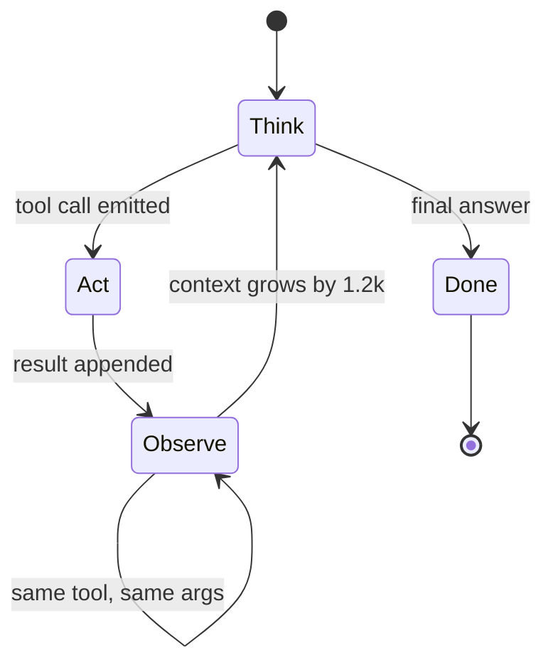
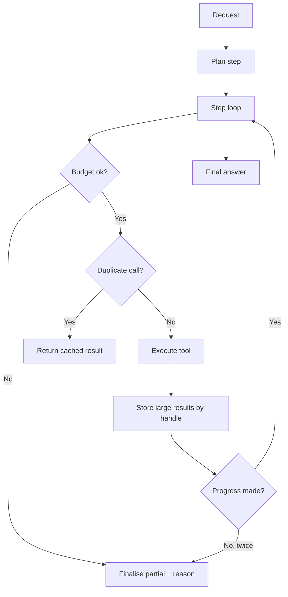

> **Scenario** - একটি research agent-কে বলা হলো "সব open incident আর তাদের root cause summarise করো।" সে ৬১টি step চালায়, একই তিনটি document নয়বার পড়ে, আর এক request-এ $87 পুড়িয়ে ফেলে। একই দুপুরে আরও দুইশো অনুরূপ request আসে।

## Why it matters

- Agent loop-এ context quadratically বাড়ে। প্রতিটি step tool result history-তে যোগ করে, আর পরের প্রতিটি step পুরো history আবার পাঠায়। মোট token step সংখ্যার বর্গের সাথে বাড়ে, linearly নয়।
- একটিমাত্র unbounded request স্বাভাবিক এক মাসের ব্যবহারের চেয়ে বেশি খরচ করতে পারে। আপনি নিজে না বানালে কোনো স্বাভাবিক ceiling নেই।
- যে loop থামে না আর যে loop এখনো কাজ করছে - দুটো দেখতে একরকম। Progress signal ছাড়া timeout-ই একমাত্র stop condition, আর সেটা টাকা খরচ হয়ে যাওয়ার পরে বাজে।
- Latency জমে। প্রতি step ১.৮s ধরে ষাটটি step মানে ১০৮ সেকেন্ড wall clock, যেকোনো যুক্তিসঙ্গত request timeout-এর অনেক বাইরে।
- Concurrency limit আসলে capacity limit। Little's Law অনুযায়ী `concurrency = arrival rate × duration`; লম্বা agent run সেই worker slot খায় যা ছোট request-এর দরকার।

## Symptoms

| Signal | What you observe |
|---|---|
| Cost tail | p99 request cost median-এর ৪০ গুণ |
| Step distribution | bimodal histogram: বেশিরভাগ run step ৬-এ শেষ, একটি tail cap পর্যন্ত যায় |
| Repetition | প্রতি run-এ একই tool একই argument দিয়ে তিন বা তারও বেশি বার |
| Token growth | step *n*-এ `prompt_tokens` মোটামুটি *n*-এর সমানুপাতিক |
| Saturation | গুটিকয় দীর্ঘ agent request-এই worker pool নিঃশেষ |

## How it breaks

সরল loop-টি এমন: model ডাকো, tool call থাকলে চালাও, result যোগ করো, আবার করো। কেউ progress মাপে না। Model অনিশ্চিত হলে তার হাতের সবচেয়ে সস্তা কাজ আরেকটি retrieval, তাই সে আবার retrieve করে - সামান্য ভিন্ন query দিয়ে, সামান্য ভিন্ন chunk পেয়ে, context বাড়িয়ে, আর নিজের বিভ্রান্তি বাড়িয়ে।

Token-এর হিসাব নির্দয়। ধরুন base prompt ২,০০০ token আর প্রতিটি tool result যোগ করে ১,২০০। step *n*-এ prompt হয় `2000 + 1200(n-1)`। ৬০ step-এ যোগ করলে প্রায় ২.২M input token। প্রতি মিলিয়ন $3.00 হলে প্রতি run-এ শুধু input বাবদ $6.60, output আলাদা - আর বড় model বা মোটা tool result সরাসরি এটাকে গুণ করে।



## Root causes

1. Loop-এ step cap আছে কিন্তু token বা টাকার budget নেই, আর cap-টাও অনেক বেশি রাখা।
2. Tool result summarise বা handle দিয়ে reference না করে হুবহু যোগ করা হয়।
3. Duplicate-call detector নেই, তাই agent অনির্দিষ্টকাল একই state-এ ফিরে আসতে পারে।
4. কোনো progress signal নেই - "এগোচ্ছে" আর "ঘুরপাক খাচ্ছে" আলাদা করার কিছু নেই।
5. খরচ মাপা হয় পুরো product-এর মাসিক হিসেবে, কখনো per request নয়, তাই tail অদৃশ্য।

## How to solve it

### 1. শুধু step নয়, token ও টাকায় budget করুন

```python
@dataclass
class RunBudget:
    max_steps: int = 12
    max_input_tokens: int = 120_000
    max_cost_usd: float = 0.75
    deadline: float = field(default_factory=lambda: time.monotonic() + 45.0)

    def check(self, step: int, tokens: int, spent: float) -> str | None:
        if step >= self.max_steps: return "step_cap"
        if tokens >= self.max_input_tokens: return "token_cap"
        if spent >= self.max_cost_usd: return "cost_cap"
        if time.monotonic() >= self.deadline: return "deadline"
        return None
```

Budget ছাড়ালে error page নয়, সৎ নোটসহ সেরা partial উত্তর ফেরত দিন। আটটি incident-এর আংশিক summary একটি timeout-এর চেয়ে অনেক বেশি কাজের।

### 2. Tool result value নয়, handle হিসেবে রাখুন

```python
def observe(result: str) -> str:
    if ntokens(result) <= 400:
        return result
    handle = store.put(result)                      # full text in Redis, 1h TTL
    head = result[:800]
    return f"[{handle}] first 800 chars:\n{head}\n(use read_handle('{handle}') for the rest)"
```

শুধু এটুকুই quadratic বৃদ্ধি সমতল করে দেয়: history-তে ১,২০০ token-এর blob নয়, ২০০ token-এর reference জমে।

### 3. পুনরাবৃত্ত call ধরুন ও short-circuit করুন

```python
seen: dict[str, str] = {}

def execute(call) -> str:
    key = f"{call.name}:{json.dumps(call.args, sort_keys=True)}"
    if key in seen:
        return f"Already called this exact tool. Previous result: {seen[key][:300]}"
    result = HANDLERS[call.name](**call.args)
    seen[key] = result
    return result
```

### 4. ঘোষিত plan চান এবং তার বিপরীতে progress মিলিয়ে দেখুন

Step ১-এ model-এর কাছে numbered plan চান, তারপর প্রতিটি পরের step-কে বলুন সে plan-এর কোন item এগোচ্ছে তা জানাতে। পরপর দুটি step কিছুই না এগোলে থামুন এবং যা আছে তা ফেরত দিন।

```ts
if (step.advancesPlanItem === previous.advancesPlanItem && step.newFactsFound === 0) {
  stalledSteps += 1
  if (stalledSteps >= 2) return finalise(partialResults, 'no_progress')
}
```

### 5. পুরো agent-এর চারপাশে circuit breaker রাখুন

সাম্প্রতিক traffic-এ p95 run cost বা step count threshold ছাড়ালে নতুন request-কে single-shot RAG-এ নামিয়ে দিন। ১৪:০০-এ ship করা একটি খারাপ prompt template ১৫:০০-এর মধ্যে মাসের budget শেষ করে দেবে না।

### 6. Concurrency সচেতনভাবে বাঁধুন

Little's Law অনুযায়ী প্রতিটি ৪০s-এর ২০০টি সমান্তরাল agent run-এর জন্য প্রতি ৪০s window-তে `200 × 40 = 8,000` worker-second লাগে - মানে ২০০ worker। Bounded depth-এর queue রাখুন আর load shed করুন, agent-দের interactive traffic অনাহারে রাখতে দেবেন না।

## Target design



## Tradeoffs

| Option | Pros | Cons | Choose when |
|---|---|---|---|
| Single-shot RAG | পূর্বানুমেয় খরচ ও latency | multi-hop প্রশ্ন ভাঙতে পারে না | বেশিরভাগ user-facing Q&A |
| Bounded agent loop | budget-এর ভেতরে multi-hop সামলায় | budget plumbing ও partial answer লাগে | research বা triage assistant |
| Unbounded loop | মাঝেমধ্যে কঠিন কাজ সমাধা করে | সীমাহীন খরচ, সীমাহীন latency | কড়া timeout সহ offline batch job |
| Handle-ভিত্তিক observation | context বৃদ্ধি সমতল | বাড়তি store ও বাড়তি tool | tool result নিয়মিত ৪০০ token ছাড়ায় |
| Human-in-the-loop gate | লাগামছাড়া plan ধরে ফেলে | real-time নয় | high-stakes বা ব্যয়বহুল workflow |

## Verification checklist

- [ ] Per-request খরচ রেকর্ড এবং p99 alert কনফিগার করা।
- [ ] ইচ্ছাকৃতভাবে অস্পষ্ট prompt step cap-এ থেমে partial উত্তর দেয় তা নিশ্চিত।
- [ ] অভিন্ন call পুনরাবৃত্তি করা test দিয়ে duplicate suppression যাচাই করা।
- [ ] লম্বা run-এ প্রতি step-এর `prompt_tokens` plot করে বৃদ্ধি সমতল কিনা নিশ্চিত।
- [ ] প্রত্যাশিত arrival rate ও গড় run duration থেকে concurrency limit হিসাব করা।
- [ ] Staging-এ কৃত্রিম cost spike দিয়ে degrade-to-RAG path পরীক্ষা করা।

## Anti-patterns

- "যদি লাগে" ভেবে `max_steps = 100` রেখে সেটাকে safety limit বলা।
- ৪,০০০ token-এর tool output হুবহু history-তে যোগ করা।
- খরচ কেবল মাসিক provider invoice-এ মাপা।
- Budget ছাড়ালে ইতিমধ্যে হিসাব হয়ে যাওয়া partial result-এর বদলে error ফেরত দেওয়া।
- Latency-sensitive interactive request-এর সাথে agent-দের একই worker pool ভাগ করতে দেওয়া।

## Related

- [Agent tool-calling reliability and schema discipline](/systems/ai-rag-agents/agent-tool-calling-reliability)
- [LLM caching layers and cost control](/systems/ai-rag-agents/llm-caching-and-cost-control)
- [Eval harness design for LLM features in CI](/systems/ai-rag-agents/eval-harness-design)
