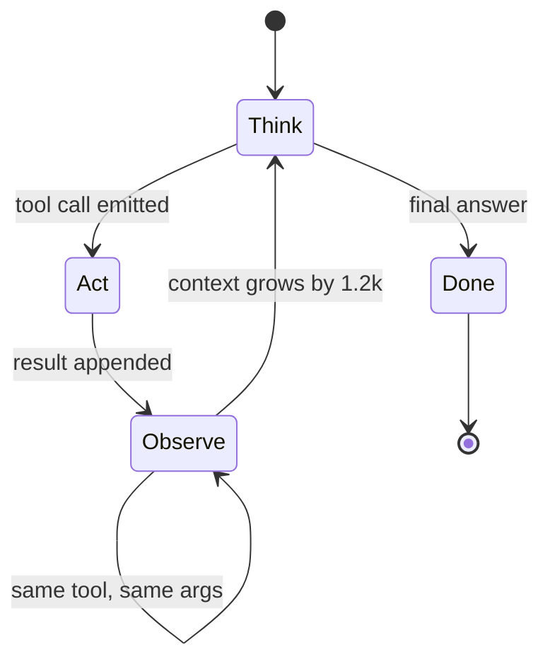
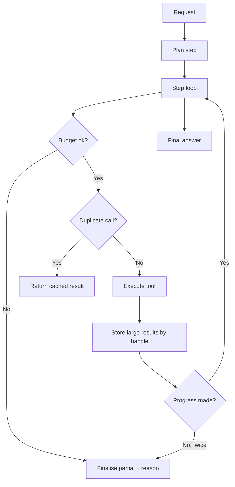

> **Scenario** - A research agent is given "summarise every open incident and their root causes." It runs 61 steps, re-reads the same three documents nine times, and burns $87 in one request. Two hundred similar requests land the same afternoon.

## Why it matters

- Agent loops grow context quadratically. Every step appends the tool result to history, and every subsequent step re-sends the entire history. Total tokens scale with the square of step count, not linearly.
- A single unbounded request can cost more than a month of normal usage. There is no natural ceiling unless you build one.
- Loops that do not terminate look identical to loops that are still working. Without a progress signal, the timeout is your only stop condition - and it fires after the money is spent.
- Latency compounds. Sixty steps at 1.8s each is 108 seconds of wall clock, well past any reasonable request timeout.
- Concurrency limits are capacity limits. By Little's Law, `concurrency = arrival rate × duration`; long agent runs consume worker slots that short requests need.

## Symptoms

| Signal | What you observe |
|---|---|
| Cost tail | p99 request cost is 40x the median |
| Step distribution | A bimodal histogram: most runs end by step 6, a tail runs to the cap |
| Repetition | The same tool called with identical arguments three or more times per run |
| Token growth | `prompt_tokens` on step *n* roughly proportional to *n* |
| Saturation | Worker pool exhausted by a handful of long-running agent requests |

## How it breaks

The naive loop is: call the model, execute any tool call, append the result, repeat. Nothing measures progress. If the model is uncertain, the cheapest action available to it is another retrieval, so it retrieves again - with a slightly different query, getting slightly different chunks, growing the context, and increasing its own confusion.

The token arithmetic is unforgiving. Suppose the base prompt is 2,000 tokens and each tool result adds 1,200. At step *n* the prompt is `2000 + 1200(n-1)`. Summing over 60 steps gives about 2.2M input tokens. At $3.00 per million that is $6.60 of input per run, plus output - and a larger model or fatter tool results multiplies it straight through.



## Root causes

1. The loop has a step cap but no token or currency budget, and the cap is set far too high.
2. Tool results are appended verbatim instead of being summarised or referenced by handle.
3. There is no duplicate-call detector, so the agent can revisit the same state indefinitely.
4. No progress signal exists - nothing distinguishes "making headway" from "spinning".
5. Cost is measured per month across the whole product, never per request, so the tail is invisible.

## How to solve it

### 1. Budget in tokens and currency, not just steps

```python
@dataclass
class RunBudget:
    max_steps: int = 12
    max_input_tokens: int = 120_000
    max_cost_usd: float = 0.75
    deadline: float = field(default_factory=lambda: time.monotonic() + 45.0)

    def check(self, step: int, tokens: int, spent: float) -> str | None:
        if step >= self.max_steps: return "step_cap"
        if tokens >= self.max_input_tokens: return "token_cap"
        if spent >= self.max_cost_usd: return "cost_cap"
        if time.monotonic() >= self.deadline: return "deadline"
        return None
```

When a budget trips, return the best partial answer with an honest note - not an error page. A partial summary of eight incidents is more useful than a timeout.

### 2. Store tool results by handle, not by value

```python
def observe(result: str) -> str:
    if ntokens(result) <= 400:
        return result
    handle = store.put(result)                      # full text in Redis, 1h TTL
    head = result[:800]
    return f"[{handle}] first 800 chars:\n{head}\n(use read_handle('{handle}') for the rest)"
```

This alone flattens the quadratic growth: history stops accumulating 1,200-token blobs and accumulates 200-token references instead.

### 3. Detect and short-circuit repeated calls

```python
seen: dict[str, str] = {}

def execute(call) -> str:
    key = f"{call.name}:{json.dumps(call.args, sort_keys=True)}"
    if key in seen:
        return f"Already called this exact tool. Previous result: {seen[key][:300]}"
    result = HANDLERS[call.name](**call.args)
    seen[key] = result
    return result
```

### 4. Require a stated plan and check progress against it

Ask the model for a numbered plan on step 1, then require each subsequent step to name the plan item it advances. If two consecutive steps advance nothing, stop and return what you have.

```ts
if (step.advancesPlanItem === previous.advancesPlanItem && step.newFactsFound === 0) {
  stalledSteps += 1
  if (stalledSteps >= 2) return finalise(partialResults, 'no_progress')
}
```

### 5. Put a circuit breaker around the whole agent

If the p95 run cost or step count crosses a threshold across recent traffic, degrade to single-shot RAG for new requests. One bad prompt template shipped at 14:00 should not drain the monthly budget by 15:00.

### 6. Cap concurrency deliberately

By Little's Law, 200 concurrent agent runs at 40s each need `200 × 40 = 8,000` worker-seconds of capacity per 40s window - that is 200 workers. Set a queue with a bounded depth and shed load rather than letting agents starve interactive traffic.

## Target design



## Tradeoffs

| Option | Pros | Cons | Choose when |
|---|---|---|---|
| Single-shot RAG | Predictable cost and latency | Cannot decompose multi-hop questions | Most user-facing Q&A |
| Bounded agent loop | Handles multi-hop within a budget | Needs budget plumbing and partial answers | Research or triage assistants |
| Unbounded loop | Occasionally solves hard tasks | Unbounded cost, unbounded latency | Offline batch jobs with a hard timeout |
| Handle-based observations | Flat context growth | Extra store and an extra tool | Tool results routinely exceed 400 tokens |
| Human-in-the-loop gate | Catches runaway plans | Not real-time | High-stakes or expensive workflows |

## Verification checklist

- [ ] Per-request cost recorded and a p99 alert configured.
- [ ] A deliberately ambiguous prompt confirmed to stop at the step cap with a partial answer.
- [ ] Duplicate tool-call suppression verified by a test that repeats an identical call.
- [ ] `prompt_tokens` per step plotted for a long run to confirm growth is flat, not linear.
- [ ] Concurrency limit computed from expected arrival rate and mean run duration.
- [ ] Degrade-to-RAG path exercised in staging under a simulated cost spike.

## Anti-patterns

- Setting `max_steps = 100` "just in case" and calling it a safety limit.
- Appending 4,000-token tool outputs to history verbatim.
- Measuring cost only in the monthly provider invoice.
- Returning an error when the budget trips instead of the partial result already computed.
- Letting agents share a worker pool with latency-sensitive interactive requests.

## Related

- [Agent tool-calling reliability and schema discipline](/systems/ai-rag-agents/agent-tool-calling-reliability)
- [LLM caching layers and cost control](/systems/ai-rag-agents/llm-caching-and-cost-control)
- [Eval harness design for LLM features in CI](/systems/ai-rag-agents/eval-harness-design)
