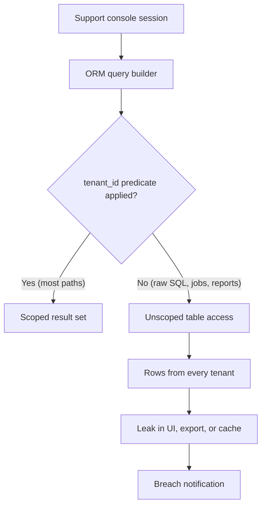
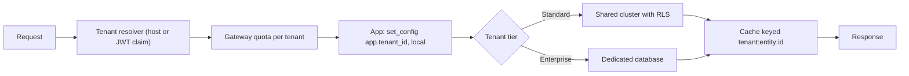

> **Scenario** — এক support engineer shared `orders` টেবিলে `acme` tenant-এর জন্য data-fix query চালান, `tenant_id` predicate দিতে ভুলে যান, আর ৩৮০ জন customer-এর ৪১,০০০ row update হয়ে যায়। Audit log-এ মাত্র একটি statement। Incident review জিজ্ঞেস করে — একটা missing `WHERE` কীভাবে একসাথে সব tenant-এ পৌঁছাল?

## Why it matters

- Cross-tenant leakage সেই একমাত্র bug class যা enterprise deal শেষ করে দেয়। অন্য কোম্পানির data-র একটা screenshot মানে bug ticket নয়, breach notification।
- Isolation model চিরকালের জন্য migration cost ঠিক করে। এক ৯০০GB shared টেবিলে `ALTER TABLE` মানে একটা maintenance window; ৪,০০০ schema-তে একই change মানে failure rate সহ একটা job queue।
- Noisy neighbour performance সমস্যার আগে isolation সমস্যা। এক tenant ১২M row import করলে বাকিদের p99 SLO ছাড়ানো উচিত নয়।
- Enterprise procurement জিজ্ঞেস করে "আমাদের data কোথায় থাকে, আলাদা করে delete করা যায়?" — উত্তরটা আপনার schema design, আর sales cycle-এর মাঝে সেটা retrofit করা যায় না।
- সম্পূর্ণ shared model-এ per-tenant cost দেখা প্রায় অসম্ভব, ফলে product-এর দাম ঠিকভাবে নির্ধারণ করা যায় না।

## Symptoms

| Signal | What you observe |
|---|---|
| Cross-tenant read | Support query বা cached response এমন `tenant_id`-র row ফেরত দেয় যা session-এর নয় |
| Tenant-ভিত্তিক p99 | Bimodal — গুটিকয় বড় tenant slow tail দখল করে, median tenant ঠিক আছে |
| Migration duration | Schema change ঘণ্টার পর ঘণ্টা চলে আর সব tenant-এর পড়া টেবিল lock করে |
| Deletion request | GDPR erasure-এ schema drop নয়, হাতে লেখা script লাগে |
| Backup restore | এক tenant restore করতে গোটা cluster scratch instance-এ restore করতে হয় |
| Connection pool | Schema-per-tenant-এ exhausted, কারণ প্রতি tenant নিজের pooled connection ধরে রাখে |

## How it breaks

সমস্যা প্রায় কখনোই storage engine নয়। সমস্যা হলো tenant scoping application কোডে থাকে, আর application কোডে শত শত query site থাকে। প্রতিটি ORM call, প্রতিটি raw SQL report, প্রতিটি background job আর প্রতিটি ad-hoc console session predicate বাদ দেওয়ার আলাদা সুযোগ। এখানে ৯৯% coverage কোনো safety property নয় — একটাই uncovered path মানেই পুরো breach।

দ্বিতীয় failure mode হলো resource sharing। এক shared cluster-এ যে tenant full-table scan চালায় সে buffer pool, IOPS আর connection খেয়ে ফেলে যা বাকিদের দরকার। *Data*-র isolation আর *load*-এর isolation আলাদা সমস্যা, আর দল সাধারণত কোনোটাই সমাধান করে না কারণ ধরে নেয় প্রথমটা দ্বিতীয়টা দিয়ে দেয়।



## Root causes

1. Tenant scoping database boundary-তে নয়, application কোডে enforce করা।
2. এক high-privilege database role সহ shared connection pool, ফলে database tenant আলাদা করতে পারে না।
3. Background job আর reporting query scoped repository layer bypass করে সরাসরি টেবিলে লেখা।
4. Cache key-তে tenant identifier নেই, তাই এক tenant-এর response অন্যকে serve হয়।
5. Per-tenant resource limit নেই, তাই data boundary ঠিক থাকলেও load-এ isolation ভেঙে যায়।
6. ২০ tenant-এর সময় বাছা isolation model ৪,০০০ tenant-এও অপরিবর্তিত।

## How to solve it

### 1. Data class অনুযায়ী ইচ্ছাকৃতভাবে model বাছুন

সব কিছুর জন্য এক model লাগে না। প্রচলিত আকার: high-volume transactional data-র জন্য shared table, সবচেয়ে বড় ২% customer-এর জন্য dedicated database, আর tenant metadata-র জন্য আলাদা control-plane database।

| Model | Isolation | Migration cost | Practical ceiling |
|---|---|---|---|
| Shared table + `tenant_id` | শুধু logical | একটি migration | হাজার দশেক tenant |
| Schema per tenant | শক্ত logical | N migration | ~১,০০০-৫,০০০ schema |
| Database per tenant | Physical | N migration + N connection | কয়েকশ |

### 2. Row-level security দিয়ে enforcement database-এ নিন

Application-level scoping একটা convention। Postgres RLS একটা constraint — raw SQL, psql console আর গত বছরের analytics job সবার উপর কাজ করে।

```sql
ALTER TABLE orders ENABLE ROW LEVEL SECURITY;
ALTER TABLE orders FORCE ROW LEVEL SECURITY;

CREATE POLICY tenant_isolation ON orders
  USING (tenant_id = current_setting('app.tenant_id', true)::uuid)
  WITH CHECK (tenant_id = current_setting('app.tenant_id', true)::uuid);

-- The application role must not be the table owner, or FORCE is required (above).
GRANT SELECT, INSERT, UPDATE, DELETE ON orders TO app_runtime;
```

`WITH CHECK` ঠিক ততটাই জরুরি যতটা `USING`: এটা ছাড়া scoped session অন্য tenant-এর row *insert* করতে পারে।

### 3. প্রতিটি checked-out connection-এ tenant বসান

```php
// app/Providers/TenantConnectionProvider.php  (Laravel)
DB::listen(function () {});

public function bindTenant(string $tenantId): void
{
    // set_config with is_local = true scopes the setting to the transaction,
    // so a pooled connection can never leak the previous tenant's context.
    DB::statement('SELECT set_config(?, ?, true)', ['app.tenant_id', $tenantId]);
}

// Middleware: fail closed. No resolved tenant means no database access at all.
public function handle(Request $request, Closure $next)
{
    $tenantId = $this->resolver->fromRequest($request)
        ?? abort(400, 'unresolved tenant');
    DB::transaction(fn () => $this->bindTenant($tenantId));
    return $next($request);
}
```

Connection pooler-এর সাথে আসল কৌশল `is_local = true`: setting transaction-এর সাথেই মরে যায়, পরের tenant-এর request-এ বাঁচে না।

### 4. leak করার চেষ্টা করে এমন test লিখুন

```sql
-- Regression test: run as app_runtime with tenant A bound, expect zero rows of B.
BEGIN;
SELECT set_config('app.tenant_id', '11111111-1111-1111-1111-111111111111', true);
SELECT count(*) AS must_be_zero
  FROM orders
 WHERE tenant_id <> '11111111-1111-1111-1111-111111111111'::uuid;
ROLLBACK;
```

অন্তত দুই tenant seed করা database-এর বিরুদ্ধে এটি CI-তে চালান। `must_be_zero` শূন্যের বেশি হলে build fail।

### 5. শুধু row নয়, load-ও isolate করুন

Edge-এ per-tenant quota, per-tenant bounded work queue আর statement timeout এক customer-কে shared capacity খেয়ে ফেলা থেকে আটকায়।

```yaml
# Per-tenant limits enforced at the gateway, independent of the data model.
rate_limits:
  default:  { requests_per_minute: 600,  burst: 60 }
  overrides:
    acme:   { requests_per_minute: 6000, burst: 600 }
statement_timeout: 15s
max_concurrent_exports_per_tenant: 2
```

### 6. সবচেয়ে বড় tenant-দের নিজস্ব database দিন

কোনো tenant মোট load-এর প্রায় ১০% ছাড়ালে shared cluster-এর tail latency আসলে ওই tenant-এর আচরণ। একই application code path রেখে তাদের dedicated database-এ সরান, connection configuration নয় tenant metadata থেকে resolve করুন।

## Target design



## Tradeoffs

| Option | Pros | Cons | Choose when |
|---|---|---|---|
| Shared table + RLS | এক migration, সর্বোচ্চ density, সস্তা | শুধু logical isolation; noisy neighbour; per-tenant restore কঠিন | অনেক ছোট tenant-এর self-serve SaaS |
| Schema per tenant | পরিষ্কার per-tenant dump ও drop; পরিচিত SQL | Migration fan-out; কয়েক হাজারের পর catalogue bloat | Compliance-চালিত mid-market |
| Database per tenant | Physical isolation, স্বাধীন restore, সহজ residency | Connection ও cost overhead; fleet-wide change ধীর | Enterprise contract, regulated data, কম বড় tenant |
| Tier অনুযায়ী hybrid | যেখানে লাভ সেখানে density, যেখানে বিক্রি সেখানে isolation | দুটি code path সৎ রাখতে হয় | Product self-serve ও enterprise দুটোতেই আছে |

## Verification checklist

- [ ] প্রতিটি tenant-scoped টেবিলে `SELECT relrowsecurity, relforcerowsecurity FROM pg_class` দুটোই true।
- [ ] CI test bound tenant session-এ শূন্য cross-tenant row assert করে।
- [ ] প্রতিটি cache key-তে tenant identifier আছে; cache layer grep করে ব্যতিক্রম খুঁজুন।
- [ ] Background job tenant context স্পষ্টভাবে বহন করে, না থাকলে fail closed হয়।
- [ ] Drill-এ single-tenant restore করা হয়েছে এবং সময় লিপিবদ্ধ।
- [ ] Per-tenant request ও query rate graph করা; শীর্ষ tenant shared capacity-র ১০%-এর নিচে।
- [ ] শুধু session নয়, application role-এর জন্য `statement_timeout` সেট করা।

## Anti-patterns

- একমাত্র enforcement হিসেবে global ORM scope-এর উপর নির্ভর করা — একটা raw query বা console session-ই যথেষ্ট।
- Runtime-এ table-owner role ব্যবহার করা, যা `FORCE` ছাড়া row-level security চুপচাপ উপেক্ষা করে।
- Transaction pooler-এর পেছনে session-level `SET` দিয়ে tenant বসানো, যাতে মান পরের request-এ leak করে।
- Isolation-এর জন্য database-per-tenant করে unprefixed key সহ এক shared Redis রেখে দেওয়া।
- Contract-এ এমন physical isolation-এর প্রতিশ্রুতি দেওয়া যা schema আসলে দেয় না।

## Related

- [Cost attribution and showback](/systems/product-platform/cost-attribution-and-showback)
- [Public API contract stability](/systems/product-platform/public-api-contract-stability)
- [Modular monolith versus microservices](/systems/product-platform/modular-monolith-vs-microservices)
