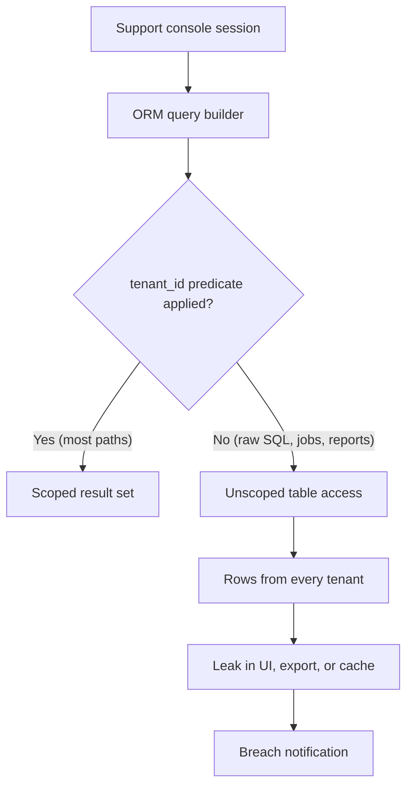
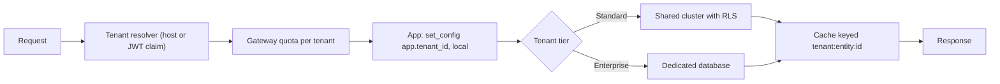

> **Scenario** - A support engineer runs a data-fix query for tenant `acme` against the shared `orders` table, forgets the `tenant_id` predicate, and updates 41,000 rows across 380 customers. The audit log shows one statement. The incident review asks why a single missing `WHERE` clause could reach every tenant at once.

## Why it matters

- Cross-tenant leakage is the one bug class that ends enterprise deals. A single screenshot of another company's data in a customer's dashboard is a breach notification, not a bug ticket.
- The isolation model decides migration cost forever. `ALTER TABLE` on one 900GB shared table is a maintenance window; the same change across 4,000 schemas is a job queue with a failure rate.
- Noisy neighbours are an isolation problem before they are a performance problem. One tenant importing 12M rows should not push everyone else's p99 past the SLO.
- Enterprise procurement asks "where is our data stored and can it be deleted independently?" The answer is your schema design, and you cannot retrofit it during a sales cycle.
- Per-tenant cost visibility is nearly impossible in a fully shared model, which means you cannot price the product accurately.

## Symptoms

| Signal | What you observe |
|---|---|
| Cross-tenant reads | A support query or a cached response returns rows with a `tenant_id` the session does not own |
| p99 by tenant | Bimodal - a handful of large tenants dominate the slow tail while median tenants are fine |
| Migration duration | Schema changes take hours and lock a table every tenant reads |
| Deletion requests | GDPR erasure requires a hand-written script instead of dropping a schema |
| Backup restore | Restoring one tenant means restoring the whole cluster to a scratch instance first |
| Connection pool | Exhausted in schema-per-tenant setups because each tenant holds its own pooled connections |

## How it breaks

The failure is almost never the storage engine. It is that tenant scoping lives in application code, and application code has hundreds of query sites. Every ORM call, every raw SQL report, every background job, and every ad-hoc console session is an independent opportunity to omit the predicate. Coverage of 99% is not a safety property here: one uncovered path is the whole breach.

The second failure mode is resource sharing. In a single shared cluster, a tenant that triggers a full-table scan consumes buffer pool, IOPS, and connections that every other tenant needs. Isolation of *data* and isolation of *load* are separate problems, and teams usually solve neither because they assume the first implies the second.



## Root causes

1. Tenant scoping enforced in application code instead of at the database boundary.
2. A shared connection pool with one high-privilege database role, so the database cannot tell tenants apart.
3. Background jobs and reporting queries written against tables directly, bypassing the scoped repository layer.
4. Caches keyed without the tenant identifier, so one tenant's response is served to another.
5. No per-tenant resource limits, so isolation collapses under load even when the data boundary holds.
6. The isolation model chosen at seed stage for 20 tenants and never revisited at 4,000.

## How to solve it

### 1. Pick the model deliberately, per data class

You do not need one model for everything. A common shape: shared tables for high-volume transactional data, dedicated databases for the largest 2% of customers, and a separate control-plane database for tenant metadata.

| Model | Isolation | Migration cost | Practical ceiling |
|---|---|---|---|
| Shared table + `tenant_id` | Logical only | One migration | Tens of thousands of tenants |
| Schema per tenant | Strong logical | N migrations | ~1,000-5,000 schemas |
| Database per tenant | Physical | N migrations + N connections | Hundreds |

### 2. Move enforcement into the database with row-level security

Application-level scoping is a convention. Postgres RLS is a constraint - it applies to raw SQL, to the psql console, and to the analytics job someone wrote last year.

```sql
ALTER TABLE orders ENABLE ROW LEVEL SECURITY;
ALTER TABLE orders FORCE ROW LEVEL SECURITY;

CREATE POLICY tenant_isolation ON orders
  USING (tenant_id = current_setting('app.tenant_id', true)::uuid)
  WITH CHECK (tenant_id = current_setting('app.tenant_id', true)::uuid);

-- The application role must not be the table owner, or FORCE is required (above).
GRANT SELECT, INSERT, UPDATE, DELETE ON orders TO app_runtime;
```

`WITH CHECK` matters as much as `USING`: without it a scoped session can still *insert* a row belonging to another tenant.

### 3. Set the tenant on every checked-out connection

```php
// app/Providers/TenantConnectionProvider.php  (Laravel)
DB::listen(function () {});

public function bindTenant(string $tenantId): void
{
    // set_config with is_local = true scopes the setting to the transaction,
    // so a pooled connection can never leak the previous tenant's context.
    DB::statement('SELECT set_config(?, ?, true)', ['app.tenant_id', $tenantId]);
}

// Middleware: fail closed. No resolved tenant means no database access at all.
public function handle(Request $request, Closure $next)
{
    $tenantId = $this->resolver->fromRequest($request)
        ?? abort(400, 'unresolved tenant');
    DB::transaction(fn () => $this->bindTenant($tenantId));
    return $next($request);
}
```

The `is_local = true` argument is the whole trick with connection poolers: the setting dies with the transaction rather than surviving into the next tenant's request.

### 4. Add a test that tries to leak

```sql
-- Regression test: run as app_runtime with tenant A bound, expect zero rows of B.
BEGIN;
SELECT set_config('app.tenant_id', '11111111-1111-1111-1111-111111111111', true);
SELECT count(*) AS must_be_zero
  FROM orders
 WHERE tenant_id <> '11111111-1111-1111-1111-111111111111'::uuid;
ROLLBACK;
```

Wire this into CI against a seeded database with at least two tenants. A `must_be_zero` above 0 fails the build.

### 5. Isolate load, not just rows

Per-tenant quotas at the edge, a bounded work queue per tenant, and a statement timeout stop one customer from consuming shared capacity.

```yaml
# Per-tenant limits enforced at the gateway, independent of the data model.
rate_limits:
  default:  { requests_per_minute: 600,  burst: 60 }
  overrides:
    acme:   { requests_per_minute: 6000, burst: 600 }
statement_timeout: 15s
max_concurrent_exports_per_tenant: 2
```

### 6. Give the largest tenants their own database

Once a tenant is more than roughly 10% of total load, the shared cluster's tail latency is that tenant's behaviour. Move them to a dedicated database behind the same application code path, with the connection resolved from tenant metadata rather than from configuration.

## Target design



## Tradeoffs

| Option | Pros | Cons | Choose when |
|---|---|---|---|
| Shared table with `tenant_id` + RLS | One migration, best density, cheapest per tenant | Logical isolation only; noisy neighbours; hard per-tenant restore | Self-serve SaaS with many small tenants |
| Schema per tenant | Clean per-tenant dump and drop; familiar SQL | Migration fan-out; catalogue bloat past a few thousand schemas | Mid-market with compliance-driven separation |
| Database per tenant | Physical isolation, independent restore, easy residency | Connection and cost overhead; slow fleet-wide changes | Enterprise contracts, regulated data, few large tenants |
| Hybrid by tier | Density where it pays, isolation where it sells | Two code paths to keep honest | Product spans self-serve and enterprise |

## Verification checklist

- [ ] `SELECT relrowsecurity, relforcerowsecurity FROM pg_class` shows both true for every tenant-scoped table.
- [ ] A CI test asserts zero cross-tenant rows are visible under a bound tenant session.
- [ ] Every cache key contains the tenant identifier; grep the cache layer for keys that do not.
- [ ] Background jobs carry the tenant context explicitly and fail closed when it is absent.
- [ ] A single-tenant restore has been performed in a drill, with the elapsed time recorded.
- [ ] Per-tenant request and query rates are graphed; the top tenant is under 10% of shared capacity.
- [ ] `statement_timeout` is set for the application role, not just for individual sessions.

## Anti-patterns

- Relying on a global ORM scope as the only enforcement - one raw query or one console session bypasses it.
- Using the table-owner role at runtime, which silently ignores row-level security unless `FORCE` is enabled.
- Setting the tenant with a session-level `SET` behind a transaction pooler, so the value leaks into the next request.
- Splitting to a database per tenant for isolation while keeping one shared Redis with unprefixed keys.
- Promising physical isolation in a contract that the schema does not actually provide.

## Related

- [Cost attribution and showback](/systems/product-platform/cost-attribution-and-showback)
- [Public API contract stability](/systems/product-platform/public-api-contract-stability)
- [Modular monolith versus microservices](/systems/product-platform/modular-monolith-vs-microservices)
