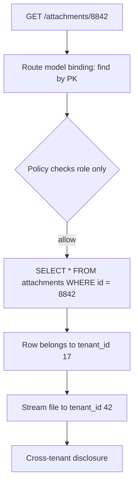
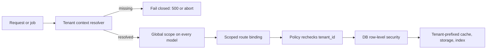

> **Scenario** - শুক্রবারে নতুন "export attachments" endpoint ship হলো। এটা primary key দিয়ে record load করে stream করে। সোমবারে এক customer নিজের dashboard থেকে download করা একটা PDF email করল - যেটা তার প্রতিযোগীর। SQL ঠিকই ছিল - শুধু tenant predicate ছিল না।

## Why it matters

- Shared-infrastructure SaaS-এ cross-tenant exposure সবচেয়ে উচ্চ-severity application bug। সাধারণত customer notification লাগে, প্রায়ই contractual penalty।
- Monitoring-এ এটা অদৃশ্য: 5xx নেই, slow query নেই, error rate বদলায় না। System ঠিক যা লেখা আছে তাই করে।
- ত্রুটি একটা query-তে একটা অনুপস্থিত clause, তাই review ধরতে পারে কেবল যদি scoping manual না হয়ে structural হয়।
- প্রতিটি নতুন surface - report, export, webhook, admin tooling, background job - boundary enforce না করলে ঝুঁকি ফিরিয়ে আনে।

## Symptoms

| Signal | What you observe |
| --- | --- |
| Sequential ID কাজ করে | `/records/4471` কে `/records/4472` করলে অন্য account-এর data আসে |
| Predicate নেই | hot query-র `EXPLAIN`-এ filter-এ `tenant_id` নেই |
| Count মেলে না | tenant-এর dashboard total তার নিজের row count-এর বেশি |
| Job-time leak | nightly export-এ অন্য tenant-এর row ঢোকে |
| Cache bleed | cache key `report:monthly`, `report:monthly:tenant_42` নয় |
| Aggregate ভুল | refactor-এর পর billing total বেড়ে যায় |

## How it breaks

Tenancy সাধারণত একটা *convention* হিসেবে বাস্তবায়িত হয় - "সবসময় `tenant_id` দিয়ে filter করো" - আর convention ক্ষয়ে যায়। দ্বাদশ report লেখা developer `Model::find($id)` ধরে, কারণ ওটাই সবচেয়ে ছোট পথ। Route model binding record globally resolve করে, policy ownership নয় role check করে, response চলে যায়। একই gap raw SQL-এ, cache key-তে, আর queued job-এ থাকে যেখানে scope করার মতো authenticated user নেই।



## Root causes

1. Tenant scoping data-access layer-এ enforce না হয়ে প্রতি query-তে প্রয়োগ হয়।
2. Route model binding tenant predicate ছাড়া global primary key দিয়ে record resolve করে।
3. Policy capability (`can('view', ...)`) দেখে, কখনো tenant identity মেলায় না।
4. Queue job ও scheduled command tenant context ছাড়া চলে, তাই global query স্বাভাবিক দেখায়।
5. Cache, search index ও file path-এ tenant discriminator নেই।
6. Identifier sequential integer, তাই enumeration তুচ্ছ।

## How to solve it

### 1. Global scope দিয়ে scoping structural করুন

```php
// app/Models/Concerns/BelongsToTenant.php
namespace App\Models\Concerns;

use Illuminate\Database\Eloquent\Builder;

trait BelongsToTenant
{
    protected static function bootBelongsToTenant(): void
    {
        static::addGlobalScope('tenant', function (Builder $builder) {
            $tenantId = app('tenant.context')->id();

            abort_if($tenantId === null, 500, 'tenant_context_missing');

            $builder->where($builder->qualifyColumn('tenant_id'), $tenantId);
        });

        static::creating(function ($model) {
            $model->tenant_id ??= app('tenant.context')->id();
        });
    }
}
```

Context না থাকলে abort করা ইচ্ছাকৃত: *fail-closed* default silent leak-কে staging-এ জোরালো 500-তে পরিণত করে।

### 2. Route model binding scope করুন

```php
// routes/web.php
Route::get('/attachments/{attachment}', [AttachmentController::class, 'show'])
    ->scopeBindings();
```

Global scope-এর সাথে মিলে `{attachment}` কেবল বর্তমান tenant-এর ভেতরেই resolve হয় - বাইরের id দিলে 404, যা record-এর অস্তিত্বও নিশ্চিত করে না।

### 3. Policy-তেও tenancy মেলান

Defence in depth: `withoutGlobalScopes()` দিয়ে scope bypass হলেও policy না বলবে।

```php
public function view(User $user, Attachment $attachment): bool
{
    if ($user->tenant_id !== $attachment->tenant_id) {
        return false;
    }

    return $user->hasPermission('attachment.view');
}
```

### 4. যেখানে ঝুঁকি বেশি, boundary database-এ নামান

PostgreSQL row-level security হাতে লেখা SQL-এও predicate enforce করে:

```sql
ALTER TABLE attachments ENABLE ROW LEVEL SECURITY;

CREATE POLICY attachments_tenant_isolation ON attachments
  USING (tenant_id = current_setting('app.tenant_id')::bigint);

-- Set once per request/transaction, from trusted server code only.
SET LOCAL app.tenant_id = '42';
```

### 5. Job-কে স্পষ্ট tenant context দিন

```php
class ExportAttachments implements ShouldQueue
{
    public function __construct(public int $tenantId) {}

    public function handle(): void
    {
        app('tenant.context')->runAs($this->tenantId, function () {
            Attachment::query()->chunkById(500, fn ($rows) => $this->write($rows));
        });
    }
}
```

"current user" implicitly serialise করবেন না; tenant id pass করে context আবার তৈরি করুন।

### 6. প্রতিটি derived artefact namespace করুন

Cache key, search index name, object storage prefix, export filename - সবেতে tenant থাকবে:

```php
Cache::tags(["tenant:{$tenantId}"])->remember("report:monthly:{$tenantId}", 900, $callback);
Storage::disk('s3')->path("tenants/{$tenantId}/attachments/{$ulid}");
```

Public identifier-এ ULID/UUID ব্যবহার করুন যাতে কোনো check বাদ পড়লেও enumeration কিছু জানায় না।

### 7. Default-এ negative case test করুন

```php
public function test_foreign_tenant_attachment_is_not_found(): void
{
    $mine = User::factory()->create();
    $theirs = Attachment::factory()->create(); // different tenant

    $this->actingAs($mine)
        ->get("/attachments/{$theirs->id}")
        ->assertNotFound();
}
```

এটাকে shared test trait বানান যাতে প্রতিটি নতুন resource assertion পায়।

## Target design



## Tradeoffs

| Option | Pros | Cons | Choose when |
| --- | --- | --- | --- |
| Manual `where tenant_id` | framework magic নেই; স্পষ্ট | একটা বাদ পড়া = breach | ছোট codebase, কম query |
| ORM global scope | structural default; সস্তা | `withoutGlobalScopes()` দিয়ে bypass হয় | অধিকাংশ Laravel/Rails ধরনের app |
| Database RLS | raw SQL ও BI tool রক্ষা করে | connection/session plumbing; local debug কঠিন | regulated data, অনেক query path |
| Tenant-প্রতি schema | শক্ত isolation; সরল মানসিক model | migration fan-out; হাজার schema-তে কষ্ট | কয়েক ডজন থেকে শতাধিক tenant |
| Tenant-প্রতি database | কঠিন boundary; per-tenant restore | সর্বোচ্চ operational cost | enterprise contract দাবি করলে |

## Verification checklist

- [ ] প্রতিটি read endpoint-এ পরিচিত foreign-tenant id চেয়ে 404 আশা করুন।
- [ ] Tenant context না থাকলে app abort করে (চুপচাপ সব row দেয় না) তা নিশ্চিত করুন।
- [ ] শীর্ষ query-গুলো `EXPLAIN` করে filter/index-এ `tenant_id` দেখুন।
- [ ] Redis key-তে tenant discriminator ছাড়া কিছু আছে কিনা দেখুন।
- [ ] Tenant A-এর export job চালিয়ে row ownership diff করুন।
- [ ] Public identifier non-sequential কিনা দেখুন।
- [ ] Object storage path tenant-prefixed ও bucket publicly listable নয় তা নিশ্চিত করুন।

## Anti-patterns

- Frontend সবসময় সঠিক `tenant_id` পাঠাবে - এই ভরসা করা।
- "support impersonation" mode যা context switch না করে scope globally বন্ধ করে।
- খালি ফল "ঠিক করতে" report-এ `withoutGlobalScopes()` ছড়ানো।
- URL-এ sequential integer id, সাথে per-query manual check।
- Hit ratio বাড়াতে tenant জুড়ে একটাই cache namespace share করা।

## Related

- [RBAC vs ABAC authorization modeling](/systems/auth-security/rbac-vs-abac-modeling)
- [OAuth token lifecycle and tenant isolation](/systems/auth-security/oauth-token-lifecycle)
- [Injection through ORM escape hatches](/systems/auth-security/injection-and-orm-escapes)
