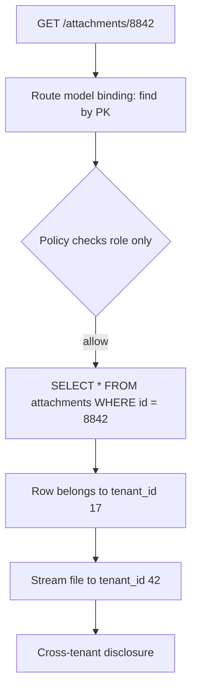
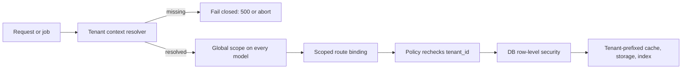

> **Scenario** — A new "export attachments" endpoint ships on Friday. It loads records by primary key and streams them. On Monday a customer emails a PDF belonging to a competitor, downloaded from their own dashboard. The query was correct SQL — it just had no tenant predicate.

## Why it matters

- Cross-tenant exposure is the highest-severity class of application bug in shared-infrastructure SaaS. It usually triggers customer notification, and often contractual penalties.
- It is invisible to monitoring: no 5xx, no slow query, no error rate change. The system behaves exactly as written.
- The defect is one missing clause in one query, so review catches it only if scoping is structural rather than manual.
- Every new surface — reports, exports, webhooks, admin tooling, background jobs — reintroduces the risk unless the boundary enforces it.

## Symptoms

| Signal | What you observe |
| --- | --- |
| Sequential IDs work | Changing `/records/4471` to `/records/4472` returns data from another account |
| Missing predicate | `EXPLAIN` on a hot query shows no `tenant_id` in the filter |
| Count mismatch | A tenant's dashboard total exceeds the row count they own |
| Job-time leakage | Nightly exports include rows outside the requested tenant |
| Cache bleed | Cache keys are `report:monthly` rather than `report:monthly:tenant_42` |
| Aggregates off | Billing totals drift upward after a refactor |

## How it breaks

Tenancy is usually implemented as a *convention* — "always filter by `tenant_id`" — and conventions decay. A developer writing the twelfth report reaches for `Model::find($id)` because it is the shortest path. Route model binding resolves the record globally, the policy checks a role rather than ownership, and the response is returned. The same gap appears in raw SQL, in cache keys, and in queued jobs where there is no authenticated user to scope against.



## Root causes

1. Tenant scoping is applied per query instead of enforced by the data-access layer.
2. Route model binding resolves records by global primary key with no tenant predicate.
3. Policies check capability (`can('view', ...)`) but never compare tenant identity.
4. Queue jobs and scheduled commands run without a tenant context, so global queries look normal.
5. Cache, search indexes, and file paths omit the tenant discriminator.
6. Identifiers are sequential integers, making enumeration trivial.

## How to solve it

### 1. Make scoping structural with a global scope

```php
// app/Models/Concerns/BelongsToTenant.php
namespace App\Models\Concerns;

use Illuminate\Database\Eloquent\Builder;

trait BelongsToTenant
{
    protected static function bootBelongsToTenant(): void
    {
        static::addGlobalScope('tenant', function (Builder $builder) {
            $tenantId = app('tenant.context')->id();

            abort_if($tenantId === null, 500, 'tenant_context_missing');

            $builder->where($builder->qualifyColumn('tenant_id'), $tenantId);
        });

        static::creating(function ($model) {
            $model->tenant_id ??= app('tenant.context')->id();
        });
    }
}
```

Aborting when context is missing is deliberate: a *fail-closed* default turns a silent leak into a loud 500 in staging.

### 2. Scope route model binding

```php
// routes/web.php
Route::get('/attachments/{attachment}', [AttachmentController::class, 'show'])
    ->scopeBindings();
```

Combined with the global scope, `{attachment}` can only resolve inside the current tenant — a foreign id yields 404, which also avoids confirming the record exists.

### 3. Compare tenancy in the policy too

Defence in depth: even if a scope is bypassed with `withoutGlobalScopes()`, the policy refuses.

```php
public function view(User $user, Attachment $attachment): bool
{
    if ($user->tenant_id !== $attachment->tenant_id) {
        return false;
    }

    return $user->hasPermission('attachment.view');
}
```

### 4. Push the boundary into the database where the stakes justify it

PostgreSQL row-level security enforces the predicate even for hand-written SQL:

```sql
ALTER TABLE attachments ENABLE ROW LEVEL SECURITY;

CREATE POLICY attachments_tenant_isolation ON attachments
  USING (tenant_id = current_setting('app.tenant_id')::bigint);

-- Set once per request/transaction, from trusted server code only.
SET LOCAL app.tenant_id = '42';
```

### 5. Give jobs an explicit tenant context

```php
class ExportAttachments implements ShouldQueue
{
    public function __construct(public int $tenantId) {}

    public function handle(): void
    {
        app('tenant.context')->runAs($this->tenantId, function () {
            Attachment::query()->chunkById(500, fn ($rows) => $this->write($rows));
        });
    }
}
```

Never serialise "the current user" implicitly; pass the tenant id and re-establish context.

### 6. Namespace every derived artefact

Cache keys, search index names, object storage prefixes, and export filenames all carry the tenant:

```php
Cache::tags(["tenant:{$tenantId}"])->remember("report:monthly:{$tenantId}", 900, $callback);
Storage::disk('s3')->path("tenants/{$tenantId}/attachments/{$ulid}");
```

Use ULIDs or UUIDs for public identifiers so enumeration gives no signal even if a check is missed.

### 7. Test the negative case by default

```php
public function test_foreign_tenant_attachment_is_not_found(): void
{
    $mine = User::factory()->create();
    $theirs = Attachment::factory()->create(); // different tenant

    $this->actingAs($mine)
        ->get("/attachments/{$theirs->id}")
        ->assertNotFound();
}
```

Make this a shared test trait so every new resource inherits the assertion.

## Target design



## Tradeoffs

| Option | Pros | Cons | Choose when |
| --- | --- | --- | --- |
| Manual `where tenant_id` | No framework magic; explicit | One omission is a breach | Tiny codebase, few queries |
| Global scope in ORM | Structural default; cheap | Bypassable with `withoutGlobalScopes()` | Most Laravel/Rails style apps |
| Database RLS | Protects raw SQL and BI tools | Connection/session plumbing; harder local debugging | Regulated data, many query paths |
| Schema per tenant | Strong isolation; simple mental model | Migration fan-out; thousands of schemas hurt | Dozens to low hundreds of tenants |
| Database per tenant | Hard boundary; per-tenant restore | Highest operational cost | Enterprise contracts demanding it |

## Verification checklist

- [ ] Attempt to fetch a known foreign-tenant id on every read endpoint and expect 404.
- [ ] Confirm the app aborts (not silently returns all rows) when tenant context is missing.
- [ ] `EXPLAIN` the top queries and confirm `tenant_id` appears in the filter or index.
- [ ] Inspect Redis keys for any without a tenant discriminator.
- [ ] Run an export job for tenant A and diff row ownership.
- [ ] Confirm public identifiers are non-sequential.
- [ ] Confirm object storage paths are tenant-prefixed and buckets are not publicly listable.

## Anti-patterns

- Relying on the frontend to always send the right `tenant_id` in the request body.
- A "support impersonation" mode that disables scopes globally instead of switching context.
- `withoutGlobalScopes()` sprinkled in reports to "fix" empty results.
- Sequential integer ids exposed in URLs alongside per-query manual checks.
- Sharing one cache namespace to improve hit ratio across tenants.

## Related

- [RBAC vs ABAC authorization modeling](/systems/auth-security/rbac-vs-abac-modeling)
- [OAuth token lifecycle and tenant isolation](/systems/auth-security/oauth-token-lifecycle)
- [Injection through ORM escape hatches](/systems/auth-security/injection-and-orm-escapes)
