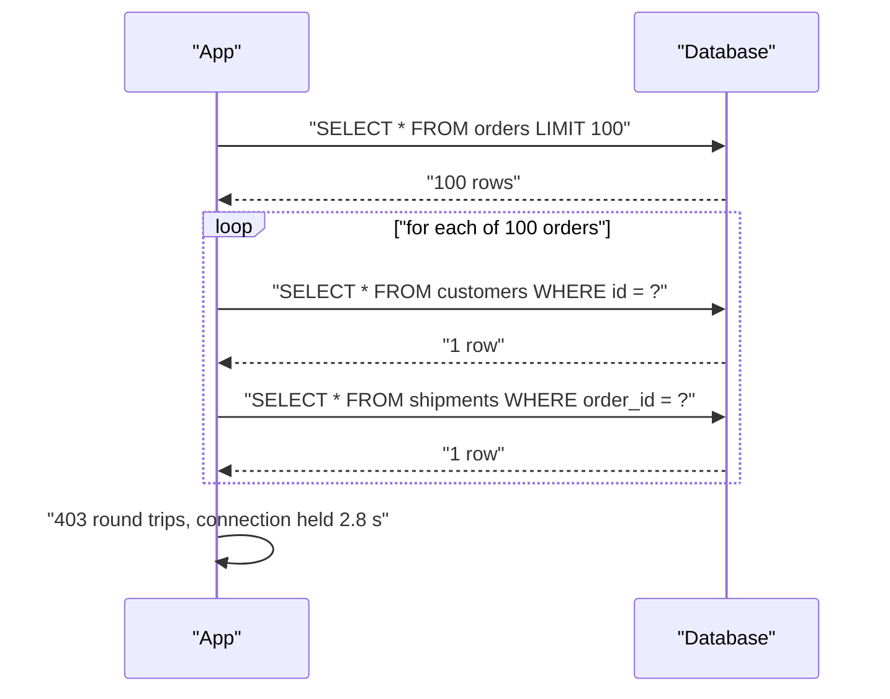
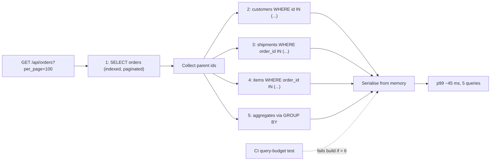

> **Scenario** - `/api/orders?per_page=100` উত্তর দিতে ২.৮ সেকেন্ড নেয়। Slow log দেখায় ওই একটি request-এ ৪০৩টি query: order list-এ একটি, প্রতিটি customer লোডে ১০০টি, প্রতিটি order-এর shipment-এ ১০০টি, আর loop-এর ভেতরে tenant setting lazily আনা currency formatter থেকে আরও ২০০টি।

## কেন গুরুত্বপূর্ণ

- প্রতিটি query-র নির্দিষ্ট overhead আছে - round trip, parse, plan, result marshalling - তাই ৪০০ × ৩ ms মানে ১.২ সেকেন্ড latency, যা কোনো index সরাতে পারবে না।
- ওই প্রতিটি query request-এর পুরো সময় pool connection ধরে রাখে। Little's Law অনুযায়ী প্রতি request-এ ৪০০ query × ৩ ms মানে এক request ১.২ সেকেন্ড একটি connection দখল করে; ৪০টি concurrent request-এর জন্য ৪০টি connection লাগে *কেবল অপেক্ষা করার জন্য*।
- N+1 traffic-এর সাথে নয়, data-র সাথে বাড়ে: ৩ row-এর fixture-এ review ও CI পাশ করে, তারপর কোনো customer-এর ৫,০০০ line item থাকলে ফেটে যায়।
- "database ধীর" রিপোর্টের সবচেয়ে সাধারণ কারণ এটাই - যেখানে database ৮% CPU-তে।
- সমাধান সাধারণত দুই লাইনের, তাই ২ সেকেন্ডের regression পুরোপুরি নিজের গোল।

## লক্ষণ

| Signal | যা দেখবেন |
| --- | --- |
| Slow query log | Request প্রতি শত শত প্রায় একই `SELECT ... WHERE id = ?` |
| APM trace | ছোট ছোট DB span-এর সমতল দেয়াল, প্রতিটি ১–৪ ms, পুরো request জুড়ে |
| `pg_stat_statements` | এক query-তে `calls = 41 000 000`, অথচ ক্ষুদ্র `mean_exec_time` |
| DB CPU | নিচু, অথচ app latency উঁচু |
| Pool metric | Connection busy, কিন্তু per-connection query time নগণ্য |
| Scaling আচরণ | Latency concurrency-র সাথে নয়, `per_page`-এর সমানুপাতিক |

## কীভাবে ভাঙে

Lazy loading হলো ORM-এর feature যা relation-এর query পিছিয়ে দেয় যতক্ষণ attribute ছোঁয়া না হয়। Loop-এর ভেতরে - বা template, serialiser, accessor-এর ভেতরে - "ছোঁয়া" হয় প্রতি row-তে একবার। Parent query N row দেয়, code আরও N query চালায়, তাই ১ + N।

আসল সমস্যা হলো ORM খরচটা call site-এ লুকিয়ে রাখে। `$order->customer->name` দেখতে property access, network round trip নয়। Serialiser আর Blade/Vue template সবচেয়ে বড় অপরাধী, কারণ যে code field যোগ করেছে সেখানে loop-টা দেখা যায় না।

Nesting গুণ করে: ১০০ order × (১ customer + ১ shipment + ১ tenant setting) = ৩০০ query, shipment-এর carrier-ও lazy হলে আরও ১০০।



## মূল কারণ

1. Loop, template বা serialiser-এর ভেতরে lazy relation access।
2. Accessor ও computed attribute যা read-এ query করে (`getFormattedTotalAttribute()` tenant setting আনছে)।
3. Eager loading ঘোষিত ছিল কিন্তু পরের refactor-এ ভেঙেছে - API resource-এ নতুন field unloaded relation টানে।
4. Polymorphic relation, যা অনেক ORM সাহায্য ছাড়া এক query-তে eager-load করতে পারে না।
5. GraphQL resolver per-field লেখা, কোনো batching layer ছাড়া।
6. Pagination limit বাড়ানো (`per_page=500`), query count আবার পরীক্ষা না করে।
7. Aggregate-এর বদলে collection দিয়ে গোনা (`$order->items->count()`)।

## কীভাবে সমাধান করবেন

### ১. test-এ query counter দিয়ে প্রমাণ করুন

Regression আবার ঢোকা অসম্ভব করুন:

```php
<?php
// tests/Feature/OrderIndexQueryBudgetTest.php
public function test_order_index_stays_within_query_budget(): void
{
    Order::factory()->count(100)->hasItems(5)->create();

    $queries = 0;
    DB::listen(function () use (&$queries) { $queries++; });

    $this->getJson('/api/orders?per_page=100')->assertOk();

    // ১ orders + ১ customers + ১ shipments + ১ items + ১ settings
    $this->assertLessThanOrEqual(6, $queries, "N+1 regression: {$queries} queries");
}
```

Budget assertion সমস্যাটি যেই মুহূর্তে ঢোকে সেই মুহূর্তেই CI-তে ধরে - এটাই একমাত্র নির্ভরযোগ্য জায়গা।

### ২. যে graph serialise করবেন পুরোটা eager-load করুন

```php
<?php
// Row প্রতি নয়, relation level প্রতি একটি query
$orders = Order::query()
    ->with([
        'customer:id,name,email',
        'shipment.carrier:id,name',
        'items' => fn ($q) => $q->select('id', 'order_id', 'sku', 'qty'),
    ])
    ->withCount('items')                 // aggregate, loaded collection নয়
    ->withSum('items as total_qty', 'qty')
    ->latest('created_at')
    ->paginate(100);
```

ভেতরে এটা `WHERE order_id IN (...)` দিয়ে ১ + ৪ query হয়:

```sql
SELECT id, order_id, sku, qty FROM items WHERE order_id IN (1,2,3, /* ...১০০ id */);
```

Column list খেয়াল করুন। চওড়া table-এ `SELECT *` দিয়ে eager load করলে ১০০ round trip-এর বদলে একটাই বিশাল result set হয় - এটাও regression।

### ৩. lazy loading গঠনগতভাবে বন্ধ করুন

```php
<?php
// AppServiceProvider::boot() - dev/CI-তে throw, production-এ log
Model::preventLazyLoading(! app()->isProduction());

Model::handleLazyLoadingViolationUsing(function ($model, $relation) {
    Log::warning('lazy load violation', [
        'model' => $model::class, 'relation' => $relation,
    ]);
});
```

এখন কোনো `with()` বাদ পড়লে production-এ চুপচাপ ২ সেকেন্ড না খেয়ে test fail করে।

### ৪. resolver boundary-তে loader দিয়ে batch করুন

GraphQL বা per-item service call-এ key জমিয়ে এক round trip-এ resolve করুন।

```ts
// DataLoader-ধরনের batching: N call প্রতি tick-এ একটি IN query হয়
const customerLoader = new DataLoader<string, Customer>(async (ids) => {
  const rows = await db.query<Customer>(
    'SELECT id, name, email FROM customers WHERE id = ANY($1)',
    [ids],
  )
  const byId = new Map(rows.map((r) => [r.id, r]))
  return ids.map((id) => byId.get(id) ?? new Error(`customer ${id} missing`))
})

// Resolver সরল থাকে; batching নিচে ঘটে
const customer = await customerLoader.load(order.customerId)
```

দুটি নিয়ম এটাকে নিরাপদ রাখে: result key-র একই ক্রমে ফেরত দিতে হবে, আর loader per-request তৈরি হতে হবে যাতে user-এর মধ্যে cache মেশে না।

### ৫. aggregate SQL-এ ঠেলে দিন

```sql
-- PHP-তে গুনতে/যোগ করতে প্রতিটি item লোড করার বদলে
SELECT o.id, o.total_cents,
       count(i.id)            AS item_count,
       coalesce(sum(i.qty),0) AS total_qty
FROM orders o
LEFT JOIN items i ON i.order_id = o.id
WHERE o.tenant_id = 88
GROUP BY o.id, o.total_cents
ORDER BY o.created_at DESC
LIMIT 100;
```

"প্রতি parent-এর সর্বশেষ child" তালিকায় lateral join N query-র চেয়ে ভালো:

```sql
SELECT o.id, s.status, s.updated_at
FROM orders o
LEFT JOIN LATERAL (
  SELECT status, updated_at FROM shipments
  WHERE shipments.order_id = o.id
  ORDER BY updated_at DESC LIMIT 1
) s ON true
WHERE o.tenant_id = 88
LIMIT 100;
```

MySQL 8.0-এ একই কাজ window function দিয়ে হয় (`ROW_NUMBER() OVER (PARTITION BY order_id ORDER BY updated_at DESC)`), কারণ `LATERAL` এসেছে কেবল 8.0.14-এ।

### ৬. blast radius সীমিত করুন

`per_page`-এর সর্বোচ্চ সীমা enforce করুন, serialiser depth বাঁধা রাখুন। যে endpoint ৫,০০০ nested object দিতে পারে, একদিন তা চাওয়া হবেই।

## Target design



## Tradeoff

| Option | সুবিধা | খরচ | কখন বাছবেন |
| --- | --- | --- | --- |
| Eager loading (`with`) | সহজ, framework-native | Serialiser-এর সাথে sync রাখতে হয় | সাধারণ REST list endpoint |
| একটি `JOIN` query | এক round trip | has-many-তে row multiplication, চওড়া result | One-to-one relation, aggregate |
| DataLoader batching | Resolver decoupled থাকে | বাড়তি layer, per-request lifecycle নিয়ম | GraphQL, service-to-service fan-out |
| Denormalised column | Read-এ join নেই | Write-এ consistency-র দায় | `item_count`-এর মতো read-heavy field |
| Serialised payload cache | Hit-এ DB একেবারে বাদ | Invalidation, staleness | স্থির, বারবার পড়া resource |

## যাচাই checklist

- [ ] প্রতিটি list endpoint-এ `per_page` = max-এ নির্দিষ্ট query budget assert করা test আছে।
- [ ] Dev ও CI-তে `Model::preventLazyLoading()` (বা ORM-সমতুল্য) চালু।
- [ ] Endpoint-এর APM trace-এ ~১০-এর কম DB span।
- [ ] বিশাল `calls` ও ক্ষুদ্র `mean_exec_time`-এর query খুঁজে `pg_stat_statements` পর্যালোচনা।
- [ ] Eager load explicit column বাছে; চওড়া relation-এ `SELECT *` নেই।
- [ ] `per_page`-এর server-side কঠিন সর্বোচ্চ সীমা আছে ও পরীক্ষিত।
- [ ] DataLoader instance per-request; cross-user cache মেশে না তা test-এ নিশ্চিত।
- [ ] Fix-এর পর connection-pool wait time মাপা - latency-র সাথে কমা উচিত।

## Anti-pattern

- N+1 দূর না করে endpoint response cache করে লুকিয়ে রাখা।
- Pool size বাড়িয়ে আরও request-কে প্রতিটি ২ সেকেন্ড connection ধরে রাখতে দেওয়া।
- সব জায়গায় সব কিছু eager load (`with('items.product.category.tenant')`), ফলে ৪০০ ছোট query একটাই ৪০ MB result set হয়ে যাওয়া।
- `withCount` থাকা সত্ত্বেও loaded relation-এ `$collection->count()`।
- Loop ঠিক করে serialisation-এ query করা lazy accessor রেখে দেওয়া।
- `per_page=500`-এ রিপোর্ট হওয়া bug ঠিক করে `per_page=10`-এ benchmark করা।
- "database ধীর" বলে read replica-র দিকে হাত বাড়ানো।

## সম্পর্কিত

- [Index design ও query plan পড়া](/systems/data-storage/index-design-and-query-plans)
- [Connection pool শেষ হয়ে যাওয়া](/systems/data-storage/connection-pool-exhaustion)
- [বিশাল table archive ও prune](/systems/data-storage/large-table-archival-strategy)
- [p99 tail latency ও capacity planning](/systems/performance-capacity/p99-tail-latency-planning)
