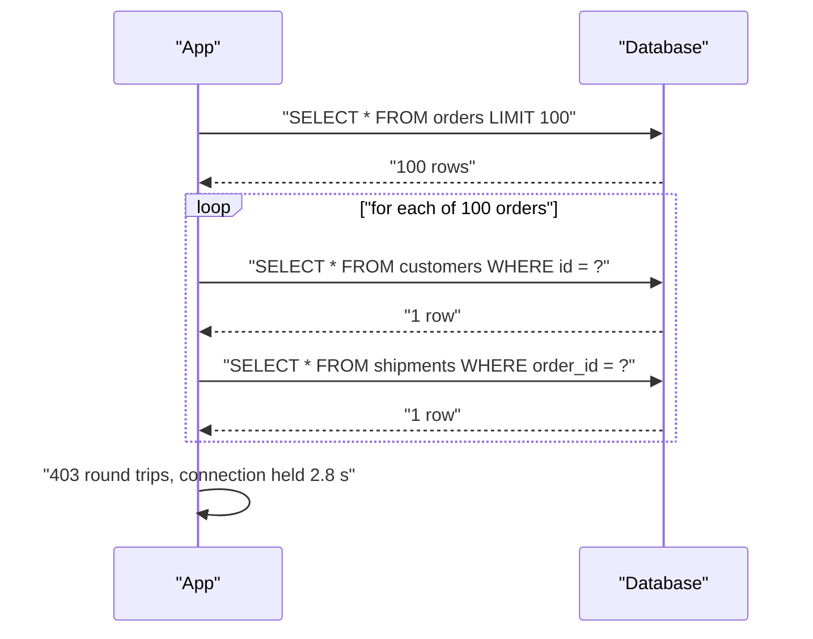
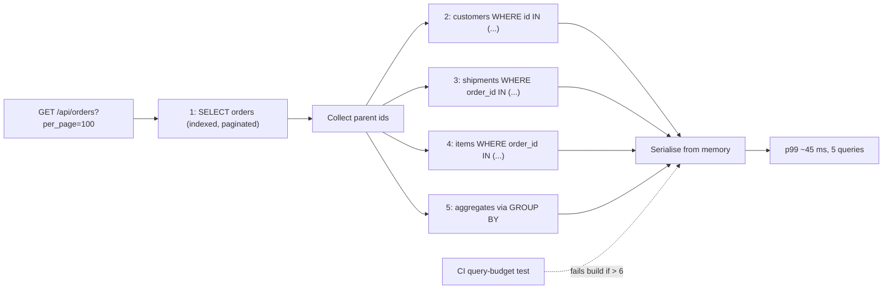

> **Scenario** - `/api/orders?per_page=100` responds in 2.8 s. The slow log shows 403 queries for that one request: one to list orders, 100 to load each customer, 100 for each order's shipment, and 200 more from a currency formatter that lazily fetches the tenant's settings inside the loop.

## Why it matters

- Each query has fixed overhead - round trip, parse, plan, result marshalling - so 400 × 3 ms is 1.2 s of latency that no index will remove.
- Every one of those queries holds a pool connection for the duration of the request. By Little's Law, 400 queries per request at 3 ms means one request occupies a connection for 1.2 s; 40 concurrent requests need 40 connections *doing nothing but waiting*.
- N+1 scales with data, not traffic: it passes review and CI on a 3-row fixture and detonates when a customer has 5 000 line items.
- It is the most common cause of "the database is slow" reports where the database is at 8% CPU.
- Fixing it is usually a two-line change, which makes the 2 s regression a pure own-goal.

## Symptoms

| Signal | What you observe |
| --- | --- |
| Slow query log | Hundreds of near-identical `SELECT ... WHERE id = ?` per request |
| APM trace | A flat wall of tiny DB spans, each 1–4 ms, filling the request |
| `pg_stat_statements` | One query with `calls = 41 000 000` and tiny `mean_exec_time` |
| DB CPU | Low, while app latency is high |
| Pool metrics | Connections busy but query time per connection trivial |
| Scaling behaviour | Latency proportional to `per_page`, not to concurrency |

## How it breaks

Lazy loading is an ORM feature that defers a relation's query until the attribute is touched. Inside a loop - or inside a template, or a serialiser, or an accessor - "touched" happens once per row. The parent query returns N rows and the code issues N more queries, hence 1 + N.

The pathology is that the ORM hides the cost at the call site. `$order->customer->name` looks like a property access, not a network round trip. Serialisers and Blade/Vue templates are the worst offenders because the loop is not visible in the code that added the field.

Nesting multiplies: 100 orders × (1 customer + 1 shipment + 1 tenant setting) = 300 queries, plus 100 more if the shipment's carrier is also lazy.



## Root causes

1. Lazy relations accessed inside a loop, template, or serialiser.
2. Accessors and computed attributes that query on read (`getFormattedTotalAttribute()` fetching tenant settings).
3. Eager loading declared but broken by a later refactor - a new field in the API resource pulls an unloaded relation.
4. Polymorphic relations, which many ORMs cannot eager-load in one query without help.
5. GraphQL resolvers implemented per-field with no batching layer.
6. Pagination limits raised (`per_page=500`) without re-testing the query count.
7. Counting via collections (`$order->items->count()`) instead of an aggregate.

## How to solve it

### 1. Prove it with a query counter, in a test

Make the regression impossible to reintroduce:

```php
<?php
// tests/Feature/OrderIndexQueryBudgetTest.php
public function test_order_index_stays_within_query_budget(): void
{
    Order::factory()->count(100)->hasItems(5)->create();

    $queries = 0;
    DB::listen(function () use (&$queries) { $queries++; });

    $this->getJson('/api/orders?per_page=100')->assertOk();

    // 1 orders + 1 customers + 1 shipments + 1 items + 1 settings
    $this->assertLessThanOrEqual(6, $queries, "N+1 regression: {$queries} queries");
}
```

A budget assertion catches the problem in CI at the moment it is introduced, which is the only reliable place.

### 2. Eager-load the whole graph you will serialise

```php
<?php
// One query per relation level instead of one per row
$orders = Order::query()
    ->with([
        'customer:id,name,email',
        'shipment.carrier:id,name',
        'items' => fn ($q) => $q->select('id', 'order_id', 'sku', 'qty'),
    ])
    ->withCount('items')                 // aggregate, not a loaded collection
    ->withSum('items as total_qty', 'qty')
    ->latest('created_at')
    ->paginate(100);
```

Under the hood this becomes 1 + 4 queries using `WHERE order_id IN (...)`:

```sql
SELECT id, order_id, sku, qty FROM items WHERE order_id IN (1,2,3, /* ...100 ids */);
```

Note the column lists. Eager loading a relation with `SELECT *` on a wide table trades 100 round trips for one enormous result set - still a regression.

### 3. Prevent lazy loading structurally

```php
<?php
// AppServiceProvider::boot() - throw in dev/CI, log in production
Model::preventLazyLoading(! app()->isProduction());

Model::handleLazyLoadingViolationUsing(function ($model, $relation) {
    Log::warning('lazy load violation', [
        'model' => $model::class, 'relation' => $relation,
    ]);
});
```

Now any missing `with()` fails a test rather than silently costing 2 s in production.

### 4. Batch across resolver boundaries with a loader

For GraphQL or any per-item service call, collect keys and resolve them in one round trip.

```ts
// DataLoader-style batching: N calls collapse into one IN query per tick
const customerLoader = new DataLoader<string, Customer>(async (ids) => {
  const rows = await db.query<Customer>(
    'SELECT id, name, email FROM customers WHERE id = ANY($1)',
    [ids],
  )
  const byId = new Map(rows.map((r) => [r.id, r]))
  return ids.map((id) => byId.get(id) ?? new Error(`customer ${id} missing`))
})

// Resolvers stay naive; batching happens underneath
const customer = await customerLoader.load(order.customerId)
```

Two rules make this safe: results must be returned in the same order as the keys, and the loader must be created per-request so it never caches across users.

### 5. Push aggregates into SQL

```sql
-- Instead of loading every item to count and sum them in PHP
SELECT o.id, o.total_cents,
       count(i.id)            AS item_count,
       coalesce(sum(i.qty),0) AS total_qty
FROM orders o
LEFT JOIN items i ON i.order_id = o.id
WHERE o.tenant_id = 88
GROUP BY o.id, o.total_cents
ORDER BY o.created_at DESC
LIMIT 100;
```

For a "latest child per parent" list, a lateral join beats N queries:

```sql
SELECT o.id, s.status, s.updated_at
FROM orders o
LEFT JOIN LATERAL (
  SELECT status, updated_at FROM shipments
  WHERE shipments.order_id = o.id
  ORDER BY updated_at DESC LIMIT 1
) s ON true
WHERE o.tenant_id = 88
LIMIT 100;
```

MySQL 8.0 expresses the same thing with a window function (`ROW_NUMBER() OVER (PARTITION BY order_id ORDER BY updated_at DESC)`) since `LATERAL` arrived only in 8.0.14.

### 6. Cap the blast radius

Enforce a maximum `per_page`, and keep serialiser depth bounded. An endpoint that can return 5 000 nested objects will eventually be asked to.

## Target design



## Tradeoffs

| Option | Pros | Cons | Choose when |
| --- | --- | --- | --- |
| Eager loading (`with`) | Simple, framework-native | Must be kept in sync with serialisers | Standard REST list endpoints |
| Single `JOIN` query | One round trip | Row multiplication for has-many, wide result | One-to-one relations, aggregates |
| DataLoader batching | Resolvers stay decoupled | Extra layer, per-request lifecycle rules | GraphQL, service-to-service fan-out |
| Denormalised columns | Zero joins on read | Write-time consistency burden | Read-heavy fields like `item_count` |
| Cache the serialised payload | Removes DB entirely on hit | Invalidation, staleness | Stable, frequently-read resources |

## Verification checklist

- [ ] A test asserts a fixed query budget for each list endpoint at `per_page` = max.
- [ ] `Model::preventLazyLoading()` (or the ORM equivalent) enabled in dev and CI.
- [ ] APM trace of the endpoint shows fewer than ~10 DB spans.
- [ ] `pg_stat_statements` reviewed for queries with huge `calls` and tiny `mean_exec_time`.
- [ ] Eager loads select explicit columns; no `SELECT *` on wide relations.
- [ ] `per_page` has a hard server-side maximum, tested.
- [ ] DataLoader instances are per-request; a test confirms no cross-user cache bleed.
- [ ] After the fix, connection-pool wait time measured - it should drop with latency.

## Anti-patterns

- Caching the endpoint response to hide the N+1 instead of removing it.
- Raising the connection pool size so more requests can each hold a connection for 2 s.
- Eager loading everything everywhere (`with('items.product.category.tenant')`), turning 400 small queries into one 40 MB result set.
- `$collection->count()` on a loaded relation when `withCount` exists.
- Fixing the loop but leaving a lazy accessor that queries on serialisation.
- Benchmarking with `per_page=10` after fixing a bug reported at `per_page=500`.
- Reaching for a read replica because "the database is slow".

## Related

- [Index design and reading query plans](/systems/data-storage/index-design-and-query-plans)
- [Connection pool exhaustion](/systems/data-storage/connection-pool-exhaustion)
- [Archiving and pruning very large tables](/systems/data-storage/large-table-archival-strategy)
- [p99 tail latency and capacity planning](/systems/performance-capacity/p99-tail-latency-planning)
