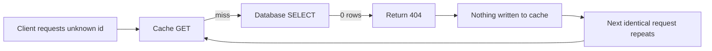
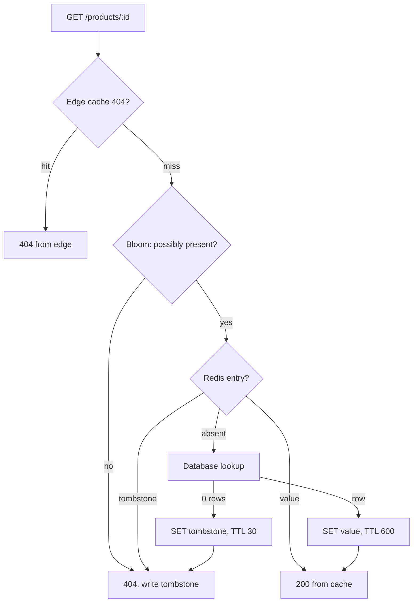

> **Scenario** - একটি scraper `/api/products/{id}` ধরে 1 থেকে 5,000,000 পর্যন্ত হাঁটে। এর প্রায় 4.6 মিলিয়ন ID-র অস্তিত্ব নেই। প্রত্যেকটি cache miss করে - কারণ "not found" কখনো cache হয়নি - এবং Postgres-এ যায়। ছয় ঘণ্টা database CPU 95%, অথচ cache hit ratio dashboard নির্লিপ্তভাবে 98% দেখায়।

## Why it matters

- যে miss কখনো cache হয় না, তা ইন্টারনেট থেকে সরাসরি database-এ একটি uncapped channel। আক্রমণকারী ঠিক যে traffic pattern বাছবে, cache তার জন্য শূন্য সুরক্ষা দেয়।
- Hit-ratio dashboard এটা লুকায়। শুধু বিদ্যমান entity-র lookup গোনা হয়, তাই metric সুস্থ দেখায় আর origin পুড়তে থাকে।
- বৈধ traffic-ও এটা ঘটায়: search engine-এ এখনো link থাকা মুছে ফেলা product, expired share link, user দেখতে পায় না এমন resource-এর permission check।
- Not-found lookup প্রায়ই *সবচেয়ে* ব্যয়বহুল query - index shortcut নেই, পুরো predicate evaluate হয়, কখনো scan-এর পরেও join শূন্য ফেরায়।
- আর negative cache করার পর TTL বেশি হলে নতুন তৈরি record ওই পুরো window অদৃশ্য থাকে, যা user-এর কাছে "save button কাজ করছে না"।

## Symptoms

| Signal | What you observe |
|--------|------------------|
| Cache hit ratio | দেখতে ঠিক (95%+), অথচ database QPS আলাদাভাবে বাড়ছে |
| Query log | শূন্য row ফেরানো query-র বিপুল পরিমাণ |
| ID distribution | বাস্তব range-এর অনেক বাইরে sequential বা random ID |
| Redis key count | সমতল, অথচ origin load বাড়ছে - কিছুই লেখা হচ্ছে না |
| Response codes | app tier-এ 404-এর বড় অংশ |
| Latency | 404 response 200 response-এর চেয়ে ধীর |

## How it breaks

সাধারণ `remember`-ধাঁচের helper কেবল তখনই cache-এ লেখে যখন loader একটি value ফেরায়। `null`, `false`, খালি array এবং ছোড়া `ModelNotFoundException` - সবই write এড়িয়ে যায়। কোড দেখতে সঠিক (error cache করা তো উচিত নয়), কিন্তু ফল হলো পুরো not-found space স্থায়ীভাবে uncacheable।

আক্রমণকারীর আপনার ID space জানার দরকার নেই। যেকোনো enumeration বেশিরভাগ miss তৈরি করে, আর miss-ই ব্যয়বহুল path। tenant-scoped lookup-এও একই আকার: অন্য tenant-এর বৈধ ID এই tenant-এর কাছে "not found" এবং সমানভাবে uncacheable।



## Root causes

1. cache-population branch truthy result-এর উপর শর্তাধীন।
2. control flow-এ exception (`findOrFail`) ব্যবহার করায় cache write পুরোপুরি বাদ পড়ে।
3. cache-এ "আমরা দেখিনি" আর "দেখেছি, নেই" - এ দুইয়ের কোনো পার্থক্য নেই।
4. ব্যয়বহুল lookup-এর সামনে কোনো সস্তা membership pre-filter নেই।
5. 404 path-এ rate limiting নেই, তাই caller-এর জন্য enumeration বিনামূল্যে।
6. একবার নতুন record এক ঘণ্টা অদৃশ্য থাকার incident-এর পর negative cache করতে ভয়।

## How to solve it

### 1. Cache a sentinel, with a shorter TTL

একটি স্পষ্ট tombstone রাখুন, যাতে read path "absent" আর "known absent" আলাদা করতে পারে।

```ts
const NEGATIVE = '\u0000nf'
const POSITIVE_TTL = 600
const NEGATIVE_TTL = 30 // deliberately shorter

export async function getProduct(id: number): Promise<Product | null> {
  const key = `product:${id}`
  const cached = await redis.get(key)
  if (cached === NEGATIVE) return null
  if (cached) return JSON.parse(cached) as Product

  const row = await db.product.findUnique({ where: { id } })
  if (!row) {
    await redis.set(key, NEGATIVE, 'EX', jitteredTtl(NEGATIVE_TTL))
    return null
  }
  await redis.set(key, JSON.stringify(row), 'EX', jitteredTtl(POSITIVE_TTL))
  return row
}
```

Laravel-এ sentinel `Cache::remember`-এর null-skip আচরণ এড়ায়:

```php
public function find(int $id): ?Product
{
    $key = "product:{$id}";
    $cached = Cache::get($key);

    if ($cached === self::NEGATIVE) {
        return null;
    }
    if ($cached !== null) {
        return $cached;
    }

    $product = Product::find($id);
    Cache::put($key, $product ?? self::NEGATIVE, $product ? 600 : 30);

    return $product;
}
```

### 2. Invalidate the tombstone on create

entity তৈরি হওয়ার মুহূর্তেই negative entry মুছতে হবে, নাহলে creation ব্যর্থ মনে হবে।

```php
protected static function booted(): void
{
    static::created(fn (Product $p) => Cache::forget("product:{$p->id}"));
    static::updated(fn (Product $p) => Cache::forget("product:{$p->id}"));
    static::deleted(fn (Product $p) => Cache::put("product:{$p->id}", self::NEGATIVE, 30));
}
```

### 3. Add a membership pre-filter for large ID spaces

খুব বড় keyspace-এ Bloom filter এক round trip-এ "নিশ্চিতভাবে নেই" বলে দেয়, ID-প্রতি key ছাড়াই।

```bash
# RedisBloom: 0.1% false positive rate over 10M expected items
BF.RESERVE product:exists 0.001 10000000
BF.ADD product:exists 4211
BF.EXISTS product:exists 999999   # 0 => certainly absent, skip the database
```

`BF.EXISTS`-এর `0` চূড়ান্ত; `1` false positive হতে পারে, তাই স্বাভাবিক path-এ নামুন।

### 4. Rate-limit and cache 404s at the edge

Negative response-ও cacheable HTTP response। সেটা বলে দিন।

```
HTTP/1.1 404 Not Found
Cache-Control: public, max-age=30
Surrogate-Control: max-age=60
```

```nginx
location /api/products/ {
    proxy_cache app_cache;
    proxy_cache_valid 200 5m;
    proxy_cache_valid 404 30s;      # cache the absence at the edge too
    limit_req zone=api_404 burst=20 nodelay;
    add_header X-Cache-Status $upstream_cache_status always;
}
```

## Target design



## Tradeoffs

| Option | Pros | Cons | Choose when |
|--------|------|------|-------------|
| Sentinel value with short TTL | সহজ, নির্ভুল, যেকোনো store-এ চলে | probe করা প্রতিটি ID-তে একটি key - আক্রমণের সাথে memory বাড়ে | মাঝারি বা সীমিত ID space-এ default |
| Bloom filter pre-check | probe যত বেশিই হোক memory স্থির | false positive; data বদলালে rebuild লাগে | কোটি কোটি ID, উচ্চ enumeration ঝুঁকি |
| Edge caching of 404s | origin পুনরাবৃত্ত probe দেখেই না | শুধু অভিন্ন URL-এ কাজ করে; cache-key hygiene লাগে | public, unauthenticated read endpoint |
| Rate limiting only | নতুন cache semantics ভাবতে হয় না | বৈধ burst throttle হয়; নাছোড় scraper ধীরে হলেও চালিয়ে যায় | এখনই read path বদলানো সম্ভব নয় |
| No negative caching | নতুন entity সাথে সাথে দৃশ্যমান | unbounded origin exposure | creation latency কঠোর product requirement ও traffic বিশ্বস্ত |

## Verification checklist

- [ ] `for i in $(seq 1 1000); do curl -s -o /dev/null "$HOST/api/products/99$i"; done` চালিয়ে দেখুন প্রথম pass-এর পর database QPS সমতল থাকে।
- [ ] এক probe-এর পর `redis-cli GET product:9999999` tombstone দেয়, `(nil)` নয়।
- [ ] আগে probe হওয়া ID-তে record তৈরি করে দেখুন তা সাথে সাথেই পড়া যায়।
- [ ] configuration-এ negative TTL positive TTL-এর চেয়ে ছোট এবং দুটোই jittered।
- [ ] একটি metric negative hit ও positive hit আলাদা করে, যাতে dashboard মিথ্যা বলা বন্ধ করে।
- [ ] দ্বিতীয় call-এ `curl -sI "$HOST/api/products/9999999"` `404` ও `X-Cache-Status: HIT` দেয়।
- [ ] synthetic enumeration test-এ memory বৃদ্ধি eviction budget-এর ভেতরে থাকে।

## Anti-patterns

- আসল data-র সমান TTL দিয়ে `null` cache করা, ফলে তৈরি হওয়া record দশ মিনিট অদৃশ্য।
- sentinel হিসেবে খালি string ব্যবহার, যা বৈধ খালি value-র সাথে সংঘর্ষ করে।
- compact marker-এর বদলে *exception* object বা serialized stack trace cache করা।
- read path unbounded রেখে enumeration থামাতে শুধু WAF-এর উপর ভরসা।
- create-এ invalidate না করে negative cache করা, তারপর "save button কাজ করছে না" debug করা।
- cache key-তে tenant বা role না রেখে authorization denial-কে cacheable not-found ধরা।

## Related

- [Cache-aside vs write-through vs write-behind](/systems/caching-cdn/cache-aside-vs-write-through)
- [TTL and jitter design for cache fleets](/systems/caching-cdn/ttl-and-jitter-design)
- [Cache stampede prevention with locks and early refresh](/systems/caching-cdn/cache-stampede-prevention)
- [Cache invalidation strategies that survive deploys](/systems/caching-cdn/cache-invalidation-strategies)
