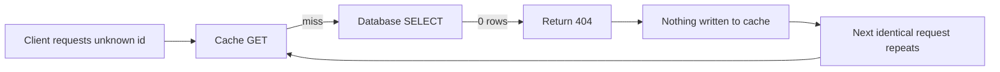
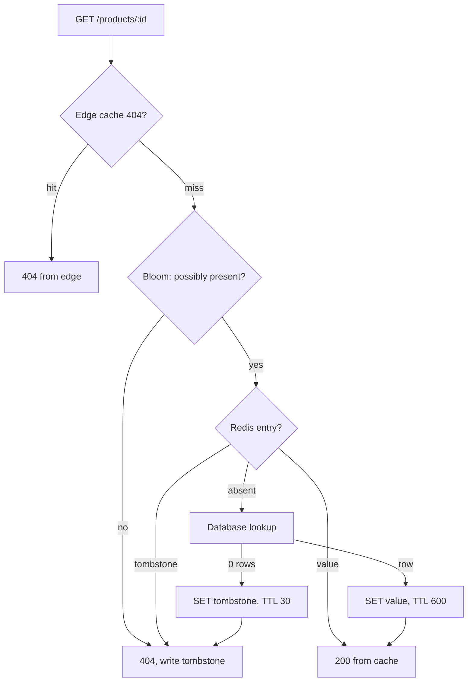

> **Scenario** — A scraper walks `/api/products/{id}` for IDs 1 through 5,000,000. Roughly 4.6 million of those IDs do not exist. Every one of them misses the cache — because "not found" was never cached — and hits Postgres. Database CPU sits at 95% for six hours while the cache hit ratio dashboard cheerfully reports 98%.

## Why it matters

- A miss that is never cached is an uncapped channel from the internet straight to your database. The cache provides zero protection for exactly the traffic pattern an attacker will choose.
- Hit-ratio dashboards hide it. Only lookups for existing entities are counted, so the metric looks healthy while the origin burns.
- Legitimate traffic causes it too: deleted products still linked from search engines, expired share links, permission checks for resources the user cannot see.
- Not-found lookups are often the *most* expensive queries — no index shortcut, full predicate evaluation, sometimes a join that returns nothing after scanning.
- Once you do cache negatives, a too-long TTL means a newly created record is invisible for that whole window, which reads as "the save button doesn't work".

## Symptoms

| Signal | What you observe |
|--------|------------------|
| Cache hit ratio | Looks fine (95%+) while database QPS climbs independently |
| Query log | High volume of queries returning zero rows |
| ID distribution | Sequential or random IDs far outside the real range |
| Redis key count | Flat, while origin load rises — nothing is being written |
| Response codes | Large share of 404s at the app tier |
| Latency | 404 responses slower than 200 responses |

## How it breaks

The typical `remember`-style helper only writes to the cache when the loader returns a value. `null`, `false`, an empty array, and a thrown `ModelNotFoundException` all skip the write. The code reads as correct — you would not want to cache an error — but the effect is that the entire not-found space is permanently uncacheable.

Attackers do not need to know your ID space. Any enumeration produces mostly misses, and misses are the expensive path. The same shape appears with tenant-scoped lookups: a valid ID belonging to another tenant looks like "not found" to this tenant and is equally uncacheable.



## Root causes

1. The cache-population branch is conditional on a truthy result.
2. Exceptions used for control flow (`findOrFail`) bypass the cache write entirely.
3. No distinction in the cache between "we have not looked" and "we looked and it is not there".
4. No cheap membership pre-filter in front of the expensive lookup.
5. No rate limiting on the 404 path, so enumeration is free for the caller.
6. Fear of caching negatives after one incident where a new record stayed invisible for an hour.

## How to solve it

### 1. Cache a sentinel, with a shorter TTL

Store an explicit tombstone value so the read path can distinguish "absent" from "known absent".

```ts
const NEGATIVE = '\u0000nf'
const POSITIVE_TTL = 600
const NEGATIVE_TTL = 30 // deliberately shorter

export async function getProduct(id: number): Promise<Product | null> {
  const key = `product:${id}`
  const cached = await redis.get(key)
  if (cached === NEGATIVE) return null
  if (cached) return JSON.parse(cached) as Product

  const row = await db.product.findUnique({ where: { id } })
  if (!row) {
    await redis.set(key, NEGATIVE, 'EX', jitteredTtl(NEGATIVE_TTL))
    return null
  }
  await redis.set(key, JSON.stringify(row), 'EX', jitteredTtl(POSITIVE_TTL))
  return row
}
```

In Laravel, the sentinel avoids `Cache::remember`'s null-skipping behaviour:

```php
public function find(int $id): ?Product
{
    $key = "product:{$id}";
    $cached = Cache::get($key);

    if ($cached === self::NEGATIVE) {
        return null;
    }
    if ($cached !== null) {
        return $cached;
    }

    $product = Product::find($id);
    Cache::put($key, $product ?? self::NEGATIVE, $product ? 600 : 30);

    return $product;
}
```

### 2. Invalidate the tombstone on create

The negative entry must be removed the moment the entity comes into existence, otherwise creation appears to fail.

```php
protected static function booted(): void
{
    static::created(fn (Product $p) => Cache::forget("product:{$p->id}"));
    static::updated(fn (Product $p) => Cache::forget("product:{$p->id}"));
    static::deleted(fn (Product $p) => Cache::put("product:{$p->id}", self::NEGATIVE, 30));
}
```

### 3. Add a membership pre-filter for large ID spaces

For very large keyspaces, a Bloom filter answers "definitely not present" in one round trip without a per-ID key.

```bash
# RedisBloom: 0.1% false positive rate over 10M expected items
BF.RESERVE product:exists 0.001 10000000
BF.ADD product:exists 4211
BF.EXISTS product:exists 999999   # 0 => certainly absent, skip the database
```

A `0` from `BF.EXISTS` is authoritative; a `1` may be a false positive, so fall through to the normal path.

### 4. Rate-limit and cache 404s at the edge

Negative responses are cacheable HTTP responses. Say so.

```
HTTP/1.1 404 Not Found
Cache-Control: public, max-age=30
Surrogate-Control: max-age=60
```

```nginx
location /api/products/ {
    proxy_cache app_cache;
    proxy_cache_valid 200 5m;
    proxy_cache_valid 404 30s;      # cache the absence at the edge too
    limit_req zone=api_404 burst=20 nodelay;
    add_header X-Cache-Status $upstream_cache_status always;
}
```

## Target design



## Tradeoffs

| Option | Pros | Cons | Choose when |
|--------|------|------|-------------|
| Sentinel value with short TTL | Simple, exact, works with any store | One key per probed ID — memory grows with the attack | Default for bounded or moderate ID spaces |
| Bloom filter pre-check | Constant memory regardless of probe volume | False positives; rebuilds needed as data changes | Tens of millions of IDs, high enumeration risk |
| Edge caching of 404s | Origin never sees the repeat probe | Only helps for identical URLs; needs cache-key hygiene | Public, unauthenticated read endpoints |
| Rate limiting only | No cache semantics to reason about | Legitimate bursts get throttled; determined scrapers slow down but continue | You cannot change the read path right now |
| No negative caching | Newly created entities are instantly visible | Unbounded origin exposure | Creation latency is a hard product requirement and traffic is trusted |

## Verification checklist

- [ ] `for i in $(seq 1 1000); do curl -s -o /dev/null "$HOST/api/products/99$i"; done` and confirm database QPS stays flat after the first pass.
- [ ] `redis-cli GET product:9999999` returns the tombstone, not `(nil)`, after one probe.
- [ ] Create a record whose ID was previously probed and confirm it is readable immediately.
- [ ] Negative TTL is strictly shorter than positive TTL in configuration, and both are jittered.
- [ ] A metric distinguishes negative hits from positive hits so the dashboard stops lying.
- [ ] `curl -sI "$HOST/api/products/9999999"` returns `404` with `X-Cache-Status: HIT` on the second call.
- [ ] Memory growth under a synthetic enumeration test stays within the eviction budget.

## Anti-patterns

- Caching `null` with the same TTL as real data, so a created record is invisible for ten minutes.
- Using an empty string as the sentinel, which collides with legitimately empty values.
- Caching the *exception* object or a serialized stack trace instead of a compact marker.
- Relying on the WAF to stop enumeration while the read path stays unbounded.
- Caching negatives without invalidating on create, then debugging "the save button doesn't work".
- Treating an authorization denial as a cacheable not-found without including the tenant or role in the cache key.

## Related

- [Cache-aside vs write-through vs write-behind](/systems/caching-cdn/cache-aside-vs-write-through)
- [TTL and jitter design for cache fleets](/systems/caching-cdn/ttl-and-jitter-design)
- [Cache stampede prevention with locks and early refresh](/systems/caching-cdn/cache-stampede-prevention)
- [Cache invalidation strategies that survive deploys](/systems/caching-cdn/cache-invalidation-strategies)
