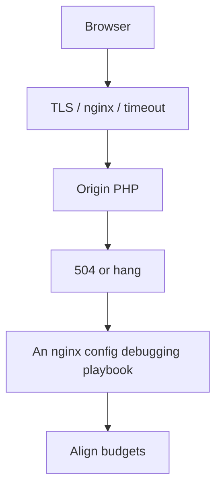

> **Lesson 87 · intermediate** - Which server block won, why the regex location matched, and how to read $upstream_* variables at 2am.

## Why it matters

- Nginx buffering, TLS handshake cost, and timeouts are the real UX of a Laravel API behind a proxy.
- Geo routing and rate limits at the edge stop abuse before PHP-FPM ever wakes.
- MTU/MSS issues look like “random” timeouts that no application log will explain.
- This lesson is specifically about **An nginx config debugging playbook**. Tags: nginx, debugging, logging, playbook, edge.

## Symptoms

| Signal | What you observe |
| --- | --- |
| 504 | PHP finished, proxy already gave up |
| TLS tax | Mobile p99 dominated by handshake, not JSON |
| DDoS-ish | Login endpoint CPU-bound from unauthenticated POST |
| Partial body | Large upload dies at 1MB proxy limit |

## How it breaks



The named technology is rarely the villain. Two code paths (often a Vue/Quasar screen and a Laravel write) assume opposite contracts. Production finds the race. For this topic that contract is: Which server block won, why the regex location matched, and how to read $upstream_* variables at 2am.

## Root causes

1. proxy_read_timeout shorter than the slowest honest job.
2. No session resumption / HTTP/2 on the cert.
3. Rate limit only inside Laravel, not at nginx.
4. client_max_body_size copied from a blog and never matched the product.

## How to solve it

### 1. Write the invariant in one sentence

Which server block won, why the regex location matched, and how to read $upstream_* variables at 2am. Put that sentence in the PR, the Pinia action, and the Laravel class.

### 2. Guard the edge in code

```ts
// Axios timeout must be < nginx, or the user retries while PHP still runs
api.defaults.timeout = 12_000
```

```php
# nginx
proxy_read_timeout 30s;
client_max_body_size 12m;
limit_req zone=login burst=20 nodelay;
```

### 3. Keep a chart you will actually look at

Edge 4xx/5xx, TLS handshake time, and origin vs edge cache hit. If the chart cannot catch a regression in **An nginx config debugging playbook**, the lesson is not done.

## Worked example

Quasar file upload hung at 99%. Nginx `client_max_body_size` was 1m; Laravel accepted 8m. Aligning the proxy limit and showing a client-side size check removed the ghost progress bar.

On this topic, start from the symptom in the table that matches your last incident, then walk the diagram until the guard above would have fired.

## Check before you ship

- [ ] The invariant for **An nginx config debugging playbook** is written in one sentence.
- [ ] Empty, duplicate, timeout, or permission paths have a test or a staged rehearsal.
- [ ] A dashboard or log query would catch a regression within one deploy.
- [ ] Related reading still makes sense: reverse-proxy-buffering-and-timeouts, load-balancing-algorithm-choice, nginx-edge-tls-termination.

## What not to do

- Copy a blog snippet that retries forever or caches the error as success.
- Treat Pinia as the source of truth for a Laravel row.
- Skip the previous numbered lesson if this one feels dense — the path is beginner → intermediate → advanced on purpose.
