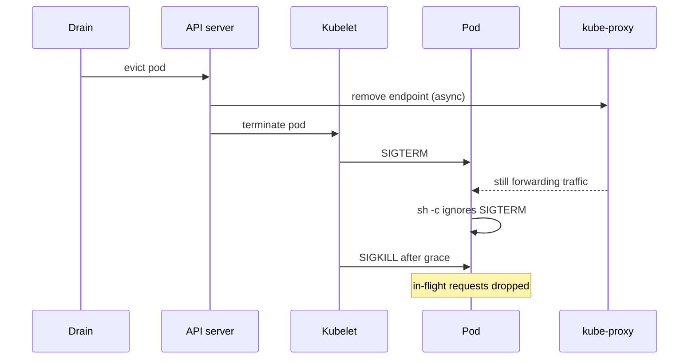
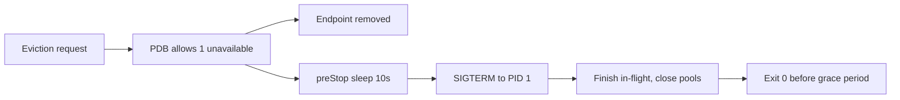

> **পরিস্থিতি** - একটা রুটিন node pool upgrade বারোটা node drain করল। Checkout error rate এগারো মিনিট ধরে ৪%-এ উঠল, ৩০০টা background job হারিয়ে গেল। কেউ কিছু deploy করেনি; শুধু cluster upgrade-ই incident ঘটিয়েছে।

## কেন গুরুত্বপূর্ণ

- Node upgrade, spot reclaim ও autoscaler scale-down *রুটিন* ঘটনা। Drain কষ্ট দিলে আপনার সাপ্তাহিক outage নির্ধারিত সূচিতেই আছে।
- Kubernetes SIGTERM পাঠিয়ে `terminationGracePeriodSeconds` অপেক্ষা করে, তারপর SIGKILL করে। SIGTERM উপেক্ষা করা app ওই মুহূর্তে প্রতিটি in-flight request হারায়।
- Endpoint সরানো আর process shutdown সমান্তরাল, ধারাবাহিক নয় - `preStop` delay ছাড়া proxy বন্ধ হতে থাকা socket-এ traffic পাঠাতেই থাকে।
- PodDisruptionBudget না থাকলে drain একসাথে service-এর সব replica নিতে পারে; ভুল PDB আবার cluster upgrade অনির্দিষ্টকাল আটকে রাখে।

## লক্ষণ

| Signal | যা দেখবেন |
|---|---|
| Upgrade চলাকালীন | deploy নয়, `kubectl drain`-এর সাথে মিলে যাওয়া error rate spike |
| Client error | eviction-এর শেষ সেকেন্ডে পাঠানো request-এ connection reset / 502 |
| Drain output | ঘণ্টার পর ঘণ্টা `error when evicting pod ... Cannot evict pod as it would violate the budget` |
| Job metric | consumer-এর processed message হারানো, redeliver বা duplicate |
| Pod events | `Stopping container`-এর পরপরই grace period শেষে SIGKILL |

## কীভাবে ভাঙে

Eviction একসাথে দুটি ঘড়ি চালায়। API pod-কে Endpoints থেকে সরায়, আর kubelet PID 1-এ SIGTERM পাঠায়। কেউ কারো জন্য অপেক্ষা করে না। kube-proxy ও ingress controller-এর converge হতে এক সেকেন্ড বা বেশি লাগে, তাই app বন্ধ হতে শুরু করার পরও traffic আসতে থাকে।

Process যদি SIGTERM উপেক্ষাও করে - shell wrapper-এ খুব সাধারণ, যেখানে PID 1 হলো `/bin/sh -c` এবং signal forward করে না - তাহলে কিছুই graceful ভাবে বন্ধ হয় না। Container grace period শেষ না হওয়া পর্যন্ত চলে, তারপর request-এর মাঝপথেই মারা যায়।



## মূল কারণ

1. PID 1 এমন একটা shell যা application-এ SIGTERM forward করে না।
2. `preStop` hook নেই, তাই endpoint সরানো ও socket বন্ধ হওয়ার মধ্যে race হয়।
3. `terminationGracePeriodSeconds` দীর্ঘতম in-flight request বা job-এর চেয়ে ছোট।
4. PodDisruptionBudget নেই, তাই একটি drain একটি Deployment-এর সব replica evict করতে পারে।
5. `minAvailable` = `replicas` সেট করা, যা প্রতিটি voluntary eviction অসম্ভব করে।

## কীভাবে সমাধান করবেন

### ১. Process যেন SIGTERM পায় ও মানে

```dockerfile
# exec form: the app becomes PID 1 and receives signals directly
ENTRYPOINT ["node", "dist/server.js"]
```

```ts
const server = app.listen(8080)
process.on('SIGTERM', () => {
  server.close(async () => {          // stop accepting, finish in-flight
    await queue.close()               // nack unacked messages
    await db.end()
    process.exit(0)
  })
  setTimeout(() => process.exit(1), 25_000).unref()  // hard cap
})
```

### ২. Data plane-কে converge করার সময় দিন

```yaml
spec:
  terminationGracePeriodSeconds: 60      # > longest request + preStop
  containers:
    - name: api
      lifecycle:
        preStop:
          exec:
            command: ["sh", "-c", "sleep 10"]
```

### ৩. এমন budget দিন যা maintenance-কে অনুমতি দেয়

```yaml
apiVersion: policy/v1
kind: PodDisruptionBudget
metadata:
  name: api
spec:
  maxUnavailable: 1          # or minAvailable: 80% for large fleets
  selector:
    matchLabels: { app: api }
```

Scalable Deployment-এ `maxUnavailable`, আর quorum system-এ `minAvailable` ব্যবহার করুন (যেমন ৩-node etcd বা Redis cluster-এ `minAvailable: 2`)। `minAvailable`-কে কখনো `replicas`-এর সমান করবেন না - তাতে প্রতিটি node upgrade আটকে যায়।

### ৪. Replica ছড়িয়ে দিন যেন এক node একক ব্যর্থতাবিন্দু না হয়

```yaml
topologySpreadConstraints:
  - maxSkew: 1
    topologyKey: kubernetes.io/hostname
    whenUnsatisfiable: ScheduleAnyway
    labelSelector:
      matchLabels: { app: api }
```

### ৫. Drain-এর মহড়া দিন

```bash
kubectl get pdb -A
kubectl drain node-14 --ignore-daemonsets --delete-emptydir-data --grace-period=60
# watch endpoints leave before the container exits
kubectl get endpoints api -n prod -w
kubectl uncordon node-14
```

## কাঙ্ক্ষিত ডিজাইন



## Tradeoff

| Option | সুবিধা | খরচ | কখন বেছে নেবেন |
|---|---|---|---|
| `maxUnavailable: 1` | সহজ, সবসময় অগ্রগতি হয় | বড় fleet-এ drain ধীর | অনেক replica-র stateless service |
| `minAvailable: N` | quorum স্পষ্টভাবে রক্ষা করে | replica N-এ নামলে upgrade আটকায় | etcd, Redis Sentinel, Kafka broker |
| দীর্ঘ grace period (১২০s+) | দীর্ঘ job পরিচ্ছন্নভাবে শেষ হয় | node upgrade অনেক বেশি সময় নেয় | দীর্ঘ unit-of-work-এর batch worker |
| PDB নেই | সবচেয়ে দ্রুত drain | একটি upgrade পুরো service নামিয়ে দিতে পারে | কেবল development cluster |

## যাচাই checklist

- [ ] `kubectl exec ... -- ps -p 1 -o comm=` `sh` নয়, application দেখায়।
- [ ] Synthetic load-এ এক node drain করলে শূন্য 5xx response।
- [ ] Container exit-এর অন্তত `preStop` সময় আগে endpoint সরে যায়।
- [ ] পুরো node pool-এর `kubectl drain` PDB deadlock ছাড়াই শেষ হয়।
- [ ] সর্বোচ্চ পর্যবেক্ষিত request duration `terminationGracePeriodSeconds` বিয়োগ preStop sleep-এর নিচে।
- [ ] Queue consumer SIGTERM-এ in-flight message nack করে, redelivery count দিয়ে যাচাই করা।

## Anti-pattern

- Entrypoint-কে `sh -c "npm start"`-এ মুড়ে signal delivery হারানো।
- Deploy দ্রুত দেখাতে `terminationGracePeriodSeconds: 5` দেওয়া।
- ৩-replica Deployment-এ `minAvailable: 3` দিয়ে upgrade আটকে গেলে pod force-delete করা।
- App এখনো SIGTERM উপেক্ষা করলেও শুধু `preStop`-এর উপর ভরসা করা - আপনি SIGKILL পিছিয়েছেন, data loss নয়।
- Scheduler-এ spread constraint না থাকায় এক service-এর সব replica এক node-এ চালানো।

## সম্পর্কিত

- [Kubernetes probes done right](/systems/devops-containers/kubernetes-probes-done-right)
- [Autoscaling on the right signal](/systems/devops-containers/autoscaling-on-the-right-signal)
- [Retry storm prevention](/systems/reliability-edge-cases/retry-storm-prevention)
