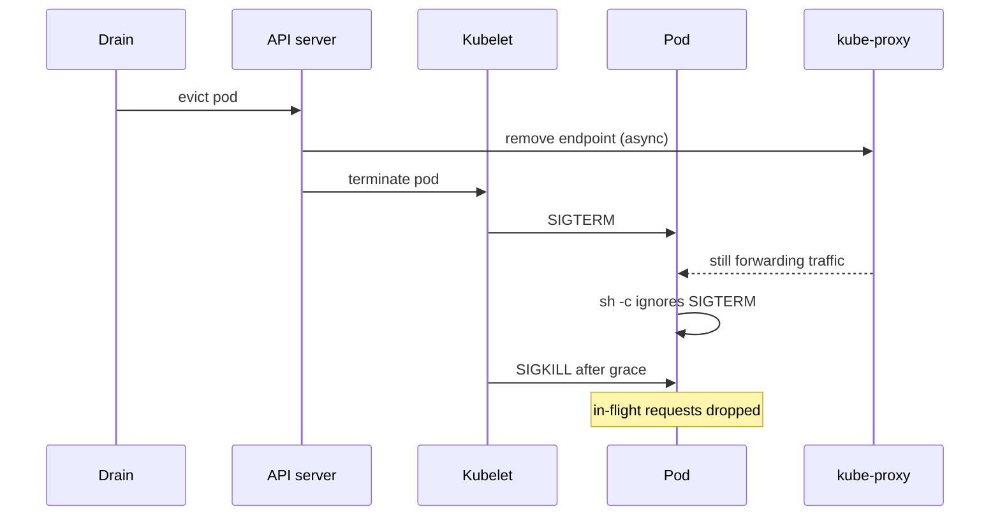
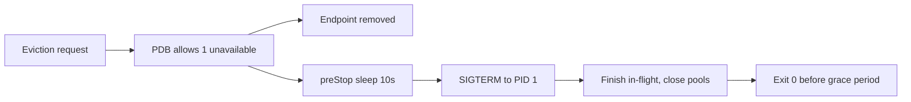

> **Scenario** — A routine node pool upgrade drains twelve nodes. Checkout error rate hits 4% for eleven minutes, and 300 background jobs are lost. Nobody deployed anything; the cluster upgrade alone caused the incident.

## Why it matters

- Node upgrades, spot reclaims, and autoscaler scale-down are *routine*. If a drain hurts, you have a weekly outage on a schedule.
- Kubernetes sends SIGTERM and waits `terminationGracePeriodSeconds`, then SIGKILLs. An app that ignores SIGTERM loses every in-flight request at that deadline.
- Endpoint removal and process shutdown are concurrent, not sequential — without a `preStop` delay, the proxy still sends traffic to a closing socket.
- A missing PodDisruptionBudget lets the drain take every replica of a service at once; a wrong one blocks cluster upgrades indefinitely.

## Symptoms

| Signal | What you observe |
|---|---|
| During upgrade | Error rate spike correlated with `kubectl drain`, not with a deploy |
| Client errors | Connection reset / 502 for requests issued in the last second before eviction |
| Drain output | `error when evicting pod ... Cannot evict pod as it would violate the budget` for hours |
| Job metrics | Consumer processed messages lost, redelivered, or duplicated |
| Pod events | `Stopping container` immediately followed by SIGKILL after grace period |

## How it breaks

Eviction runs two clocks at once. The API removes the pod from Endpoints, and the kubelet sends SIGTERM to PID 1. Neither waits for the other. kube-proxy and the ingress controller need a second or more to converge, so traffic keeps arriving after the app has begun shutting down.

If the process also ignores SIGTERM — common with shell wrappers where PID 1 is `/bin/sh -c` and never forwards signals — nothing shuts down gracefully at all. The container runs until the grace period expires and is then killed mid-request.



## Root causes

1. PID 1 is a shell that does not forward SIGTERM to the application.
2. No `preStop` hook, so endpoint removal races with socket close.
3. `terminationGracePeriodSeconds` shorter than the longest in-flight request or job.
4. No PodDisruptionBudget, so a single drain can evict all replicas of a Deployment.
5. `minAvailable` set equal to `replicas`, which makes every voluntary eviction impossible.

## How to solve it

### 1. Make the process receive and honour SIGTERM

```dockerfile
# exec form: the app becomes PID 1 and receives signals directly
ENTRYPOINT ["node", "dist/server.js"]
```

```ts
const server = app.listen(8080)
process.on('SIGTERM', () => {
  server.close(async () => {          // stop accepting, finish in-flight
    await queue.close()               // nack unacked messages
    await db.end()
    process.exit(0)
  })
  setTimeout(() => process.exit(1), 25_000).unref()  // hard cap
})
```

### 2. Give the data plane time to converge

```yaml
spec:
  terminationGracePeriodSeconds: 60      # > longest request + preStop
  containers:
    - name: api
      lifecycle:
        preStop:
          exec:
            command: ["sh", "-c", "sleep 10"]
```

### 3. Set a budget that permits maintenance

```yaml
apiVersion: policy/v1
kind: PodDisruptionBudget
metadata:
  name: api
spec:
  maxUnavailable: 1          # or minAvailable: 80% for large fleets
  selector:
    matchLabels: { app: api }
```

Use `maxUnavailable` for scalable Deployments and `minAvailable` for quorum systems (for example `minAvailable: 2` on a 3-node etcd or Redis cluster). Never set `minAvailable` equal to `replicas` — that blocks every node upgrade.

### 4. Spread replicas so one node is not a single point of failure

```yaml
topologySpreadConstraints:
  - maxSkew: 1
    topologyKey: kubernetes.io/hostname
    whenUnsatisfiable: ScheduleAnyway
    labelSelector:
      matchLabels: { app: api }
```

### 5. Rehearse the drain

```bash
kubectl get pdb -A
kubectl drain node-14 --ignore-daemonsets --delete-emptydir-data --grace-period=60
# watch endpoints leave before the container exits
kubectl get endpoints api -n prod -w
kubectl uncordon node-14
```

## Target design



## Tradeoffs

| Option | Pros | Cons | Choose when |
|---|---|---|---|
| `maxUnavailable: 1` | Simple, always allows progress | Drains are slow on large fleets | Stateless services with many replicas |
| `minAvailable: N` | Protects quorum explicitly | Blocks upgrades if replicas drop to N | etcd, Redis Sentinel, Kafka brokers |
| Long grace period (120s+) | Long jobs complete cleanly | Node upgrades take much longer | Batch workers with long unit-of-work |
| No PDB | Fastest possible drain | An upgrade can take out the whole service | Development clusters only |

## Verification checklist

- [ ] `kubectl exec ... -- ps -p 1 -o comm=` shows the application, not `sh`.
- [ ] Draining one node under synthetic load produces zero 5xx responses.
- [ ] Endpoints removal precedes container exit by at least the `preStop` duration.
- [ ] `kubectl drain` of an entire node pool completes without a PDB deadlock.
- [ ] The longest observed request duration is below `terminationGracePeriodSeconds` minus the preStop sleep.
- [ ] Queue consumers nack in-flight messages on SIGTERM, verified by redelivery counts.

## Anti-patterns

- Wrapping the entrypoint in `sh -c "npm start"` and losing signal delivery.
- Setting `terminationGracePeriodSeconds: 5` to make deploys look fast.
- Setting `minAvailable: 3` on a 3-replica Deployment, then force-deleting pods when upgrades stall.
- Relying on `preStop` alone while the app still ignores SIGTERM — you delayed the SIGKILL, not the data loss.
- Running all replicas of a service on one node because the scheduler had no spread constraint.

## Related

- [Kubernetes probes done right](/systems/devops-containers/kubernetes-probes-done-right)
- [Autoscaling on the right signal](/systems/devops-containers/autoscaling-on-the-right-signal)
- [Retry storm prevention](/systems/reliability-edge-cases/retry-storm-prevention)
