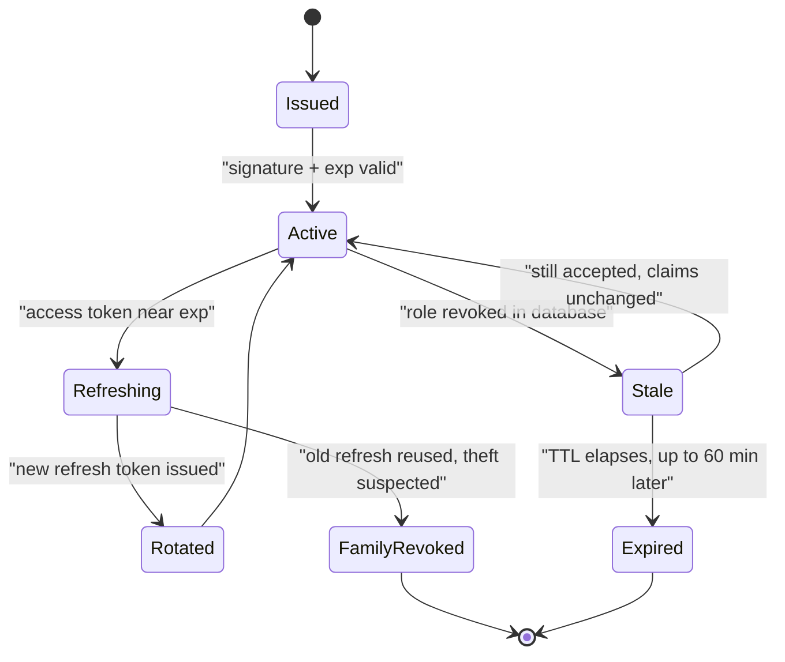
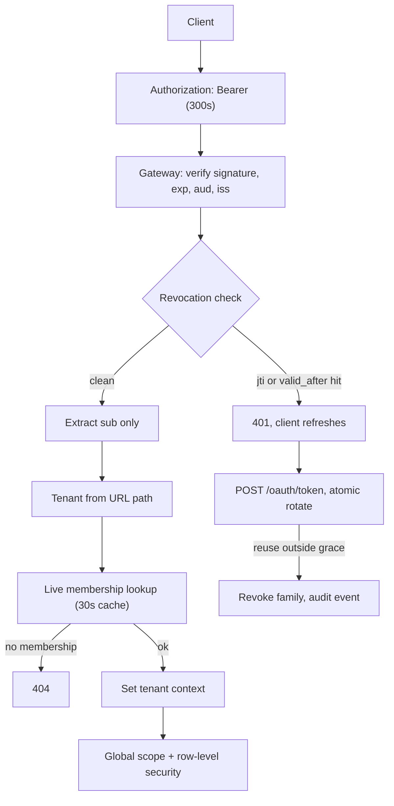

> **Scenario** — Tenant A-এর একজন support engineer একটি ticket খুলে tenant B-এর invoice দেখতে পান। Audit log-এ কিছুই ভুল মনে হয় না। Access token valid, signed ও unexpired ছিল — শুধু তার `tenant_id` claim এসেছিল এগারো মিনিট আগে ছেড়ে আসা এক session থেকে।

## Why it matters

- Token bug গঠনগতভাবেই নীরব। Valid signature মানে নিচের প্রতিটি স্তর প্রশ্ন করা বন্ধ করে, তাই ভুল claim একেবারে database পর্যন্ত বিশ্বাস পায়।
- Cross-tenant leak বেশিরভাগ compliance ব্যবস্থায় reportable breach। খরচ fix-এ নয়; খরচ disclosure, audit আর চলে যাওয়া customer-এ।
- Revocation gap-এর মাপ token lifetime। ৬০ মিনিটের access token-এ "আমরা তার access সরিয়েছি" মানে "এক ঘণ্টার মধ্যে সরাবো", যা offboarding checklist-এর প্রতিশ্রুতি নয়।
- Refresh-token race support queue তৈরি করে। দুই tab একসাথে refresh করে, একটি জেতে, অন্যটি form-এর মাঝপথে logout হয়।

## Symptoms

| Signal | What you observe |
|---|---|
| Cross-tenant data | একাধিক membership থাকা user-এর কাছে অন্য tenant-এর record আসে |
| Post-offboarding | Deactivated user এক token lifetime পর্যন্ত সফল API call করতে থাকে |
| Random logout | Session-এর মাঝপথে user logout, access-token TTL-এর গুণিতকে জড়ো |
| Refresh error | `invalid_grant` spike; concurrent tab বা retried request একই refresh token ব্যবহার করে |
| Audit log | Stale `tenant_id`-তে action আরোপিত, অথচ কোনো tenant switch event নেই |
| Token size | Role claim যোগ করার পর cookie 4KB ছাড়ায়; কিছু request proxy-তে fail করে |
| Clock | শুধু এক node-এ `exp` validation fail, ৪০s NTP drift-এর কারণে |

## How it breaks

তিনটি আলাদা failure path মিলে "auth ভেঙে গেছে" হয়ে যায়।

**Claim তার context-এর চেয়ে বেশি বাঁচে।** Login-এর সময় JWT-তে বসানো `tenant_id` একটি snapshot। User tenant বদলালে, tenant থেকে সরে গেলে বা role হারালেও token expire না হওয়া পর্যন্ত পুরোনো সত্য দাবি করতে থাকে। যে authorisation check `tenant_id` *token থেকে* পড়ে, প্রতি request-এ resolve করে না, সেটি গঠনগতভাবেই ভুল।

**Atomicity ছাড়া rotation.** Refresh rotation নতুন refresh token দেয় ও পুরোনোটি বাতিল করে। দুটি concurrent request একই পুরোনো token দেখায়; প্রথমটি rotate করে, দ্বিতীয়টি সেটিকে revoked পায়, আর পুরো family theft সন্দেহে মুছে যায়।

**Revocation-এর নামার জায়গা নেই।** Stateless JWT validation-ই JWT-র উদ্দেশ্য, অর্থাৎ state ফিরিয়ে না এনে "এটি মৃত" বলার কোনো জায়গা নেই।



`Stale --> Active` edge-টাই incident। System valid token আর যার underlying authorisation তুলে নেওয়া হয়েছে এমন token-এর পার্থক্য করতে পারে না।

## Root causes

1. Authorisation সিদ্ধান্ত token থেকে `tenant_id` পড়ে, request path + live membership check থেকে নয়।
2. "Load কমাতে" access-token TTL ৬০ মিনিট, ফলে revocation gap-ও ৬০ মিনিট।
3. Refresh rotation একটিমাত্র atomic compare-and-swap ছাড়া করা, তাই concurrent refresh race করে।
4. Role ও permission claim হিসেবে বসানো, তাই permission বদলাতে নতুন token লাগে।
5. Token binding নেই: চুরি করা bearer token যেকোনো IP, device, TLS session থেকে কাজ করে।
6. Issuer ও validator-এর মধ্যে clock skew, কোনো `leeway` কনফিগার করা নেই।
7. Logout শুধু client-side cookie মোছে, server-side refresh token revoke করে না।

## How to solve it

### 1. শুধু token claim দেখে কখনো authorise করবেন না

Token প্রমাণ করে *কে*। Database ঠিক করে *এখন, এই tenant-এ, সে কী করতে পারে*।

```php
// Laravel middleware: the tenant comes from the route, the membership from the database.
final class ResolveTenantContext
{
    public function handle(Request $request, Closure $next)
    {
        $userId   = $request->attributes->get('token')->subject();   // trusted: signed
        $tenantId = $request->route('tenant');                       // untrusted: from URL

        // One live lookup. Cached for at most 30s, invalidated on membership change.
        $membership = $this->memberships->activeFor($userId, $tenantId);

        if ($membership === null) {
            // 404, not 403 — do not confirm the tenant exists to a non-member.
            abort(404);
        }

        $request->attributes->set('tenant', $membership->tenant);
        $request->attributes->set('permissions', $membership->permissions);

        return $next($request);
    }
}
```

তারপর global scope দিয়ে leak-কে গঠনগতভাবে অসম্ভব করুন, যাতে ভুলে যাওয়া `where` clause tenant পার হতে না পারে:

```php
protected static function booted(): void
{
    static::addGlobalScope('tenant', function (Builder $q) {
        $q->where('tenant_id', app(TenantContext::class)->id());
    });
}
```

Database স্তরে Postgres row-level security এই belt-এর suspenders।

### 2. ছোট access token, লম্বা refresh token, stateful refresh

```ts
const TOKEN_POLICY = {
  // Revocation gap is bounded by this number. 5 minutes, not 60.
  accessTokenTtlSeconds: 300,
  // Refresh tokens are opaque, stored server-side, and revocable.
  refreshTokenTtlSeconds: 60 * 60 * 24 * 30,
  // Absolute cap regardless of activity: re-authenticate after 90 days.
  absoluteSessionTtlSeconds: 60 * 60 * 24 * 90,
  clockSkewLeewaySeconds: 30,
} as const
```

পাঁচ মিনিট যথেষ্ট ছোট যাতে offboarding প্রতিশ্রুতি সৎ থাকে, আবার যথেষ্ট বড় যাতে refresh traffic মোট request-এর ~০.৩%-এর নিচে থাকে।

### 3. Rotation atomic ও race-সহনশীল করুন

```sql
-- Single statement: only one concurrent refresh can win.
UPDATE refresh_tokens
SET    used_at      = now(),
       rotated_to   = $new_token_hash
WHERE  token_hash   = $presented_hash
  AND  used_at IS NULL
  AND  expires_at > now()
RETURNING user_id, family_id;
-- Zero rows returned means: already used, expired, or forged.
```

```python
GRACE_PERIOD_S = 10

def rotate(presented_hash: str) -> TokenPair:
    row = db.atomic_rotate(presented_hash)
    if row is not None:
        return issue_pair(row.user_id, row.family_id)

    prior = db.find_recently_rotated(presented_hash)
    if prior and (now() - prior.used_at).total_seconds() < GRACE_PERIOD_S:
        # A concurrent tab or a network retry. Return the same successor, do not punish.
        return db.pair_for(prior.rotated_to)

    # Reuse outside the grace window is the classic theft signal: kill the family.
    if prior:
        db.revoke_family(prior.family_id)
        audit.security_event("refresh_token_reuse", family=prior.family_id)
    raise InvalidGrant()
```

১০ সেকেন্ডের grace window theft detection উল্লেখযোগ্যভাবে দুর্বল না করেই বেশিরভাগ `invalid_grant` support ticket মুছে দেয়।

### 4. Revocation-কে নামার জায়গা দিন

`jti` দিয়ে key করা ছোট deny-list, সাথে per-user `tokens_valid_after` timestamp। দুটোই সস্তা।

```ts
async function isRevoked(claims: AccessClaims): Promise<boolean> {
  // Bulk revocation: "log this user out everywhere" is one timestamp write.
  const validAfter = await redis.get(`auth:valid_after:${claims.sub}`)
  if (validAfter && claims.iat < Number(validAfter)) return true
  // Targeted revocation: a single leaked token, TTL matches the access token TTL.
  return (await redis.exists(`auth:revoked:${claims.jti}`)) === 1
}
```

৩০০ সেকেন্ডের access TTL-এ deny-list-এ সর্বোচ্চ ৩০০ সেকেন্ডের entry থাকে। এটি ছোটই থাকে।

### 5. Token-কে কিছুর সাথে bind করুন

Sender-constrained token (DPoP বা mTLS-bound token) মানে চুরি করা bearer token সংশ্লিষ্ট key ছাড়া অকেজো। যেখানে সেটা ভারী, সেখানে অন্তত issuing IP ও user-agent রাখুন এবং session-এর মাঝপথে পরিবর্তনে audit event তুলুন।

## Target design



## Tradeoffs

| Option | Pros | Cons | Choose when |
|---|---|---|---|
| দীর্ঘায়ু stateless JWT | Hot path-এ lookup নেই; সহজে scale করে | Revocation gap = TTL; claim stale হয় | কম-ঝুঁকির, read-only, public data |
| ছোট JWT + refresh rotation | Revocation gap সীমিত; deny-list ছোট | Refresh traffic; rotation race সামলাতে হয় | Multi-tenant SaaS-এর ডিফল্ট |
| Opaque token + introspection | তাৎক্ষণিক revocation; claim কখনো stale নয় | প্রতি request-এ lookup; auth service critical path | উচ্চ ঝুঁকির operation, কম request volume |
| Claim হিসেবে role | কোনো authorisation lookup নেই | Permission বদলালে re-issue; token 4KB ছাড়ায় | খুব স্থিতিশীল, coarse-grained role |
| Live membership lookup | সবসময় হালনাগাদ; cross-tenant leak অসম্ভব | প্রতি request-এ একটি cached read | Tenant-রা infrastructure ভাগ করে এমন যেকোনো system |
| DPoP / mTLS binding | চুরি করা token অকেজো | Client জটিলতা; key management | Financial, healthcare, admin API |

## Verification checklist

- [ ] Grep প্রমাণ করে কোনো authorisation সিদ্ধান্ত token থেকে `tenant_id` বা `roles` পড়ে না।
- [ ] Test tenant বদলে পরের request-এ আগের tenant-এর record 404 হয় কিনা assert করে।
- [ ] Membership revoke করলে access-token TTL-এর মধ্যে access বন্ধ হয়, integration test-এ মাপা।
- [ ] একই token নিয়ে দুটি concurrent refresh দুটোই সফল হয় এবং একই successor ফেরত দেয়।
- [ ] Grace window-এর বাইরে refresh reuse family revoke করে ও audit event তোলে।
- [ ] Access-token TTL ৩০০s বা কম এবং offboarding SLA-তে লেখা।
- [ ] Clock skew leeway কনফিগার করা এবং validator-দের NTP drift ৫s ছাড়ালে alert আছে।
- [ ] প্রতিটি tenant-scoped table-এ row-level security বা সমতুল্য global scope চালু।
- [ ] Logout server-side refresh token revoke করে, logout-এর পর replay করে যাচাই করা।

## Anti-patterns

- Refresh load কমাতে access-token TTL বাড়ানো; QPS-এর একটি rounding error-এর বিনিময়ে revocation gap প্রশস্ত করলেন।
- "যাতে lookup করতে না হয়" বলে JWT-তে tenant রাখা — এটাই cross-tenant bug, আগেভাগে লিখে রাখা।
- প্রতিটি `invalid_grant`-কে theft ধরে সেই user-কে জোর করে logout করা যার দ্বিতীয় tab এক মুহূর্ত দেরিতে refresh করেছে।
- পুরো permission set token-এ রেখে পরে আবিষ্কার করা যে cookie proxy-র 4KB header সীমা ছাড়িয়েছে।
- Logout-এ cookie মুছে তাকে revocation বলা; refresh token তখনও ত্রিশ দিন valid।
- ৪০ সেকেন্ড clock পার্থক্য থাকা server-এ শূন্য leeway দিয়ে `exp` validate করা।

## Related

- [The JWT revocation problem](/systems/auth-security/jwt-revocation-problem)
- [Multi-tenant authorization leaks](/systems/auth-security/multi-tenant-authorization-leaks)
- [RBAC vs ABAC modeling](/systems/auth-security/rbac-vs-abac-modeling)
- [Secrets management and rotation](/systems/auth-security/secrets-management-and-rotation)
- [Audit logging for compliance](/systems/auth-security/audit-logging-for-compliance)
