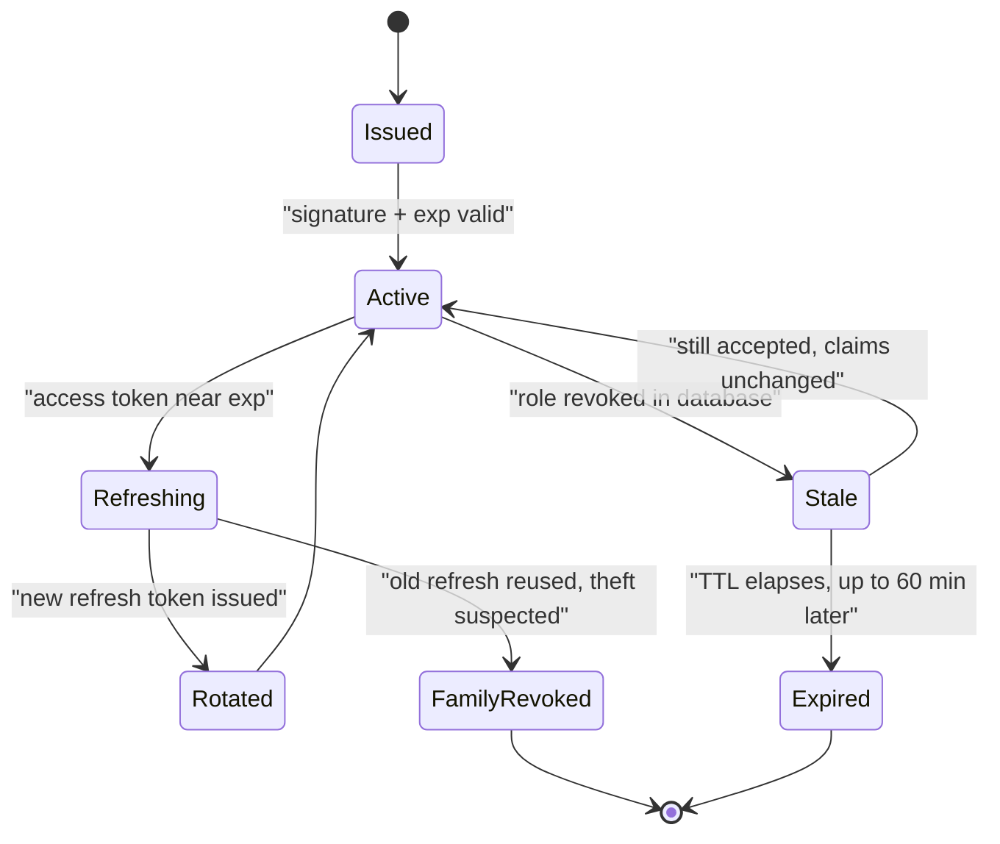
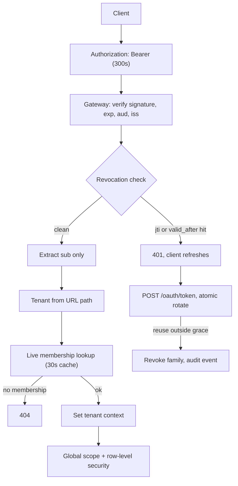

> **Scenario** — A support engineer at tenant A opens a ticket and sees an invoice belonging to tenant B. Nothing in the audit log looks wrong. The access token was valid, signed, and unexpired — it just carried a `tenant_id` claim from a session the user switched away from eleven minutes ago.

## Why it matters

- Token bugs are silent by construction. A valid signature means every layer downstream stops asking questions, so a wrong claim is trusted all the way to the database.
- Cross-tenant leakage is a reportable breach in most compliance regimes. The cost is not the fix; it is the disclosure, the audit, and the customer who leaves.
- Revocation gaps are measured in token lifetime. With a 60-minute access token, "we removed their access" means "we removed their access within an hour", which is not what the offboarding checklist promised.
- Refresh-token races produce a support queue. Two tabs refreshing at once, one wins, the other is logged out mid-form.

## Symptoms

| Signal | What you observe |
|---|---|
| Cross-tenant data | Records from another tenant appear for a user with multiple memberships |
| Post-offboarding | Deactivated users keep making successful API calls for up to one token lifetime |
| Random logouts | Users signed out mid-session, clustered at multiples of the access-token TTL |
| Refresh errors | `invalid_grant` spikes; concurrent tabs or a retried request reusing one refresh token |
| Audit log | Actions attributed to a stale `tenant_id`, with no corresponding tenant switch event |
| Token size | Cookies over 4KB after roles were embedded as claims; some requests fail at the proxy |
| Clock | `exp` validation failures on one node only, tracing to 40s of NTP drift |

## How it breaks

Three distinct failure paths get conflated into "auth is broken".

**Claims outlive their context.** A `tenant_id` baked into a JWT at login is a snapshot. When the user switches tenant, is removed from a tenant, or has a role revoked, the token still asserts the old truth until it expires. Any authorisation check that reads `tenant_id` *from the token* rather than resolving it per-request is wrong by construction.

**Rotation without atomicity.** Refresh rotation issues a new refresh token and invalidates the old one. Two concurrent requests both present the old token; the first rotates, the second finds it revoked, and the whole family is nuked as suspected theft.

**Revocation has nowhere to land.** Stateless JWT validation is the point of JWTs, which means there is no place to say "this one is dead" without adding state back.



The `Stale --> Active` edge is the incident. The system cannot tell the difference between a valid token and a token whose underlying authorisation has been withdrawn.

## Root causes

1. Authorisation decisions read `tenant_id` from the token instead of from the request path plus a live membership check.
2. Access-token TTL set to 60 minutes "to reduce load", making the revocation gap 60 minutes.
3. Refresh rotation implemented without a single atomic compare-and-swap, so concurrent refreshes race.
4. Roles and permissions embedded as claims, so a permission change requires a new token.
5. No token binding: a stolen bearer token works from any IP, any device, any TLS session.
6. Clock skew between the issuer and the validators, with no `leeway` configured.
7. Logout that deletes the client-side cookie without revoking the refresh token server-side.

## How to solve it

### 1. Never authorise from a token claim alone

The token proves *who*. The database decides *what they may do, right now, in this tenant*.

```php
// Laravel middleware: the tenant comes from the route, the membership from the database.
final class ResolveTenantContext
{
    public function handle(Request $request, Closure $next)
    {
        $userId   = $request->attributes->get('token')->subject();   // trusted: signed
        $tenantId = $request->route('tenant');                       // untrusted: from URL

        // One live lookup. Cached for at most 30s, invalidated on membership change.
        $membership = $this->memberships->activeFor($userId, $tenantId);

        if ($membership === null) {
            // 404, not 403 — do not confirm the tenant exists to a non-member.
            abort(404);
        }

        $request->attributes->set('tenant', $membership->tenant);
        $request->attributes->set('permissions', $membership->permissions);

        return $next($request);
    }
}
```

Then make the leak structurally impossible with a global scope, so a forgotten `where` clause cannot cross tenants:

```php
protected static function booted(): void
{
    static::addGlobalScope('tenant', function (Builder $q) {
        $q->where('tenant_id', app(TenantContext::class)->id());
    });
}
```

At the database layer, Postgres row-level security is the belt to that suspenders.

### 2. Short access tokens, long refresh tokens, stateful refresh

```ts
const TOKEN_POLICY = {
  // Revocation gap is bounded by this number. 5 minutes, not 60.
  accessTokenTtlSeconds: 300,
  // Refresh tokens are opaque, stored server-side, and revocable.
  refreshTokenTtlSeconds: 60 * 60 * 24 * 30,
  // Absolute cap regardless of activity: re-authenticate after 90 days.
  absoluteSessionTtlSeconds: 60 * 60 * 24 * 90,
  clockSkewLeewaySeconds: 30,
} as const
```

Five minutes is short enough that the offboarding promise is honest and long enough that refresh traffic stays under ~0.3% of request volume.

### 3. Make rotation atomic and race-tolerant

```sql
-- Single statement: only one concurrent refresh can win.
UPDATE refresh_tokens
SET    used_at      = now(),
       rotated_to   = $new_token_hash
WHERE  token_hash   = $presented_hash
  AND  used_at IS NULL
  AND  expires_at > now()
RETURNING user_id, family_id;
-- Zero rows returned means: already used, expired, or forged.
```

```python
GRACE_PERIOD_S = 10

def rotate(presented_hash: str) -> TokenPair:
    row = db.atomic_rotate(presented_hash)
    if row is not None:
        return issue_pair(row.user_id, row.family_id)

    prior = db.find_recently_rotated(presented_hash)
    if prior and (now() - prior.used_at).total_seconds() < GRACE_PERIOD_S:
        # A concurrent tab or a network retry. Return the same successor, do not punish.
        return db.pair_for(prior.rotated_to)

    # Reuse outside the grace window is the classic theft signal: kill the family.
    if prior:
        db.revoke_family(prior.family_id)
        audit.security_event("refresh_token_reuse", family=prior.family_id)
    raise InvalidGrant()
```

The 10-second grace window removes the majority of `invalid_grant` support tickets without weakening theft detection meaningfully.

### 4. Give revocation somewhere to land

Keep a small deny-list keyed by `jti`, plus a per-user `tokens_valid_after` timestamp. Both are cheap.

```ts
async function isRevoked(claims: AccessClaims): Promise<boolean> {
  // Bulk revocation: "log this user out everywhere" is one timestamp write.
  const validAfter = await redis.get(`auth:valid_after:${claims.sub}`)
  if (validAfter && claims.iat < Number(validAfter)) return true
  // Targeted revocation: a single leaked token, TTL matches the access token TTL.
  return (await redis.exists(`auth:revoked:${claims.jti}`)) === 1
}
```

With a 300-second access TTL, the deny-list holds at most 300 seconds of entries. It stays small.

### 5. Bind the token to something

Sender-constrained tokens (DPoP, or mTLS-bound tokens) mean a stolen bearer token is useless without the corresponding key. Where that is too heavy, at minimum record the issuing IP and user-agent and raise an audit event on a change mid-session.

## Target design



## Tradeoffs

| Option | Pros | Cons | Choose when |
|---|---|---|---|
| Long-lived stateless JWT | No lookup on the hot path; scales trivially | Revocation gap equals the TTL; claims go stale | Low-risk, read-only, public data |
| Short JWT + refresh rotation | Bounded revocation gap; small deny-list | Refresh traffic; rotation races need handling | Default for multi-tenant SaaS |
| Opaque tokens + introspection | Instant revocation; no claim staleness at all | A lookup on every request; the auth service is now critical-path | High-risk operations, small request volume |
| Roles as claims | Zero authorisation lookups | Permission changes need re-issue; tokens grow past 4KB | Very stable, coarse-grained roles |
| Live membership lookup | Always current; cross-tenant leaks become impossible | One cached read per request | Any system where tenants share infrastructure |
| DPoP / mTLS binding | Stolen tokens are unusable | Client complexity; key management | Financial, healthcare, admin APIs |

## Verification checklist

- [ ] Grep proves no authorisation decision reads `tenant_id` or `roles` from the token.
- [ ] A test switches tenant and asserts the previous tenant's records return 404 on the next request.
- [ ] Revoking a membership blocks access within the access-token TTL, measured in an integration test.
- [ ] Two concurrent refreshes with the same token both succeed and return the same successor.
- [ ] Refresh reuse outside the grace window revokes the family and emits an audit event.
- [ ] Access-token TTL is 300s or less and is written into the offboarding SLA.
- [ ] Clock skew leeway is configured and NTP drift across validators is alerted above 5s.
- [ ] Row-level security or an equivalent global scope is enabled on every tenant-scoped table.
- [ ] Logout revokes the refresh token server-side, verified by replaying it after logout.

## Anti-patterns

- Extending the access-token TTL to reduce refresh load; you have widened the revocation gap in exchange for a rounding error in QPS.
- Storing the tenant in the JWT "so we do not have to look it up" — this is the cross-tenant bug, written down in advance.
- Treating every `invalid_grant` as theft and force-logging-out users whose second browser tab refreshed a moment too late.
- Putting the full permission set in the token, then discovering the cookie exceeds the proxy's 4KB header limit.
- Deleting the cookie on logout and calling it revocation; the refresh token is still valid for thirty days.
- Validating `exp` with zero leeway across servers whose clocks differ by 40 seconds.

## Related

- [The JWT revocation problem](/systems/auth-security/jwt-revocation-problem)
- [Multi-tenant authorization leaks](/systems/auth-security/multi-tenant-authorization-leaks)
- [RBAC vs ABAC modeling](/systems/auth-security/rbac-vs-abac-modeling)
- [Secrets management and rotation](/systems/auth-security/secrets-management-and-rotation)
- [Audit logging for compliance](/systems/auth-security/audit-logging-for-compliance)
