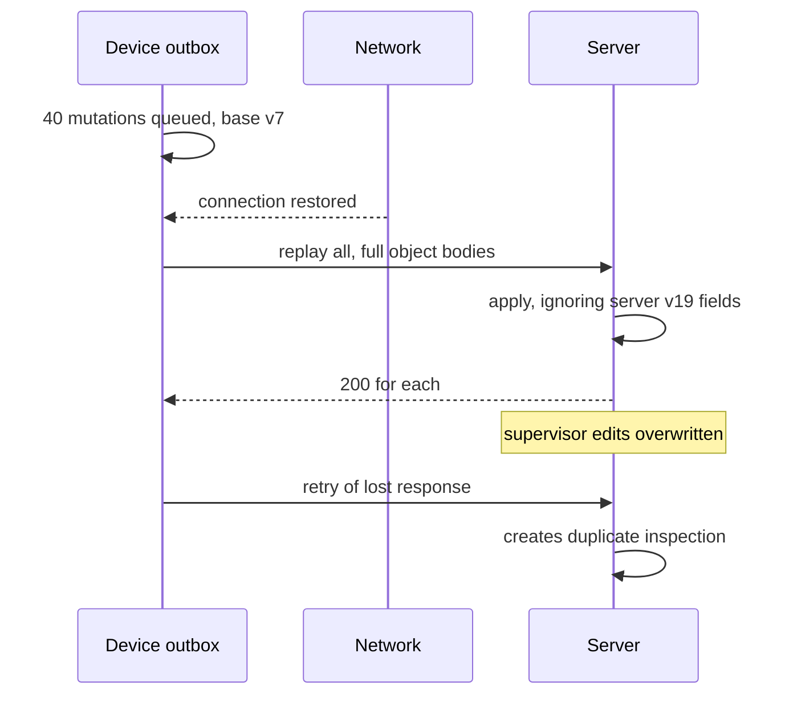
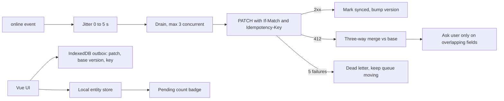

> **Scenario** - একটা field-inspection PWA technician-দের signal-হীন বেসমেন্টে কাজ করতে দেয়। এক technician তিন ঘণ্টা offline report edit করেন; supervisor একই report web থেকে edit করেন। Reconnect-এ outbox replay হয় আর last-write-wins supervisor-এর বারোটা সংশোধন মুছে দেয়। এক সপ্তাহ কেউ টেরই পায় না।

## Why it matters

- Offline-first network failure-কে error থেকে স্বাভাবিক অবস্থায় বদলায়। খারাপভাবে করলে এটা network hiccup-কে স্থায়ী data loss বানায়, যা failed save-এর চেয়ে অনেক খারাপ।
- Reconnect-এ outbox replay burst তৈরি করে: ৩০০ device থেকে ৪০টা করে queued mutation একই ১০ সেকেন্ডে এলে সেটা আপনার write path-এর উপর thundering herd।
- Device clock ভুল থাকে। Last-write-wins-এ `Date.now()` ব্যবহার করলে ৪ মিনিট এগিয়ে থাকা ফোন প্রতিটি conflict-এ জেতে।
- User মেনে নিতে পারে "আপনার পরিবর্তনে conflict হয়েছে, এই যে দুই version"। মানতে পারে না "আপনার তিন ঘণ্টার কাজ নেই"।

## Symptoms

| Signal | What you observe |
| --- | --- |
| নীরব overwrite | record-এ এক editor-এর version, অন্যজনের edit history-তেও নেই |
| Replay storm | কোনো অঞ্চলে connectivity ফিরলে write endpoint p99 লাফায় |
| Duplicate row | flaky reconnect-এর পর একই inspection দুইবার |
| আটকে থাকা outbox | একটা poisoned mutation পিছনের সব write আটকে দেয় |
| ভুল ordering | device clock skew-এ পুরোনো edit নতুনটার পরে বসে |
| Quota error | সপ্তাহখানেক offline log-এর পর IndexedDB `QuotaExceededError` |

## How it breaks

Outbox একটা queue, তাই queue-এর সব সমস্যা প্রযোজ্য: ordering, poison message, backpressure ও duplicate delivery। উপরন্তু offline client-এর *stale base version* থাকে। সে version 7-এর বিপরীতে edit বানিয়েছে; server এখন version 19-এ। পুরো object পাঠানো মানে যেসব field সে কখনও দেখেনি সেগুলোও overwrite করা। অধিকাংশ "নীরব overwrite" রিপোর্টের যন্ত্র এটাই।



## Root causes

1. Field-level patch-এর বদলে full-object write, তাই না দেখা field overwrite হয়।
2. Server version বা logical clock নয়, device time-এর উপর last-write-wins।
3. Idempotency key নেই, তাই retried create দ্বিতীয় record বানায়।
4. Outbox সাথে সাথে ও একসাথে replay হয়, jitter বা concurrency cap নেই।
5. একটা fail করা mutation queue-এর মাথা চিরকাল আটকে রাখে - dead-letter path নেই।
6. IndexedDB prune হয় না, তাই storage quota ভরে গিয়ে write fail শুরু হয়।

## How to solve it

### 1. Final state নয়, intent-সহ outbox persist করুন

```ts
// db.ts - Dexie schema
db.version(3).stores({
  outbox: '++seq, entityId, status, createdAt',
  entities: 'id, updatedAt',
})

export type OutboxItem = {
  seq?: number
  id: string                 // Idempotency-Key, stable across retries
  entityId: string
  op: 'create' | 'patch' | 'delete'
  patch: Record<string, unknown>   // only changed fields
  baseVersion: number
  status: 'pending' | 'sending' | 'failed'
  attempts: number
  createdAt: number
}
```

পুরো object নয়, patch রাখলে server কেবল user-এর সত্যিই edit করা field-ই ছোঁয়।

### 2. Device clock নয়, server-assigned version ব্যবহার করুন

```ts
const res = await fetch(`/api/reports/${item.entityId}`, {
  method: 'PATCH',
  headers: {
    'Content-Type': 'application/json',
    'Idempotency-Key': item.id,
    'If-Match': `W/"${item.baseVersion}"`,
  },
  body: JSON.stringify(item.patch),
})
```

412 মানে base সরে গেছে। এটা সমাধান করার conflict, জোর করে লেখার write নয়।

### 3. Jitter ও concurrency cap দিয়ে outbox drain করুন

```ts
async function drain(signal: AbortSignal) {
  await sleep(Math.random() * 5_000)          // spread the herd
  const limit = 3                              // max parallel writes
  const items = await db.outbox.where('status').equals('pending').sortBy('seq')
  await pMap(items, send, { concurrency: limit, signal })
}

window.addEventListener('online', () => void drain(controller.signal))
```

Jitter না থাকলে এক ভবনের সব device একই access point-এ ফিরে একই সেকেন্ডে আপনার API-তে আঘাত করে।

### 4. Field ধরে conflict resolve করুন, user-কে দেখান

```ts
function resolve(local: Patch, server: Report, base: Report) {
  const auto: Patch = {}
  const manual: string[] = []
  for (const [field, value] of Object.entries(local)) {
    if (server[field] === base[field]) auto[field] = value   // server untouched: safe
    else manual.push(field)                                   // both changed: ask
  }
  return { auto, manual }
}
```

Base version-এর বিপরীতে three-way merge অধিকাংশ conflict স্বয়ংক্রিয়ভাবে মেটায় আর কেবল সত্যিকারের overlap escalate করে। Text field-এ CRDT (Yjs, Automerge) prompt পুরোপুরি সরায়, বিনিময়ে বড় bundle ও অচেনা debugging।

### 5. Poison mutation dead-letter করুন

৫ বার চেষ্টার পর item-কে `status: 'failed'`-এ সরান, queue চলতে দিন, আর "৩টি পরিবর্তন sync করা যায়নি" panel দেখান যেখানে user retry বা export করতে পারে।

### 6. Storage budget করুন

```ts
const { quota = 0, usage = 0 } = await navigator.storage.estimate()
if (usage / quota > 0.8) await pruneSyncedOlderThan(30 * 24 * 3600_000)
void navigator.storage.persist()   // ask to survive eviction
```

### 7. Offline অবস্থা দৃশ্যমান করুন

"১২টি পরিবর্তন sync-এর অপেক্ষায়" badge ও last-synced timestamp সবচেয়ে খারাপ পরিণতি ঠেকায়: user ভাবছে কাজ server-এ সংরক্ষিত, অথচ তা কেবল IndexedDB-তে।

## Target design



## Tradeoffs

| Option | Pros | Cons | Choose when |
| --- | --- | --- | --- |
| Last-write-wins | এক লাইনের কোড | নীরব data loss | সত্যিকারের single-writer data, যেমন device setting |
| Version check + merge | নীরব ক্ষতি নেই, ব্যাখ্যাযোগ্য | base snapshot ও conflict UI লাগে | একাধিক editor-এর business record |
| CRDT | স্বয়ংক্রিয় convergence, prompt নেই | ৫০–১৫০ KB library, অস্বচ্ছ state | collaborative text ও drawing |
| Offline-এ write বন্ধ | সহজেই consistent | মাঠে অব্যবহার্য | connectivity নিশ্চিত |

## Verification checklist

- [ ] Offline edit করুন, অন্য user একই record edit করুক, reconnect করুন - কোনো field নীরবে হারায় না।
- [ ] একই outbox item দুইবার replay করুন; server ঠিক একটা record বানায়।
- [ ] ৫০টা simulated device reconnect করান; jitter-এর কারণে write p99 SLO-র মধ্যে থাকে।
- [ ] একটা item-এ স্থায়ী 422 চাপান; queue-এর বাকিটা তবু drain হয়।
- [ ] Device clock ৫ মিনিট এগিয়ে দিন; conflict resolution অপরিবর্তিত থাকে।
- [ ] IndexedDB quota-র ৮০% ভরান; pruning চলে এবং write সফল হয়।
- [ ] Airplane mode-এ UI-তে pending count ও last-synced সময় দেখা যায়।

## Anti-patterns

- Conflict tiebreaker হিসেবে device-এর `Date.now()` ব্যবহার।
- পুরো form object outbox-এ রেখে reconnect-এ PUT করা।
- Flaky connectivity-তে প্রতিটি `online` event-এ debounce ছাড়া queue drain করা।
- Failed retry-র পর user-কে কিছু না জানিয়ে mutation নীরবে ফেলে দেওয়া।
- `navigator.onLine === true` মানেই request সফল হবে ধরে নেওয়া।

## Related

- [Optimistic UI and safe rollback](/systems/frontend-architecture/optimistic-ui-and-rollback)
- [Realtime UI reconnection handling](/systems/frontend-architecture/realtime-ui-reconnection-handling)
- [Frontend state management at scale](/systems/frontend-architecture/frontend-state-management-at-scale)
