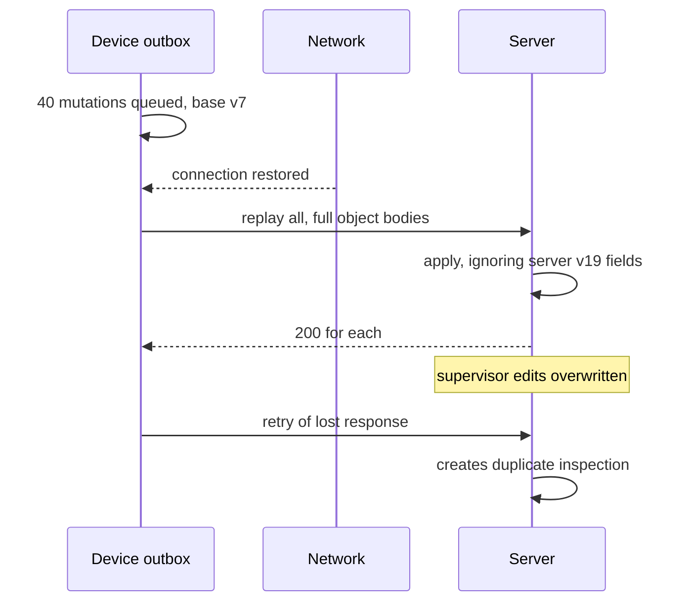
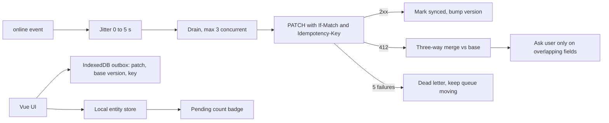

> **Scenario** - A field-inspection PWA lets technicians work in basements with no signal. One tech edits a report offline for three hours; a supervisor edits the same report from the web. On reconnect the outbox replays and last-write-wins hands the supervisor's twelve corrections to the void. Nobody notices for a week.

## Why it matters

- Offline-first turns network failure from an error into a normal state. Done badly, it turns a network hiccup into permanent data loss, which is far worse than a failed save.
- Replaying an outbox on reconnect creates a burst: 40 queued mutations from 300 devices arriving in the same 10 seconds is a thundering herd against your write path.
- Device clocks are wrong. Using `Date.now()` for last-write-wins means a phone that is 4 minutes fast wins every conflict it participates in.
- Users can accept "your change conflicted, here are both versions". They cannot accept "your three hours of work is gone".

## Symptoms

| Signal | What you observe |
| --- | --- |
| Silent overwrite | A record shows one editor's version; the other's edits are absent from history |
| Replay storm | Write endpoint p99 spikes when connectivity returns to a region |
| Duplicate rows | The same inspection appears twice after a flaky reconnect |
| Stuck outbox | One poisoned mutation blocks every queued write behind it |
| Wrong ordering | An older edit lands after a newer one because a device clock is skewed |
| Quota errors | `QuotaExceededError` from IndexedDB after weeks of offline logs |

## How it breaks

The outbox is a queue, and every queue problem applies: ordering, poison messages, backpressure, and duplicate delivery. On top of that, an offline client has a *stale base version*. It computed its edit against version 7; the server is now at version 19. Sending the full object means overwriting fields the client never saw. That is the mechanism behind most "silent overwrite" reports.



## Root causes

1. Full-object writes instead of field-level patches, so unseen fields get overwritten.
2. Last-write-wins keyed on device time rather than a server version or logical clock.
3. No idempotency key, so a retried create becomes a second record.
4. Outbox replays immediately and all at once, with no jitter or concurrency cap.
5. A single failing mutation blocks the queue head forever - no dead-letter path.
6. Nothing prunes IndexedDB, so storage quota fills and writes start failing.

## How to solve it

### 1. Persist an outbox with intent, not final state

```ts
// db.ts - Dexie schema
db.version(3).stores({
  outbox: '++seq, entityId, status, createdAt',
  entities: 'id, updatedAt',
})

export type OutboxItem = {
  seq?: number
  id: string                 // Idempotency-Key, stable across retries
  entityId: string
  op: 'create' | 'patch' | 'delete'
  patch: Record<string, unknown>   // only changed fields
  baseVersion: number
  status: 'pending' | 'sending' | 'failed'
  attempts: number
  createdAt: number
}
```

Storing the patch, not the whole object, means the server only touches fields the user actually edited.

### 2. Use a server-assigned version, never the device clock

```ts
const res = await fetch(`/api/reports/${item.entityId}`, {
  method: 'PATCH',
  headers: {
    'Content-Type': 'application/json',
    'Idempotency-Key': item.id,
    'If-Match': `W/"${item.baseVersion}"`,
  },
  body: JSON.stringify(item.patch),
})
```

A 412 means the base moved. That is a conflict to resolve, not a write to force.

### 3. Drain the outbox with jitter and a concurrency cap

```ts
async function drain(signal: AbortSignal) {
  await sleep(Math.random() * 5_000)          // spread the herd
  const limit = 3                              // max parallel writes
  const items = await db.outbox.where('status').equals('pending').sortBy('seq')
  await pMap(items, send, { concurrency: limit, signal })
}

window.addEventListener('online', () => void drain(controller.signal))
```

Without the jitter, every device in a building reconnects to the same access point and hits your API in the same second.

### 4. Resolve conflicts per field, and show the user

```ts
function resolve(local: Patch, server: Report, base: Report) {
  const auto: Patch = {}
  const manual: string[] = []
  for (const [field, value] of Object.entries(local)) {
    if (server[field] === base[field]) auto[field] = value   // server untouched: safe
    else manual.push(field)                                   // both changed: ask
  }
  return { auto, manual }
}
```

Three-way merge against the base version resolves most conflicts automatically and escalates only genuine overlaps. For text fields, a CRDT (Yjs, Automerge) removes the prompt entirely at the cost of a larger bundle and unfamiliar debugging.

### 5. Dead-letter poison mutations

After 5 attempts move the item to `status: 'failed'`, keep the queue moving, and surface a "3 changes could not be synced" panel where the user can retry or export.

### 6. Budget storage

```ts
const { quota = 0, usage = 0 } = await navigator.storage.estimate()
if (usage / quota > 0.8) await pruneSyncedOlderThan(30 * 24 * 3600_000)
void navigator.storage.persist()   // ask to survive eviction
```

### 7. Make offline state visible

A persistent badge with "12 changes waiting to sync" and a last-synced timestamp prevents the worst outcome: a user who assumes their work is saved on a server when it is only in IndexedDB.

## Target design



## Tradeoffs

| Option | Pros | Cons | Choose when |
| --- | --- | --- | --- |
| Last-write-wins | One line of code | Silent data loss | Truly single-writer data such as device settings |
| Version check plus merge | No silent loss, explainable | Needs base snapshots and UI for conflicts | Business records with multiple editors |
| CRDT | Automatic convergence, no prompts | 50–150 KB library, opaque state | Collaborative text and drawings |
| Block writes when offline | Trivially consistent | Unusable in the field | Connectivity is guaranteed |

## Verification checklist

- [ ] Edit offline, have another user edit the same record, reconnect - no field is lost silently.
- [ ] Replay the same outbox item twice; the server creates exactly one record.
- [ ] Reconnect 50 simulated devices; write p99 stays within its SLO thanks to jitter.
- [ ] Force a permanent 422 on one item; the rest of the queue still drains.
- [ ] Set the device clock 5 minutes ahead; conflict resolution is unaffected.
- [ ] Fill IndexedDB to 80% of quota; pruning runs and writes still succeed.
- [ ] Airplane mode shows a pending count and a last-synced time in the UI.

## Anti-patterns

- Using `Date.now()` from the device as the conflict tiebreaker.
- Storing the entire form object in the outbox and PUTting it on reconnect.
- Draining the queue on every `online` event without debounce, during flaky connectivity.
- Silently dropping a mutation after a failed retry with no user-visible trace.
- Assuming `navigator.onLine === true` means requests will actually succeed.

## Related

- [Optimistic UI and safe rollback](/systems/frontend-architecture/optimistic-ui-and-rollback)
- [Realtime UI reconnection handling](/systems/frontend-architecture/realtime-ui-reconnection-handling)
- [Frontend state management at scale](/systems/frontend-architecture/frontend-state-management-at-scale)
