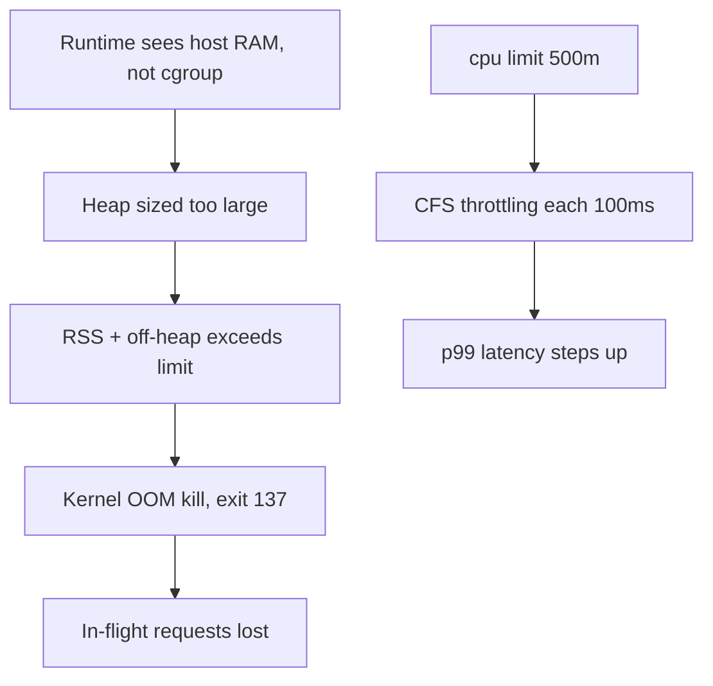
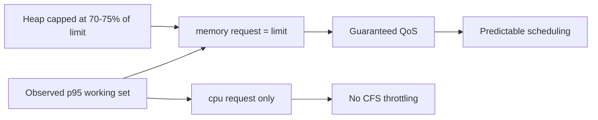

> **পরিস্থিতি** — একটা Node.js worker প্রতি ৪০ মিনিটে exit code 137 নিয়ে restart হয়। App-এর নিজের metric-এ memory ঠিকঠাক, heap কখনো ৯০০ MB ছাড়ায় না, container limit ১ GiB। এদিকে কেউ "সাহায্য করতে" `cpu: 500m` limit বসানোর পর API pod-এর p99 তিনগুণ হয়েছে।

## কেন গুরুত্বপূর্ণ

- `OOMKilled` মানে SIGKILL: graceful shutdown নেই, flush নেই, in-flight request ও unacknowledged queue message হারিয়ে যায়।
- CPU limit মারে না, throttle করে — এমন latency তৈরি করে যা দেখতে slow dependency-র মতো, ফলে টিম দিনের পর দিন ভুল system debug করে।
- Scheduling চলে request দিয়ে, limit দিয়ে নয়। ভুল request মানে হয় cluster খরচের অপচয়, নয়তো node এত ঠাসা যে সব একসাথে degrade করে।
- Memory limit একটা কঠিন দেয়াল, আর বেশিরভাগ runtime cgroup-এর কথা না জানলে host memory দেখে heap ঠিক করে।

## লক্ষণ

| Signal | যা দেখবেন |
|---|---|
| `kubectl describe pod` | `Last State: Terminated, Reason: OOMKilled, Exit Code: 137` |
| App metric | মারা যাওয়ার আগ মুহূর্ত পর্যন্ত heap limit-এর অনেক নিচে |
| Node metric | `container_cpu_cfs_throttled_seconds_total` ক্রমাগত বাড়ছে |
| Latency | CPU usage limit-এ আটকে থাকা অবস্থায় p99 ১০০ms সীমানায় ধাপে ধাপে বাড়ে |
| Scheduling | Node অর্ধেক খালি দেখালেও `0/12 nodes are available: Insufficient memory` |

## কীভাবে ভাঙে

দুটি আলাদা failure একই "pod খুশি নয়" পোশাক পরে থাকে।

**Memory:** cgroup limit RSS-এর *পাশাপাশি* page cache, off-heap allocation, thread stack ও native library arena গোনে। `-Xmx900m` দেওয়া JVM বা ৯০০ MB heap-এর Node process সহজেই ১.৩ GiB RSS ব্যবহার করে। Kernel-এর OOM killer আপনার heap dashboard পড়ে না; সে cgroup counter পড়ে এবং PID 1 মেরে দেয়।

**CPU:** limit প্রয়োগ হয় ১০০ms period-এ CFS quota দিয়ে। `cpu: 500m` মানে প্রতি ১০০ms-এ ৫০ms CPU। ৮০ms CPU দরকার এমন request মাঝপথে থেমে ৫০ms পরে আবার চলে — গড় utilisation আরামদায়ক ৪৫% দেখালেও latency দৃশ্যমান ধাপে বাড়ে।



## মূল কারণ

1. Runtime cgroup-aware নয়, তাই heap sizing node memory-র ভিত্তিতে হয়।
2. শুধু limit সেট করা, অথবা সব জায়গায় request == limit, ফলে burst-এর জায়গা নেই।
3. Off-heap ব্যবহার (Buffer, native module, glibc arena, memory-backed emptyDir-এ `/tmp`) কখনো হিসাবে ধরা হয় না।
4. শুধু request দরকার এমন latency-sensitive service-এ CPU limit বসানো।
5. "limit বাড়িয়ে দাও" দিয়ে আসল leak ঢাকা, যা restart-এর ব্যবধান বাড়ায় কিন্তু কিছু সারায় না।

## কীভাবে সমাধান করবেন

### ১. Runtime-কে cgroup-এর কথা জানান

```yaml
env:
  - name: NODE_OPTIONS
    value: "--max-old-space-size=768"       # ~75% of a 1Gi limit
  # JVM equivalent:
  # - name: JAVA_TOOL_OPTIONS
  #   value: "-XX:MaxRAMPercentage=70 -XX:+ExitOnOutOfMemoryError"
resources:
  requests:
    memory: "1Gi"
    cpu: "250m"
  limits:
    memory: "1Gi"                            # requests == limits = Guaranteed QoS
    # no cpu limit for latency-sensitive services
```

Memory request ও limit সমান রাখলে pod `Guaranteed` QoS class-এ পড়ে, তাই node pressure-এ সবার শেষে evict হয়।

### ২. Kernel আসলে কী দেখেছে তা নিশ্চিত করুন

```bash
kubectl get pod worker-5c8 -o jsonpath='{.status.containerStatuses[0].lastState.terminated}'
kubectl exec worker-5c8 -- cat /sys/fs/cgroup/memory.max /sys/fs/cgroup/memory.peak
kubectl exec api-77b -- cat /sys/fs/cgroup/cpu.stat   # nr_throttled, throttled_usec
```

### ৩. শুধু kill নয়, throttling ও headroom-এ alert দিন

```yaml
- alert: CpuThrottlingHigh
  expr: |
    rate(container_cpu_cfs_throttled_periods_total{namespace="prod"}[5m])
      / rate(container_cpu_cfs_periods_total{namespace="prod"}[5m]) > 0.25
  for: 10m
- alert: MemoryHeadroomLow
  expr: |
    container_memory_working_set_bytes{namespace="prod"}
      / on(pod) kube_pod_container_resource_limits{resource="memory"} > 0.9
  for: 15m
```

### ৪. পর্যবেক্ষিত ডেটা থেকে right-size করুন

```bash
kubectl top pods -n prod --sort-by=memory
# set request near p95 working set, limit ~1.3x request for memory
kubectl set resources deploy/worker --requests=cpu=250m,memory=1Gi --limits=memory=1Gi
```

## কাঙ্ক্ষিত ডিজাইন



## Tradeoff

| Option | সুবিধা | খরচ | কখন বেছে নেবেন |
|---|---|---|---|
| CPU limit নেই, শুধু request | throttling নেই, সেরা tail latency | noisy pod প্রতিবেশীকে starve করতে পারে | latency-sensitive request/response service |
| CPU limit সেট করা | পূর্বানুমেয় খরচ, কঠিন isolation | node খালি থাকলেও p99-এ throttling | batch job ও untrusted multi-tenant workload |
| memory request == limit | Guaranteed QoS, শেষে evict | overcommit নেই, node density কম | user-facing যেকোনো কিছু |
| memory request < limit | বেশি density, সস্তা | Burstable QoS, pressure-এ আগে evict | restart সহ্য করতে পারে এমন background worker |

## যাচাই checklist

- [ ] Peak load-এ latency-sensitive pod-এ `cpu.stat`-এর `nr_throttled` প্রায় শূন্য।
- [ ] প্রত্যাশিত traffic-এর ২ গুণ load test-এ working set memory limit-এর ৮০%-এর নিচে থাকে।
- [ ] গুরুত্বপূর্ণ service-এ `kubectl describe pod` QoS Class `Guaranteed` দেখায়।
- [ ] Heap flag limit থেকে derive করা — `kubectl exec ... -- node -e 'console.log(v8.getHeapStatistics().heap_size_limit)'` দিয়ে যাচাই।
- [ ] ইচ্ছাকৃত leak test-এ exit 137 হয় *এবং* user টের পাওয়ার আগেই alert বাজে।
- [ ] Restart count ও OOM kill latency-র একই dashboard-এ আছে।

## Anti-pattern

- "সমাধান" হিসেবে memory limit দ্বিগুণ করা — leak এখন ৪০-এর বদলে ৮০ মিনিট নেয়।
- "template-এ ছিল" বলে এক service-এর request/limit অন্যটাতে copy করা।
- Fairness-এর নামে সব pod-এ `cpu: 1` limit বসিয়ে তারপর তিন মাস ধরে tail latency debug করা।
- Scratch space-এ `emptyDir: {medium: Memory}` ব্যবহার করে limit-এর হিসাবে না ধরা।
- `OOMKilled`-কে Kubernetes-এর bug ভাবা, অথচ kernel ঠিক যা বলা হয়েছে তাই করেছে।

## সম্পর্কিত

- [Autoscaling on the right signal](/systems/devops-containers/autoscaling-on-the-right-signal)
- [Kubernetes probes done right](/systems/devops-containers/kubernetes-probes-done-right)
- [p99 tail latency and capacity planning](/systems/performance-capacity/p99-tail-latency-planning)
