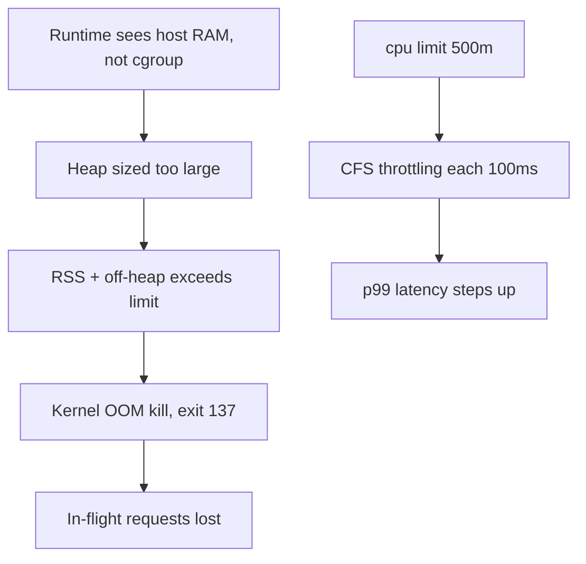
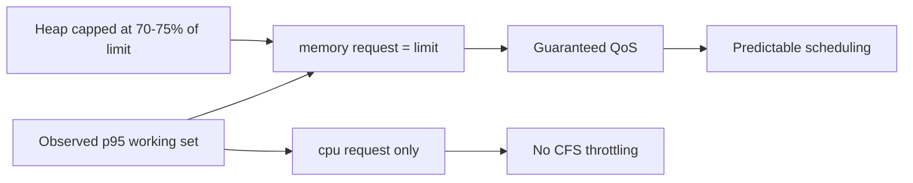

> **Scenario** - A Node.js worker restarts every 40 minutes with exit code 137. Memory looks fine in the app's own metrics, the heap never exceeds 900 MB, and the container limit is 1 GiB. Meanwhile the API pod's p99 tripled after someone "helpfully" set `cpu: 500m` as a limit.

## Why it matters

- `OOMKilled` is a SIGKILL: no graceful shutdown, no flush, in-flight requests and unacknowledged queue messages are lost.
- CPU limits throttle rather than kill, producing latency that looks like a slow dependency and sends teams debugging the wrong system for days.
- Requests, not limits, drive scheduling. Wrong requests mean either wasted cluster spend or nodes packed until everything degrades together.
- Memory limits are a hard wall, and most runtimes size their heap from host memory unless told about the cgroup.

## Symptoms

| Signal | What you observe |
|---|---|
| `kubectl describe pod` | `Last State: Terminated, Reason: OOMKilled, Exit Code: 137` |
| App metrics | Heap well under the limit right up to the kill |
| Node metrics | `container_cpu_cfs_throttled_seconds_total` climbing steadily |
| Latency | p99 rises in flat steps at 100ms boundaries while CPU usage sits at the limit |
| Scheduling | `0/12 nodes are available: Insufficient memory` while nodes look half empty |

## How it breaks

Two distinct failures wear the same "the pod is unhappy" costume.

**Memory:** the cgroup limit counts RSS *plus* page cache, off-heap allocations, thread stacks, and native library arenas. A JVM with `-Xmx900m` or a Node process with a 900 MB heap can easily use 1.3 GiB RSS. The kernel OOM killer does not read your heap dashboard; it reads the cgroup counter and kills PID 1.

**CPU:** a limit is enforced by CFS quota over a 100ms period. `cpu: 500m` means 50ms of CPU per 100ms window. A request that needs 80ms of CPU gets stopped mid-flight and resumes 50ms later - latency appears in visible steps, even though average utilisation reads a comfortable 45%.



## Root causes

1. The runtime is not cgroup-aware, so heap sizing is based on node memory.
2. Only limits are set, or requests equal limits everywhere, leaving no room for burst.
3. Off-heap usage (Buffers, native modules, glibc arenas, `/tmp` on an emptyDir backed by memory) is never counted.
4. CPU limits applied to latency-sensitive services that only need a request.
5. Genuine leaks masked by "just bump the limit", which extends the interval between restarts without fixing anything.

## How to solve it

### 1. Tell the runtime about the cgroup

```yaml
env:
  - name: NODE_OPTIONS
    value: "--max-old-space-size=768"       # ~75% of a 1Gi limit
  # JVM equivalent:
  # - name: JAVA_TOOL_OPTIONS
  #   value: "-XX:MaxRAMPercentage=70 -XX:+ExitOnOutOfMemoryError"
resources:
  requests:
    memory: "1Gi"
    cpu: "250m"
  limits:
    memory: "1Gi"                            # requests == limits = Guaranteed QoS
    # no cpu limit for latency-sensitive services
```

Setting memory request equal to limit puts the pod in the `Guaranteed` QoS class, so it is evicted last under node pressure.

### 2. Confirm what the kernel actually saw

```bash
kubectl get pod worker-5c8 -o jsonpath='{.status.containerStatuses[0].lastState.terminated}'
kubectl exec worker-5c8 -- cat /sys/fs/cgroup/memory.max /sys/fs/cgroup/memory.peak
kubectl exec api-77b -- cat /sys/fs/cgroup/cpu.stat   # nr_throttled, throttled_usec
```

### 3. Alert on throttling and headroom, not just kills

```yaml
- alert: CpuThrottlingHigh
  expr: |
    rate(container_cpu_cfs_throttled_periods_total{namespace="prod"}[5m])
      / rate(container_cpu_cfs_periods_total{namespace="prod"}[5m]) > 0.25
  for: 10m
- alert: MemoryHeadroomLow
  expr: |
    container_memory_working_set_bytes{namespace="prod"}
      / on(pod) kube_pod_container_resource_limits{resource="memory"} > 0.9
  for: 15m
```

### 4. Right-size from observed data

```bash
kubectl top pods -n prod --sort-by=memory
# set request near p95 working set, limit ~1.3x request for memory
kubectl set resources deploy/worker --requests=cpu=250m,memory=1Gi --limits=memory=1Gi
```

## Target design



## Tradeoffs

| Option | Pros | Cons | Choose when |
|---|---|---|---|
| No CPU limit, request only | No throttling, best tail latency | A noisy pod can starve neighbours | Latency-sensitive request/response services |
| CPU limit set | Predictable cost, hard isolation | Throttling at p99 even when the node is idle | Batch jobs and untrusted multi-tenant workloads |
| memory request == limit | Guaranteed QoS, evicted last | No overcommit, lower node density | Anything user-facing |
| memory request < limit | Higher density, cheaper | Burstable QoS, evicted earlier under pressure | Background workers that tolerate restarts |

## Verification checklist

- [ ] `cpu.stat` shows `nr_throttled` near zero for latency-sensitive pods under peak load.
- [ ] A load test at 2x expected traffic keeps working set under 80% of the memory limit.
- [ ] `kubectl describe pod` shows QoS Class `Guaranteed` for critical services.
- [ ] The heap flag is derived from the limit, verified with `kubectl exec ... -- node -e 'console.log(v8.getHeapStatistics().heap_size_limit)'`.
- [ ] A deliberate leak test produces exit 137 *and* a fired alert before users notice.
- [ ] Restart counts and OOM kills are on the same dashboard as latency.

## Anti-patterns

- Doubling the memory limit as a "fix" - the leak now takes 80 minutes instead of 40.
- Copying requests and limits between services because "the template had them".
- Setting `cpu: 1` limits on every pod for fairness, then debugging tail latency for a quarter.
- Using `emptyDir: {medium: Memory}` for scratch space without counting it against the limit.
- Treating `OOMKilled` as a Kubernetes bug rather than a kernel doing exactly what it was told.

## Related

- [Autoscaling on the right signal](/systems/devops-containers/autoscaling-on-the-right-signal)
- [Kubernetes probes done right](/systems/devops-containers/kubernetes-probes-done-right)
- [p99 tail latency and capacity planning](/systems/performance-capacity/p99-tail-latency-planning)
