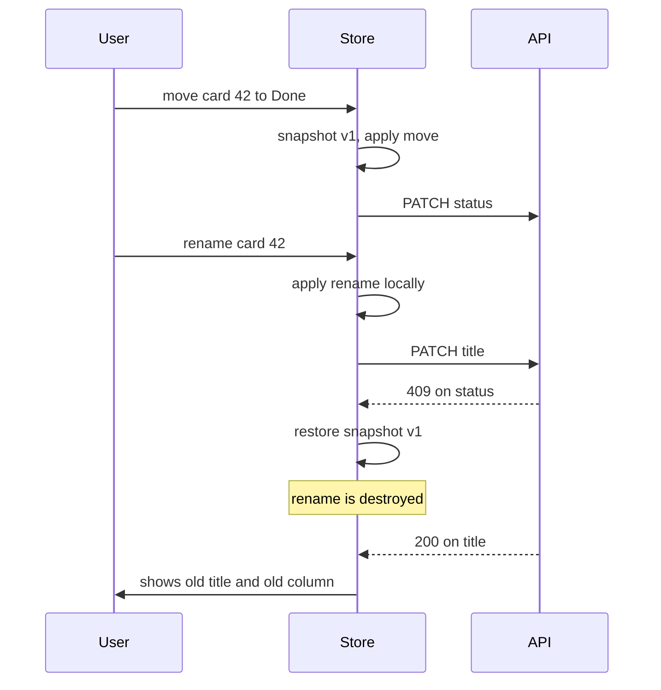
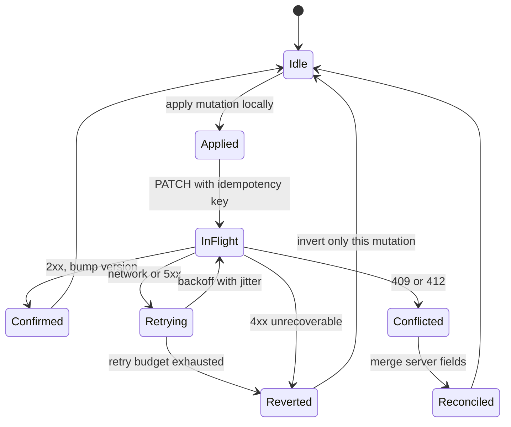

> **Scenario** - একটা kanban board card move optimistically apply করে। User card 42 "Done"-এ টেনে নিয়ে সাথে সাথেই সেটার নাম বদলায়। Move request 409 দিয়ে fail করে, rollback move-এর আগের snapshot ফিরিয়ে আনে - দুই সেকেন্ড পরে সফল হওয়া rename মুছে যায়। User আবার টাইপ করে, আর support-এ লেখা হয় "app হঠাৎ edit হারায়"।

## Why it matters

- Optimistic update প্রতি interaction-এ ২০০–৮০০ ms perceived latency সরায়। এক session-এ ডজনখানেক drag হলে এটাই পছন্দের tool আর সহ্য করা tool-এর পার্থক্য।
- সরল rollback পুরো object-এর snapshot ফেরায়, ফলে মাঝখানে করা যেকোনো পরিবর্তন নীরবে ধ্বংস হয়। ধীর হওয়ার চেয়ে data loss খারাপ।
- Idempotency key ছাড়া failed mutation retry করলে duplicate হতে পারে: প্রথম request আসলে সফল ছিল, response হারিয়েছে, এখন দুইটা order।
- ভুলটা ধরা কঠিন। Alert করার মতো server error নেই - server ঠিকই আছে। শুধু user টের পায়।

## Symptoms

| Signal | What you observe |
| --- | --- |
| Edit উধাও | বদলানোর কয়েক সেকেন্ড পর field পুরোনো মানে ফিরে যায় |
| Flicker | item নতুন জায়গায় লাফায়, ফিরে আসে, আবার যায় |
| Duplicate record | এক double-click থেকে দুইটা একই order |
| আটকে থাকা spinner | failure path reset ভুলে যাওয়ায় pending state কাটে না |
| Out-of-order write | দ্রুত দুইটা rename-এ পুরোনোটা জেতে |
| নীরব divergence | manual refresh না করা পর্যন্ত UI ও server একমত নয় |

## How it breaks

বাগটা rollback model-এ। অধিকাংশ implementation mutation-এর আগে `const snapshot = structuredClone(entity)` করে আর fail-এ `Object.assign(entity, snapshot)`। এটা *state* rollback, অথচ state ইতিমধ্যেই এগিয়ে গেছে। আসলে দরকার *mutation* rollback: শুধু যে পরিবর্তন fail করেছে সেটাই undo করা, পরের পরিবর্তন অক্ষত রেখে।



## Root causes

1. প্রতি mutation-এ inverse patch-এর বদলে পুরো entity-র snapshot-and-restore।
2. Mutation queue নেই, তাই একই entity-তে concurrent write অনিশ্চিতভাবে interleave করে।
3. Idempotency key ছাড়া retry, network flake-এ duplicate তৈরি করে।
4. Server-version check নেই, তাই stale client নতুন server value overwrite করে।
5. Pending state entity-র উপর রাখা, তাই clear করতে ভুলে যাওয়া failure path UI আটকে দেয়।
6. সব error একরকম ধরা - 409 conflict-এ merge, 500-এ retry, 422-তে form error দরকার।

## How to solve it

### 1. প্রতিটি mutation-এর স্পষ্ট inverse রাখুন

```ts
type Mutation<T> = {
  id: string            // also the Idempotency-Key
  entityId: string
  apply: (draft: T) => void
  invert: (draft: T) => void
  baseVersion: number
}

function moveCard(card: Card, to: Column): Mutation<Card> {
  const from = card.column
  return {
    id: crypto.randomUUID(),
    entityId: card.id,
    baseVersion: card.version,
    apply: (d) => { d.column = to },
    invert: (d) => { d.column = from },
  }
}
```

Failure *বর্তমান* মানের উপর `invert` চালায়, তাই পরের rename টিকে যায়।

### 2. প্রতি entity-তে mutation serialise করুন

```ts
const queues = new Map<string, Promise<void>>()

function enqueue(entityId: string, task: () => Promise<void>) {
  const prev = queues.get(entityId) ?? Promise.resolve()
  const next = prev.catch(() => {}).then(task)
  queues.set(entityId, next)
  return next
}
```

দ্রুত দুইটা rename এখন user-এর করা ক্রমেই apply হয়।

### 3. Idempotency key ও version পাঠান

```ts
await api.patch(`/cards/${m.entityId}`, payload, {
  headers: {
    'Idempotency-Key': m.id,
    'If-Match': String(m.baseVersion),
  },
})
```

Response হারানোর পর retry দ্বিতীয় record না বানিয়ে মূল result ফেরত দেয়। `If-Match` stale write-কে 412-তে পরিণত করে, যা client সামলাতে পারে।

### 4. Failure type অনুযায়ী branch করুন

```ts
catch (err) {
  if (isNetworkError(err) || err.status >= 500) return retryWithBackoff(m)
  if (err.status === 412 || err.status === 409) return reconcile(m, err.body.current)
  applyInverse(m)                 // 4xx: the write will never succeed
  toast.error(messageFor(err))
}
```

কেবল unrecoverable client error rollback করে। Transient failure retry করে, conflict reconcile করে।

### 5. Conflict field ধরে ধরে reconcile করুন

```ts
function reconcile(m: Mutation<Card>, server: Card) {
  const draft = store.get(m.entityId)!
  const fields = changedFields(m)
  // server wins on fields this mutation touched; keep local edits elsewhere
  for (const f of fields) draft[f] = server[f]
  draft.version = server.version
  toast.info('This card changed elsewhere; your move was not applied.')
}
```

### 6. Pending state entity-র বাইরে রাখুন

`pendingByEntity: Map<string, number>` রাখুন যাতে UI data না বদলে সূক্ষ্ম indicator দেখাতে পারে, আর `finally` block সবসময় কমায়।

### 7. সবকিছুতে optimistic হবেন না

Payment, irreversible delete ও আইনি ওজনের যেকোনো কিছুতে সত্যিকারের pending state দেখান। Optimism সস্তা, reversible, উচ্চ-কম্পাঙ্কের action-এর জন্য।

## Target design



## Tradeoffs

| Option | Pros | Cons | Choose when |
| --- | --- | --- | --- |
| Snapshot rollback | লিখতে সহজ | concurrent edit ধ্বংস করে | concurrency-হীন single-field form |
| Inverse patch rollback | পরের edit রক্ষা করে | প্রতি mutation-এ inverse লাগে | board, list, collaborative UI |
| Pessimistic write | সবসময় consistent | ২০০–৮০০ ms দৃশ্যমান latency | payment ও destructive action |
| CRDT-backed state | স্বয়ংক্রিয় merge | বড় library, অচেনা semantics | real-time multi-user document |

## Verification checklist

- [ ] Item সরান, rename করুন, তারপর move fail করান - rename টিকে থাকে।
- [ ] Network throttle করে submit-এ double-click; ঠিক একটা record তৈরি হয়।
- [ ] curl-এ একই `Idempotency-Key` replay করুন; server মূল response ফেরত দেয়।
- [ ] 412 simulate করুন; UI conflict message দেখায় ও server value নেয়।
- [ ] Retry-র পর mutation fail করান; কোনো spinner চলতে থাকে না।
- [ ] ১০০ ms ব্যবধানে দুইটা rename পাঠান; server-এ শেষেরটাই চূড়ান্ত মান।

## Anti-patterns

- সর্বজনীন undo হিসেবে প্রতিটি mutation-এর আগে পুরো store `structuredClone` করা।
- "সাধারণত কাজ করে" বলে idempotency key ছাড়া `POST` retry করা।
- Server উত্তর দেওয়ার আগেই success toast দেখানো।
- 422 validation error-কে retryable ধরে endpoint-এ hammer করা।
- Payment confirmation screen-এ optimism প্রয়োগ করা।

## Related

- [Frontend state management at scale](/systems/frontend-architecture/frontend-state-management-at-scale)
- [Offline-first sync and conflict resolution](/systems/frontend-architecture/offline-first-sync-conflicts)
- [Realtime UI reconnection handling](/systems/frontend-architecture/realtime-ui-reconnection-handling)
