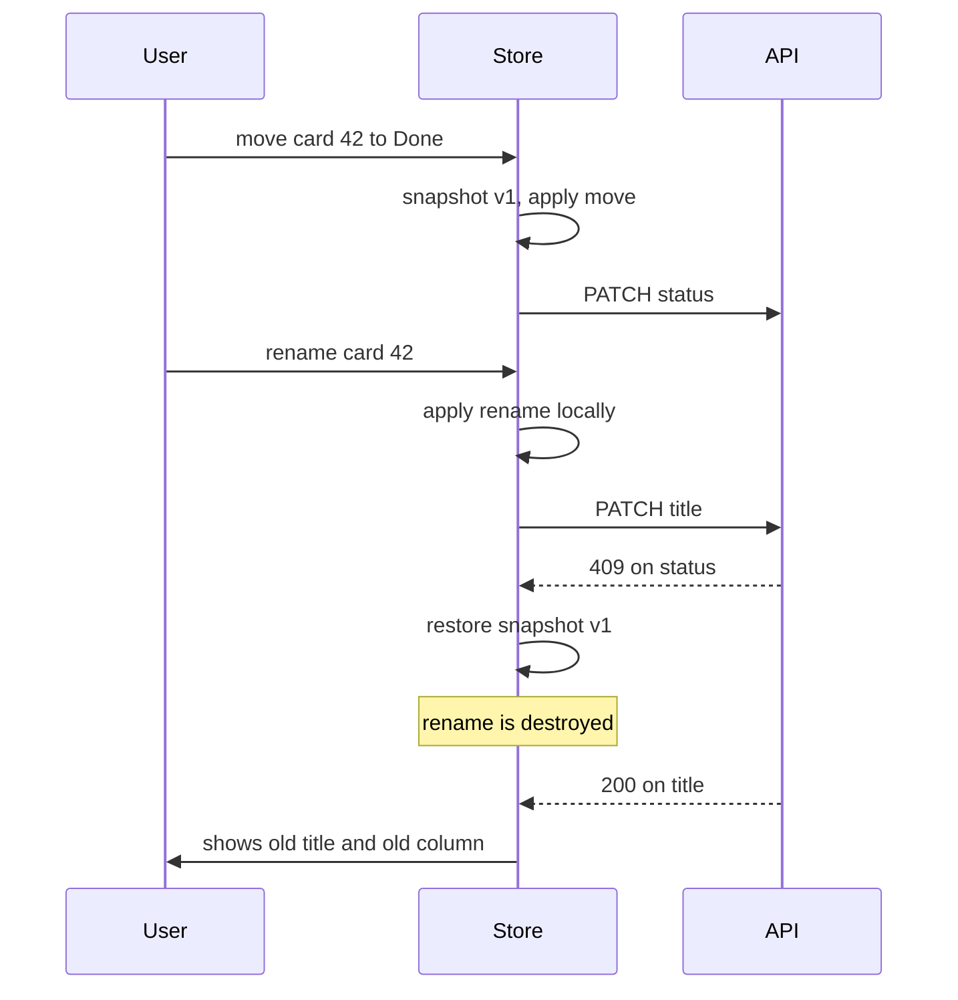
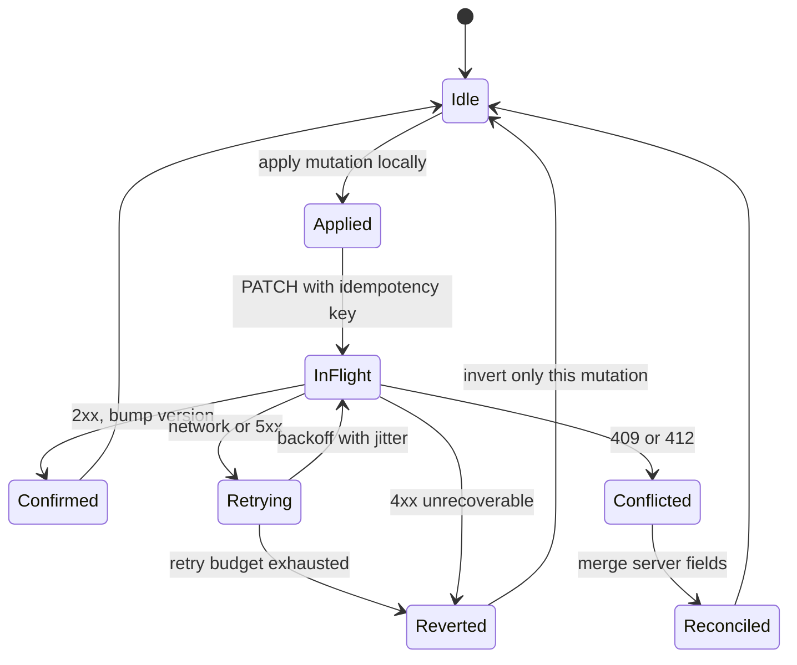

> **Scenario** - A kanban board applies card moves optimistically. A user drags card 42 to "Done", then immediately renames it. The move request fails with a 409 and the rollback restores the pre-move snapshot - wiping the rename that succeeded two seconds later. The user re-types it, and support logs it as "app randomly loses edits".

## Why it matters

- Optimistic updates remove 200–800 ms of perceived latency per interaction. On a board with dozens of drags per session, that is the difference between a tool people like and one they tolerate.
- Naive rollback restores a whole-object snapshot, which silently destroys any change the user made in between. Data loss is worse than slowness.
- Retrying a failed mutation without an idempotency key can create duplicates: the first request actually succeeded, the response was lost, and now there are two orders.
- Getting this wrong is expensive to detect. There is no server error to alert on - the server is fine. Only the user notices.

## Symptoms

| Signal | What you observe |
| --- | --- |
| Vanishing edits | A field reverts to an older value seconds after being changed |
| Flicker | Item jumps to the new position, back, then forward again |
| Duplicate records | Two identical orders created from one double-click |
| Stuck spinner | Pending state never clears because the failure path forgot to reset it |
| Out-of-order writes | Two rapid renames land, the older one wins |
| Silent divergence | UI and server disagree until a manual refresh |

## How it breaks

The bug is in the rollback model. Most implementations do `const snapshot = structuredClone(entity)` before the mutation and `Object.assign(entity, snapshot)` on failure. That is a *state* rollback, and state has moved on. What you actually want is a *mutation* rollback: undo only the specific change that failed, leaving later changes intact.



## Root causes

1. Snapshot-and-restore of whole entities instead of inverse patches per mutation.
2. No mutation queue, so concurrent writes to the same entity interleave unpredictably.
3. Retries without an idempotency key, producing duplicates on network flakes.
4. No server-version check, so a stale client overwrites a newer server value.
5. Pending state stored on the entity, so a failure path that forgets to clear it strands the UI.
6. All errors treated the same - a 409 conflict needs a merge, a 500 needs a retry, a 422 needs a form error.

## How to solve it

### 1. Model each mutation with an explicit inverse

```ts
type Mutation<T> = {
  id: string            // also the Idempotency-Key
  entityId: string
  apply: (draft: T) => void
  invert: (draft: T) => void
  baseVersion: number
}

function moveCard(card: Card, to: Column): Mutation<Card> {
  const from = card.column
  return {
    id: crypto.randomUUID(),
    entityId: card.id,
    baseVersion: card.version,
    apply: (d) => { d.column = to },
    invert: (d) => { d.column = from },
  }
}
```

Failure calls `invert` on the *current* value, so a later rename survives.

### 2. Serialise mutations per entity

```ts
const queues = new Map<string, Promise<void>>()

function enqueue(entityId: string, task: () => Promise<void>) {
  const prev = queues.get(entityId) ?? Promise.resolve()
  const next = prev.catch(() => {}).then(task)
  queues.set(entityId, next)
  return next
}
```

Two rapid renames now apply in the order the user made them.

### 3. Send an idempotency key and a version

```ts
await api.patch(`/cards/${m.entityId}`, payload, {
  headers: {
    'Idempotency-Key': m.id,
    'If-Match': String(m.baseVersion),
  },
})
```

A retry after a dropped response returns the original result instead of creating a second record. `If-Match` turns a stale write into a 412 the client can handle.

### 4. Branch on the failure type

```ts
catch (err) {
  if (isNetworkError(err) || err.status >= 500) return retryWithBackoff(m)
  if (err.status === 412 || err.status === 409) return reconcile(m, err.body.current)
  applyInverse(m)                 // 4xx: the write will never succeed
  toast.error(messageFor(err))
}
```

Only unrecoverable client errors roll back. Transient failures retry, conflicts reconcile.

### 5. Reconcile conflicts field by field

```ts
function reconcile(m: Mutation<Card>, server: Card) {
  const draft = store.get(m.entityId)!
  const fields = changedFields(m)
  // server wins on fields this mutation touched; keep local edits elsewhere
  for (const f of fields) draft[f] = server[f]
  draft.version = server.version
  toast.info('This card changed elsewhere; your move was not applied.')
}
```

### 6. Keep pending state outside the entity

Track `pendingByEntity: Map<string, number>` so the UI can show a subtle indicator without mutating the data, and a `finally` block always decrements it.

### 7. Do not be optimistic about everything

Payments, irreversible deletes, and anything with legal weight should show a real pending state. Optimism is for cheap, reversible, high-frequency actions.

## Target design



## Tradeoffs

| Option | Pros | Cons | Choose when |
| --- | --- | --- | --- |
| Snapshot rollback | Trivial to implement | Destroys concurrent edits | Single-field forms with no concurrency |
| Inverse patch rollback | Preserves later edits | Every mutation needs an inverse | Boards, lists, collaborative UIs |
| Pessimistic writes | Always consistent | 200–800 ms of visible latency | Payments and destructive actions |
| CRDT-backed state | Automatic merge | Large library, unfamiliar semantics | Real-time multi-user documents |

## Verification checklist

- [ ] Move an item, rename it, then force the move to fail - the rename survives.
- [ ] Double-click submit with the network throttled; exactly one record is created.
- [ ] Replay the same `Idempotency-Key` in curl; the server returns the original response.
- [ ] Simulate a 412; the UI shows a conflict message and adopts the server value.
- [ ] Fail a mutation after retries; no spinner is left running.
- [ ] Fire two renames 100 ms apart; the later one is the final value on the server.

## Anti-patterns

- `structuredClone` of the whole store before every mutation as a universal undo.
- Retrying `POST` without an idempotency key because "it usually works".
- Showing a success toast before the server responds.
- Treating a 422 validation error as retryable and hammering the endpoint.
- Applying optimism to a payment confirmation screen.

## Related

- [Frontend state management at scale](/systems/frontend-architecture/frontend-state-management-at-scale)
- [Offline-first sync and conflict resolution](/systems/frontend-architecture/offline-first-sync-conflicts)
- [Realtime UI reconnection handling](/systems/frontend-architecture/realtime-ui-reconnection-handling)
