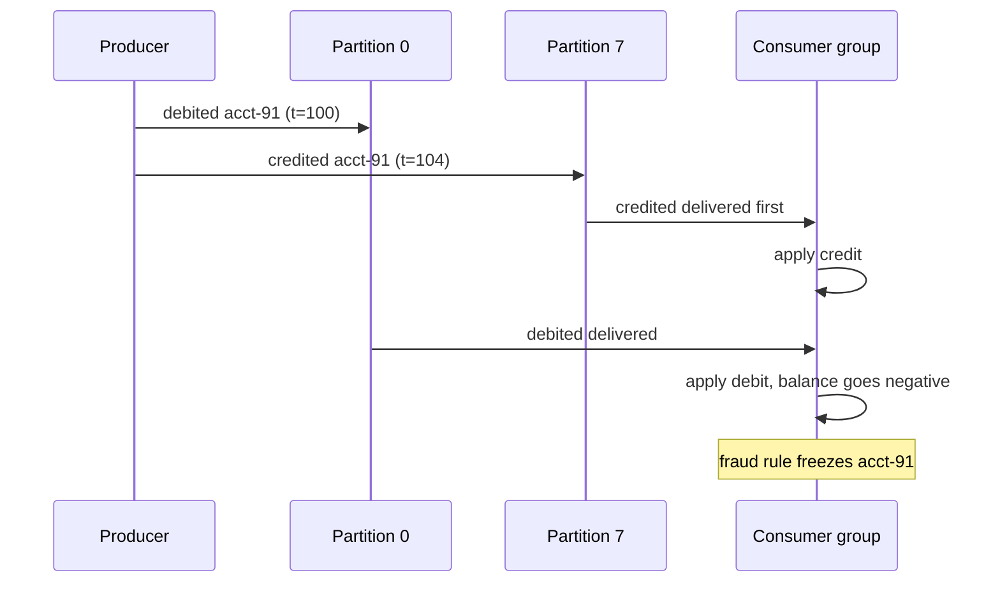
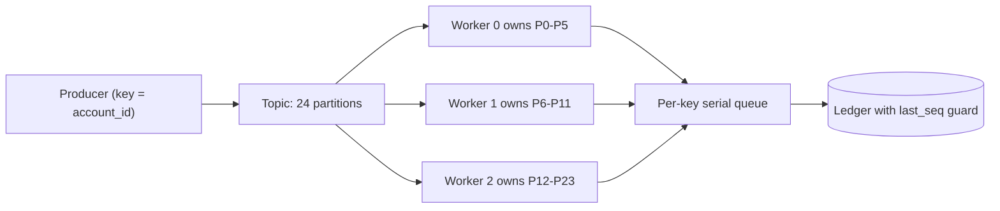

> **Scenario** — একটা account service একই account-এর জন্য ৪ms-এর মধ্যে `balance.debited` তারপর `balance.credited` emit করে। Kafka-তে ২৪টা partition, producer random key ব্যবহার করছে। Downstream ledger debit-এর আগে credit apply করে, মাঝের balance negative হয়ে যায়, আর একটা automated fraud rule account freeze করে দেয়। Produce-এর সময় event দুটো "in order" ছিল, consume-এর সময় নয়।

## Why it matters

- Kafka ordering guarantee দেয় **শুধু partition-এর ভিতরে**। topic globally ordered নয়, যতবারই কেউ বলুক "Kafka is ordered"।
- Out-of-order state transition অসম্ভব intermediate state বানায় যা downstream automation চালু করে: fraud freeze, dunning email, inventory oversell।
- পরে ordering ঠিক করা মানে সাধারণত consumer-কে commutative করে লেখা, যা প্রথম দিনেই key ঠিক করার চেয়ে অনেক বেশি ব্যয়বহুল।
- সরল "ফিক্স" (এক partition, বা global lock) throughput ধ্বংস করে — ২৪-way parallel pipeline single-threaded হয়ে যায়।
- সঠিক key থাকা সত্ত্বেও consumer group rebalance in-flight message drain না করলে কাজ reorder করে।

## Symptoms

| Signal | What you observe |
|---|---|
| Ledger invariants | ক্ষণস্থায়ী negative balance যা কয়েক সেকেন্ডে নিজেই ঠিক হয় |
| Event timestamps | একই entity-র `t=100`-এর আগে consumer `t=104` process করে |
| Partition assignment | এক account ID-র event একাধিক partition-এ |
| Rebalance logs | `Revoking previously assigned partitions`-এর পর duplicate processing |
| Version conflicts | উচ্চ write rate-এ optimistic locking failure বেড়ে যাওয়া |
| Hot partition | এক partition-এ ৪০% traffic, বাকিগুলো idle |

## How it breaks

Ordering হলো partition-এর বৈশিষ্ট্য, যা produce time-এ partitioner ঠিক করে। key null হলে Java client sticky partitioning-এ batch ছড়িয়ে দেয়; key `orderId` হলেও invariant যদি per-account হয়, দুই account-এর event ভুলভাবে interleave করতে পারে। Consumer তারপর প্রতি partition-এ এক thread চালায় ও partition-গুলো concurrently process করে, তাই দুই ভিন্ন partition-এর event-এর আপেক্ষিক order scheduler ঠিক করে।

দ্বিতীয় failure হলো internal parallelism। যে consumer এক partition থেকে batch পড়ে প্রতিটি record worker pool-এ ছুড়ে দেয়, সে নিজের process-এর ভিতরেই partition ordering ফেলে দিয়েছে।



## Root causes

1. Partition key সেই entity-র সঙ্গে মেলে না যার ordering invariant।
2. null বা random key, "load ছড়াতে" default partitioner-এর ওপর ভরসা।
3. Consumer record গুলো thread pool-এ ছড়িয়ে দেয়, ভিতরেই per-partition ordering ভাঙে।
4. Launch-এর পর partition count বদলানো, ফলে পুরনো key-এর hash এখন অন্য partition-এ যায়।
5. batch-এর মাঝপথে rebalance হলে reprocessing নতুন owner-এর অগ্রগতির সঙ্গে interleave করে।
6. `max.in.flight.requests.per.connection > 1` সহ producer retry আর idempotence বন্ধ — partition-এর ভিতরেও reorder হতে পারে।

## How to solve it

### 1. Pick the key from the invariant, not the payload

জিজ্ঞেস করুন: "সবচেয়ে ছোট কোন unit-টা order মেনে process হতেই হবে?" সেটাই আপনার key। ledger-এ `account_id`। inventory-তে `sku` (বা `sku:warehouse`)। user profile-এ `user_id`।

```ts
await producer.send({
  topic: 'ledger.events',
  messages: [{
    key: event.accountId,          // the ordering unit
    value: JSON.stringify(event),
    headers: { 'x-seq': String(event.sequence) },
  }],
})
```

### 2. Lock producer settings that preserve order

```yaml
# producer config
enable.idempotence: true          # implies acks=all, retries=Integer.MAX_VALUE
max.in.flight.requests.per.connection: 5   # safe only with idempotence on
acks: all
```

`enable.idempotence` ছাড়া retry হওয়া batch পরের batch-এর পরে গিয়ে পড়তে পারে এবং এক partition-এর ভিতরেই নীরবে record reorder করে।

### 3. Keep ordering inside the consumer

এক partition এক logical thread-এ process করুন। concurrency দরকার হলে partition-এর *ভিতরে* key ধরে shard করুন এবং per-key queue রাখুন।

```ts
const inFlight = new Map<string, Promise<void>>()

function submit(key: string, work: () => Promise<void>): Promise<void> {
  const prev = inFlight.get(key) ?? Promise.resolve()
  const next = prev.then(work, work)
  inFlight.set(key, next.finally(() => {
    if (inFlight.get(key) === next) inFlight.delete(key)
  }))
  return next
}
```

এতে per-key serialisation ও cross-key parallelism দুটোই মেলে — আসল প্রয়োজন এটাই।

### 4. Defend with sequence numbers

সঠিক key থাকলেও per-entity monotonic sequence রাখুন এবং consumer-কে stale write reject করতে দিন। এতে ordering bug corrupt state না হয়ে দৃশ্যমান metric হয়।

```sql
UPDATE accounts
   SET balance_cents = balance_cents + :delta,
       last_seq      = :seq
 WHERE id = :account_id
   AND last_seq < :seq;
-- 0 rows affected means a stale or duplicate event; count it and move on
```

### 5. Size partitions once and treat the count as immutable

Partition বাড়ালে key rehash হয় এবং প্রতিটি in-flight entity-র ordering ভাঙে। বাড়াতেই হলে target count নিয়ে নতুন topic বানিয়ে cutover-এ consumer migrate করুন, নয়তো পরিবর্তনের সময় একটা নথিভুক্ত ordering gap মেনে নিন।

### 6. Handle rebalances explicitly

`onPartitionsRevoked`-এ offset commit করুন, revocation চলাকালীন নতুন কাজ নেওয়া বন্ধ করুন, আর cooperative sticky assignment বেছে নিন যাতে অপ্রভাবিত partition চলতে থাকে।

## Target design



## Tradeoffs

| Option | Pros | Cons | Choose when |
|---|---|---|---|
| Single partition | পূর্ণ order, নিশ্চিতভাবে সঠিক | throughput এক consumer-এ সীমিত | কম-volume control topic |
| Key by entity ID | entity-প্রতি parallel ও সঠিক | hot key hot partition বানায় | stateful event-এর default |
| Key by tenant | কম key, সরল routing | বড় tenant একটা partition দখল করে | tenant-scoped workflow |
| No ordering, commutative writes | সর্বোচ্চ parallelism | প্রতিটি consumer commutative হতে হবে | counter, metric, CRDT-ধাঁচের state |
| Sequence guard only | যেকোনো order সহ্য করে | সর্বত্র versioned state লাগে | keying-এর পাশে defence-in-depth |

## Verification checklist

- [ ] এক entity-র ১০,০০০ event produce করে দেখুন consumer কঠোরভাবে বাড়তে থাকা sequence-এ apply করে।
- [ ] এক entity-র প্রতিটি message একই partition-এ পড়ছে কিনা দেখুন: `kafka-console-consumer` চালান `--property print.partition=true` দিয়ে।
- [ ] চলমান producer config-এ সত্যিই `enable.idempotence=true` আছে কিনা যাচাই করুন, শুধু repo-তে নয়।
- [ ] load-এর সময় rebalance ঘটিয়ে stale-sequence rejection গুনুন; ওগুলো duplicate হওয়া উচিত, gap নয়।
- [ ] per-partition throughput skew মাপুন; কোনো partition median-এর ২× ছাড়ানো উচিত নয়।
- [ ] consumer unordered worker pool-এ record দেয় কিনা যাচাই করুন — doc নয়, code path পড়ুন।

## Anti-patterns

- "সমান বণ্টনের জন্য" প্রতি message-এ UUID key দেওয়া, যা ordering পুরোপুরি মুছে দেয়।
- consumed batch timestamp-এ sort করে সেটাকে ordered বলা; ভিন্ন producer-এর wall clock তুলনাযোগ্য নয়।
- incident-এর সময় "দ্রুত drain করতে" partition বাড়ানো, যা প্রতিটি key reorder করে।
- order ফেরাতে per-entity distributed lock ব্যবহার করা, যা পুরো pipeline serialise করে।
- framework ভিতরে prefetch ও parallelise করা সত্ত্বেও single-threaded consumer-কে যথেষ্ট ধরে নেওয়া।
- source-এর monotonic sequence-এর বদলে producer-side timestamp দিয়ে ordering সিদ্ধান্ত নেওয়া।

## Related

- [Consumer lag, autoscaling, and drain time](/systems/messaging-async/consumer-lag-and-scaling)
- [Choosing between a queue and a stream](/systems/messaging-async/queue-vs-stream-selection)
- [Building idempotent consumers](/systems/messaging-async/idempotent-consumers)
