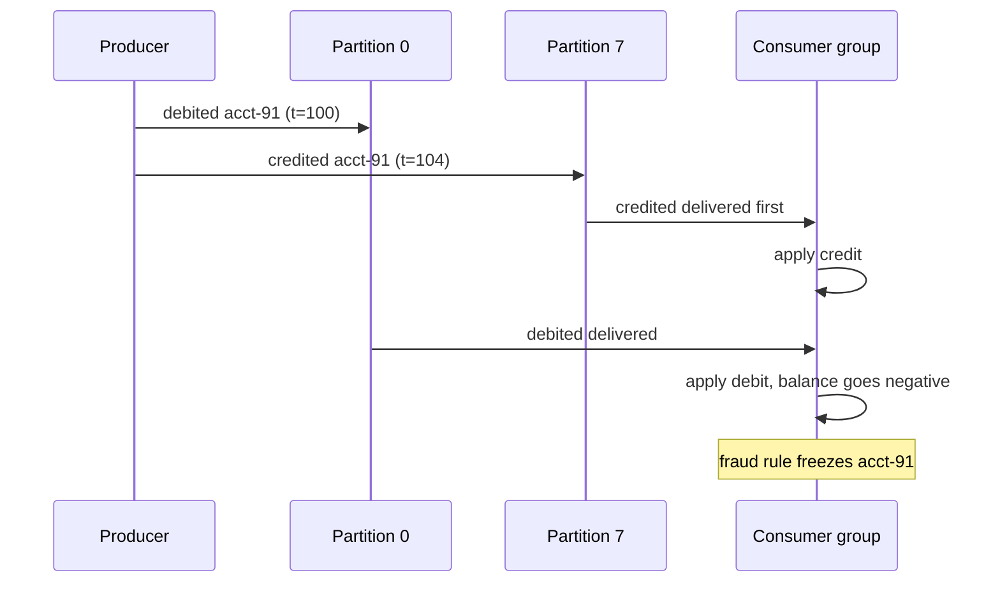
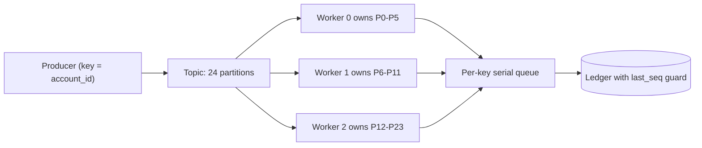

> **Scenario** — An account service emits `balance.debited` then `balance.credited` for the same account within 4ms. Kafka is configured with 24 partitions and the producer uses a random key. Downstream the ledger applies the credit before the debit, the intermediate balance goes negative, and an automated fraud rule freezes the account. The events were "in order" when produced and out of order when consumed.

## Why it matters

- Kafka guarantees ordering **within a partition only**. Nothing about a topic is ordered globally, no matter how many times someone says "Kafka is ordered".
- Out-of-order state transitions produce impossible intermediate states that trigger downstream automation: fraud freezes, dunning emails, inventory oversell.
- Fixing ordering after the fact usually means rewriting consumers to be commutative, which is far more expensive than getting the key right on day one.
- Naive fixes (one partition, or a global lock) destroy throughput and turn a 24-way parallel pipeline into a single-threaded one.
- Consumer group rebalances reorder work even with correct keys if in-flight messages are not drained.

## Symptoms

| Signal | What you observe |
|---|---|
| Ledger invariants | Transient negative balances that self-correct seconds later |
| Event timestamps | Consumer processes event `t=104` before `t=100` for the same entity |
| Partition assignment | Events for one account ID appear on multiple partitions |
| Rebalance logs | `Revoking previously assigned partitions` followed by duplicate processing |
| Version conflicts | Optimistic locking failures spiking during high write rates |
| Hot partition | One partition holds 40% of traffic while others idle |

## How it breaks

Ordering is a property of the partition, established at produce time by the partitioner. If the key is null, the Java client uses sticky partitioning and spreads a batch across partitions; if the key is `orderId` but the invariant is per-account, two accounts' events can interleave incorrectly. Consumers then run one thread per partition and process partitions concurrently, so the relative order of two events on different partitions is whatever the scheduler decides.

The second failure is internal parallelism. A consumer that reads a batch from one partition and hands each record to a worker pool has just discarded partition ordering inside its own process.



## Root causes

1. Partition key does not match the entity that owns the ordering invariant.
2. Null or random keys, relying on the default partitioner to "spread load".
3. Consumer fans records out to a thread pool, breaking per-partition ordering internally.
4. Partition count changed after launch, so the hash of an existing key now maps elsewhere.
5. Rebalances mid-batch cause reprocessing that interleaves with a new owner's progress.
6. Producer retries with `max.in.flight.requests.per.connection > 1` and idempotence disabled, which can reorder within a partition.

## How to solve it

### 1. Pick the key from the invariant, not the payload

Ask: "what is the smallest unit that must be processed in order?" That is your key. For a ledger it is `account_id`. For inventory it is `sku` (or `sku:warehouse`). For a user profile it is `user_id`.

```ts
await producer.send({
  topic: 'ledger.events',
  messages: [{
    key: event.accountId,          // the ordering unit
    value: JSON.stringify(event),
    headers: { 'x-seq': String(event.sequence) },
  }],
})
```

### 2. Lock producer settings that preserve order

```yaml
# producer config
enable.idempotence: true          # implies acks=all, retries=Integer.MAX_VALUE
max.in.flight.requests.per.connection: 5   # safe only with idempotence on
acks: all
```

Without `enable.idempotence`, a retried batch can land after a later batch and silently reorder records inside one partition.

### 3. Keep ordering inside the consumer

Process one partition on one logical thread. If you need concurrency, shard by key *within* the partition and keep a per-key queue.

```ts
const inFlight = new Map<string, Promise<void>>()

function submit(key: string, work: () => Promise<void>): Promise<void> {
  const prev = inFlight.get(key) ?? Promise.resolve()
  const next = prev.then(work, work)
  inFlight.set(key, next.finally(() => {
    if (inFlight.get(key) === next) inFlight.delete(key)
  }))
  return next
}
```

This gives per-key serialisation with cross-key parallelism, which is the actual requirement.

### 4. Defend with sequence numbers

Even with correct keys, add a monotonic per-entity sequence and let the consumer reject stale writes. This turns an ordering bug into a visible metric instead of corrupt state.

```sql
UPDATE accounts
   SET balance_cents = balance_cents + :delta,
       last_seq      = :seq
 WHERE id = :account_id
   AND last_seq < :seq;
-- 0 rows affected means a stale or duplicate event; count it and move on
```

### 5. Size partitions once and treat the count as immutable

Increasing partitions rehashes keys and breaks ordering for every in-flight entity. If you must grow, create a new topic with the target count and migrate consumers with a cutover, or accept a documented ordering gap during the change.

### 6. Handle rebalances explicitly

Commit offsets in `onPartitionsRevoked`, stop accepting new work during revocation, and prefer cooperative sticky assignment so unaffected partitions keep running.

## Target design



## Tradeoffs

| Option | Pros | Cons | Choose when |
|---|---|---|---|
| Single partition | Total order, trivially correct | Throughput capped at one consumer | Low-volume control topics |
| Key by entity ID | Parallel and correct per entity | Hot keys create hot partitions | The default for stateful events |
| Key by tenant | Fewer keys, simple routing | Large tenants dominate a partition | Tenant-scoped workflows |
| No ordering, commutative writes | Maximum parallelism | Every consumer must be commutative | Counters, metrics, CRDT-style state |
| Sequence guard only | Tolerates any order | Requires versioned state everywhere | Defence-in-depth alongside keying |

## Verification checklist

- [ ] Produce 10,000 events for one entity and assert the consumer applies them in strictly increasing sequence.
- [ ] Confirm every message for a given entity lands on the same partition: check `kafka-console-consumer` with `--property print.partition=true`.
- [ ] Verify `enable.idempotence=true` is actually set in the running producer config, not just the repo.
- [ ] Trigger a rebalance during load and count stale-sequence rejections; they should be duplicates, not gaps.
- [ ] Measure per-partition throughput skew; no partition should exceed 2× the median.
- [ ] Assert the consumer does not hand records to an unordered worker pool — read the code path, not the docs.

## Anti-patterns

- Setting the key to a UUID per message "for even distribution", which guarantees no ordering at all.
- Sorting a consumed batch by timestamp and calling it ordered; wall clocks across producers are not comparable.
- Adding partitions during an incident to "drain faster", which reorders every key.
- Using a distributed lock per entity to reimpose order, which serialises the whole pipeline.
- Assuming a single-threaded consumer is enough when the framework prefetches and parallelises underneath.
- Relying on producer-side timestamps for ordering decisions instead of a monotonic sequence owned by the source.

## Related

- [Consumer lag, autoscaling, and drain time](/systems/messaging-async/consumer-lag-and-scaling)
- [Choosing between a queue and a stream](/systems/messaging-async/queue-vs-stream-selection)
- [Building idempotent consumers](/systems/messaging-async/idempotent-consumers)
