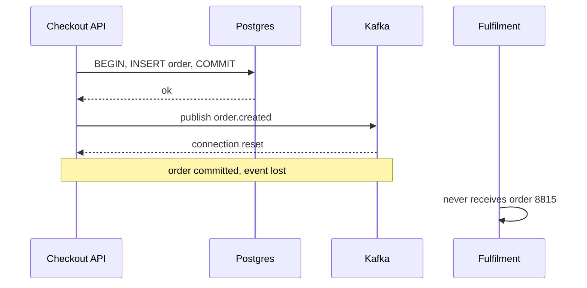
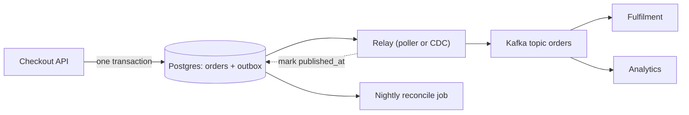

> **Scenario** — একটা checkout service আগে Postgres-এ `orders` row লেখে, তারপর Kafka-তে `order.created` publish করে। ৪০ সেকেন্ডের broker failover-এ ১,১৮০টা order database-এ commit হয় কিন্তু কখনো publish হয় না। Fulfilment ওগুলোর খবরই পায় না। দুদিন পর finance দেখে paid order আছে কিন্তু shipment নেই — আর কোন event হারিয়েছে কেউ বলতে পারে না, কারণ publish call-এর কোনো durable record ছিল না।

## Why it matters

- Database commit আর broker publish দুটো আলাদা system; এদের ঘিরে কোনো transaction নেই, তাই প্রতিটি "save then publish" একটা race যার loss window নিশ্চিত।
- উল্টো failure আরও খারাপ: publish সফল, transaction rollback — downstream এমন order নিয়ে কাজ করে যেটা অস্তিত্বেই নেই।
- Recovery হাতে করা ও ধীর। "row আছে event নেই" মেলাতে প্রতি entity-র জন্য আলাদা script লিখতে হয়, তাও চাপের মধ্যে।
- Request path-এ publish retry করলে broker latency user-facing p99-এ যোগ হয়, তবু process মরলে event হারায়।
- Auditor ও finance-এর প্রমাণযোগ্য record দরকার — কী emit হয়েছে, কখন। fire-and-forget publish কোনোটাই দেয় না।

## Symptoms

| Signal | What you observe |
|---|---|
| Row/event count drift | একই window-তে `SELECT count(*) FROM orders` topic message count-এর চেয়ে বেশি |
| Error logs | সফল commit-এর ঠিক পরেই `KafkaJSConnectionError` বা `AMQPConnectionClosed` |
| Downstream gaps | Consumer 8814 ও 8816 process করে, 8815 কখনো নয় |
| Phantom events | Consumer এমন event পায় যার entity ID source service-এ 404 |
| Request latency | Checkout p99 database latency নয়, broker latency অনুসরণ করে |
| Incident pattern | loss ঠিক broker restart, deploy বা network blip-এর সঙ্গে মেলে |

## How it breaks

সমস্যাটা dual write। Service দুটো আলাদা system-এ কোনো coordination ছাড়া লেখে, আর মাঝখানে crash বা timeout হলেই system inconsistent। publish-কে try/catch দিয়ে মুড়েও লাভ নেই: `COMMIT` আর `producer.send()`-এর মাঝে process SIGKILL হতে পারে, application-level retry সেটা টেকে না। publish-কে commit-এর *আগে* সরালে bug উল্টে phantom event হয়।



## Root causes

1. দুই system-এ দুই write, কোনো shared transaction boundary নেই।
2. publish failure durable retry state-এর বদলে শুধু log line দিয়ে সামলানো।
3. idempotent producer বা event ID নেই, তাই সরল retry gap ঠিক না করে duplicate বানায়।
4. Business logic ধরে নেয় event commit-এর side effect, অথচ সেটা commit-এরই অংশ হওয়া উচিত।
5. source-of-truth row আর emitted event মিলিয়ে দেখার কোনো reconciliation job নেই।

## How to solve it

### 1. Write the event into the same transaction

business data-র একই database ও schema-তে একটা `outbox` table যোগ করুন। event তখন commit-এর আরেকটা row মাত্র।

```sql
CREATE TABLE outbox (
  id            BIGSERIAL PRIMARY KEY,
  aggregate     TEXT        NOT NULL,
  aggregate_id  TEXT        NOT NULL,
  event_type    TEXT        NOT NULL,
  payload       JSONB       NOT NULL,
  headers       JSONB       NOT NULL DEFAULT '{}'::jsonb,
  created_at    TIMESTAMPTZ NOT NULL DEFAULT now(),
  published_at  TIMESTAMPTZ
);

CREATE INDEX outbox_unpublished_idx
  ON outbox (id) WHERE published_at IS NULL;
```

partial index-টা table-এ ৫ কোটি historical row থাকলেও relay scan সস্তা রাখে।

### 2. Insert business row and event atomically

```php
DB::transaction(function () use ($cart) {
    $order = Order::create([
        'customer_id' => $cart->customerId,
        'total_cents' => $cart->totalCents,
        'status'      => 'created',
    ]);

    Outbox::create([
        'aggregate'    => 'order',
        'aggregate_id' => (string) $order->id,
        'event_type'   => 'order.created',
        'payload'      => $order->toEventPayload(),
        'headers'      => ['event_id' => (string) Str::uuid(), 'schema' => 'v2'],
    ]);
});
```

Transaction-এর ভিতরে কোনো broker call নেই। Checkout latency database-এর গতিতেই থাকে।

### 3. Relay with a poller that claims rows

`FOR UPDATE SKIP LOCKED` ব্যবহার করুন যাতে একাধিক relay instance একে অন্যের গায়ে না পড়ে।

```ts
async function relayBatch(): Promise<number> {
  return db.transaction(async (tx) => {
    const rows = await tx.query(`
      SELECT id, event_type, aggregate_id, payload, headers
      FROM outbox
      WHERE published_at IS NULL
      ORDER BY id
      LIMIT 500
      FOR UPDATE SKIP LOCKED
    `)
    if (rows.length === 0) return 0

    await producer.sendBatch({
      topicMessages: [{
        topic: 'orders',
        messages: rows.map((r) => ({
          key: r.aggregate_id,
          value: JSON.stringify(r.payload),
          headers: { ...r.headers, 'x-outbox-id': String(r.id) },
        })),
      }],
    })

    await tx.query(
      `UPDATE outbox SET published_at = now() WHERE id = ANY($1)`,
      [rows.map((r) => r.id)],
    )
    return rows.length
  })
}
```

Relay at-least-once: `sendBatch`-এর পর `UPDATE`-এর আগে process মরলে ওই event দুবার publish হবে। এটাই সঠিক ও প্রত্যাশিত — consumer `event_id`-তে dedup করবে।

### 4. Or let CDC do the relay

Debezium Postgres WAL tail করলে poller লাগে না, polling load ছাড়াই sub-second latency পাওয়া যায়।

```yaml
connector.class: io.debezium.connector.postgresql.PostgresConnector
plugin.name: pgoutput
table.include.list: public.outbox
transforms: outbox
transforms.outbox.type: io.debezium.transforms.outbox.EventRouter
transforms.outbox.route.by.field: aggregate
transforms.outbox.table.field.event.key: aggregate_id
```

খরচ: আরেকটা distributed system চালানো, replication slot monitoring, আর কঠোর নিয়ম — slot পিছিয়ে পড়লে WAL disk ভরে দেবে।

### 5. Prune and reconcile

৭ দিনের পুরনো published row batch-এ delete করুন। প্রতিদিন reconciliation চালান: কত order তৈরি হয়েছে বনাম কত `order.created` emit হয়েছে; শূন্যের বেশি drift হলেই alert।

## Target design



## Tradeoffs

| Option | Pros | Cons | Choose when |
|---|---|---|---|
| Direct publish after commit | সবচেয়ে সরল, কম latency | loss window নিশ্চিত | শুধু non-critical telemetry |
| Outbox + polling relay | বাড়তি infra নেই, বোঝা সহজ | polling load, ১০০ms–১s latency | বেশিরভাগ service; default |
| Outbox + CDC (Debezium) | sub-second, DB polling নেই | Kafka Connect চালাতে হয়, slot ঝুঁকি | উচ্চ event volume, Connect cluster আগে থেকেই আছে |
| Listen/notify trigger | কম latency, poller নেই | listener না থাকলে notification হারায় | single-instance relay, ছোট scale |
| Two-phase commit (XA) | কাগজে সত্যিই atomic | blocking coordinator, দুর্বল broker support | প্রায় কখনো নয় |

## Verification checklist

- [ ] batch-এর মাঝখানে relay process kill করে দেখুন restart-এ প্রতিটি unpublished row কোনো gap ছাড়াই উঠে আসে।
- [ ] দুটো relay instance একসাথে চালিয়ে দেখুন `SKIP LOCKED` প্রত্যাশিত crash window-এর বাইরে duplicate publish আটকায়।
- [ ] ৬০ সেকেন্ড broker outage ঘটান; checkout latency ও success rate অপরিবর্তিত এবং পরে backlog drain হয় কিনা দেখুন।
- [ ] `outbox_unpublished_idx` ব্যবহার হচ্ছে কিনা: `EXPLAIN`-এ index scan দেখা উচিত, sequential scan নয়।
- [ ] ২৪ ঘণ্টার window-তে reconciliation output শূন্য drift কিনা যাচাই করুন।
- [ ] প্রতিটি event-এ স্থায়ী `event_id` আছে এবং consumer দ্বিতীয় copy reject করে কিনা দেখুন।

## Anti-patterns

- "একসাথে রাখতে" transaction block-এর ভিতরে publish করা — broker call transactional নয় এবং lock ধরে রাখে।
- publish-এ `published_at` mark না করে row delete করা, যা audit trail ধ্বংস করে ও debugging অসম্ভব করে।
- কেউ partial index ফেলে দেওয়ায় relay পুরো table scan করা।
- outbox-কে queue ভেবে relay-তে business logic রাখা; এটা transport, processor নয়।
- "relay একবারই পাঠায়" ভেবে consumer-side dedup বাদ দেওয়া — পাঠায় না।
- outbox table অনন্তকাল বাড়তে দেওয়া, যতক্ষণ না autovacuum পিছিয়ে পড়ে ও partial index bloat করে।

## Related

- [Saga compensation design that actually unwinds](/systems/messaging-async/saga-compensation-design)
- [Building idempotent consumers](/systems/messaging-async/idempotent-consumers)
- [The exactly-once delivery illusion](/systems/messaging-async/exactly-once-delivery-illusion)
