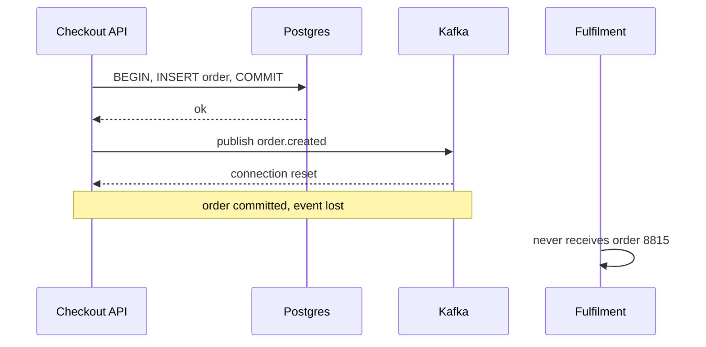
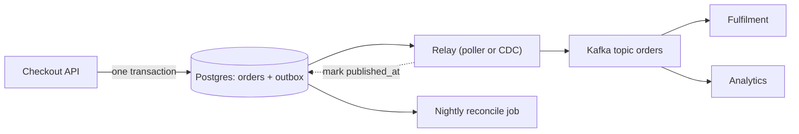

> **Scenario** - A checkout service writes the `orders` row to Postgres, then publishes `order.created` to Kafka. During a 40-second broker failover, 1,180 orders commit to the database but never publish. Fulfilment never hears about them. Two days later finance finds paid orders with no shipment, and nobody can tell which events were lost because the publish call had no durable record.

## Why it matters

- A database commit and a broker publish are two separate systems; there is no transaction that spans them, so every "save then publish" is a race with a guaranteed loss window.
- The inverse failure is worse: publish succeeds, transaction rolls back, and downstream services act on an order that does not exist.
- Recovery is manual and slow. Reconciling "rows without events" requires a bespoke script per entity, written under pressure.
- Retrying the publish inside the request path adds broker latency to user-facing p99 and still loses events when the process dies.
- Auditors and finance need a provable record of what was emitted and when - a fire-and-forget publish provides neither.

## Symptoms

| Signal | What you observe |
|---|---|
| Row/event count drift | `SELECT count(*) FROM orders` exceeds topic message count for the same window |
| Error logs | `KafkaJSConnectionError` or `AMQPConnectionClosed` immediately after a successful commit |
| Downstream gaps | Consumers process order 8814 and 8816 but never 8815 |
| Phantom events | Consumer receives an event whose entity ID returns 404 from the source service |
| Request latency | Checkout p99 tracks broker latency instead of database latency |
| Incident pattern | Loss correlates exactly with broker restarts, deploys, or network blips |

## How it breaks

The failure is a dual write. The service performs two independent writes with no coordination, and any crash or timeout between them leaves the system inconsistent. Even wrapping the publish in a try/catch does not help: the process can be SIGKILLed between `COMMIT` and `producer.send()`, and no amount of application-level retry survives that. Moving the publish *before* the commit just inverts the bug into phantom events.



## Root causes

1. Two writes to two systems with no shared transaction boundary.
2. Publish failures handled with a log line instead of durable retry state.
3. No idempotent producer or event ID, so naive retries create duplicates instead of fixing gaps.
4. Business logic assumes the event is a side effect of the commit rather than part of it.
5. No reconciliation job comparing source-of-truth rows against emitted events.

## How to solve it

### 1. Write the event into the same transaction

Add an `outbox` table in the same database and schema as the business data. The event becomes just another row in the commit.

```sql
CREATE TABLE outbox (
  id            BIGSERIAL PRIMARY KEY,
  aggregate     TEXT        NOT NULL,
  aggregate_id  TEXT        NOT NULL,
  event_type    TEXT        NOT NULL,
  payload       JSONB       NOT NULL,
  headers       JSONB       NOT NULL DEFAULT '{}'::jsonb,
  created_at    TIMESTAMPTZ NOT NULL DEFAULT now(),
  published_at  TIMESTAMPTZ
);

CREATE INDEX outbox_unpublished_idx
  ON outbox (id) WHERE published_at IS NULL;
```

The partial index keeps the relay scan cheap even when the table holds 50M historical rows.

### 2. Insert business row and event atomically

```php
DB::transaction(function () use ($cart) {
    $order = Order::create([
        'customer_id' => $cart->customerId,
        'total_cents' => $cart->totalCents,
        'status'      => 'created',
    ]);

    Outbox::create([
        'aggregate'    => 'order',
        'aggregate_id' => (string) $order->id,
        'event_type'   => 'order.created',
        'payload'      => $order->toEventPayload(),
        'headers'      => ['event_id' => (string) Str::uuid(), 'schema' => 'v2'],
    ]);
});
```

No broker call inside the transaction. Checkout latency stays at database speed.

### 3. Relay with a poller that claims rows

Use `FOR UPDATE SKIP LOCKED` so multiple relay instances can run without stepping on each other.

```ts
async function relayBatch(): Promise<number> {
  return db.transaction(async (tx) => {
    const rows = await tx.query(`
      SELECT id, event_type, aggregate_id, payload, headers
      FROM outbox
      WHERE published_at IS NULL
      ORDER BY id
      LIMIT 500
      FOR UPDATE SKIP LOCKED
    `)
    if (rows.length === 0) return 0

    await producer.sendBatch({
      topicMessages: [{
        topic: 'orders',
        messages: rows.map((r) => ({
          key: r.aggregate_id,
          value: JSON.stringify(r.payload),
          headers: { ...r.headers, 'x-outbox-id': String(r.id) },
        })),
      }],
    })

    await tx.query(
      `UPDATE outbox SET published_at = now() WHERE id = ANY($1)`,
      [rows.map((r) => r.id)],
    )
    return rows.length
  })
}
```

The relay is at-least-once: if the process dies after `sendBatch` but before the `UPDATE`, those events publish twice. That is correct and expected - consumers dedup on `event_id`.

### 4. Or let CDC do the relay

Debezium tailing the Postgres WAL removes the poller entirely and gives you sub-second latency without polling load.

```yaml
connector.class: io.debezium.connector.postgresql.PostgresConnector
plugin.name: pgoutput
table.include.list: public.outbox
transforms: outbox
transforms.outbox.type: io.debezium.transforms.outbox.EventRouter
transforms.outbox.route.by.field: aggregate
transforms.outbox.table.field.event.key: aggregate_id
```

Cost: another distributed system to operate, replication slot monitoring, and a hard rule that the slot must never fall behind or the WAL fills the disk.

### 5. Prune and reconcile

Delete published rows older than 7 days in batches. Run a daily reconciliation counting orders created versus `order.created` events emitted; alert on any nonzero drift.

## Target design



## Tradeoffs

| Option | Pros | Cons | Choose when |
|---|---|---|---|
| Direct publish after commit | Simplest, lowest latency | Guaranteed loss window | Non-critical telemetry only |
| Outbox + polling relay | No extra infra, easy to reason about | Polling load, 100ms–1s latency | Most services; the default |
| Outbox + CDC (Debezium) | Sub-second, no DB polling | Kafka Connect to operate, slot risk | High event volume, existing Connect cluster |
| Listen/notify trigger | Low latency, no poller | Notifications are lost if no listener | Single-instance relay, small scale |
| Two-phase commit (XA) | Truly atomic on paper | Blocking coordinator, poor broker support | Almost never |

## Verification checklist

- [ ] Kill the relay process mid-batch and confirm every unpublished row is picked up on restart with no gaps.
- [ ] Run two relay instances concurrently and confirm `SKIP LOCKED` prevents duplicate publishes beyond the expected crash window.
- [ ] Force a broker outage for 60 seconds; verify checkout latency and success rate are unchanged and the backlog drains afterwards.
- [ ] Confirm `outbox_unpublished_idx` is used: `EXPLAIN` should show an index scan, not a sequential scan.
- [ ] Check reconciliation output is zero drift for a 24-hour window.
- [ ] Verify every event carries a stable `event_id` and that consumers reject the second copy.

## Anti-patterns

- Publishing inside the transaction block "to keep it together" - the broker call is not transactional and holds locks open.
- Deleting outbox rows on publish instead of marking `published_at`, which destroys the audit trail and makes debugging impossible.
- A relay that scans the whole table because someone dropped the partial index.
- Treating the outbox as a queue with business logic in the relay; it is a transport, not a processor.
- Skipping consumer-side dedup because "the relay only sends once" - it does not.
- Letting the outbox table grow forever until autovacuum falls behind and the partial index bloats.

## Related

- [Saga compensation design that actually unwinds](/systems/messaging-async/saga-compensation-design)
- [Building idempotent consumers](/systems/messaging-async/idempotent-consumers)
- [The exactly-once delivery illusion](/systems/messaging-async/exactly-once-delivery-illusion)
