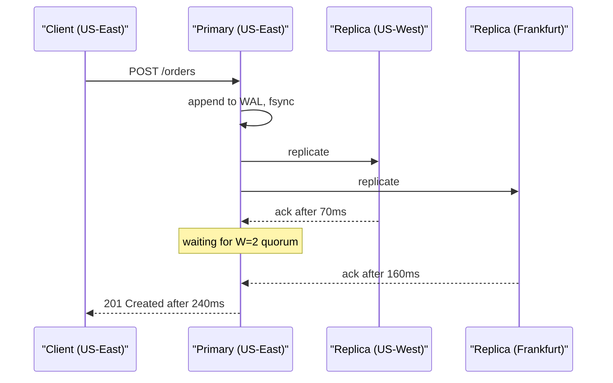
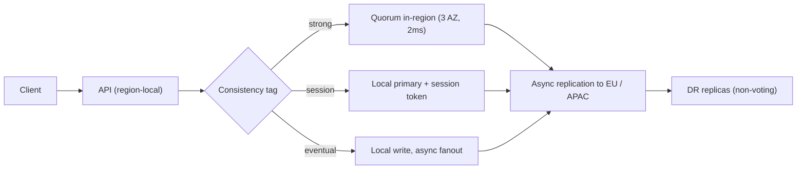

> **Scenario** — ops টিম order database তিন region-এর cluster-এ সরিয়ে `quorum` write চালু করার পর checkout p99 ১৮০ms থেকে ২.৪s-এ উঠল। কোনো node down নয়, database-এ কোনো alert নেই, পরিবর্তন শুধু "better durability"।

## Why it matters

- প্রতিটি synchronous cross-region write অন্তত এক round trip দেয়: US-East থেকে US-West ৭০ms, Frankfurt ১৬০ms, Singapore ২৪০ms। এই খরচ request path-এ, background-এ নয়।
- Database dashboard-এ এটা অদৃশ্য। Replication lag শূন্য — synchronous quorum-এর উদ্দেশ্যই তো এটাই — তাই পুরো খরচ application latency-তে গিয়ে পড়ে।
- Timeout budget সাধারণত single-region latency ধরে সেট করা থাকে। ৭০০ms quorum write-এর সামনে ৫০০ms upstream timeout মানে সুস্থ cluster-ও ১০০% error rate দেখাবে।
- CAP শুধু partition case-এর ভাষা দেয়, ফলে normal-operation tradeoff দুর্ঘটনাক্রমে হয় — Terraform variable-এ, durability optimize করতে চাওয়া কারো হাতে।

## Symptoms

| Signal | What you observe |
|---|---|
| Write p99 | baseline-এর ৮-১৫x, inter-region RTT-র গুণিতকের কাছে জমাট |
| Write p50 | প্রায় অপরিবর্তিত — শুধু দূরের replica ছোঁয়া request ধীর |
| Replication lag | ০ms-এ সমান, তাই storage টিম বলে cluster healthy |
| Error rate | API gateway থেকে upstream 504, database error নয় |
| Latency histogram | bimodal, দ্বিতীয় hump ঠিক `local + দ্বিতীয় নিকটতম region-এর RTT`-তে |
| Retries | client retry অবস্থা খারাপ করে, কারণ প্রতিটি retry একই quorum খরচ দেয় |

## How it breaks

PACELC, CAP-এর সাথে সেই অর্ধেকটা যোগ করে যা সাধারণ মঙ্গলবারে গুরুত্বপূর্ণ: **Partition হলে Availability বা Consistency বাছুন; Else, Latency বা Consistency বাছুন।** Single-region Postgres primary হলো PC/EC — দুই শাখাতেই consistent, কারণ সেখানে "network" মানে একটা rack। Replica set region ছাড়িয়ে গেলেই EC দামি হয়ে যায়: যথেষ্ট replica durably accept না করা পর্যন্ত write ack করতে পারে না, আর "যথেষ্ট"-এর মধ্যে এখন ৪,০০০km দূরের মেশিন আছে।

সূক্ষ্ম দিকটা হলো *কোন* replica latency ঠিক করছে। `N=3, W=2` তিন region-এ থাকলে US-East-এর write-কে US-West (৭০ms) বা Frankfurt (১৬০ms)-এ পৌঁছাতে হবে। observed latency হলো *দ্বিতীয় দ্রুততম* ack, তাই p50 নিকট replica অনুসরণ করে আর p99 দূরের — এখান থেকেই bimodal histogram। `W=3` করলে (বা চার region জুড়ে পাঁচ-node cluster-এ `majority`) প্রতিটি write সবচেয়ে ধীর link-এর দাম দেয়।



## Root causes

1. durability-র জন্য replica set region জুড়ে টানা হয়েছে, কিন্তু write latency budget আবার হিসাব করা হয়নি।
2. write concern per-operation নয়, cluster-wide `majority` — তাই idempotent audit log আর payment capture একই দাম দেয়।
3. upstream timeout budget কখনো বাড়ানো হয়নি, ফলে tail latency error rate হয়ে গেছে।
4. read-ও primary-তে pin করা, যেসব operation ২s staleness সহ্য করে তারাও cross-region latency দিচ্ছে।
5. migration-এর আগে `RTT * hops` কেউ মাপেনি; design review-তে CAP নিয়ে কথা হয়েছে, else-branch নিয়ে হয়নি।

## How to solve it

### 1. প্রতিটি write-কে consistency requirement অনুযায়ী ভাগ করুন

write concern-কে cluster-wide setting ভাবা বন্ধ করুন। Operation স্পষ্টভাবে tag করুন আর default রাখুন সস্তাটা।

```ts
type Consistency = 'strong' | 'session' | 'eventual'

const WRITE_CONCERN: Record<Consistency, { w: number | 'majority'; wtimeoutMS: number }> = {
  // Money movement, inventory decrements, idempotency-key claims.
  strong: { w: 'majority', wtimeoutMS: 2_000 },
  // User-visible edits that must survive read-your-writes for the same session.
  session: { w: 2, wtimeoutMS: 800 },
  // Audit logs, view counters, telemetry.
  eventual: { w: 1, wtimeoutMS: 200 },
}

export async function persist<T>(
  coll: Collection<T>,
  doc: T,
  consistency: Consistency = 'eventual',
) {
  return coll.insertOne(doc, { writeConcern: WRITE_CONCERN[consistency] })
}
```

আসল কাজ হলো call site audit করা। বেশিরভাগ codebase-এ ১০%-এরও কম write-এর সত্যিই cross-region majority দরকার।

### 2. Quorum একটি latency domain-এর ভেতরে রাখুন

ব্যবসার যদি strong consistency আর ২০০ms write দুটোই দরকার, তবে replica set ২৪০ms network জুড়ে থাকতে পারে না। Voting member একই region-এর তিন availability zone-এ (১-২ms দূরত্ব) রাখুন, দূরের region যোগ করুন non-voting বা async replica হিসেবে।

```yaml
# Voting quorum stays in us-east-1: AZ-level failure tolerance, ~2ms RTT.
members:
  - { host: db-use1-az1, priority: 10, votes: 1 }
  - { host: db-use1-az2, priority: 5,  votes: 1 }
  - { host: db-use1-az3, priority: 5,  votes: 1 }
  # Disaster recovery only: never blocks a write, never wins an election by itself.
  - { host: db-euc1-az1, priority: 0, votes: 0, hidden: true }
  - { host: db-apse1-az1, priority: 0, votes: 0, hidden: true }
```

এতে cross-region ক্ষেত্রে আপনি EL বেছেছেন আর region-এর ভেতরে EC — emergent নয়, স্পষ্ট সিদ্ধান্ত।

### 3. Staleness tolerance দিয়ে read route করুন

```ts
const readPreference = (maxStalenessSeconds: number | null) =>
  maxStalenessSeconds === null
    ? { mode: 'primary' as const }
    : { mode: 'nearest' as const, maxStalenessSeconds }

// Product catalogue: 90s of staleness is invisible to users, saves the RTT.
await catalogue.find(query, { readPreference: readPreference(90) })
// Balance check before a transfer: must not be stale.
await accounts.findOne({ id }, { readPreference: readPreference(null) })
```

### 4. Tradeoff-টা observable করুন

বেছে নেওয়া consistency level metric label হিসেবে emit করুন, histogram নিজেই ভাগ হয়ে যাবে:

```promql
histogram_quantile(0.99,
  sum by (le, consistency, region) (
    rate(db_write_duration_seconds_bucket[5m])
  )
)
```

`consistency="strong"` যদি write volume-এর ~১০%-এর বেশি হয়, তবে এটা tuning item নয়, design review item।

### 5. Timeout budget ভেতর থেকে বাইরে হিসাব করুন

প্রতিটি hop-এর timeout নিচের সব budget আর retry-র যোগফলের চেয়ে বড় হতে হবে। এক retry সহ ২,০০০ms quorum write-এর জন্য calling service-এর দরকার ≥৪,৫০০ms, gateway-এর আরও বেশি — নইলে timeout নয়, write concern-ই বাদ দিতে হবে।

## Target design



## Tradeoffs

| Option | Pros | Cons | Choose when |
|---|---|---|---|
| Cross-region synchronous quorum (EC) | পুরো region হারালেও শূন্য data loss | প্রতিটি write inter-region RTT দেয়; p99 সবচেয়ে ধীর link-এ বাঁধা | কম write rate-এ regulatory zero-RPO |
| In-region quorum + async DR (EL) | ২-৫ms write, AZ fault tolerance | পুরো region হারালে কয়েক সেকেন্ডের RPO | বেশিরভাগ product-এর default |
| Single primary, no quorum | সর্বনিম্ন latency, সহজ reasoning | node failure-এ data loss; read scaling নেই | internal tooling, পুনর্নির্মাণযোগ্য data |
| Per-operation write concern | খরচ শুধু যেখানে correctness দরকার | call-site discipline ও review লাগে | ছোট critical core সহ mixed workload |

## Verification checklist

- [ ] প্রতি জোড়া voting member-এর RTT `ping`/`mtr` দিয়ে রেকর্ড করা, আর p99 write budget দ্বিতীয় বৃহত্তম RTT-র চেয়ে বড়।
- [ ] `db_write_duration_seconds` histogram consistency level ও region দিয়ে labelled।
- [ ] write volume-এর ১০%-এর কম সবচেয়ে strong level ব্যবহার করে; সেই call site-গুলোর তালিকা review করা ও নামসহ আছে।
- [ ] প্রতিটি hop-এর timeout budget documented, প্রত্যেকটি তার নিচের যোগফলের চেয়ে বড়।
- [ ] Game-day test-এ একটি voting member সরিয়ে নিশ্চিত করা হয়েছে write একই p99-এ চলছে।
- [ ] ২x peak load test-এ `consistency="eventual"` traffic-এ bimodal hump নেই।

## Anti-patterns

- 504 থামা পর্যন্ত upstream timeout বাড়ানো — error rate-কে ৩s page-এ রূপান্তর করে কারণ লুকিয়ে ফেলা।
- quorum তিন মহাদেশে থাকা অবস্থায় "safety-র জন্য" cluster-wide `w: 'majority'` দেওয়া।
- দূরের region-এ read replica যোগ করে সব read primary-তেই pin রাখা।
- ০ms replication lag-কে সুস্থতার প্রমাণ ধরা, যখন খরচ request latency-তে সরে গেছে।
- quorum timeout আক্রমণাত্মকভাবে retry করা; প্রতিটি retry পুরো RTT আবার দেয় আর ধীর link-এ load বাড়ায়।

## Related

- [CAP theorem tradeoffs in real outages](/systems/distributed-systems/cap-theorem-tradeoffs)
- [Tuning quorum reads and writes](/systems/distributed-systems/quorum-read-write-tuning)
- [Designing UX for eventual consistency](/systems/distributed-systems/eventual-consistency-user-experience)
