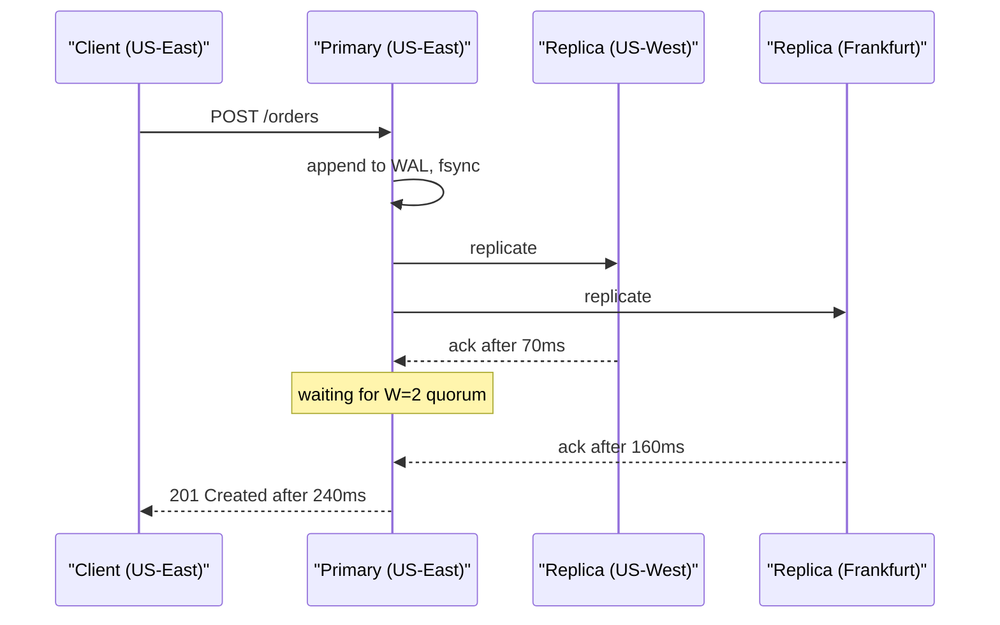
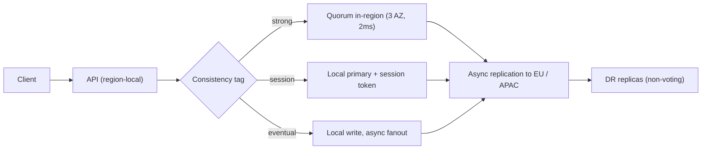

> **Scenario** - Checkout p99 jumps from 180ms to 2.4s after ops moves the order database to a three-region cluster with `quorum` writes. No node is down, no alert fired on the database, and the only change was "better durability".

## Why it matters

- Every synchronous cross-region write pays at least one round trip: 70ms US-East to US-West, 160ms to Frankfurt, 240ms to Singapore. That cost is paid on the request path, not in the background.
- The failure is invisible to database dashboards. Replication lag is zero - that is the *point* of a synchronous quorum - so the cost lands entirely in application latency.
- Timeout budgets are usually set for single-region latency. A 500ms upstream timeout in front of a 700ms quorum write turns a healthy cluster into a 100% error rate.
- CAP gives teams the vocabulary for the partition case only, so the normal-operation tradeoff gets made by accident, in a Terraform variable, by someone who was optimizing for durability.

## Symptoms

| Signal | What you observe |
|---|---|
| Write p99 | 8-15x baseline, tightly clustered around a multiple of inter-region RTT |
| Write p50 | Barely changed - only the requests that hit the far replica are slow |
| Replication lag | Flat at 0ms, so the storage team says the cluster is healthy |
| Error rate | Upstream 504s from the API gateway, not database errors |
| Latency histogram | Bimodal, with a second hump exactly at `local + RTT_to_second_nearest_region` |
| Retries | Client retries make it worse, because each retry pays the same quorum cost |

## How it breaks

PACELC extends CAP with the half that matters on a normal Tuesday: **if there is a Partition, choose Availability or Consistency; Else, choose Latency or Consistency.** A single-region Postgres primary is PC/EC - it is consistent in both branches, and it can be because "the network" is a rack. The moment the replica set spans regions, EC becomes expensive: the write cannot acknowledge until enough replicas have durably accepted it, and "enough" now includes a machine 4,000km away.

The subtle part is *which* replica sets the latency. With `N=3, W=2` across three regions, a write in US-East must reach either US-West (70ms) or Frankfurt (160ms). The observed latency is the *second-fastest* acknowledgement, so p50 tracks the near replica and p99 tracks the far one - that is where the bimodal histogram comes from. Push to `W=3` (or `majority` on a five-node cluster spanning four regions) and every write pays the slowest link.



## Root causes

1. The replica set was stretched across regions for durability without re-deriving the write latency budget.
2. Write concern was set to `majority` globally instead of per-operation, so idempotent audit logs pay the same price as payment captures.
3. Timeout budgets upstream were never widened, so the tail became an error rate instead of a slow page.
4. Reads were also pinned to the primary, adding cross-region latency to operations that tolerate 2s of staleness.
5. Nobody measured `RTT * hops` before the migration; the design review discussed CAP and never mentioned the else-branch.

## How to solve it

### 1. Classify every write by its consistency requirement

Stop treating write concern as a cluster-wide setting. Tag operations explicitly and make the default the cheap one.

```ts
type Consistency = 'strong' | 'session' | 'eventual'

const WRITE_CONCERN: Record<Consistency, { w: number | 'majority'; wtimeoutMS: number }> = {
  // Money movement, inventory decrements, idempotency-key claims.
  strong: { w: 'majority', wtimeoutMS: 2_000 },
  // User-visible edits that must survive read-your-writes for the same session.
  session: { w: 2, wtimeoutMS: 800 },
  // Audit logs, view counters, telemetry.
  eventual: { w: 1, wtimeoutMS: 200 },
}

export async function persist<T>(
  coll: Collection<T>,
  doc: T,
  consistency: Consistency = 'eventual',
) {
  return coll.insertOne(doc, { writeConcern: WRITE_CONCERN[consistency] })
}
```

Auditing the call sites is the real work. In most codebases fewer than 10% of writes genuinely need a cross-region majority.

### 2. Keep the quorum inside one latency domain

If the business needs strong consistency and 200ms writes, the replica set cannot span 240ms of network. Put the voting members in one region across three availability zones (1-2ms apart) and add far regions as non-voting or async replicas.

```yaml
# Voting quorum stays in us-east-1: AZ-level failure tolerance, ~2ms RTT.
members:
  - { host: db-use1-az1, priority: 10, votes: 1 }
  - { host: db-use1-az2, priority: 5,  votes: 1 }
  - { host: db-use1-az3, priority: 5,  votes: 1 }
  # Disaster recovery only: never blocks a write, never wins an election by itself.
  - { host: db-euc1-az1, priority: 0, votes: 0, hidden: true }
  - { host: db-apse1-az1, priority: 0, votes: 0, hidden: true }
```

You have now chosen EL for the cross-region case and EC within the region - an explicit decision instead of an emergent one.

### 3. Route reads by staleness tolerance

```ts
const readPreference = (maxStalenessSeconds: number | null) =>
  maxStalenessSeconds === null
    ? { mode: 'primary' as const }
    : { mode: 'nearest' as const, maxStalenessSeconds }

// Product catalogue: 90s of staleness is invisible to users, saves the RTT.
await catalogue.find(query, { readPreference: readPreference(90) })
// Balance check before a transfer: must not be stale.
await accounts.findOne({ id }, { readPreference: readPreference(null) })
```

### 4. Make the tradeoff observable

Emit the chosen consistency level as a metric label so the histogram splits itself:

```promql
histogram_quantile(0.99,
  sum by (le, consistency, region) (
    rate(db_write_duration_seconds_bucket[5m])
  )
)
```

If `consistency="strong"` is more than ~10% of write volume, that is a design review item, not a tuning item.

### 5. Widen timeout budgets from the inside out

Each hop's timeout must exceed the sum of downstream budgets plus retries. For a 2,000ms quorum write with one retry, the calling service needs ≥4,500ms and the gateway more than that - or you must reject the write concern, not the timeout.

## Target design



## Tradeoffs

| Option | Pros | Cons | Choose when |
|---|---|---|---|
| Cross-region synchronous quorum (EC) | Survives full region loss with zero data loss | Every write pays inter-region RTT; p99 tied to slowest link | Regulatory zero-RPO requirement on a low write rate |
| In-region quorum + async DR (EL across regions) | 2-5ms writes, AZ fault tolerance | RPO of seconds if the whole region is lost | Default for most products |
| Single primary, no quorum | Lowest latency, simplest reasoning | Data loss on node failure; no read scaling | Internal tooling, rebuildable data |
| Per-operation write concern | Pays the cost only where correctness needs it | Requires call-site discipline and review | Mixed workload with a small critical core |

## Verification checklist

- [ ] `ping`/`mtr` RTT recorded between every pair of voting members, and the p99 write budget is greater than the second-largest RTT.
- [ ] `db_write_duration_seconds` histogram is labelled by consistency level and region.
- [ ] Less than 10% of write volume uses the strongest level; the list of those call sites is reviewed and named.
- [ ] Timeout budget at each hop is documented and each is larger than the sum below it.
- [ ] A game-day test removes one voting member and confirms writes continue at the same p99.
- [ ] A load test at 2x peak confirms the bimodal hump is absent from `consistency="eventual"` traffic.

## Anti-patterns

- Raising every upstream timeout until the 504s stop - you have converted an error rate into 3s pages and hidden the cause.
- Setting `w: 'majority'` cluster-wide "for safety" while the quorum spans three continents.
- Adding read replicas in far regions and then pinning all reads to the primary anyway.
- Treating replication lag of 0ms as proof of health when the cost has moved into request latency.
- Retrying quorum timeouts aggressively; each retry re-pays the full RTT and adds load to the slow link.

## Related

- [CAP theorem tradeoffs in real outages](/systems/distributed-systems/cap-theorem-tradeoffs)
- [Tuning quorum reads and writes](/systems/distributed-systems/quorum-read-write-tuning)
- [Designing UX for eventual consistency](/systems/distributed-systems/eventual-consistency-user-experience)
