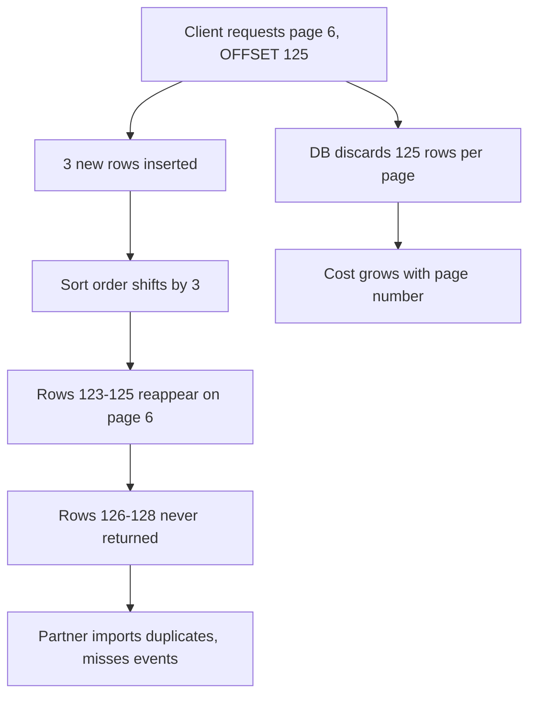
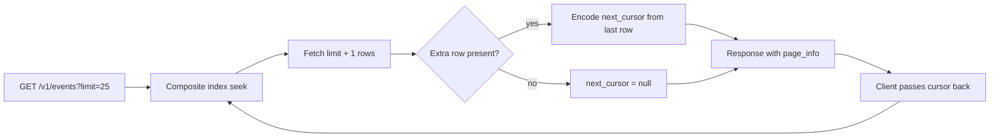

> **Scenario** — এক analytics partner প্রতি রাতে আপনার `/v1/events` export করে, পৃষ্ঠায় ২৫ row ধরে `?page=1` থেকে `?page=8000` পর্যন্ত হাঁটে। Page 1 ফেরে ৮ms-এ। Page 8000 লাগে ৪.২ সেকেন্ড, পুরো সময় একটি connection ধরে রাখে, আর export peak traffic-এর সাথে মিলে যায়। আরও খারাপ: হাঁটার সময় ঢোকা row প্রতিটি পরবর্তী page সরিয়ে দেয়, তাই partner একই সাথে event মিস করে ও duplicate import করে।

## Why it matters

- `LIMIT 25 OFFSET 200000` মানে database ২,০০,০০০ row পড়ে ফেলে দেয়। খরচ page number-এর সাথে রৈখিকভাবে বাড়ে।
- একটিমাত্র deep-paging client কম request volume দেখিয়েও connection pool ভরিয়ে ফেলতে পারে।
- পরিবর্তনশীল টেবিলে offset pagination শুধু ধীর নয়, *ভুল* — item বাদ পড়ে ও পুনরাবৃত্তি হয়।
- চুপচাপ row মিস করা export এমন reconciliation সমস্যা বানায় যা সপ্তাহ পরে কারও finance report-এ ধরা পড়ে।
- বড় টেবিলে total count নিজেই full scan, প্রায়ই page-এর চেয়ে দামি।

## Symptoms

| Signal | What you observe |
| --- | --- |
| Page-wise latency | `page`-এর সাথে p50 বাড়ে, `per_page`-এ সমতল |
| Query plan | `Seq Scan`-এর উপর `Sort`, তার উপর `Limit`; বড় `rows removed by offset` |
| Duplicate export | partner-এর row count আপনার চেয়ে বেশি; একই `event_id` দুইবার |
| Missing row | হাঁটার সময় তৈরি row কোনো page-এ আসে না |
| Count timeout | শুধু `SELECT count(*)` data query-র চেয়ে বেশি সময় নেয় |
| Connection hold | রাতের window-তে দীর্ঘ SELECT pool slot আটকে রাখে |

## How it breaks

`OFFSET` seek নয়, discard। ২,০০,০০১–২,০০,০২৫ row ফেরাতে database sorted order-এ প্রথম ২,০০,০০০ row তৈরি করে ফেলে দেয়। নিখুঁত index থাকলেও কাজ offset-এর সমানুপাতিক।

Drift আরও সূক্ষ্ম বাগ। নতুন row ঢোকার সময় `created_at DESC`-এ sort করা মানে প্রতিটি insert window এক ধাপ নিচে ঠেলে। Page 5 তারপর page 6 পড়া partner page 5-এর শেষ row আবার page 6-এর প্রথমে দেখে — আর boundary-র কাছের row পুরোপুরি বাদ পড়তে পারে।



## Root causes

1. `OFFSET` scan করে ফেলে দেয়, তাই খরচ গভীরতার সাথে বাড়ে।
2. Sort key unique নয়, তাই tie প্রতি query-তে যেকোনো ক্রমে আসে।
3. Client হাঁটার সময় result set বদলাতে থাকে।
4. প্রতিটি page request-এ বড় টেবিলে `count(*)` হিসাব হয়।
5. `per_page`-এ cap নেই, তাই client ১,০০,০০০ row চাইতে পারে।
6. Query-র দিক অনুযায়ী sort column-এ index নেই।

## How to solve it

### 1. Keyset (cursor) pagination ব্যবহার করুন

"২,০০,০০০ skip করো"-র বদলে বলুন "এই বিন্দুর পরের row দাও"। Sort key unique হতে হবে — timestamp-এর সাথে primary key tiebreaker হিসেবে জুড়ুন।

```sql
-- Composite index matching the exact sort order
CREATE INDEX events_tenant_created_id
    ON events (tenant_id, created_at DESC, id DESC);

-- First page
SELECT id, type, created_at, payload
FROM events
WHERE tenant_id = $1
ORDER BY created_at DESC, id DESC
LIMIT 26;   -- one extra row to detect has_more

-- Subsequent pages: row-value comparison, not OR chains
SELECT id, type, created_at, payload
FROM events
WHERE tenant_id = $1
  AND (created_at, id) < ($2, $3)
ORDER BY created_at DESC, id DESC
LIMIT 26;
```

Row-value রূপ `(created_at, id) < ($2, $3)`-ই Postgres-কে composite index একক seek হিসেবে ব্যবহার করতে দেয়। `created_at < $2 OR (created_at = $2 AND id < $3)` লিখলে প্রায়ই খারাপ plan হয়।

### 2. Cursor অস্বচ্ছ ও tamper-evident করুন

```php
<?php

namespace App\Http\Pagination;

use Illuminate\Support\Facades\Crypt;

final class Cursor
{
    public function __construct(
        public readonly string $createdAt,
        public readonly int $id,
        public readonly string $sort,
    ) {}

    public function encode(): string
    {
        return rtrim(strtr(base64_encode(Crypt::encryptString(json_encode([
            'c' => $this->createdAt,
            'i' => $this->id,
            's' => $this->sort,
        ]))), '+/', '-_'), '=');
    }

    public static function decode(string $token, string $expectedSort): self
    {
        $json = Crypt::decryptString(base64_decode(strtr($token, '-_', '+/')));
        $data = json_decode($json, true, flags: JSON_THROW_ON_ERROR);

        if (($data['s'] ?? null) !== $expectedSort) {
            throw new \InvalidArgumentException('cursor sort mismatch');
        }

        return new self($data['c'], (int) $data['i'], $data['s']);
    }
}
```

Cursor-এর ভেতরে sort order encode করলে সেই কুৎসিত কেস আটকায় যেখানে client `created_at`-এর cursor রেখে `sort=amount` বদলে দেয়।

### 3. Laravel controller

```php
public function index(Request $request): JsonResponse
{
    $limit = min(100, max(1, (int) $request->query('limit', 25)));
    $sort = $request->query('sort', 'created_at_desc');

    $query = Event::query()
        ->where('tenant_id', $request->user()->tenant_id)
        ->orderByDesc('created_at')
        ->orderByDesc('id')
        ->limit($limit + 1);

    if ($token = $request->query('cursor')) {
        $cursor = Cursor::decode($token, $sort);
        $query->whereRaw('(created_at, id) < (?, ?)', [$cursor->createdAt, $cursor->id]);
    }

    $rows = $query->get();
    $hasMore = $rows->count() > $limit;
    $page = $rows->take($limit);
    $last = $page->last();

    return response()->json([
        'data' => EventResource::collection($page),
        'page_info' => [
            'has_more'    => $hasMore,
            'next_cursor' => $hasMore && $last
                ? (new Cursor($last->created_at->toIso8601String(), $last->id, $sort))->encode()
                : null,
        ],
    ]);
}
```

`limit + 1` row আনাই দ্বিতীয় count query ছাড়া পরবর্তী page আছে কিনা জানার উপায়।

### 4. Client side type করুন

```ts
type Page<T> = { data: T[]; page_info: { has_more: boolean; next_cursor: string | null } }

export async function* paginate<T>(
  path: string,
  limit = 100,
): AsyncGenerator<T, void, undefined> {
  let cursor: string | null = null

  do {
    const url = new URL(path, location.origin)
    url.searchParams.set('limit', String(limit))
    if (cursor) url.searchParams.set('cursor', cursor)

    const res = await fetch(url)
    if (!res.ok) throw new Error(`pagination failed: HTTP ${res.status}`)

    const page = (await res.json()) as Page<T>
    yield* page.data
    cursor = page.page_info.next_cursor
  } while (cursor)
}
```

### 5. নিখুঁত total ফেরানো বন্ধ করুন

Default-এ `has_more` দিন। UI-র সত্যিই count লাগলে unfiltered view-তে `pg_class.reltuples` থেকে estimate দিন, অথবা filtered set ছোট হলে (subquery-তে ১,০০০-এ capped `count(*)`) কেবল তখনই নিখুঁত গণনা করুন।

## Target design



## Tradeoffs

| Option | Pros | Cons | Choose when |
| --- | --- | --- | --- |
| Offset/limit | random page access, বানানো সহজ | O(offset) খরচ, write-এ drift | ছোট, স্থির টেবিল ও admin UI |
| Keyset cursor | ধ্রুব খরচ, insert-এ স্থিতিশীল | page 400-এ লাফ দেওয়া যায় না, unique sort দরকার | feed, export, বড় টেবিল |
| Snapshot cursor (txid) | সম্পূর্ণ consistent view | snapshot ধরে রাখে, টেবিল bloat | consistency দরকার এমন ছোট export |
| Time-window chunk | সরল, resumable, parallel | অসম page size | analytics backfill |
| ID range seek | সবচেয়ে সস্তা | কেবল monotonic ID-তে চলে | internal batch job |

## Verification checklist

- [ ] Page 1 ও page 4,000-এর p99 তুলনা করুন; পার্থক্য ২০%-এর নিচে থাকা উচিত।
- [ ] Cursor query-তে `EXPLAIN ANALYZE` চালিয়ে `Sort` node ছাড়া `Index Scan` নিশ্চিত করুন।
- [ ] হাঁটার মাঝপথে ৫০০ row insert করে দেখুন client কোনো duplicate ID পায় না।
- [ ] `limit=100000` নথিভুক্ত সর্বোচ্চে clamp হচ্ছে — assert করুন।
- [ ] ভিন্ন sort order-এর cursor দিয়ে দেখুন `400` আসে, নীরব ভুল data নয়।
- [ ] পুরো export-এর মোট query time row count-এ রৈখিক, quadratic নয় — যাচাই করুন।

## Anti-patterns

- Read replica যোগ করে ধীর deep page "ঠিক" করা — full scan সরালেন, সরালেন না।
- শুধু `created_at`-এর মতো non-unique column-এ sort, ফলে tie প্রতি request-এ ক্রম বদলায়।
- কাঁচা `id` বা `offset` cursor হিসেবে প্রকাশ করা, যাতে client অনাকাঙ্ক্ষিত cursor বানাতে পারে।
- চার কোটি row-এর টেবিলে প্রতি page-এ `total_count` ফেরানো।
- "partner চেয়েছে" বলে `per_page=10000` অনুমতি দেওয়া।
- Filter বদলায়নি তা যাচাই না করে *অনুরোধ করা* filter থেকে cursor বানানো।

## Related

- [Rate limiting algorithms and fair quotas](/systems/api-integration/rate-limiting-algorithms)
- [Bulk endpoints and partial failure semantics](/systems/api-integration/bulk-endpoints-partial-failure)
- [API versioning without breaking callers](/systems/api-integration/api-versioning-without-breakage)
