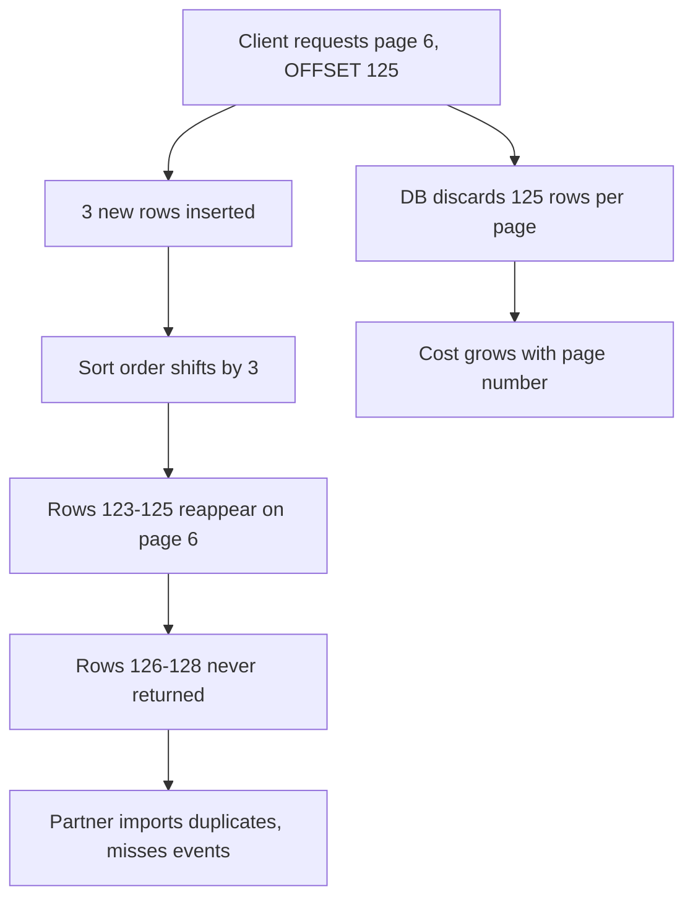
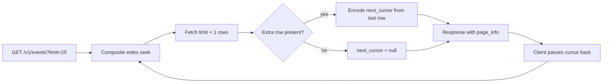

> **Scenario** - An analytics partner exports your `/v1/events` endpoint nightly, walking `?page=1` through `?page=8000` at 25 rows per page. Page 1 returns in 8ms. Page 8000 takes 4.2 seconds, holds a connection the whole time, and the export overlaps with peak traffic. Worse, rows inserted during the walk shift every subsequent page, so the partner both misses events and imports duplicates.

## Why it matters

- `LIMIT 25 OFFSET 200000` makes the database read and discard 200,000 rows. Cost grows linearly with page number.
- A single deep-paging client can saturate your connection pool while looking like low request volume.
- Offset pagination over a mutating table is *incorrect*, not just slow - items are skipped and repeated.
- Exports that silently miss rows produce reconciliation problems that surface weeks later in someone's finance report.
- Total counts on large tables are their own full scan, often more expensive than the page itself.

## Symptoms

| Signal | What you observe |
| --- | --- |
| Latency by page | p50 rises monotonically with `page`, flat with `per_page` |
| Query plan | `Limit` above a `Sort` above a `Seq Scan`, with `rows removed by offset` large |
| Duplicate exports | Partner's row count exceeds yours; same `event_id` twice |
| Missing rows | Rows created during the walk never appear in any page |
| Count timeouts | `SELECT count(*)` alone takes longer than the data query |
| Connection hold | Long-running SELECTs pin pool slots during the nightly window |

## How it breaks

`OFFSET` is not a seek; it is a discard. To return rows 200,001–200,025 the database must produce and throw away the first 200,000 rows in sorted order. Even with a perfect index, the work is proportional to the offset.

Drift is the subtler bug. Sorting by `created_at DESC` while new rows arrive means every insert pushes the window down by one. A partner reading page 5, then page 6, sees the last row of page 5 again as the first row of page 6 - and rows near the boundary can be skipped entirely.



## Root causes

1. `OFFSET` scans and discards, so cost scales with depth.
2. The sort key is not unique, so ties order arbitrarily between queries.
3. The result set mutates while the client walks it.
4. `count(*)` on a large table is computed on every page request.
5. There is no cap on `per_page`, so a client can ask for 100,000 rows.
6. The sort column is not indexed in the direction being queried.

## How to solve it

### 1. Use keyset (cursor) pagination

Instead of "skip 200,000", say "give me rows after this exact point". The sort key must be unique - pair a timestamp with the primary key as a tiebreaker.

```sql
-- Composite index matching the exact sort order
CREATE INDEX events_tenant_created_id
    ON events (tenant_id, created_at DESC, id DESC);

-- First page
SELECT id, type, created_at, payload
FROM events
WHERE tenant_id = $1
ORDER BY created_at DESC, id DESC
LIMIT 26;   -- one extra row to detect has_more

-- Subsequent pages: row-value comparison, not OR chains
SELECT id, type, created_at, payload
FROM events
WHERE tenant_id = $1
  AND (created_at, id) < ($2, $3)
ORDER BY created_at DESC, id DESC
LIMIT 26;
```

The row-value form `(created_at, id) < ($2, $3)` is what lets Postgres use the composite index as a single seek. Writing it as `created_at < $2 OR (created_at = $2 AND id < $3)` often produces a worse plan.

### 2. Make the cursor opaque and tamper-evident

```php
<?php

namespace App\Http\Pagination;

use Illuminate\Support\Facades\Crypt;

final class Cursor
{
    public function __construct(
        public readonly string $createdAt,
        public readonly int $id,
        public readonly string $sort,
    ) {}

    public function encode(): string
    {
        return rtrim(strtr(base64_encode(Crypt::encryptString(json_encode([
            'c' => $this->createdAt,
            'i' => $this->id,
            's' => $this->sort,
        ]))), '+/', '-_'), '=');
    }

    public static function decode(string $token, string $expectedSort): self
    {
        $json = Crypt::decryptString(base64_decode(strtr($token, '-_', '+/')));
        $data = json_decode($json, true, flags: JSON_THROW_ON_ERROR);

        if (($data['s'] ?? null) !== $expectedSort) {
            throw new \InvalidArgumentException('cursor sort mismatch');
        }

        return new self($data['c'], (int) $data['i'], $data['s']);
    }
}
```

Encoding the sort order inside the cursor prevents the ugly case where a client changes `sort=amount` while reusing a cursor built for `created_at`.

### 3. The Laravel controller

```php
public function index(Request $request): JsonResponse
{
    $limit = min(100, max(1, (int) $request->query('limit', 25)));
    $sort = $request->query('sort', 'created_at_desc');

    $query = Event::query()
        ->where('tenant_id', $request->user()->tenant_id)
        ->orderByDesc('created_at')
        ->orderByDesc('id')
        ->limit($limit + 1);

    if ($token = $request->query('cursor')) {
        $cursor = Cursor::decode($token, $sort);
        $query->whereRaw('(created_at, id) < (?, ?)', [$cursor->createdAt, $cursor->id]);
    }

    $rows = $query->get();
    $hasMore = $rows->count() > $limit;
    $page = $rows->take($limit);
    $last = $page->last();

    return response()->json([
        'data' => EventResource::collection($page),
        'page_info' => [
            'has_more'    => $hasMore,
            'next_cursor' => $hasMore && $last
                ? (new Cursor($last->created_at->toIso8601String(), $last->id, $sort))->encode()
                : null,
        ],
    ]);
}
```

Fetching `limit + 1` rows is how you know whether a next page exists without running a second count query.

### 4. Type the client side

```ts
type Page<T> = { data: T[]; page_info: { has_more: boolean; next_cursor: string | null } }

export async function* paginate<T>(
  path: string,
  limit = 100,
): AsyncGenerator<T, void, undefined> {
  let cursor: string | null = null

  do {
    const url = new URL(path, location.origin)
    url.searchParams.set('limit', String(limit))
    if (cursor) url.searchParams.set('cursor', cursor)

    const res = await fetch(url)
    if (!res.ok) throw new Error(`pagination failed: HTTP ${res.status}`)

    const page = (await res.json()) as Page<T>
    yield* page.data
    cursor = page.page_info.next_cursor
  } while (cursor)
}
```

### 5. Stop returning exact totals

Offer `has_more` by default. If the UI genuinely needs a count, return an estimate from `pg_class.reltuples` for unfiltered views, or compute an exact count only when the filtered set is small (`count(*)` over a subquery capped at 1,000).

## Target design



## Tradeoffs

| Option | Pros | Cons | Choose when |
| --- | --- | --- | --- |
| Offset/limit | Random page access, trivial to build | O(offset) cost, drifts under writes | Small, static tables and admin UIs |
| Keyset cursor | Constant cost, stable under inserts | No jump to page 400, needs unique sort | Feeds, exports, large tables |
| Snapshot cursor (txid) | Fully consistent view | Holds a snapshot, bloats the table | Short exports needing consistency |
| Time-window chunks | Simple, resumable, parallelisable | Uneven page sizes | Analytics backfills |
| Seek by ID range | Cheapest possible | Only works for monotonic IDs | Internal batch jobs |

## Verification checklist

- [ ] Compare p99 for page 1 and page 4,000; the difference should be under 20%.
- [ ] `EXPLAIN ANALYZE` the cursor query and confirm an `Index Scan` with no `Sort` node.
- [ ] Insert 500 rows mid-walk and confirm the client sees no duplicate IDs.
- [ ] Assert `limit=100000` is clamped to the documented maximum.
- [ ] Feed a cursor from a different sort order and confirm a `400`, not silent wrong data.
- [ ] Verify total query time for a full export is roughly linear in row count, not quadratic.

## Anti-patterns

- Fixing slow deep pages by adding a read replica - you moved the full scan, you did not remove it.
- Sorting by a non-unique column such as `created_at` alone, so ties reorder between requests.
- Exposing raw `id` or `offset` as the cursor, which lets clients construct cursors you never intended.
- Returning `total_count` on every page of a 40-million-row table.
- Allowing `per_page=10000` because "the partner asked for it".
- Building the cursor from the *requested* filter rather than validating the filter has not changed.

## Related

- [Rate limiting algorithms and fair quotas](/systems/api-integration/rate-limiting-algorithms)
- [Bulk endpoints and partial failure semantics](/systems/api-integration/bulk-endpoints-partial-failure)
- [API versioning without breaking callers](/systems/api-integration/api-versioning-without-breakage)
