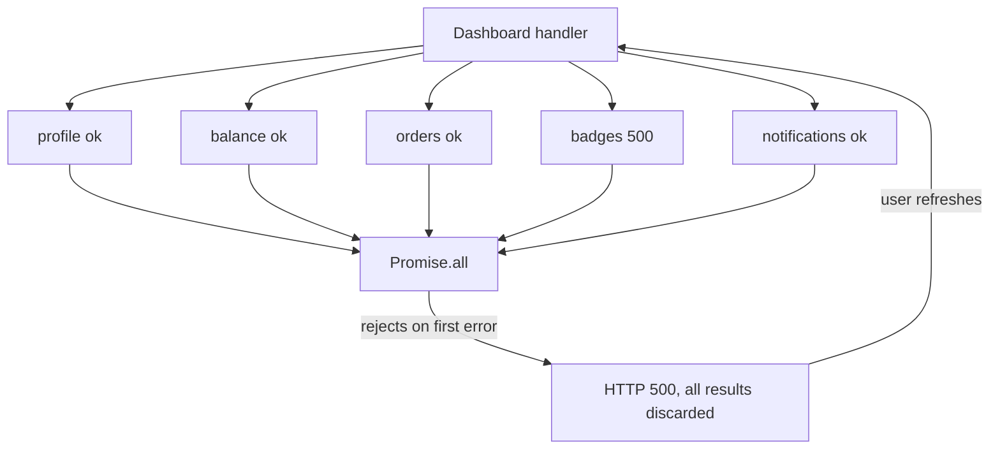
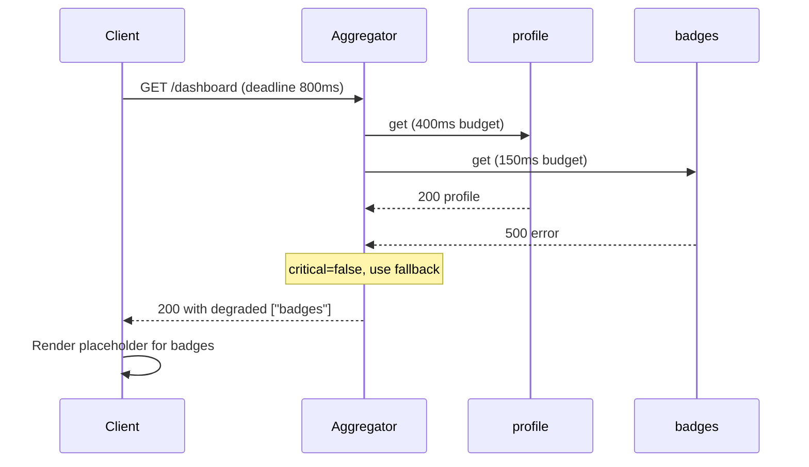

> **Scenario** — Dashboard endpoint ৯টা service-এ fan out করে: profile, balance, orders, notifications, badges, fx-rates, feature-flags, audit, search-suggest। `badges` 500 দিতে শুরু করে। `Promise.all` reject করে, handler 500 ফেরায়, আর একটা gamification widget-এর কারণে প্রত্যেক user খালি dashboard দেখে।

## Why it matters

- Distributed system-এ partial failure স্বাভাবিক অবস্থা। যে design শুধু total success বা total failure সামলায়, সেটা বেশিরভাগ সময়ই ভুল।
- `Promise.all` semantics মানে *সবচেয়ে খারাপ* dependency response ঠিক করে। ৯টা dependency ৯৯.৯% হলে endpoint সর্বোচ্চ ৯৯.১%।
- Blast radius উল্টো: সবচেয়ে কম গুরুত্বপূর্ণ service-এর হাতে সবচেয়ে বেশি ক্ষমতা।
- Aggregate timeout জমা হয়। ৯টা sequential call প্রতিটি ৩০০ms মানে render-এর আগেই ২.৭ সেকেন্ড।
- Debug কঠিন, কারণ দেখা যায় aggregator-এর 500, ভেতরের `badges` 500 নয়।

## Symptoms

| Signal | What you observe |
|---|---|
| Error rate | Aggregator 5xx সব dependency error rate-এর *যোগফল* অনুসরণ করে |
| Trace waterfall | একটা লাল child span; ৮টা সবুজ থাকা সত্ত্বেও parent failed |
| Latency | Endpoint p99 = সবচেয়ে ধীর dependency-র p99, median নয় |
| Logs | একটা error নিয়ে `Promise.all` rejection, বাকি ৮ result চুপচাপ ফেলে দেওয়া |
| Client behaviour | Full-page error; user refresh করে, fan-out বহুগুণ হয় |
| Cost | প্রতিটি failed request-এ আটটা সফল, billed, পরিত্যক্ত downstream call |

## How it breaks

All-or-nothing aggregation-সহ fan-out availability-কে multiplicative বানায়। আরও সূক্ষ্ম সমস্যা হলো *পরিত্যক্ত কাজ*: `Promise.all` reject করলে আটটা সফল response ফেলে দেওয়া হয়, তাই retry নয়টাই আবার আনে। টানা `badges` failure-এ aggregator ৯ গুণ কাজ করে ০ গুণ ফলাফলের জন্য, আর সেই বাড়তি load দ্বিতীয় একটা dependency-কে limit ছাড়ায়। এখন দুইটা fail করছে, aggregator তবু ঠিক একটাই error দেয়।



## Root causes

1. যেখানে `Promise.allSettled` semantics দরকার, সেখানে `Promise.all` ব্যবহার।
2. Per-dependency criticality নেই, তাই optional widget আর account balance একই মর্যাদা পায়।
3. API schema-তে partial-response contract নেই — client "orders unavailable" বোঝানোর উপায় পায় না।
4. Hard deadline-সহ parallel fan-out না করে shared timeout budget sequentially খরচ।
5. Aggregator-level retry শুধু failed নয়, *সব* call আবার পাঠায়।
6. Observability শুধু endpoint level-এ, per-dependency success rate অদৃশ্য।

## How to solve it

### 1. Settle করুন, failure-এ দৌড়াবেন না

```ts
type SectionResult<T> =
  | { status: 'ok'; data: T }
  | { status: 'unavailable'; reason: string }

async function section<T>(
  name: string,
  critical: boolean,
  timeoutMs: number,
  fn: (signal: AbortSignal) => Promise<T>,
): Promise<SectionResult<T>> {
  const ac = new AbortController()
  const t = setTimeout(() => ac.abort(), timeoutMs)
  try {
    return { status: 'ok', data: await fn(ac.signal) }
  } catch (e) {
    metrics.increment('section.failed', { name })
    if (critical) throw e
    return { status: 'unavailable', reason: (e as Error).name }
  } finally {
    clearTimeout(t)
  }
}

const [profile, balance, orders, badges] = await Promise.all([
  section('profile', true, 400, getProfile),
  section('balance', true, 400, getBalance),
  section('orders', false, 300, getOrders),
  section('badges', false, 150, getBadges),
])
```

বাইরের `Promise.all` এখন নিরাপদ: প্রতিটি `section` শুধু *critical* dependency-র জন্য reject করে।

### 2. Partial success-কে contract-এর অংশ বানান

Response schema-কে "এই অংশ নেই" বলতে পারতে হবে, যাতে client অনুমান না করে placeholder দেখায়।

```ts
type DashboardResponse = {
  sections: {
    profile: SectionResult<Profile>
    balance: SectionResult<Money>
    orders: SectionResult<Order[]>
    badges: SectionResult<Badge[]>
  }
  degraded: string[] // ['badges'] — logging ও UI banner-এর জন্য
}
```

`degraded: ['badges']`-সহ HTTP 200 দিন। এখানে 200 সৎ: request সফল, কিছু content unavailable। API convention-এ transport level-এ signal দরকার হলে 207 বা `Warning` header ব্যবহার করুন।

### 3. এক deadline-এর নিচে parallel fan-out

```python
import asyncio

async def build_dashboard(user_id: str, budget_ms: int = 800):
    async def guarded(name, coro, timeout_ms, critical):
        try:
            return name, await asyncio.wait_for(coro, timeout_ms / 1000)
        except Exception:
            if critical:
                raise
            return name, None

    tasks = [
        guarded("profile", get_profile(user_id), 400, True),
        guarded("balance", get_balance(user_id), 400, True),
        guarded("orders", get_orders(user_id), 300, False),
        guarded("badges", get_badges(user_id), 150, False),
    ]
    done = await asyncio.wait_for(asyncio.gather(*tasks), budget_ms / 1000)
    return {name: value for name, value in done}
```

### 4. শুধু যা fail করেছে, budget-সহ retry করুন

সফল result রেখে দিন, শুধু failed section আবার পাঠান — সর্বোচ্চ একবার, এবং বাকি deadline অনুমতি দিলে। একই request-এর ভেতর timeout retry করবেন না, যদি বাকি budget timeout-এর অন্তত দুই গুণ না হয়।

### 5. প্রতি section-এ last-good cache

যেখানে কিছুটা stale চলে (badges, suggestion), সেখানে `as_of` timestamp-সহ শেষ সফল payload দিন। যেখানে stale বিপজ্জনক (balance), সেখানে মিথ্যা বলার চেয়ে section fail করুন।

### 6. Per-dependency instrumentation

`section.latency{name}` ও `section.failed{name}` emit করুন যাতে dashboard দেখায় নয়টার মধ্যে *কোনটা* অসুস্থ। ২০ মিনিটের triage ৩০ সেকেন্ডে নামে।

## Target design



## Tradeoffs

| Option | Pros | Cons | Choose when |
|---|---|---|---|
| All-or-nothing (`Promise.all`) | সহজ; response সবসময় পূর্ণ | Availability গুণে কমে; কাজ অপচয় | সব section সত্যিই critical হলে |
| Settle + per-section status | উঁচু availability; সৎ contract | Client-কে প্রতিটি state সামলাতে হয় | Composite read endpoint |
| Per-section last-good cache | Page সবসময় পূর্ণ দেখায় | Stale ঝুঁকি; `as_of` দেখাতে হয় | Read-mostly, non-financial section |
| Streaming response | First paint দ্রুত | Client জটিল; caching কঠিন | অনেক স্বাধীন section, কিছু ধীর |
| Client-side fan-out | Aggregator সরল থাকে | N round trip; auth বারবার | কম section, ভালো client network |

## Verification checklist

- [ ] Staging-এ প্রতিটি dependency আলাদা করে মেরে দেখুন; সব non-critical-এর জন্য endpoint 200 দেয়।
- [ ] এক dependency-তে ৫s latency যোগ করুন (`tc qdisc add dev eth0 root netem delay 5000ms`); endpoint তবু ৮০০ms budget-এর ভেতর উত্তর দেয়।
- [ ] `degraded` array log-এ আছে ও queryable, যাতে per-section degraded response গোনা যায়।
- [ ] নয়টা dependency-র সবার per-section success rate panel আছে।
- [ ] এক failure-এ সফল sibling result ফেলে দেয় এমন কোনো path নেই — unit test দিয়ে যাচাই।
- [ ] প্রতিটি optional section-এর জন্য client UI-তে render করা, reviewed placeholder state আছে।
- [ ] Critical path-এর section timeout-এর যোগফল endpoint budget-এর চেয়ে কম।

## Anti-patterns

- সব catch করে empty object ফেরানো, ফলে client "no orders" আর "orders service down" আলাদা করতে পারে না।
- শুধু optional section fail করলেও 500 দেওয়া, তারপর তাতে alert দিয়ে ভুল team-কে page করা।
- নয়টা dependency-র উপর loop-এ sequential `await`, parallel কাজকে additive latency বানানো।
- যেকোনো failure-এ পুরো fan-out retry করা।
- HTTP 206 বা custom status code ব্যবহার, যা intermediary ও client ভুলভাবে সামলায়।
- `name` label ছাড়া একটামাত্র `dependency_errors` counter, যা triage-কে অনুমান বানায়।

## Related

- [Graceful degradation by design](/systems/reliability-edge-cases/graceful-degradation-design)
- [Running chaos experiments safely](/systems/reliability-edge-cases/chaos-experiments-safely)
- [Load shedding and admission control](/systems/reliability-edge-cases/load-shedding-and-admission-control)
- [Circuit breaker cascades across services](/systems/api-integration/circuit-breaker-cascades)
