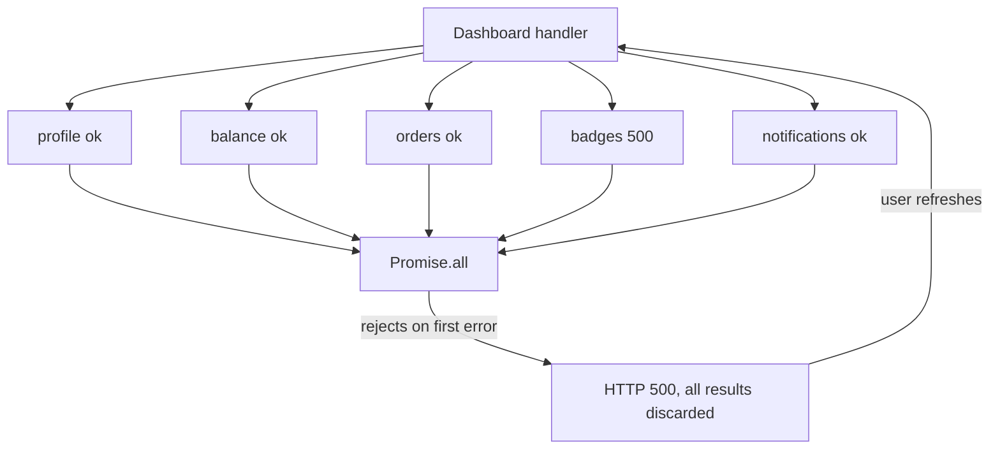
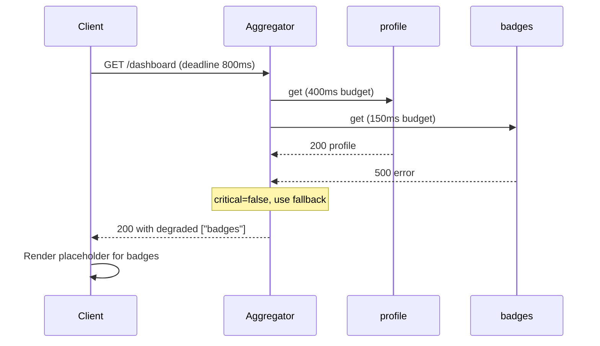

> **Scenario** — The dashboard endpoint fans out to 9 services: profile, balance, orders, notifications, badges, fx-rates, feature-flags, audit, and search-suggest. `badges` starts returning 500s. `Promise.all` rejects, the handler returns 500, and every user sees an empty dashboard because of a gamification widget.

## Why it matters

- Partial failure is the normal state of a distributed system. A design that only handles total success or total failure is wrong most of the time.
- `Promise.all` semantics mean the *worst* dependency determines the response. With 9 dependencies at 99.9%, the endpoint is 99.1% at best.
- The blast radius is inverted: the least important service has the most power.
- Aggregate timeouts compound. Nine sequential calls at 300ms each is 2.7 seconds before anything renders.
- Debugging is hard because the error surfaced is the aggregator's 500, not the underlying `badges` 500.

## Symptoms

| Signal | What you observe |
|---|---|
| Error rate | Aggregator 5xx tracks the *sum* of all dependency error rates |
| Trace waterfall | One red child span; parent marked failed despite 8 green children |
| Latency | Endpoint p99 equals the slowest dependency's p99, not the median |
| Logs | `Promise.all` rejection with a single error, other 8 results discarded silently |
| Client behaviour | Full-page error states; users hit refresh, multiplying the fan-out |
| Cost | Eight successful, billed, discarded downstream calls per failed request |

## How it breaks

Fan-out with all-or-nothing aggregation makes availability multiplicative. The subtler problem is *discarded work*: when `Promise.all` rejects, the eight successful responses are thrown away, so the retry re-fetches all nine. Under a sustained `badges` failure, the aggregator does 9x the work for 0x the results, and the extra load pushes a second dependency over its limit. Now two are failing, and the aggregator still returns exactly one error.



## Root causes

1. `Promise.all` (or equivalent) used where `Promise.allSettled` semantics are required.
2. No per-dependency criticality, so optional widgets are treated like the account balance.
3. No partial-response contract in the API schema — the client has no way to represent "orders unavailable".
4. Shared timeout budget consumed sequentially instead of a parallel fan-out with a hard deadline.
5. Retries at the aggregator level re-issue *all* calls instead of only the failed ones.
6. Observability at the endpoint level only, so per-dependency success rates are invisible.

## How to solve it

### 1. Settle, do not race to failure

```ts
type SectionResult<T> =
  | { status: 'ok'; data: T }
  | { status: 'unavailable'; reason: string }

async function section<T>(
  name: string,
  critical: boolean,
  timeoutMs: number,
  fn: (signal: AbortSignal) => Promise<T>,
): Promise<SectionResult<T>> {
  const ac = new AbortController()
  const t = setTimeout(() => ac.abort(), timeoutMs)
  try {
    return { status: 'ok', data: await fn(ac.signal) }
  } catch (e) {
    metrics.increment('section.failed', { name })
    if (critical) throw e
    return { status: 'unavailable', reason: (e as Error).name }
  } finally {
    clearTimeout(t)
  }
}

const [profile, balance, orders, badges] = await Promise.all([
  section('profile', true, 400, getProfile),
  section('balance', true, 400, getBalance),
  section('orders', false, 300, getOrders),
  section('badges', false, 150, getBadges),
])
```

The outer `Promise.all` is now safe: each `section` only rejects for a *critical* dependency.

### 2. Make partial success part of the contract

The response schema must be able to say "this part is missing" so clients render a placeholder instead of guessing.

```ts
type DashboardResponse = {
  sections: {
    profile: SectionResult<Profile>
    balance: SectionResult<Money>
    orders: SectionResult<Order[]>
    badges: SectionResult<Badge[]>
  }
  degraded: string[] // ['badges'] — for logging and UI banner
}
```

Return HTTP 200 with `degraded: ['badges']`. A 200 is honest here: the request succeeded, some content is unavailable. Use 207 or a `Warning` header if your API conventions require signalling it at the transport level.

### 3. Fan out in parallel under one deadline

```python
import asyncio

async def build_dashboard(user_id: str, budget_ms: int = 800):
    async def guarded(name, coro, timeout_ms, critical):
        try:
            return name, await asyncio.wait_for(coro, timeout_ms / 1000)
        except Exception:
            if critical:
                raise
            return name, None

    tasks = [
        guarded("profile", get_profile(user_id), 400, True),
        guarded("balance", get_balance(user_id), 400, True),
        guarded("orders", get_orders(user_id), 300, False),
        guarded("badges", get_badges(user_id), 150, False),
    ]
    done = await asyncio.wait_for(asyncio.gather(*tasks), budget_ms / 1000)
    return {name: value for name, value in done}
```

### 4. Retry only what failed, with a budget

Keep the successful results and re-issue only the failed sections, at most once, and only if the remaining deadline allows it. Never retry a timeout inside the same request unless the remaining budget is at least twice the timeout.

### 5. Cache last-good per section

For sections where slightly stale is acceptable (badges, suggestions), serve the last successful payload with an `as_of` timestamp. For sections where stale is dangerous (balance), fail the section rather than lie.

### 6. Instrument per dependency

Emit `section.latency{name}` and `section.failed{name}` so the dashboard shows *which* of the nine is sick. This turns a 20-minute triage into a 30-second one.

## Target design



## Tradeoffs

| Option | Pros | Cons | Choose when |
|---|---|---|---|
| All-or-nothing (`Promise.all`) | Simple; response is always complete | Availability multiplies down; wasted work | All sections are genuinely critical |
| Settle + per-section status | High availability; honest contract | Client must handle every section state | Composite read endpoints |
| Cached last-good per section | Page always looks complete | Stale data risk; needs `as_of` display | Read-mostly, non-financial sections |
| Streaming response | First paint is fast | Complex client; harder caching | Many independent sections, slow ones |
| Client-side fan-out | Aggregator stays trivial | N round trips; auth repeated | Few sections, good client network |

## Verification checklist

- [ ] Kill each dependency individually in staging; endpoint returns 200 for all non-critical ones.
- [ ] Add 5s of latency to one dependency (`tc qdisc add dev eth0 root netem delay 5000ms`); endpoint still answers inside its 800ms budget.
- [ ] `degraded` array appears in logs and is queryable, so you can count degraded responses per section.
- [ ] Per-section success rate panels exist for all 9 dependencies.
- [ ] No code path discards successful sibling results on a single failure — verified by unit test.
- [ ] Client UI has a rendered, reviewed placeholder state for every optional section.
- [ ] Sum of section timeouts on the critical path is less than the endpoint budget.

## Anti-patterns

- Catching everything and returning empty objects, so the client cannot distinguish "no orders" from "orders service down".
- Returning 500 when only optional sections failed, then alerting on it and paging the wrong team.
- Sequential `await` in a loop over nine dependencies, turning parallel work into additive latency.
- Retrying the whole fan-out on any failure.
- Using HTTP 206 or custom status codes that intermediaries and clients mishandle.
- A single `dependency_errors` counter with no `name` label, making triage guesswork.

## Related

- [Graceful degradation by design](/systems/reliability-edge-cases/graceful-degradation-design)
- [Running chaos experiments safely](/systems/reliability-edge-cases/chaos-experiments-safely)
- [Load shedding and admission control](/systems/reliability-edge-cases/load-shedding-and-admission-control)
- [Circuit breaker cascades across services](/systems/api-integration/circuit-breaker-cascades)
