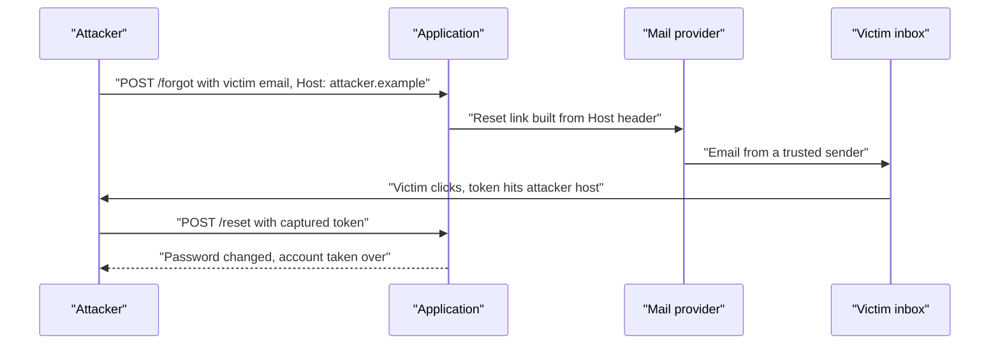
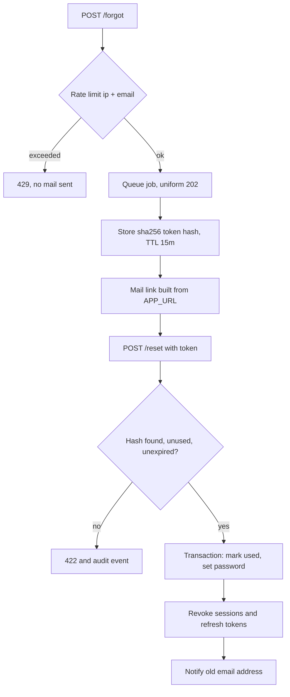

> **Scenario** - Support জানাল রাতের মধ্যে তিনটি account takeover হয়েছে। তিনজনই আপনার domain থেকে দেখতে বৈধ reset email পেয়েছে। Link গিয়েছিল `https://attacker.example/reset?token=…`-এ, কারণ mailer আসা `Host` header থেকে URL বানিয়েছিল।

## Why it matters

- Reset flow একটা *credential issuance* endpoint। যে এটা শেষ করতে পারে সে-ই account-এর মালিক, password শক্তি বা login-এ MFA policy যা-ই হোক।
- এটা প্রায়ই সবচেয়ে কম-review হওয়া path: MVP-তে একবার লেখা, আর দেখা হয় না, CSRF থেকে বাদ, আর rate limit থাকলেও দুর্ঘটনাক্রমে।
- Reset email third-party provider দিয়ে যায়, তাই token আপনার নিয়ন্ত্রণের বাইরের system পেরিয়ে এমন inbox-এ পড়ে যা compromised হতে পারে।
- এই endpoint-এ enumeration একটা verified customer list বানায়, যা কিছু jurisdiction-এ নিজেই reportable data exposure।

## Symptoms

| Signal | What you observe |
| --- | --- |
| Host থেকে বানানো link | outbound mail-এর reset URL request `Host` অনুযায়ী বদলায় |
| Token reuse | একই token দুইবার reset শেষ করে, বা সপ্তাহ পরেও কাজ করে |
| ভিন্ন timing/শব্দ | "No account found" vs "Email sent" কোন address আছে তা ফাঁস করে |
| Rate limit নেই | এক IP থেকে হাজারো reset request, সব 200 |
| Session টিকে থাকে | reset-এর পরেও attacker-এর পুরনো session authenticated |
| Log-এ token | token query parameter হওয়ায় access log-এ ঢোকে |

## How it breaks

তিনটি আলাদা দুর্বলতা একসাথে মিলে যায়। প্রথমে link untrusted input থেকে তৈরি, তাই attacker একটা আসল email-কে নিজের host-এ তাক করাতে পারে। দ্বিতীয়ত token দীর্ঘায়ু, single-purpose কিন্তু multi-use, আর plaintext-এ রাখা, তাই mail path-এর যেকোনো জায়গার leak-ই যথেষ্ট। তৃতীয়ত reset শেষ হলেও বিদ্যমান session invalidate হয় না, তাই ইতিমধ্যে session থাকা attacker victim account ফিরে পাওয়ার পরেও থেকে যায়।



## Root causes

1. Absolute URL request-এর `Host` বা `X-Forwarded-Host` header থেকে তৈরি।
2. Token plaintext-এ রাখা, তাই database read মানেই ব্যবহারযোগ্য credential।
3. Single-use enforcement নেই, TTL দিনে মাপা।
4. বিদ্যমান vs অজানা account-এ আলাদা response ও timing।
5. Rate limit শুধু IP-ভিত্তিক, বা একেবারেই নেই।
6. Password change-এ session ও refresh token invalidate হয় না।
7. Reset link query string-এ, যা proxy log ও `Referer` header-এ চলে যায়।

## How to solve it

### 1. Application URL pin করুন ও `Host` যাচাই করুন

```php
// config/app.php
'url' => env('APP_URL', 'https://app.example.com'),
```

```php
// app/Providers/AppServiceProvider.php
public function boot(): void
{
    URL::forceRootUrl(config('app.url'));
    URL::forceScheme('https');
}
```

Edge-এ অপ্রত্যাশিত host সরাসরি reject করুন, যাতে application সেগুলো দেখেই না:

```nginx
server {
    listen 443 ssl;
    server_name _;
    return 421;   # misdirected request
}

server {
    listen 443 ssl;
    server_name app.example.com;
    location / { proxy_pass http://app_upstream; }
}
```

### 2. Token নয়, hash রাখুন

```php
$plain = bin2hex(random_bytes(32));

DB::table('password_resets')->insert([
    'user_id'    => $user->id,
    'token_hash' => hash('sha256', $plain),
    'expires_at' => now()->addMinutes(15),
    'created_at' => now(),
]);

Mail::to($user)->queue(new ResetPasswordMail($plain));
```

Verification hash দিয়ে খুঁজে constant time-এ মেলায়। তখন চুরি হওয়া database dump থেকে ব্যবহারযোগ্য কিছু পাওয়া যায় না।

### 3. Token single-use ও স্বল্পায়ু করুন

```php
$record = DB::table('password_resets')
    ->where('token_hash', hash('sha256', $request->token))
    ->whereNull('used_at')
    ->where('expires_at', '>', now())
    ->lockForUpdate()
    ->first();

abort_if($record === null, 422, 'invalid_or_expired_token');

DB::transaction(function () use ($record, $request) {
    DB::table('password_resets')->where('id', $record->id)->update(['used_at' => now()]);

    $user = User::lockForUpdate()->findOrFail($record->user_id);
    $user->forceFill(['password' => Hash::make($request->password)])->save();

    // Kill every existing credential for this account.
    $user->increment('token_version');
    RefreshToken::where('user_id', $user->id)->update(['revoked_at' => now()]);
    DB::table('sessions')->where('user_id', $user->id)->delete();
});
```

Transaction-এর ভেতরে `lockForUpdate()` flow-কে idempotent করে: একই token দুইবার একসাথে জমা দিলে দুটোই সফল হতে পারে না।

### 4. প্রতিটি address-এ একই উত্তর দিন

```php
public function store(ForgotPasswordRequest $request)
{
    $user = User::where('email', $request->email)->first();

    if ($user) {
        SendPasswordReset::dispatch($user);
    }

    // Identical status, body, and latency profile either way.
    return response()->json(['status' => 'reset_link_sent'], 202);
}
```

দুই branch-এই queue-তে dispatch করলে response time সমান থাকে, timing oracle সরে যায়।

### 5. একাধিক key-তে rate-limit করুন

```php
// app/Providers/RouteServiceProvider.php
RateLimiter::for('password-reset', function (Request $request) {
    return [
        Limit::perMinute(3)->by('ip:' . $request->ip()),
        Limit::perHour(5)->by('email:' . strtolower((string) $request->input('email'))),
        Limit::perMinute(60)->by('global'),
    ];
});
```

Per-email limit লক্ষ্যভিত্তিক mail bombing থামায়; global limit distributed প্রচেষ্টায় mail provider reputation বাঁচায়।

### 6. পরিবর্তন জানান ও নিশ্চিত করুন

*পুরনো* address-এ আলাদা "আপনার password বদলানো হয়েছে" notification পাঠান, আর in-session password change-এ current password (বা step-up factor) বাধ্যতামূলক করুন। এতে silent takeover detected takeover হয়ে যায়।

## Target design



## Tradeoffs

| Option | Pros | Cons | Choose when |
| --- | --- | --- | --- |
| Email-এ token link | পরিচিত; বাড়তি factor লাগে না | inbox security-র উপর নির্ভর | consumer product |
| App-এ one-time code | token মূল tab ছাড়ে না; `Referer` leak নেই | বেশি friction; typo support load | উচ্চমূল্যের account |
| Reset-এ MFA factor লাগে | inbox-only takeover আটকায় | factor হারালে support path লাগে | financial, admin বা B2B tenant |
| ১৫ মিনিট TTL | ছোট exposure window | ধীর inbox থেকে support ticket | default পছন্দ |
| ২৪ ঘণ্টা TTL | "link expired" অভিযোগ কম | leak হওয়া email-এ লম্বা window | কম ঝুঁকির internal tool |

## Verification checklist

- [ ] জাল `Host` header দিয়ে reset পাঠিয়ে দেখুন link এখনো `APP_URL` ব্যবহার করে।
- [ ] Reset table-এ শুধু hash আছে তা নিশ্চিত করুন।
- [ ] একটা token দুইবার ব্যবহার করে দ্বিতীয়বার 422 আসে কিনা দেখুন।
- [ ] পরিচিত ও অজানা address-এর response body ও latency তুলনা করুন।
- [ ] Per-email limit ছাড়িয়ে দেখুন 429 আসে ও কোনো mail যায় না।
- [ ] দ্বিতীয় session খোলা রেখে password reset করে দেখুন সেটা logout হয়েছে।
- [ ] Token nginx access log বা analytics-এ কখনো আসে না তা নিশ্চিত করুন।

## Anti-patterns

- Link-এর বদলে temporary password email করা, যা inbox-এ একটা valid credential রেখে দেয়।
- অনুমানযোগ্য token (`md5(email . time())`) বা sequential id ব্যবহার।
- "public route" বলে reset route-কে CSRF ও rate limit থেকে বাদ দেওয়া।
- সহায়ক হতে গিয়ে user-কে বলা "এই email registered নয়"।
- "আবার login করতে হবে না" বলে reset-এর পরেও session চালু রাখা।

## Related

- [MFA and account recovery tradeoffs](/systems/auth-security/mfa-and-account-recovery-tradeoffs)
- [Session fixation and CSRF defence](/systems/auth-security/session-fixation-and-csrf)
- [The JWT revocation problem](/systems/auth-security/jwt-revocation-problem)
