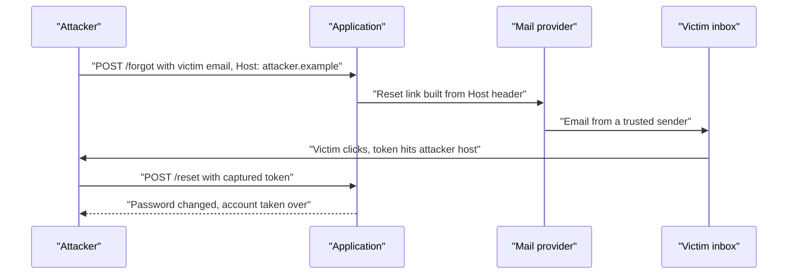
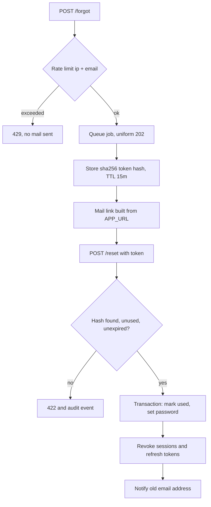

> **Scenario** — Support reports that three accounts were taken over overnight. All three received a legitimate-looking reset email from your domain. The link pointed at `https://attacker.example/reset?token=…` because the mailer built the URL from the incoming `Host` header.

## Why it matters

- The reset flow is a *credential issuance* endpoint. Anyone who can complete it owns the account, regardless of password strength or MFA-at-login policy.
- It is often the least-reviewed authenticated path: written once during MVP, never revisited, exempted from CSRF, and rate-limited only by accident.
- Reset emails go through third-party providers, so tokens travel through systems you do not control and land in inboxes that may be compromised.
- Enumeration on this endpoint produces a verified customer list, which is itself a reportable data exposure in several jurisdictions.

## Symptoms

| Signal | What you observe |
| --- | --- |
| Host-derived links | Reset URLs in outbound mail vary by request `Host` header |
| Token reuse | The same token completes a reset twice, or works weeks later |
| Response timing/wording differs | "No account found" vs "Email sent" reveals which addresses exist |
| No rate limit | Thousands of reset requests from one IP with 200 responses |
| Session survival | After reset, the attacker's old session is still authenticated |
| Token in logs | Access logs contain the token because it is a query parameter |

## How it breaks

Three independent weaknesses combine. First, the link is constructed from untrusted input, so an attacker can point a genuine email at their own host. Second, tokens are long-lived, single-purpose but multi-use, and stored in plaintext, so a leak anywhere in the mail path is enough. Third, completing a reset does not invalidate existing sessions, so an attacker who already has a session keeps it even after the victim recovers the account.



## Root causes

1. Absolute URLs generated from the request `Host` or `X-Forwarded-Host` header.
2. Tokens stored in plaintext, so a database read exposes usable credentials.
3. No single-use enforcement and TTLs measured in days.
4. Distinguishable responses and timings for existing versus unknown accounts.
5. Rate limiting keyed only on IP, or absent entirely.
6. Sessions and refresh tokens not invalidated on password change.
7. Reset links placed in query strings, where they enter proxy logs and `Referer` headers.

## How to solve it

### 1. Pin the application URL and validate `Host`

```php
// config/app.php
'url' => env('APP_URL', 'https://app.example.com'),
```

```php
// app/Providers/AppServiceProvider.php
public function boot(): void
{
    URL::forceRootUrl(config('app.url'));
    URL::forceScheme('https');
}
```

At the edge, reject unexpected hosts outright so the application never sees them:

```nginx
server {
    listen 443 ssl;
    server_name _;
    return 421;   # misdirected request
}

server {
    listen 443 ssl;
    server_name app.example.com;
    location / { proxy_pass http://app_upstream; }
}
```

### 2. Store hashes, not tokens

```php
$plain = bin2hex(random_bytes(32));

DB::table('password_resets')->insert([
    'user_id'    => $user->id,
    'token_hash' => hash('sha256', $plain),
    'expires_at' => now()->addMinutes(15),
    'created_at' => now(),
]);

Mail::to($user)->queue(new ResetPasswordMail($plain));
```

Verification looks the token up by hash and compares in constant time. A stolen database dump then yields nothing usable.

### 3. Make the token single-use and short-lived

```php
$record = DB::table('password_resets')
    ->where('token_hash', hash('sha256', $request->token))
    ->whereNull('used_at')
    ->where('expires_at', '>', now())
    ->lockForUpdate()
    ->first();

abort_if($record === null, 422, 'invalid_or_expired_token');

DB::transaction(function () use ($record, $request) {
    DB::table('password_resets')->where('id', $record->id)->update(['used_at' => now()]);

    $user = User::lockForUpdate()->findOrFail($record->user_id);
    $user->forceFill(['password' => Hash::make($request->password)])->save();

    // Kill every existing credential for this account.
    $user->increment('token_version');
    RefreshToken::where('user_id', $user->id)->update(['revoked_at' => now()]);
    DB::table('sessions')->where('user_id', $user->id)->delete();
});
```

`lockForUpdate()` inside the transaction gives the flow idempotent semantics: two concurrent submissions of the same token cannot both succeed.

### 4. Return the same answer for every address

```php
public function store(ForgotPasswordRequest $request)
{
    $user = User::where('email', $request->email)->first();

    if ($user) {
        SendPasswordReset::dispatch($user);
    }

    // Identical status, body, and latency profile either way.
    return response()->json(['status' => 'reset_link_sent'], 202);
}
```

Dispatching to a queue in both branches keeps response time uniform, removing the timing oracle.

### 5. Rate-limit on multiple keys

```php
// app/Providers/RouteServiceProvider.php
RateLimiter::for('password-reset', function (Request $request) {
    return [
        Limit::perMinute(3)->by('ip:' . $request->ip()),
        Limit::perHour(5)->by('email:' . strtolower((string) $request->input('email'))),
        Limit::perMinute(60)->by('global'),
    ];
});
```

Per-email limits stop targeted mail bombing; the global limit protects the mail provider reputation during a distributed attempt.

### 6. Notify and require confirmation of change

Send a separate "your password was changed" notification to the *old* address, and require the current password (or a step-up factor) for in-session password changes. That converts a silent takeover into a detected one.

## Target design



## Tradeoffs

| Option | Pros | Cons | Choose when |
| --- | --- | --- | --- |
| Emailed token link | Familiar; no extra factor needed | Depends on inbox security | Consumer products |
| One-time code entered in-app | Token never leaves the original tab; no `Referer` leak | More friction; typo support load | Higher-value accounts |
| Reset requires an MFA factor | Blocks inbox-only takeover | Users who lost the factor need a support path | Financial, admin, or B2B tenants |
| 15-minute TTL | Small exposure window | Support tickets from slow inboxes | Default choice |
| 24-hour TTL | Fewer "link expired" complaints | Long window for a leaked email | Low-risk internal tools |

## Verification checklist

- [ ] Send a reset with a forged `Host` header and confirm the emitted link still uses `APP_URL`.
- [ ] Confirm the reset table stores only hashes.
- [ ] Use a token twice and confirm the second attempt returns 422.
- [ ] Compare response body and latency for known and unknown addresses.
- [ ] Exceed the per-email limit and confirm 429 with no mail dispatched.
- [ ] Reset a password while a second session is open and confirm the second session is logged out.
- [ ] Confirm tokens never appear in nginx access logs or analytics.

## Anti-patterns

- Emailing a temporary password instead of a link, leaving a valid credential in the inbox.
- Using a predictable token (`md5(email . time())`) or a sequential id.
- Exempting the reset routes from CSRF and rate limiting because "they are public".
- Telling the user "this email is not registered" to be helpful.
- Leaving sessions alive after a reset so the user "does not have to log in again".

## Related

- [MFA and account recovery tradeoffs](/systems/auth-security/mfa-and-account-recovery-tradeoffs)
- [Session fixation and CSRF defence](/systems/auth-security/session-fixation-and-csrf)
- [The JWT revocation problem](/systems/auth-security/jwt-revocation-problem)
