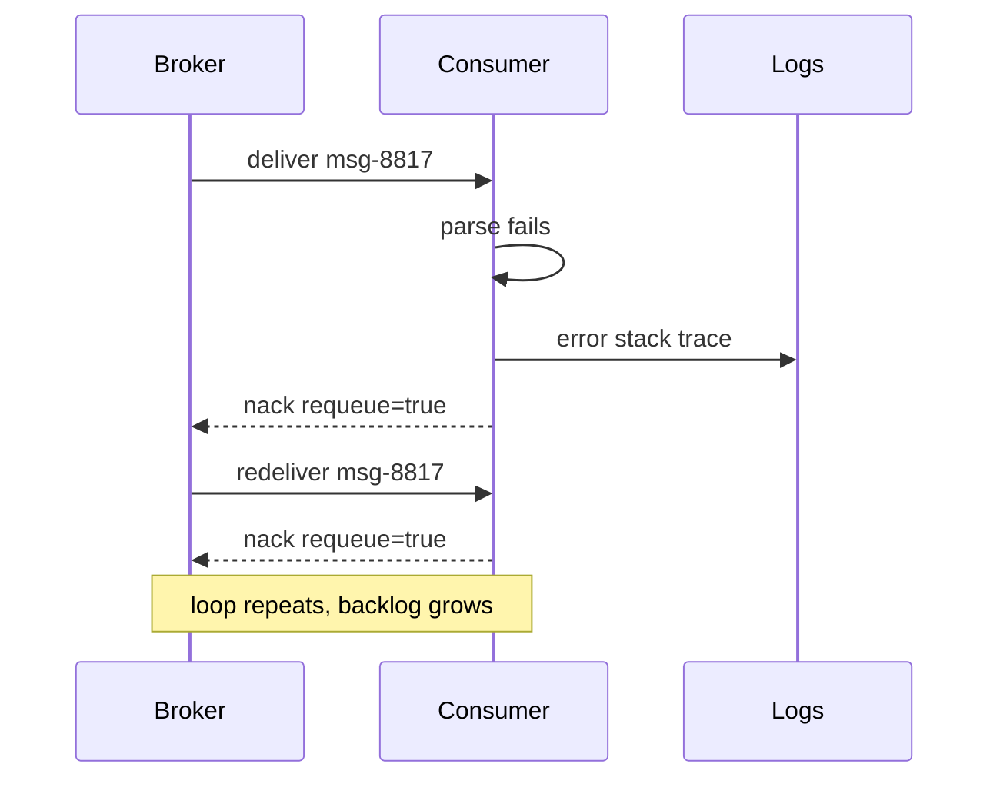
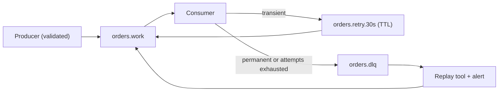

> **Scenario** - রাত ০২:১৪-এ RabbitMQ-এর একটা payments consumer আর এগোচ্ছে না। queue depth ৪১,০০০-এ আটকে, ছয়টা worker-এর CPU pinned, আর log-এ একই `order.settled` message সেকেন্ডে ৯০০ বার parse হয়ে reject হচ্ছে। এক producer `null` currency code সহ payload পাঠিয়েছে, deploy-এর পর থেকে consumer সেটাই redeliver করে যাচ্ছে।

## Why it matters

- একটা malformed message পুরো consumer capacity খেয়ে ফেলে, আর পেছনে queue unbounded বাড়ে - একটা bad record থেকে পূর্ণ outage।
- Unbounded redelivery loop যে log volume ও metric cardinality বানায় তার খরচ incident-এর চেয়েও বেশি হতে পারে - ৯০০/s error loop দিনে প্রায় ৭.৮ কোটি log line লেখে।
- Downstream SLA চুপচাপ ভাঙে: queue "up", consumer "healthy", customer support escalate না করা পর্যন্ত কেউ page পায় না।
- DLQ না থাকলে inspect করার মতো artifact-ই থাকে না। bad message শুধু log noise-এ বাঁচে, postmortem-এ replay করার কিছু নেই।
- On-call প্রথম ৩০ মিনিট broker ঠিক আছে প্রমাণ করতেই খরচ করে, payload-কে কেউ সন্দেহ করে না।

## Symptoms

| Signal | What you observe |
|---|---|
| Queue depth | consumer ack rate প্রায় শূন্য, অথচ depth flat বা বাড়ছে |
| Consumer CPU | উচ্চ utilisation কিন্তু useful throughput নেই |
| Redelivery counter | অল্প কয়েকটা `delivery_tag`-এ `redelivered=true` বারবার |
| Log pattern | একই stack trace, একই message ID, উচ্চ frequency-তে |
| Broker unacked count | ঠিক `prefetch × consumer_count`-এ আটকে |
| DLQ depth | শূন্য, কারণ dead-letter policy configure করা নেই |

## How it breaks

Consumer message নেয়, deserialisation বা domain invariant throw করে, framework-এর error handler `basic.nack` করে `requeue=true` দিয়ে। RabbitMQ message-টা queue-এর head-এ ফিরিয়ে দেয় এবং সঙ্গে সঙ্গে redeliver করে। default path-এ কোনো attempt counter নেই, তাই loop চলে CPU-র গতিতে। Kafka-তে আকার আলাদা হলেও ফল একই: consumer offset commit করার আগেই throw করে, পরের poll-এ partition শেষ committed offset-এ rewind করে, একই record replay হয় - বাড়তি হলো ওই partition-এর পেছনের সবকিছুও block।



## Root causes

1. প্রতিটি failure-এ `requeue=true`, transient ও permanent error আলাদা করা হয়নি।
2. delivery-attempt counter নেই, তাই consumer জানে না সে এই message ৯০০ বার fail করেছে।
3. work queue-তে dead-letter exchange বা DLQ configure করা নেই।
4. Producer schema validation ছাড়া publish করে, তাই invalid payload broker-এ ঢোকে।
5. Partition-এর ভিতরে blocking failure (Kafka) বা head-of-line blocking (single-active-consumer queue)।
6. শূন্য backoff-এ retry, ফলে slow transient failure আর permanent failure দেখতে একরকম।

## How to solve it

### 1. Classify the failure before you retry

Transient error (upstream timeout, deadlock, 503) retry পায়। Permanent error (schema violation, unknown enum, missing tenant) কখনো সফল হবে না। দুটো আলাদা করুন।

```ts
class PermanentMessageError extends Error {}
class TransientMessageError extends Error {}

export async function handle(raw: Buffer, attempt: number): Promise<void> {
  const parsed = OrderSettled.safeParse(JSON.parse(raw.toString()))
  if (!parsed.success) {
    throw new PermanentMessageError(parsed.error.message)
  }
  try {
    await settle(parsed.data)
  } catch (err) {
    if (isRetryable(err) && attempt < 5) throw new TransientMessageError(String(err))
    throw new PermanentMessageError(String(err))
  }
}
```

### 2. Declare a dead-letter exchange with a retry ladder

work queue-কে delay queue-তে dead-letter করান, আর delay queue TTL শেষে work queue-তে ফেরত দিক। retry queue-এর `x-message-ttl`-ই আপনার backoff।

```yaml
# rabbitmq definitions excerpt
queues:
  - name: orders.work
    arguments:
      x-dead-letter-exchange: orders.retry
  - name: orders.retry.30s
    arguments:
      x-message-ttl: 30000
      x-dead-letter-exchange: orders.work
  - name: orders.dlq
    arguments:
      x-queue-type: quorum
```

### 3. Cap attempts and route to the DLQ

Laravel-এর queue worker attempt track করে; cap-টা explicit করুন এবং failure যেন inspect করার মতো জায়গায় পড়ে।

```php
class SettleOrder implements ShouldQueue
{
    public int $tries = 5;
    public array $backoff = [5, 30, 120, 600];

    public function handle(): void
    {
        if (! $this->payload->currency) {
            $this->fail(new PermanentMessageError('missing currency'));
            return;
        }
        app(Settlement::class)->apply($this->payload);
    }

    public function failed(Throwable $e): void
    {
        DeadLetter::create([
            'queue'      => 'orders',
            'payload'    => $this->payload->toArray(),
            'error'      => $e->getMessage(),
            'failed_at'  => now(),
        ]);
    }
}
```

ওই table-এর বিপরীতে `php artisan queue:failed` ও `queue:retry` চালান; Horizon একই record তার Failed Jobs view-তে দেখায়।

### 4. Make the DLQ a first-class operational surface

যে DLQ কেউ পড়ে না সেটা landfill। `dlq_depth > 0` ১৫ মিনিটের বেশি থাকলে alert দিন, প্রতিটি dead-lettered message-এ `x-death` header রাখুন (RabbitMQ নিজেই দেয়: original queue, reason, count), আর bug ফিক্সের পর নির্বাচিত message re-publish করার replay command বানান।

### 5. Validate at the producer boundary

Consumer যে schema ব্যবহার করে, publish time-এ সেটা দিয়েই invalid payload reject করুন। দুপুর ১৪:০০-এ producer-কে একটা 400 দেওয়া রাত ০২:১৪-এর DLQ entry-র চেয়ে সস্তা।

## Target design



## Tradeoffs

| Option | Pros | Cons | Choose when |
|---|---|---|---|
| Requeue forever | কোনো config লাগে না, message হারায় না | head-of-line block, অসীম loop | production-এ কখনো নয় |
| Retry ladder + DLQ | bounded retry, inspectable failure | বাড়তি queue operate করতে হয় | work queue-এর default |
| Drop on parse failure | consumer কখনো block হয় না | নীরব data loss | telemetry-grade, কম মূল্যের event |
| Pause consumer on error | order কঠোরভাবে রক্ষা হয় | পুরো pipeline থেমে যায় | financial ledger যেখানে order পবিত্র |
| Sidelining in Kafka | partition চলতে থাকে | ওই key-এর ordering ভাঙে | stream যেখানে per-key ordering advisory |

## Verification checklist

- [ ] staging-এ ইচ্ছাকৃত malformed message publish করে দেখুন সেটা প্রত্যাশিত retry window-এর মধ্যেই DLQ-তে পড়ে - আগেও নয়, কখনো-না-ও নয়।
- [ ] `x-death` header (বা সমতুল্য metadata) original queue, reason ও count রাখছে কিনা যাচাই করুন।
- [ ] poison message retry হওয়ার সময় valid message-এর throughput অপরিবর্তিত আছে কিনা দেখুন।
- [ ] `dlq_depth > 0` ১৫ মিনিটের মধ্যে alert তুলছে কিনা পরীক্ষা করুন।
- [ ] একটা DLQ message-এ replay tool চালিয়ে দেখুন সেটা ঠিক একবারই process হয়।
- [ ] retry queue load-test করুন: ১০ হাজার dead-lettered message main queue stall করা উচিত নয়।

## Anti-patterns

- সব exception ধরে ack করে দেওয়া - bug-কে স্থায়ী নীরব data loss-এ পরিণত করে।
- "কিছু যেন না হারায়" বলে `tries = 0` (unlimited) সেট করা।
- schema violation-এ exponential backoff retry - ৬০০ সেকেন্ডে payload valid হবে না।
- DLQ-কে ত্রৈমাসিক হাতে-drain করা queue হিসেবে ব্যবহার করা।
- শুধু DLQ *rate*-এ alert দেওয়া; একটামাত্র আটকে থাকা message কখনো rate threshold ছোঁয় না।
- failed payload storage-এ না লিখে log-এ লেখা, ফলে replay মানে grep করা।

## Related

- [Building idempotent consumers](/systems/messaging-async/idempotent-consumers)
- [Event schema evolution without breaking consumers](/systems/messaging-async/event-schema-evolution)
- [Backpressure in queue-heavy architectures](/systems/messaging-async/backpressure-queue-design)
