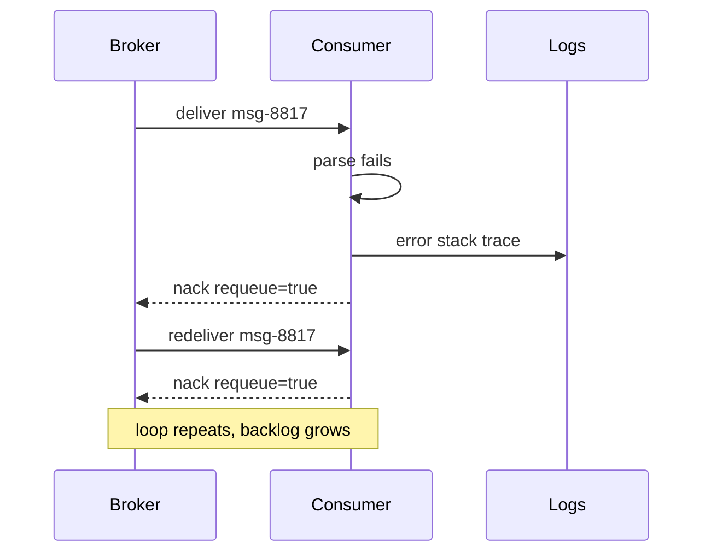
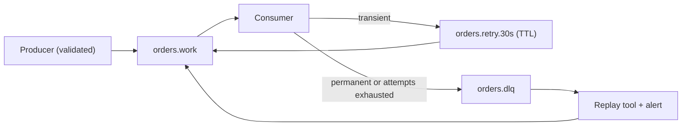

> **Scenario** — A payments consumer on RabbitMQ stops making progress at 02:14. The queue depth is flat at 41,000, CPU on all six workers is pinned, and the logs show the same `order.settled` message being parsed and rejected 900 times per second. One producer shipped a payload with a `null` currency code and the consumer has been redelivering it since the deploy.

## Why it matters

- A single malformed message can consume 100% of consumer capacity while the queue behind it grows unbounded, turning one bad record into a full outage.
- Unbounded redelivery loops generate log volume and metric cardinality that can cost more than the incident itself — a 900/s error loop writes roughly 78M log lines a day.
- Downstream SLAs break silently: the queue is "up", the consumers are "healthy", and nothing pages until customer support escalates.
- Without a dead-letter queue you have no artifact to inspect. The bad message is invisible except in log noise, so the postmortem has nothing to replay.
- On-call spends the first 30 minutes proving the broker is fine before anyone suspects a payload.

## Symptoms

| Signal | What you observe |
|---|---|
| Queue depth | Flat or rising while consumer ack rate is near zero |
| Consumer CPU | High utilisation with no useful throughput |
| Redelivery counter | `redelivered=true` on a small set of `delivery_tag`s, repeating |
| Log pattern | The same stack trace and same message ID at high frequency |
| Broker unacked count | Stuck at exactly `prefetch × consumer_count` |
| DLQ depth | Zero, because no dead-letter policy is configured |

## How it breaks

The consumer pulls the message, deserialisation or a domain invariant throws, and the framework's error handler issues `basic.nack` with `requeue=true`. RabbitMQ puts the message back at the head of the queue and immediately redelivers it. There is no attempt counter in the default path, so the loop runs forever at the speed of your CPU. In Kafka the shape differs but the outcome matches: the consumer throws before committing the offset, the partition rewinds to the last committed offset on the next poll, and the same record replays — with the added detail that everything behind that offset in the partition is now blocked too.



## Root causes

1. `requeue=true` on every failure, with no distinction between transient and permanent errors.
2. No delivery-attempt counter, so the consumer cannot know it has already failed this message 900 times.
3. No dead-letter exchange or DLQ configured on the working queue.
4. Producers publish without schema validation, so structurally invalid payloads reach the broker.
5. Blocking failures inside a partition (Kafka) or head-of-line blocking (single-active-consumer queues).
6. Retries with zero backoff, so a slow transient failure looks identical to a permanent one.

## How to solve it

### 1. Classify the failure before you retry

Transient errors (upstream timeout, deadlock, 503) deserve a retry. Permanent errors (schema violation, unknown enum, missing tenant) never succeed. Split them explicitly.

```ts
class PermanentMessageError extends Error {}
class TransientMessageError extends Error {}

export async function handle(raw: Buffer, attempt: number): Promise<void> {
  const parsed = OrderSettled.safeParse(JSON.parse(raw.toString()))
  if (!parsed.success) {
    throw new PermanentMessageError(parsed.error.message)
  }
  try {
    await settle(parsed.data)
  } catch (err) {
    if (isRetryable(err) && attempt < 5) throw new TransientMessageError(String(err))
    throw new PermanentMessageError(String(err))
  }
}
```

### 2. Declare a dead-letter exchange with a retry ladder

Configure the working queue to dead-letter into a delay queue, and the delay queue to expire back into the work queue. The `x-message-ttl` on the retry queue is your backoff.

```yaml
# rabbitmq definitions excerpt
queues:
  - name: orders.work
    arguments:
      x-dead-letter-exchange: orders.retry
  - name: orders.retry.30s
    arguments:
      x-message-ttl: 30000
      x-dead-letter-exchange: orders.work
  - name: orders.dlq
    arguments:
      x-queue-type: quorum
```

### 3. Cap attempts and route to the DLQ

In Laravel, the queue worker already tracks attempts; make the cap explicit and make the failure land somewhere inspectable.

```php
class SettleOrder implements ShouldQueue
{
    public int $tries = 5;
    public array $backoff = [5, 30, 120, 600];

    public function handle(): void
    {
        if (! $this->payload->currency) {
            $this->fail(new PermanentMessageError('missing currency'));
            return;
        }
        app(Settlement::class)->apply($this->payload);
    }

    public function failed(Throwable $e): void
    {
        DeadLetter::create([
            'queue'      => 'orders',
            'payload'    => $this->payload->toArray(),
            'error'      => $e->getMessage(),
            'failed_at'  => now(),
        ]);
    }
}
```

Run `php artisan queue:failed` and `queue:retry` against that table; Horizon surfaces the same records in its Failed Jobs view.

### 4. Make the DLQ a first-class operational surface

A DLQ nobody reads is a landfill. Alert on `dlq_depth > 0` for more than 15 minutes, tag every dead-lettered message with `x-death` headers (RabbitMQ adds these automatically: original queue, reason, count), and build a replay command that re-publishes selected messages after the bug is fixed.

### 5. Validate at the producer boundary

Reject invalid payloads at publish time with the same schema the consumer uses. A 400 to the producer at 14:00 is cheaper than a DLQ entry at 02:14.

## Target design



## Tradeoffs

| Option | Pros | Cons | Choose when |
|---|---|---|---|
| Requeue forever | Zero config, no message loss | Head-of-line block, infinite loop | Never in production |
| Retry ladder + DLQ | Bounded retries, inspectable failures | More queues to operate | Default for work queues |
| Drop on parse failure | Consumer never blocks | Silent data loss | Telemetry-grade, low-value events |
| Pause consumer on error | Preserves order strictly | Full stop of the pipeline | Financial ledgers where order is sacred |
| Sidelining in Kafka | Partition keeps moving | Ordering broken for the sidelined key | Streams where per-key ordering is advisory |

## Verification checklist

- [ ] Publish a deliberately malformed message to staging and confirm it lands in the DLQ within the expected retry window, not sooner and not never.
- [ ] Confirm `x-death` headers (or equivalent metadata) record original queue, reason, and count.
- [ ] Verify consumer throughput for valid messages is unaffected while the poison message is retrying.
- [ ] Check that `dlq_depth > 0` fires an alert within 15 minutes.
- [ ] Run the replay tool against one DLQ message and confirm it processes exactly once.
- [ ] Load-test the retry queue: 10k dead-lettered messages should not stall the main queue.

## Anti-patterns

- Catching every exception and acking, which converts a bug into permanent silent data loss.
- Setting `tries = 0` (unlimited) "so nothing is ever lost".
- Retrying schema violations with exponential backoff — the payload will not become valid in 600 seconds.
- Using the DLQ as a queue you drain manually once a quarter.
- Alerting on DLQ *rate* only; a single stuck message never trips a rate threshold.
- Writing the failed payload to logs instead of storage, so replay requires grepping.

## Related

- [Building idempotent consumers](/systems/messaging-async/idempotent-consumers)
- [Event schema evolution without breaking consumers](/systems/messaging-async/event-schema-evolution)
- [Backpressure in queue-heavy architectures](/systems/messaging-async/backpressure-queue-design)
