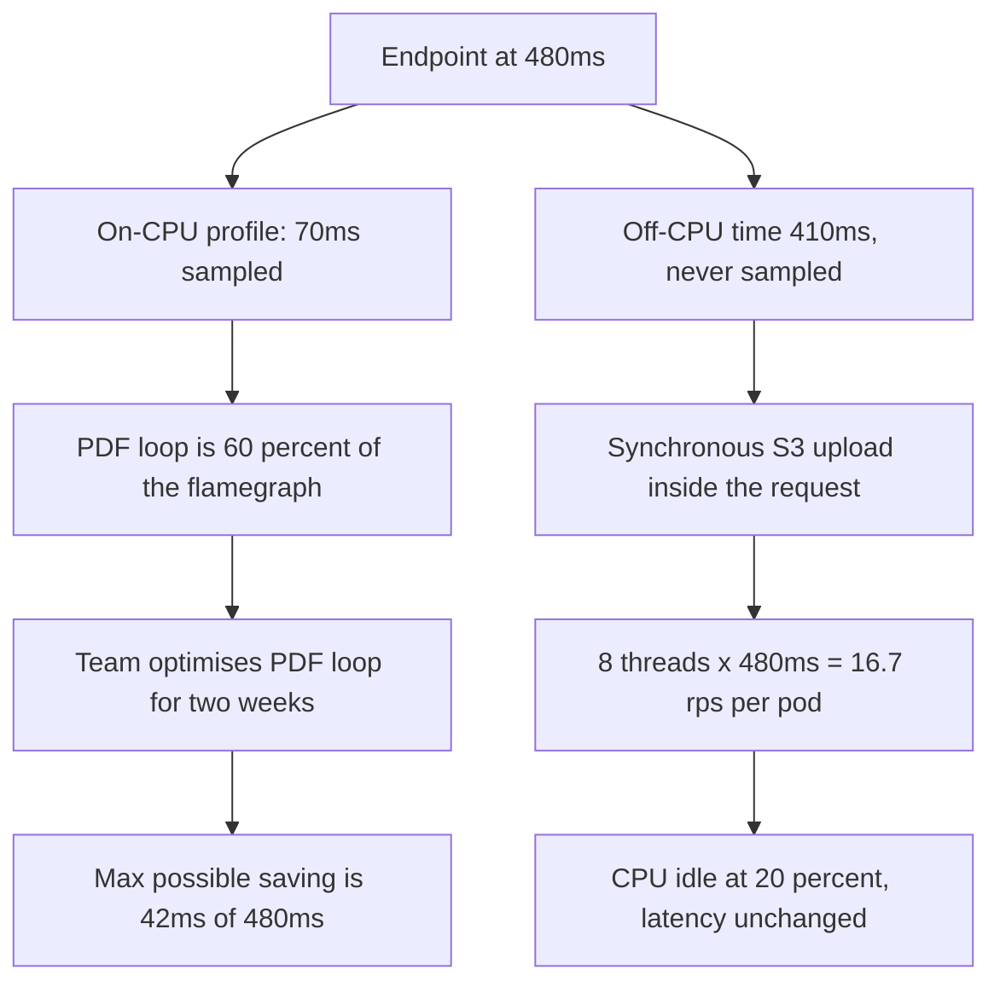
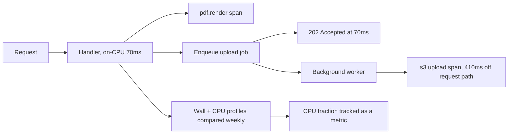

> **Scenario** - একটি invoicing endpoint 480 ms নেয়। দল দুই সপ্তাহ ধরে একটি PDF layout loop optimise করে, কারণ CPU flamegraph-এ সেটাই প্রভাবশালী। Latency নামে 465 ms-এ। Flamegraph CPU নিয়ে ঠিক ছিল, request নিয়ে ভুল: ওই 480 ms-এর 410 ms কেটেছে একটি synchronous S3 upload-এ blocked হয়ে, যা on-CPU profile-এ কখনো দেখা যায় না।

## Why it matters

- On-CPU profiler শুধু চলমান thread sample করে। অপেক্ষার সময় অদৃশ্য, আর বেশিরভাগ web request মূলত অপেক্ষাই করে।
- ভুল অর্ধেক optimise করা নিরপেক্ষ নয় - সপ্তাহখানেক engineering পোড়ে আর SLO অপরিবর্তিত থাকে।
- কোন অর্ধেকে আছেন জানলে পরের প্রতিটি সিদ্ধান্ত বদলায়: pool size, concurrency model, instance type, autoscaling metric।
- ভুল নির্ণয় প্রায়ই scale up (বড় CPU) করায়, যখন আসল সমাধান ছিল scale out বা async।
- আসল concurrency-তে profile করলে এমন contention ধরা পড়ে যা single-request profiling গঠনগতভাবেই দেখতে পারে না।

## Symptoms

| Signal | What you observe |
|---|---|
| CPU utilisation vs latency | latency উঁচু, CPU 40%-এর নিচে - আপনি IO-bound |
| Flamegraph | একটি লম্বা stack প্রভাবশালী, তবু মোট sampled time request time-এর অনেক নিচে |
| Thread state | অনেক thread `WAITING` / `TIMED_WAITING`, অল্প `RUNNABLE` |
| `pidstat` output | কম `%usr`, কিছুটা `%system`, উঁচু `%wait` |
| Load-এ latency | CPU সমান থাকতেই latency বাড়ে |
| Span waterfall | ভিতরে child span ছাড়া একটি লম্বা ফাঁক |
| Scaling behaviour | CPU দ্বিগুণে কিছু হয় না; replica দ্বিগুণে হয় |

## How it breaks

দুই ক্ষেত্রকে আলাদা করা হিসাব দিয়ে শুরু করুন। একটি request-এর জন্য:

- **wall time** = 480 ms (user যা টের পায়)
- **on-CPU time** = 70 ms (profiler যা sample করল)
- **off-CPU time** = 480 − 70 = **410 ms**

CPU fraction = 70 / 480 = **14.6%**। On-CPU flamegraph আপনাকে ওই 70 ms-এর *আকার* দেখায়, বাকি 410 নিয়ে কিছুই বলে না। PDF loop যদি ওই 70 ms-এর 60% হয় - 42 ms - তবে পুরোপুরি সরালেও 480-এর মধ্যে 42 ms বাঁচে, অর্থাৎ **8.75%** উন্নতি। দুই সপ্তাহে মিলল 15 ms, কারণ তাত্ত্বিক সর্বোচ্চ ছিল 42 ms আর loop পুরোপুরি সরানো যায়নি।

এদিকে wait ratio বলে দেয় কত concurrency দরকার। pod-প্রতি 6 core আর Goetz-এর formula-য়:

threads = cores × utilisation × (1 + wait/service) = 6 × 0.85 × (1 + 410/70) = 6 × 0.85 × 6.86 = **35 thread**

Service configured ছিল 8-এ। pod-প্রতি 8 thread-এ max throughput 8 / 0.480 = **16.7 req/s**, অথচ thread constraint না হলে CPU সামলাতে পারত 6 core / 0.070 s = **85 req/s**। Pod তার CPU-limited capacity-র 20%-এ চলছিল, আর CPU graph - 6 core-এর 14.6% × 16.7 req/s ≈ 20% - "ঠিক" দেখাচ্ছিল।

পুরো failure-টা এটাই: যে profiler request-এর মাত্র 14.6% দেখে, তা দিয়ে 100%-এর কাজের plan করা।



## Root causes

1. Wall-clock latency ব্যাখ্যা করতে on-CPU profiler ব্যবহার করা।
2. Off-CPU বা wall-clock profile নেই, তাই blocking call-এর কোনো প্রতিনিধিত্ব নেই।
3. Distributed tracing span এত মোটা যে ফাঁক দেখা যায় না (পুরো handler-এ একটি span)।
4. Laptop-এ একটি request profile করা, যেখানে lock বা pool contention নেই।
5. Blocking IO background worker-এ queue না করে inline চালানো।
6. Thread pool এমনভাবে sized যেন কাজটা CPU-bound।
7. Bottleneck network round-trip হলেও CPU দেখে instance type বাছা।

## How to solve it

### 1. Profile করার আগে CPU fraction হিসাব করুন

```bash
# Wall time latency histogram থেকে; CPU time process নিজেই দেয়।
# স্থির 200-request burst চালিয়ে তুলনা করুন।

# Burst-এ service যত CPU second খেল
BEFORE=$(awk '{print ($14+$15)/'"$(getconf CLK_TCK)"'}' /proc/"$PID"/stat)
hey -n 200 -c 8 http://localhost:8080/api/invoices/render
AFTER=$(awk '{print ($14+$15)/'"$(getconf CLK_TCK)"'}' /proc/"$PID"/stat)

echo "cpu seconds: $(echo "$AFTER - $BEFORE" | bc)"
# 200 request x 480ms wall = handler-এ 96s wall time.
# cpu second ~14s হলে CPU fraction 14/96 = 14.6% -> IO-bound। অনুমান বন্ধ করুন।
```

মোটামুটি 30% CPU fraction-এর নিচে হলে service-কে IO-bound ধরে সোজা step 3-এ যান।

### 2. Flamegraph ঠিকভাবে পড়ুন

```bash
# Linux, পুরো process, আসল load-এ 99 Hz-এ 30 সেকেন্ড
perf record -F 99 -g -p "$PID" -- sleep 30
perf script | stackcollapse-perf.pl | flamegraph.pl > oncpu.svg

# Java: async-profiler-এর wall-clock mode-টাই আসল দরকারি
java -jar async-profiler.jar -d 30 -e wall -t -f wall.html "$PID"
java -jar async-profiler.jar -d 30 -e cpu  -t -f cpu.html  "$PID"
```

কীভাবে পড়বেন:

- **Width = মোট sample, ধীরগতি নয়।** চওড়া frame মানে "এখানে অনেক সময় গেছে", "এই function ধীর" নয়।
- **Height-এর কোনো অর্থ নেই।** গভীর stack মানে শুধু গভীর call chain।
- **দুটো graph তুলনা করুন।** যে frame `wall.html`-এ চওড়া কিন্তু `cpu.html`-এ সরু, সেটাই আপনার blocking call। ওই diff-ই পুরো নির্ণয়।
- **Spike নয়, plateau খুঁজুন।** উপরের দিকে সমান চওড়া plateau আসল কাজ; খাঁজকাটা চূড়া sampling noise।
- **Total দেখুন।** `cpu.html` wall time-এর 14% ধরলে মনে রাখুন আপনি সমস্যার 14% দেখছেন।

### 3. Off-CPU time স্পষ্টভাবে profile করুন

```bash
# eBPF: thread কোথায় block করে, আর কতক্ষণ?
sudo /usr/share/bcc/tools/offcputime -p "$PID" -f 30 > offcpu.stacks
flamegraph.pl --title "Off-CPU" --countname us offcpu.stacks > offcpu.svg

# Python: wall-clock mode-এ yappi blocking call-কে সময় দেয়
python - <<'PY'
import yappi, app
yappi.set_clock_type("wall")      # "cpu" হলে প্রতিটি network call লুকাবে
yappi.start()
app.render_invoice("inv_10231")
yappi.stop()
yappi.get_func_stats().sort("ttot").print_all()
PY
```

### 4. ফাঁকটা instrument করুন, যাতে আর profiler না লাগে

```ts
// src/tracing/spans.ts - প্রতিটি boundary crossing-এ একটি span
import { trace, SpanStatusCode } from '@opentelemetry/api'

const tracer = trace.getTracer('invoicing')

export async function timed<T>(name: string, fn: () => Promise<T>): Promise<T> {
  return tracer.startActiveSpan(name, async (span) => {
    const t0 = performance.now()
    try {
      return await fn()
    } catch (err) {
      span.setStatus({ code: SpanStatusCode.ERROR })
      throw err
    } finally {
      span.setAttribute('duration_ms', performance.now() - t0)
      span.end()
    }
  })
}

// প্রতিটি external call নিজের span পায়। 410ms ফাঁক একটি নামওয়ালা span হয়।
const pdf   = await timed('pdf.render', () => renderPdf(invoice))
const stored = await timed('s3.upload', () => s3.putObject(params))   // 410 ms
```

### 5. যে class-এ আছেন সেই অনুযায়ী সমাধান করুন

IO-bound: blocking call request path থেকে সরান।

```ts
// User response দেখার আগে upload শেষ হওয়ার দরকার নেই।
const jobId = await queue.enqueue('invoice.upload', { invoiceId, pdfKey })
return reply.code(202).send({ status: 'processing', jobId })
// Request 480ms থেকে ~70ms। PDF loop optimisation লাগেনি।
```

CPU-bound: request-প্রতি কাজ কমান (ভালো algorithm, cache, precompute), নয়তো core যোগ করুন - এই ক্রমে।

## Target design



## Tradeoffs

| Option | Pros | Cons | Choose when |
|---|---|---|---|
| শুধু on-CPU profiler | সস্তা, সবসময় আছে | সব blocking-এ অন্ধ | service সত্যিই CPU-bound |
| Wall-clock / off-CPU profiling | আসল request time দেখে | বেশি noise, বেশি setup | CPU fraction 30%-এর নিচে |
| Distributed tracing span | সবসময় চালু, prod-এ কাজ করে | যা instrument করেছেন শুধু তাই দেখায় | cross-service latency |
| IO background job-এ সরানো | সবচেয়ে বড় latency লাভ | response eventual হয় | caller-এর ফলাফল লাগে না |
| Async / non-blocking rewrite | বিশাল concurrency লাভ | নতুন failure mode, বড় diff | wait ratio ~5:1-এর উপরে ও স্থায়ী |
| বড় instance | এক লাইনের পরিবর্তন | IO-bound হলে প্রভাব শূন্য | profile-এ উঁচু `%usr` |

## Verification checklist

- [ ] প্রতি endpoint-এ CPU fraction (handler-এ CPU second / wall second) মাপা ও লিপিবদ্ধ।
- [ ] শীর্ষ তিনটি endpoint-এর জন্য wall-clock ও on-CPU দুই profile আছে।
- [ ] প্রতিটি outbound call (DB, cache, HTTP, object store) নিজের trace span পায়।
- [ ] কোনো trace-এ 20 ms-এর বেশি অব্যাখ্যাত ফাঁক নেই।
- [ ] Profile production-সদৃশ concurrency-তে নেওয়া, single-request নয়।
- [ ] Thread pool size measured wait ratio মেলে, default নয়।
- [ ] সমাধানের পর p95 মোটামুটি হিসাব যা বলেছিল ততটাই সরেছে।

## Anti-patterns

- CPU flamegraph-এর সবচেয়ে চওড়া frame optimise করা, তা request-এর কত অংশ তা না দেখে।
- Laptop-এ এক user নিয়ে profile করে production contention নিয়ে সিদ্ধান্ত টানা।
- Flamegraph-এর height-কে খরচের সংকেত হিসেবে পড়া।
- পুরো handler-কে একটি trace span-এ মুড়ে সেটাকে observability বলা।
- IO-bound service-এ CPU যোগ করে খরচ বৃদ্ধিকে scaling investment হিসেবে রিপোর্ট করা।
- অপেক্ষা network-এ হলেও disk-এর `%util`-কে IO-bound হওয়ার প্রমাণ ধরা।
- 5 সেকেন্ড sample করে diurnal traffic pattern নিয়ে সাধারণীকরণ করা।

## Related

- [Hot-path query optimisation that survives growth](/systems/performance-capacity/hot-path-query-optimization)
- [GC pauses and memory pressure in the tail](/systems/performance-capacity/gc-pauses-and-memory-pressure)
- [Amdahl, Gunther, and the ceiling on parallel speedup](/systems/performance-capacity/amdahl-and-parallel-limits)
