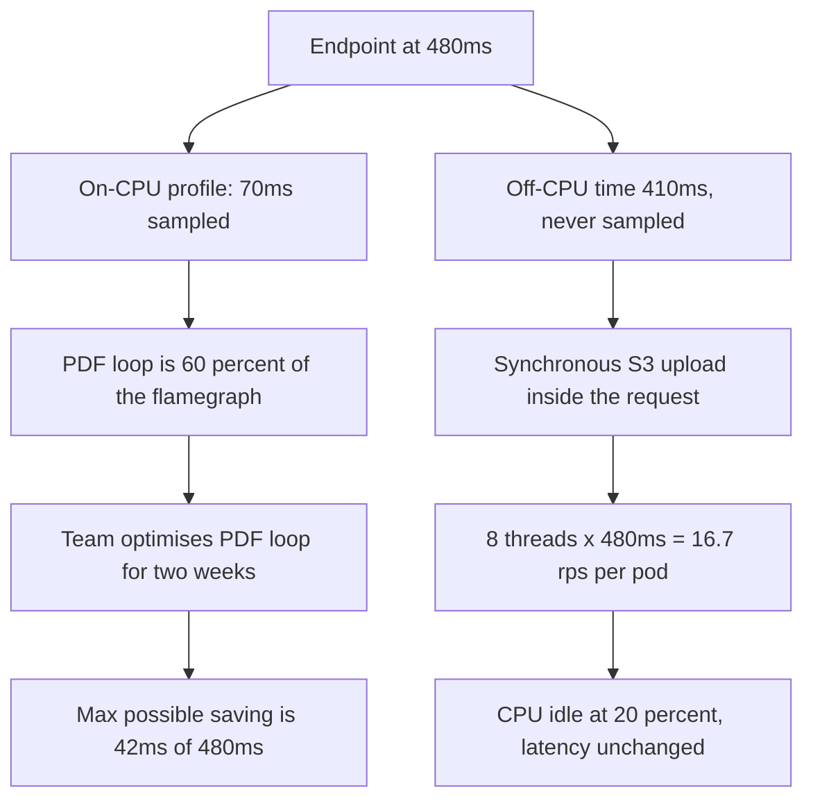
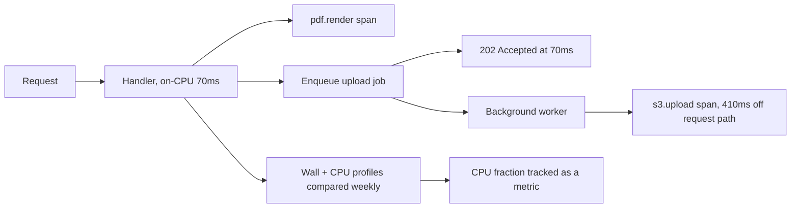

> **Scenario** - An invoicing endpoint takes 480 ms. The team spends two weeks optimising a PDF layout loop because it dominates the CPU flamegraph. Latency drops to 465 ms. The flamegraph was right about CPU and wrong about the request: 410 of those 480 ms were spent blocked on a synchronous S3 upload that never appears in an on-CPU profile.

## Why it matters

- On-CPU profilers only sample threads that are running. Time spent waiting is invisible, and most web requests are mostly waiting.
- Optimising the wrong half is not neutral - it burns weeks of engineering and leaves the SLO unchanged.
- Knowing which half you are in changes every subsequent decision: pool sizes, concurrency model, instance type, autoscaling metric.
- A wrong diagnosis often leads to scaling up (bigger CPUs) when the fix was scaling out or going async.
- Profiling under real concurrency reveals contention that single-request profiling structurally cannot see.

## Symptoms

| Signal | What you observe |
|---|---|
| CPU utilisation vs latency | Latency high, CPU under 40% - you are IO-bound |
| Flamegraph | One tall stack dominates, but total sampled time is far below request time |
| Thread states | Many threads `WAITING` / `TIMED_WAITING`, few `RUNNABLE` |
| `pidstat` output | Low `%usr`, non-trivial `%system`, high `%wait` |
| Latency under load | Grows while CPU stays flat |
| Span waterfall | A single long gap with no child spans inside it |
| Scaling behaviour | Doubling CPU does nothing; doubling replicas helps |

## How it breaks

Start with the arithmetic that distinguishes the two cases. For a single request:

- **wall time** = 480 ms (what the user feels)
- **on-CPU time** = 70 ms (what the profiler sampled)
- **off-CPU time** = 480 − 70 = **410 ms**

The CPU fraction is 70 / 480 = **14.6%**. An on-CPU flamegraph shows you the *shape* of 70 ms and says nothing about the other 410. If the PDF loop is 60% of that 70 ms - 42 ms - then eliminating it entirely saves 42 ms out of 480, an **8.75%** improvement. Two weeks bought 15 ms because 42 ms was the theoretical maximum and the loop was not fully removable.

Meanwhile, the wait ratio tells you the concurrency you need. With 6 cores per pod and Goetz's formula:

threads = cores × utilisation × (1 + wait/service) = 6 × 0.85 × (1 + 410/70) = 6 × 0.85 × 6.86 = **35 threads**

The service was configured with 8. At 8 threads per pod, max throughput is 8 / 0.480 = **16.7 req/s per pod**, while the CPU could support 6 cores / 0.070 s = **85 req/s** if threads were not the constraint. The pod was running at 20% of its CPU-limited capacity, and the CPU graph - 14.6% of 6 cores × 16.7 req/s ≈ 20% - looked "fine".

That is the whole failure: a profiler that only sees 14.6% of the request, used to plan work on 100% of it.



## Root causes

1. Using an on-CPU profiler to explain wall-clock latency.
2. No off-CPU or wall-clock profile, so blocking calls have no representation.
3. Distributed tracing spans too coarse to show the gap (one span for the whole handler).
4. Profiling a single request on a laptop, where there is no lock or pool contention.
5. Blocking IO performed inline instead of being queued for a background worker.
6. Thread pool sized as if the work were CPU-bound.
7. Instance type chosen for CPU when the bottleneck was network round-trips.

## How to solve it

### 1. Compute the CPU fraction before you profile anything

```bash
# Wall time from your latency histogram; CPU time from the process itself.
# Run a fixed 200-request burst and compare.

# CPU seconds consumed by the service during the burst
BEFORE=$(awk '{print ($14+$15)/'"$(getconf CLK_TCK)"'}' /proc/"$PID"/stat)
hey -n 200 -c 8 http://localhost:8080/api/invoices/render
AFTER=$(awk '{print ($14+$15)/'"$(getconf CLK_TCK)"'}' /proc/"$PID"/stat)

echo "cpu seconds: $(echo "$AFTER - $BEFORE" | bc)"
# 200 requests x 480ms wall = 96s of wall time in the handler.
# If cpu seconds is ~14s, CPU fraction is 14/96 = 14.6% -> IO-bound. Stop guessing.
```

Below roughly 30% CPU fraction, treat the service as IO-bound and go straight to step 3.

### 2. Read the flamegraph correctly

```bash
# Linux, whole process, 30 seconds at 99 Hz under real load
perf record -F 99 -g -p "$PID" -- sleep 30
perf script | stackcollapse-perf.pl | flamegraph.pl > oncpu.svg

# Java: async-profiler in wall-clock mode is the important one
java -jar async-profiler.jar -d 30 -e wall -t -f wall.html "$PID"
java -jar async-profiler.jar -d 30 -e cpu  -t -f cpu.html  "$PID"
```

How to read them:

- **Width = total samples, not slowness.** A wide frame means "much time was spent here", not "this function is slow".
- **Height means nothing.** Deep stacks are just deep call chains.
- **Compare the two graphs.** Frames that are wide in `wall.html` but narrow in `cpu.html` are your blocking calls. That diff is the entire diagnosis.
- **Look for plateaus, not spikes.** A flat wide plateau near the top is real work; a jagged top is sampling noise.
- **Check the total.** If `cpu.html` accounts for 14% of wall time, remember you are looking at 14% of the problem.

### 3. Profile off-CPU time explicitly

```bash
# eBPF: where do threads block, and for how long?
sudo /usr/share/bcc/tools/offcputime -p "$PID" -f 30 > offcpu.stacks
flamegraph.pl --title "Off-CPU" --countname us offcpu.stacks > offcpu.svg

# Python: yappi in wall-clock mode attributes time to blocking calls
python - <<'PY'
import yappi, app
yappi.set_clock_type("wall")      # "cpu" would hide every network call
yappi.start()
app.render_invoice("inv_10231")
yappi.stop()
yappi.get_func_stats().sort("ttot").print_all()
PY
```

### 4. Instrument the gap so you never need a profiler again

```ts
// src/tracing/spans.ts - a span around every boundary crossing
import { trace, SpanStatusCode } from '@opentelemetry/api'

const tracer = trace.getTracer('invoicing')

export async function timed<T>(name: string, fn: () => Promise<T>): Promise<T> {
  return tracer.startActiveSpan(name, async (span) => {
    const t0 = performance.now()
    try {
      return await fn()
    } catch (err) {
      span.setStatus({ code: SpanStatusCode.ERROR })
      throw err
    } finally {
      span.setAttribute('duration_ms', performance.now() - t0)
      span.end()
    }
  })
}

// Every external call gets its own span. The 410ms gap becomes a named span.
const pdf   = await timed('pdf.render', () => renderPdf(invoice))
const stored = await timed('s3.upload', () => s3.putObject(params))   // 410 ms
```

### 5. Fix according to the class you are in

IO-bound: move the blocking call out of the request path.

```ts
// The upload does not need to complete before the user sees a response.
const jobId = await queue.enqueue('invoice.upload', { invoiceId, pdfKey })
return reply.code(202).send({ status: 'processing', jobId })
// Request drops from 480ms to ~70ms. No PDF loop optimisation required.
```

CPU-bound: reduce work per request (better algorithm, cache, precompute) or add cores - in that order.

## Target design



## Tradeoffs

| Option | Pros | Cons | Choose when |
|---|---|---|---|
| On-CPU profiler only | Cheap, always available | Blind to all blocking | Service is genuinely CPU-bound |
| Wall-clock / off-CPU profiling | Sees the real request time | Noisier, more setup | CPU fraction below 30% |
| Distributed tracing spans | Always on, works in prod | Only shows what you instrumented | Cross-service latency |
| Move IO to a background job | Largest latency win | Response becomes eventual | Caller does not need the result |
| Async / non-blocking rewrite | Huge concurrency gain | New failure modes, big diff | Wait ratio above ~5:1 and staying |
| Bigger instances | One-line change | No effect when IO-bound | Profile shows high `%usr` |

## Verification checklist

- [ ] CPU fraction (CPU seconds / wall seconds in handler) is measured and recorded per endpoint.
- [ ] Both a wall-clock and an on-CPU profile exist for the top three endpoints.
- [ ] Every outbound call (DB, cache, HTTP, object store) has its own trace span.
- [ ] No trace has an unexplained gap longer than 20 ms.
- [ ] Profiles were captured under production-like concurrency, not single-request.
- [ ] Thread pool size matches the measured wait ratio, not a default.
- [ ] After the fix, p95 moved by roughly the amount the arithmetic predicted.

## Anti-patterns

- Optimising the widest frame in a CPU flamegraph without checking what fraction of the request it represents.
- Profiling on a laptop with one user and concluding anything about production contention.
- Reading flamegraph height as a cost signal.
- Wrapping the whole handler in one trace span and calling it observability.
- Adding CPU to an IO-bound service and reporting the cost increase as a scaling investment.
- Treating `%util` on a disk as proof of IO-bound behaviour when the wait is network.
- Sampling for 5 seconds and generalising to a diurnal traffic pattern.

## Related

- [Hot-path query optimisation that survives growth](/systems/performance-capacity/hot-path-query-optimization)
- [GC pauses and memory pressure in the tail](/systems/performance-capacity/gc-pauses-and-memory-pressure)
- [Amdahl, Gunther, and the ceiling on parallel speedup](/systems/performance-capacity/amdahl-and-parallel-limits)
