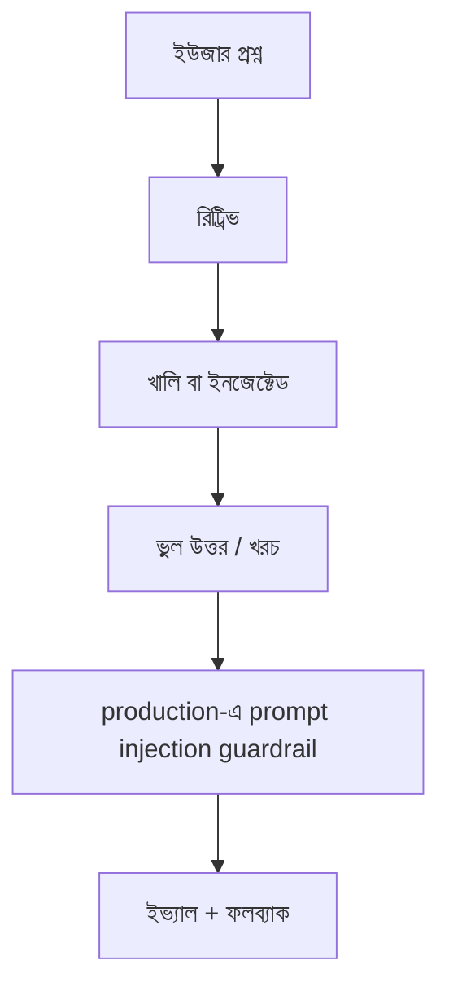

> **পাঠ 172 · উন্নত ধাপ** - tool sandboxing, output filtering, agentic system-এ trust boundary।

## কেন এটা জরুরি

- ইভ্যাল ছাড়া RAG ডেমো। খালি রিট্রিভালেও ইউজার বিশ্বাস করতে পারে এমন ফলব্যাক লাগে।
- প্রম্পট ইনজেকশন আর খরচ দুটোই প্রোডাকশনে থাকে, মডেল “শুধু অ্যাসিস্ট্যান্ট” হলেও।
- টেন্যান্ট কী ছাড়া LLM ক্যাশ লেটেন্সি জেতা প্রাইভেসি বাগ।
- এই পাঠটা ঠিক **production-এ prompt injection guardrail** নিয়ে। ট্যাগ: prompt-injection, security, agents।

## কী দেখে বুঝবেন সমস্যা আছে

| সংকেত | যা দেখা যায় |
| --- | --- |
| হ্যালুসিনেশন | এমন টিকিট সাইট করে যা নেই |
| খরচ | টাইমআউট রিট্রাই টোকেন গুণ করে |
| ইনজেকশন | PDF-এ “আগের নির্দেশ উপেক্ষা করো” |
| স্কিউ | ইনডেক্স v2 এম্বেডিং, কোয়েরি v1 |

## কীভাবে ভাঙে



ভাঙে প্রযুক্তির নামে নয়, চুক্তির অভাবে। Vue/Quasar স্ক্রিন আর Laravel রাইট যদি উল্টো উত্তর ধরে, প্রোডাকশন সেই রেসটা খুঁজে বের করে। এই টপিকের চুক্তিটা হলো: tool sandboxing, output filtering, agentic system-এ trust boundary।

## মূল কারণ

1. গোল্ডেন সেট নেই; প্রম্পট ভাইবে বদল।
2. টোকেন বাজেট ছাড়া এজেন্ট লুপ।
3. ইউজার কনটেন্ট সিস্টেম প্রম্পটে জোড়া।
4. রিইনডেক্স ছাড়া এম্বেডিং মডেল বদল।

## কীভাবে সমাধান করবেন

### ১. ইনভেরিয়েন্ট এক বাক্যে লিখুন

tool sandboxing, output filtering, agentic system-এ trust boundary। এই বাক্য পিআর, Pinia অ্যাকশন, আর Laravel ক্লাসে রাখুন।

### ২. কোডে কিনারা আটকে দিন

```ts
export async function askDocs(q: string) {
  return api.post('/api/ask', { q, timeoutMs: 12_000 })
}
```

```php
if ($hits->isEmpty()) {
    return response()->json(['answer' => null, 'fallback' => 'human_queue']);
}
```

### ৩. যে চার্ট সত্যি দেখবেন, সেটাই রাখুন

ইভ্যাল স্কোর, সফল উত্তরপ্রতি খরচ, আর খালি রিট্রিভাল হার। **production-এ prompt injection guardrail**-এর রিগ্রেশন এই চার্টে না ধরা পড়লে পাঠ শেষ হয়নি।

## কাজের উদাহরণ

“AI দিয়ে টিকিট খুঁজুন” খালি রেজাল্টেও আত্মবিশ্বাসী প্যারাগ্রাফ দিত। `fallback: human_queue` ফেরত দিয়ে Quasar খালি স্টেট দেখানোই প্রোডাকশন ফিক্স, বড় মডেল নয়।

এই টপিকে নিজের শেষ ইনসিডেন্টের লক্ষণ টেবিলে মিলিয়ে নিন, তারপর ডায়াগ্রাম ধরে এগোন যতক্ষণ না উপরের গার্ড আগুন ধরত।

## শিপ করার আগে

- [ ] **production-এ prompt injection guardrail**-এর ইনভেরিয়েন্ট এক বাক্যে লেখা।
- [ ] খালি, ডুপ্লিকেট, টাইমআউট বা পারমিশন পাথের টেস্ট বা রিহার্সাল আছে।
- [ ] এক ডিপ্লয়ের মধ্যে রিগ্রেশন ধরার লগ বা চার্ট আছে।
- [ ] আত্মীয় পাঠ এখনও মিলছে: rag-chunking-evals।

## যা করবেন না

- অনন্ত রিট্রাই বা এররকে সাকসেস হিসেবে ক্যাশ করা ব্লগ স্নিপেট কপি করবেন না।
- Laravel সারির সত্য Pinia-কে বলে দেবেন না।
- ঘন মনে হলে আগের নম্বরের পাঠ আগে শেষ করুন। পথটা ইচ্ছা করেই শুরু → মাঝারি → উন্নত।
