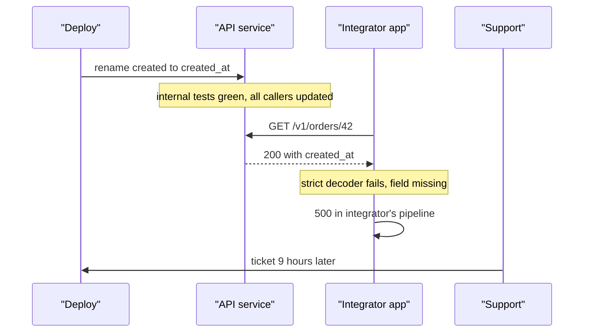
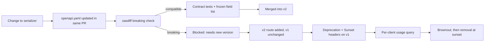

> **Scenario** - একটা cleanup PR consistency-র জন্য response field `created`-কে `created_at` করে দেয়। প্রতিটি internal test pass করে, কারণ সব internal caller একই commit-এ আপডেট হয়েছে। নয় ঘণ্টা পর তিন integrator down: একজন field positionally parse করত, একজনের strict JSON schema validator ছিল, আর একজন `created`-কে dictionary key হিসেবে ব্যবহার করত এমন report-এ যা এখন চুপচাপ `null` লেখে।

## Why it matters

- একবার third party আপনার JSON parse করলে response shape একটা contract - লিখে রাখুন বা না রাখুন। Field মুছে ফেলা breaking; type, nullability বদলানোও তাই।
- Integrator-এর ভাঙা আপনার error rate-এ দেখা যায় না। তাদের কোড 500 দেয়, আপনার endpoint 200 দেয়, আর আপনি পরদিন সকালে support ticket-এ জানেন।
- আপনি যত version বাঁচিয়ে রাখেন, প্রতিটি একটি স্থায়ী test matrix entry আর কোডে স্থায়ী branch। দুটো সামলানো যায়; পাঁচটা মানে একটা দল।
- Founder-দের জন্য: API stability একটা sales asset। "আমরা কখনো customer integration ভাঙিনি" এমন deal বন্ধ করে যা feature list পারে না।
- Unstable API-র খরচ দেয় আপনার customer-এর engineer-রা, মানে খরচটা আস্থায় - যা আবার গড়তে সবচেয়ে বেশি সময় লাগে।

## Symptoms

| Signal | What you observe |
|---|---|
| Support ticket | Deploy-এর কয়েক ঘণ্টার মধ্যে customer-এর integration failure, অথচ dashboard সুস্থ |
| Client-ভিত্তিক 4xx | এক integrator-এর error rate লাফায়, মোট traffic স্বাভাবিক দেখায় |
| Version sprawl | `v1`, `v2`, `v2.1` আর একটা undocumented `beta` সবই production routing-এ |
| Deprecation | ১৮ মাস আগে deprecated endpoint এখনো ৪% traffic নেয় |
| Schema drift | OpenAPI document আর service যা ফেরত দেয় তা মেলে না |
| পরিবর্তনের ভয় | কেউ serializer ছোঁয় না, কারণ কে কীসের উপর নির্ভর করে কেউ জানে না |

## How it breaks

মূল সমস্যা হলো আপনার test suite *আপনার* client-দের test করে। Internal caller change-এর সাথেই atomically আপডেট হয়, তাই সবুজ CI external contract নিয়ে কিছুই প্রমাণ করে না। External contract নির্ধারিত হয় consumer আসলে যা parse করে তা দিয়ে, আর সেটা না বানালে আপনি দেখতেই পান না।

Additive change সাধারণত নিরাপদ, কিন্তু সবসময় নয়: `additionalProperties: false` দেওয়া strict validator নতুন field-এ ভাঙে, আর strict decoding সহ generated client অজানা enum value reject করে। এজন্যই "আমরা শুধু যোগ করি" ভালো নিয়ম হলেও contract test দিয়ে enforce করতে হয়, আর বাস্তবে নতুন enum value additive মনে হলেও breaking।



## Root causes

1. Machine-readable contract নেই, তাই review-এর সময় "breaking" মানে মতামতের ব্যাপার।
2. Consumer-driven contract test নেই, তাই একমাত্র integration test হলো production।
3. URL prefix দিয়ে versioning, কিন্তু নতুন prefix কখন হবে তার policy নেই - মেজাজমাফিক হয়।
4. Deprecation clock নেই: endpoint deprecated লেখা থাকে, কিন্তু কিছুই অপসারণ বাধ্য করে না।
5. Per-client usage telemetry নেই, তাই "এই field এখনো কে ব্যবহার করে?" প্রশ্নের উত্তর নেই।
6. Serializer সরাসরি database model থেকে আসে, তাই column rename স্বয়ংক্রিয়ভাবে API change।

## How to solve it

### 1. Contract-কে একটা file বানান, CI-তে diff করুন

```yaml
# openapi.yaml - the contract, committed and reviewed like code.
components:
  schemas:
    Order:
      type: object
      required: [id, created_at, status, total_cents]
      properties:
        id:          { type: string, format: uuid }
        created_at:  { type: string, format: date-time }
        status:      { type: string, enum: [pending, paid, cancelled] }
        total_cents: { type: integer }
```

```bash
# CI gate: fail the build on a breaking diff against the merge base.
npx oasdiff breaking \
  <(git show origin/main:openapi.yaml) openapi.yaml \
  --fail-on ERR
```

এটি বিচারমূলক সিদ্ধান্তকে build failure-এ বদলায়। Removal, type change বা কঠোরতর `required` fail করে; optional property যোগ pass করে।

### 2. Wire shape-কে database model থেকে আলাদা করুন

```php
// app/Http/Resources/OrderResource.php - explicit, not reflective.
class OrderResource extends JsonResource
{
    public function toArray($request): array
    {
        return [
            'id'          => (string) $this->uuid,
            'created_at'  => $this->created_at->toIso8601String(),
            'status'      => $this->public_status,   // mapped, not the column
            'total_cents' => (int) $this->total_cents,
        ];
    }
}
```

স্পষ্ট resource class মানে database migration ভুল করে API বদলাতে পারে না। Mapping-ই contract, আর সেটা diff-এ দেখা যায়।

### 3. Consumer-driven contract test যোগ করুন

```ts
// tests/contract/orders.spec.ts - asserts the promises, not the implementation.
import { describe, expect, it } from 'vitest'

describe('GET /v1/orders/:id contract', () => {
  it('keeps every promised field with its promised type', async () => {
    const body = await fetchJson('/v1/orders/00000000-0000-0000-0000-000000000001')
    expect(typeof body.id).toBe('string')
    expect(typeof body.created_at).toBe('string')
    expect(['pending', 'paid', 'cancelled']).toContain(body.status)
    expect(Number.isInteger(body.total_cents)).toBe(true)
  })

  it('never removes a field that was present in v1', async () => {
    const body = await fetchJson('/v1/orders/00000000-0000-0000-0000-000000000001')
    for (const field of V1_FROZEN_FIELDS) {
      expect(body, `v1 dropped ${field}`).toHaveProperty(field)
    }
  })
})
```

`V1_FROZEN_FIELDS` repository-তে রাখা একটি literal array। এটি কেবল বাড়ে, আর কোনো entry সরাতে ইচ্ছাকৃত PR লাগে যা reviewer-এর চোখে পড়ে।

### 4. Deprecate করার আগে field-level ব্যবহার মাপুন

যা মাপা যায় না তা deprecate করা যায় না। Sparse-fieldset parameter দিয়ে কোন client কোন field পড়ে তা log করুন, অন্তত per-client endpoint ও version ব্যবহার রাখুন।

```sql
-- Who is still on the old version, and how much do they matter?
SELECT client_id,
       api_version,
       count(*)                                   AS calls_30d,
       max(requested_at)                          AS last_seen
  FROM api_access_log
 WHERE requested_at > now() - interval '30 days'
   AND api_version = 'v1'
 GROUP BY client_id, api_version
 ORDER BY calls_30d DESC;
```

### 5. আসল signal সহ deprecation clock চালান

ঘোষণা, তারপর in-band signal, তারপর ঘোষিত তারিখে sunset।

```nginx
# Deprecation and Sunset headers are machine-readable (RFC 8594 / draft-deprecation).
location /v1/ {
    add_header Deprecation "true" always;
    add_header Sunset "Tue, 30 Jun 2026 23:59:59 GMT" always;
    add_header Link "</v2/>; rel=\"successor-version\"" always;
    proxy_pass http://api_v1;
}
```

সাথে brownout রাখুন: sunset-এর এক মাস আগে নির্ধারিত সময়ে পাঁচ মিনিট deprecated version-এ 503 দিন, তারপর এক ঘণ্টা আগে আবার। যাঁরা email পড়েন না, তাঁরা brownout ঠিকই খেয়াল করেন।

### 6. ইচ্ছাকৃতভাবে, কদাচিৎ version করুন

Version-এর ভেতরে field additive ভাবে যোগ করুন। নতুন major version কেবল তখনই, যখন field মুছতে হবে বা type বদলাতে হবে। দুটি live version লক্ষ্য; অনির্দিষ্টকাল নয়, নির্দিষ্ট সময়ের জন্য overlap রাখুন।

## Target design



## Tradeoffs

| Option | Pros | Cons | Choose when |
|---|---|---|---|
| URL versioning (`/v2/`) | স্পষ্ট, cacheable, route ও document সহজ | Route ও handler duplicate; sprawl বাড়ায় | External integrator সহ public API |
| Header versioning | পরিষ্কার URL; এক resource identity | Log ও browser-এ অদৃশ্য; caching-এ `Vary` লাগে | সুশৃঙ্খল client সহ internal API |
| শুধু additive, version নয় | Matrix নেই, customer-এর migration নেই | Schema-তে চিরকাল dead field জমে | ছোট surface, দীর্ঘ integration |
| GraphQL field deprecation | Per-field usage data built-in; নিখুঁত deprecation | ভিন্ন operational profile; query cost control লাগে | ভিন্ন field subset চাওয়া অনেক client |

## Verification checklist

- [ ] `openapi.yaml` repository-তে আছে আর প্রতি PR-এ CI merge base-এর সাথে diff করে।
- [ ] Breaking-change check অন্তত একবার সত্যিই fail করেছে, অর্থাৎ ঠিকভাবে যুক্ত।
- [ ] প্রতি major version-এ frozen-field তালিকা আছে এবং test দিয়ে assert করা।
- [ ] গত ৩০ দিনের per-client, per-version ব্যবহার query করা যায়।
- [ ] Deprecated endpoint `Deprecation` ও `Sunset` header পাঠায়, `curl -I` দিয়ে যাচাই করা।
- [ ] অন্তত একটি brownout চালানো হয়েছে ও তার support-ticket সংখ্যা লেখা আছে।
- [ ] দুইয়ের বেশি major version production traffic নেয় না।

## Anti-patterns

- Cleanup PR-এ "consistency"-র জন্য field rename - ভেতরের পরিপাটি বাইরের outage-এর দাম নয়।
- সরাসরি ORM model থেকে response বানানো, ফলে যেকোনো column change মানেই API change।
- Sunset তারিখ ছাড়া endpoint deprecated ঘোষণা, যা নিশ্চিত করে সেটা চিরকাল থাকবে।
- বিদ্যমান field-এ নতুন enum value যোগ করে সেটাকে additive বলা; strict client অজানা value reject করে।
- কেউ subscribe করে না এমন changelog-এ deprecation ঘোষণা করে sunset-এর দিন অবাক হওয়া।

## Related

- [Multi-tenancy isolation models](/systems/product-platform/multi-tenancy-isolation-models)
- [Feature flags and kill switches that stay clean](/systems/product-platform/feature-flags-and-kill-switches)
- [Strangler fig migrations that finish](/systems/product-platform/strangler-fig-migration)
