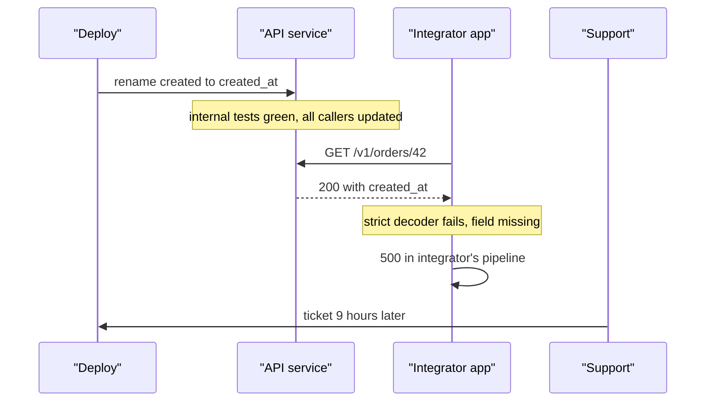
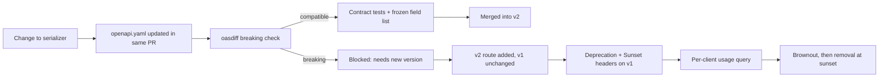

> **Scenario** - A cleanup PR renames the response field `created` to `created_at` for consistency. It passes every internal test because every internal caller was updated in the same commit. Nine hours later, three integrators are down: one parsed the field positionally, one had a strict JSON schema validator, and one was using `created` as a dictionary key in a report that now silently writes `null`.

## Why it matters

- Once a third party parses your JSON, the response shape is a contract whether or not you wrote it down. Removing a field is a breaking change; so is changing its type, its nullability, or its ordering if anyone is unwise enough to depend on that.
- Integrator breakage does not show up in your error rate. Their code 500s, your endpoint returns 200, and you find out through a support ticket the next morning.
- Every version you keep alive is a permanent test matrix entry and a permanent branch in the code. Two versions is manageable; five is a team.
- For founders: API stability is a sales asset. "We have never broken a customer integration" closes deals that a feature list cannot.
- The cost of an unstable API is paid by your customers' engineers, which means it is paid in trust, which is the slowest thing to rebuild.

## Symptoms

| Signal | What you observe |
|---|---|
| Support tickets | Integration failures reported by customers within hours of a deploy, with a healthy dashboard |
| 4xx by client | A single integrator's error rate jumps while overall traffic looks normal |
| Version sprawl | `v1`, `v2`, `v2.1`, and an undocumented `beta` all live in production routing |
| Deprecation | Endpoints marked deprecated 18 months ago still serve 4% of traffic |
| Schema drift | The OpenAPI document does not match what the service actually returns |
| Change fear | Nobody will touch the serializer because nobody knows who depends on what |

## How it breaks

The core problem is that your test suite tests *your* clients. Internal callers are updated atomically with the change, so a green CI run proves nothing about the external contract. The external contract is defined by what consumers actually parse, and you have no visibility into that unless you build it.

Additive changes are usually safe, but not always: adding a field breaks strict schema validators configured with `additionalProperties: false`, and a client generated from your OpenAPI document with strict decoding will reject an unknown enum value. This is why "we only add" is a good rule that still needs a contract test to enforce, and why new enum values are a breaking change in practice even though they feel additive.



## Root causes

1. No machine-readable contract, so "breaking" is a matter of opinion at review time.
2. No consumer-driven contract tests, so the only integration test is production.
3. Versioning by URL prefix with no policy for when a new prefix is created, so it happens by mood.
4. No deprecation clock: endpoints are marked deprecated but nothing ever forces removal.
5. No per-client usage telemetry, so nobody can answer "who still uses this field?"
6. Serializers derived directly from database models, so a column rename becomes an API change automatically.

## How to solve it

### 1. Make the contract a file, and diff it in CI

```yaml
# openapi.yaml - the contract, committed and reviewed like code.
components:
  schemas:
    Order:
      type: object
      required: [id, created_at, status, total_cents]
      properties:
        id:          { type: string, format: uuid }
        created_at:  { type: string, format: date-time }
        status:      { type: string, enum: [pending, paid, cancelled] }
        total_cents: { type: integer }
```

```bash
# CI gate: fail the build on a breaking diff against the merge base.
npx oasdiff breaking \
  <(git show origin/main:openapi.yaml) openapi.yaml \
  --fail-on ERR
```

This converts a judgement call into a build failure. A removal, a type change, or a tightened `required` list fails; adding an optional property passes.

### 2. Decouple the wire shape from the database model

```php
// app/Http/Resources/OrderResource.php - explicit, not reflective.
class OrderResource extends JsonResource
{
    public function toArray($request): array
    {
        return [
            'id'          => (string) $this->uuid,
            'created_at'  => $this->created_at->toIso8601String(),
            'status'      => $this->public_status,   // mapped, not the column
            'total_cents' => (int) $this->total_cents,
        ];
    }
}
```

An explicit resource class means a database migration cannot change the API by accident. The mapping is the contract, and it shows up in a diff.

### 3. Add consumer-driven contract tests

```ts
// tests/contract/orders.spec.ts - asserts the promises, not the implementation.
import { describe, expect, it } from 'vitest'

describe('GET /v1/orders/:id contract', () => {
  it('keeps every promised field with its promised type', async () => {
    const body = await fetchJson('/v1/orders/00000000-0000-0000-0000-000000000001')
    expect(typeof body.id).toBe('string')
    expect(typeof body.created_at).toBe('string')
    expect(['pending', 'paid', 'cancelled']).toContain(body.status)
    expect(Number.isInteger(body.total_cents)).toBe(true)
  })

  it('never removes a field that was present in v1', async () => {
    const body = await fetchJson('/v1/orders/00000000-0000-0000-0000-000000000001')
    for (const field of V1_FROZEN_FIELDS) {
      expect(body, `v1 dropped ${field}`).toHaveProperty(field)
    }
  })
})
```

`V1_FROZEN_FIELDS` is a literal array checked into the repository. It only ever grows, and removing an entry requires a deliberate PR that a reviewer will notice.

### 4. Instrument field-level usage before deprecating anything

You cannot deprecate what you cannot measure. Log which fields each client actually reads by offering a sparse-fieldset parameter, or at minimum record per-client endpoint and version usage.

```sql
-- Who is still on the old version, and how much do they matter?
SELECT client_id,
       api_version,
       count(*)                                   AS calls_30d,
       max(requested_at)                          AS last_seen
  FROM api_access_log
 WHERE requested_at > now() - interval '30 days'
   AND api_version = 'v1'
 GROUP BY client_id, api_version
 ORDER BY calls_30d DESC;
```

### 5. Run a deprecation clock with real signals

Announce, then signal in-band, then sunset on a stated date.

```nginx
# Deprecation and Sunset headers are machine-readable (RFC 8594 / draft-deprecation).
location /v1/ {
    add_header Deprecation "true" always;
    add_header Sunset "Tue, 30 Jun 2026 23:59:59 GMT" always;
    add_header Link "</v2/>; rel=\"successor-version\"" always;
    proxy_pass http://api_v1;
}
```

Pair this with brownouts: return 503 for the deprecated version for five minutes at a scheduled time, a month before sunset, then an hour before. Integrators who ignore emails notice a brownout.

### 6. Version deliberately, and rarely

Add fields additively inside a version. Create a new major version only when a field must be removed or a type must change. Two live versions is the working target; overlap them for a fixed window rather than indefinitely.

## Target design



## Tradeoffs

| Option | Pros | Cons | Choose when |
|---|---|---|---|
| URL versioning (`/v2/`) | Obvious, cacheable, easy to route and document | Duplicated routes and handlers; encourages sprawl | Public APIs with external integrators |
| Header versioning | Clean URLs; one resource identity | Invisible in logs and browsers; caching needs `Vary` | Internal APIs with disciplined clients |
| Additive-only, never version | No matrix, no migration burden on customers | Schema accumulates dead fields forever | Small surface area, long-lived integrations |
| GraphQL field deprecation | Per-field usage data is built in; precise deprecation | Different operational profile; query cost control needed | Many clients needing different field subsets |

## Verification checklist

- [ ] `openapi.yaml` is in the repository and a CI job diffs it against the merge base on every PR.
- [ ] The breaking-change check has actually failed at least once, proving it is wired correctly.
- [ ] A frozen-field list exists per major version and is asserted by a test.
- [ ] Per-client, per-version usage is queryable for the last 30 days.
- [ ] Deprecated endpoints emit `Deprecation` and `Sunset` headers, verified with `curl -I`.
- [ ] At least one brownout has been executed and its support-ticket volume recorded.
- [ ] No more than two major versions serve production traffic.

## Anti-patterns

- Renaming fields "for consistency" in a cleanup PR - internal tidiness is not worth an external outage.
- Generating responses directly from ORM models, so any column change is an API change.
- Marking an endpoint deprecated with no sunset date, which guarantees it lives forever.
- Adding a new enum value to an existing field and calling it additive; strict clients reject unknown values.
- Announcing deprecation only in a changelog nobody subscribes to, then being surprised at the sunset.

## Related

- [Multi-tenancy isolation models](/systems/product-platform/multi-tenancy-isolation-models)
- [Feature flags and kill switches that stay clean](/systems/product-platform/feature-flags-and-kill-switches)
- [Strangler fig migrations that finish](/systems/product-platform/strangler-fig-migration)
