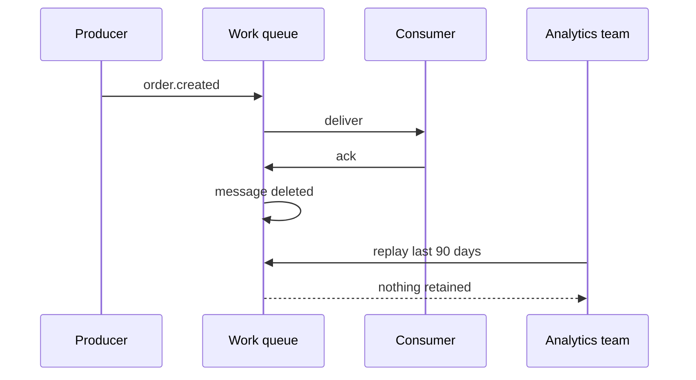
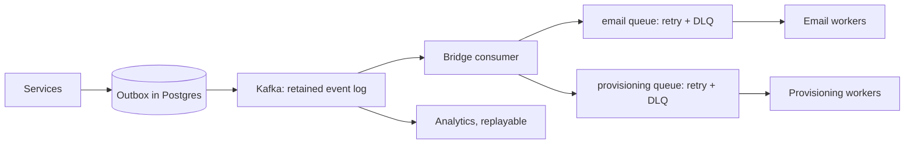

> **Scenario** — একটা দল RabbitMQ-তে order processing বানায়, কারণ সেটা আগে থেকেই চলছিল। আঠারো মাস পর analytics-এর দরকার হয় শেষ ৯০ দিনের order event থেকে একটা derived table পুনর্গঠন করা। Message গুলো process হওয়ার সঙ্গে সঙ্গেই ack হয়ে মুছে গেছে। একমাত্র উপায় একটা database backfill script, যা লিখতে চার দিন লাগে আর event stream বিশ্বস্তভাবে পুনরুৎপাদন করে না।

## Why it matters

- Queue আর stream আলাদা সমস্যা সমাধান করে। Queue কাজ বিলি করে ভুলে যায়; stream একটা ordered log রাখে আর আপনাকে replay করতে দেয়।
- ভুল বাছাই উল্টানো ব্যয়বহুল: producer, consumer, delivery assumption ও operational tooling সব বদলাতে হয়।
- Async system-এ replay সবচেয়ে মূল্যবান recovery tool, আর work queue তার কিছুই দেয় না।
- উল্টোদিকে, সাধারণ job distribution-এ stream ব্যবহার করলে partition management, offset handling ও consumer group semantics টেনে আনতে হয় যা দরকারই ছিল না।
- ভুল সিদ্ধান্তটা সাধারণত বছর পরে ধরা পড়ে, যখন নতুন consumer-এর এমন history দরকার হয় যা কখনো রাখা হয়নি।

## Symptoms

| Signal | What you observe |
|---|---|
| Backfill requests | "গত মাসটা replay করা যাবে?" — উত্তর "না" |
| Consumer additions | নতুন subscriber যোগ করতে producer বদলাতে হয় |
| Partition pressure | ২০০ concurrent worker পেতে ২০০ partition-এর job queue |
| Offset confusion | একটা খারাপ message আবার process করতে দল হাতে offset reset করছে |
| Retention surprises | ৭ দিন পর message উধাও, যা কেউ স্থায়ী ধরে নিয়েছিল |
| Head-of-line blocking | একটা ধীর record পুরো partition-এর অসম্পর্কিত কাজ আটকে দেয় |

## How it breaks

Work queue ack-এ message ধ্বংস করে। এটা bug নয় — এটাই queue-কে দক্ষ করে, আর এজন্যই depth অর্থবহ metric। কিন্তু এর মানে message-ই একমাত্র copy, তাই ভুলভাবে ack করা consumer bug স্থায়ীভাবে data হারায়। Stream retention window পর্যন্ত record রাখে এবং প্রতি consumer group-এর position track করে, তাই bug rewind করে ঠিক করা যায়।

উল্টো failure: দল job queue-এর জন্য Kafka নেয়, তারপর আবিষ্কার করে per-job retry, per-job delay ও per-job DLQ routing দরকার। Kafka-তে এর কোনোটাই native নেই, কারণ partition একটা sequential log, স্বাধীনভাবে retry করার মতো item-এর সেট নয়। এক record retry করে এগোনো মানে হয় failure পেরিয়ে commit (data loss), নয়তো partition block (stall)।



## Root causes

1. Retention ও replay প্রয়োজন নয়, বরং যা ইতিমধ্যে deployed তার ভিত্তিতে বাছাই।
2. "asynchronous" আর "queue" গুলিয়ে ফেলা — async হলো call-এর বৈশিষ্ট্য, transport-এর নয়।
3. Event কতদিন replayable থাকতে হবে তার কোনো ঘোষিত প্রয়োজন নেই।
4. ভবিষ্যতের consumer design time-এ জানা থাকবে ধরে নেওয়া।
5. Partition count-কে concurrency dial হিসেবে ব্যবহার করা, যা throughput-কে storage layout-এর সঙ্গে বেঁধে ফেলে।
6. Command (এটা একবার করো) আর event (এটা ঘটেছে) একই ধরনের message ভাবা।

## How to solve it

### 1. Decide with three questions

- **কেউ কি এটা আবার পড়বে?** হ্যাঁ হলে — এমনকি অনুমানভিত্তিকভাবে, এমনকি analytics-এর জন্য — আপনার stream বা durable history সহ outbox দরকার।
- **এটা command না event?** `SendWelcomeEmail` command: একটাই handler, retryable, মুছে ফেলার যোগ্য। `UserSignedUp` event: অনেক reader, retained।
- **per-item retry লাগবে?** স্বাধীন অগ্রগতি সহ per-item retry queue-এর ক্ষমতা। log-এ position ভাগ করা।

### 2. Model the message accordingly

```ts
// Command: imperative, single handler, safe to delete after success
type SendWelcomeEmail = {
  kind: 'command'
  name: 'send_welcome_email'
  userId: string
  idempotencyKey: string
}

// Event: past tense, immutable fact, retained for replay
type UserSignedUp = {
  kind: 'event'
  name: 'user.signed_up'
  eventId: string
  occurredAt: string
  userId: string
  plan: 'free' | 'pro'
}
```

### 3. Run both, deliberately

পরিণত architecture-এ সাধারণত stream থাকে system of record হিসেবে, আর queue থাকে work distribution-এর জন্য। একটা bridge consumer stream পড়ে command enqueue করে।

```ts
await consumer.run({
  eachMessage: async ({ message }) => {
    const event = parse(message.value)
    if (event.name !== 'user.signed_up') return
    await queue.add('send_welcome_email', {
      userId: event.userId,
      idempotencyKey: `welcome:${event.eventId}`,
    }, { attempts: 5, backoff: { type: 'exponential', delay: 2000 } })
  },
})
```

Stream দেয় replay; queue দেয় per-job retry ও DLQ। কাউকে অন্যের কাজ করতে বলা হয় না।

### 4. Set retention against the real recovery requirement

```yaml
# kafka topic config
retention.ms: 2592000000        # 30 days
cleanup.policy: delete
min.insync.replicas: 2
```

পরিবর্তনের ইতিহাস নয়, entity state রাখতে হলে log compaction প্রতি key-র সর্বশেষ মান অনির্দিষ্টকাল রাখে:

```yaml
cleanup.policy: compact
min.cleanable.dirty.ratio: 0.1
```

### 5. Size partitions for consumers, not for throughput alone

Partition count আপনার সর্বোচ্চ consumer parallelism ঠিক করে এবং কমানো যায় না। `max_expected_consumers × 1.5` নিন, "যদি লাগে" বলে ২০০ নয় — প্রতিটি partition file handle, replication traffic ও rebalance time খরচ করে।

### 6. If you already chose wrong, add an outbox

দীর্ঘ retention সহ একটা outbox table সবকিছু migrate না করেই work queue-এর ওপরে replay দেয়। এটা stream নয়, কিন্তু একটা table-এর দামে "গত মাসে কী ঘটেছিল" প্রশ্নের উত্তর দেয়।

## Target design



## Tradeoffs

| Option | Pros | Cons | Choose when |
|---|---|---|---|
| Work queue (RabbitMQ, SQS, Redis) | per-job retry, DLQ, delay, সহজ scaling | replay নেই, ack-এ message মুছে যায় | command, background job |
| Log stream (Kafka, Pulsar) | replay, একাধিক reader, per-key ordering | per-record retry নেই, partition সামলাতে হয় | event, analytics, CDC |
| Both, bridged | প্রতিটি tool তার শক্তিতে ব্যবহৃত | দুটো system চালাতে হয় | বেশিরভাগ পরিণত event-driven platform |
| Database table as queue | business data-র সঙ্গে transactional, queryable | polling, সীমিত throughput | কম volume, কঠোর consistency |
| Compacted topic | প্রতি key-র সর্বশেষ state চিরকাল থাকে | মাঝের পরিবর্তনের ইতিহাস হারায় | entity snapshot, config বিতরণ |

## Verification checklist

- [ ] analytics ও data দলকে জিজ্ঞেস করুন কতদূর পিছিয়ে replay লাগবে, আর সেই সংখ্যা topic config-এ লিখুন।
- [ ] producer পরিবর্তন বা deploy coordination ছাড়াই নতুন consumer যোগ করা যায় কিনা যাচাই করুন।
- [ ] ২৪ ঘণ্টার event staging consumer-এ replay করে derived state production-এর সঙ্গে মেলান।
- [ ] প্রতিটি command path-এ per-job retry ও DLQ আছে কিনা দেখুন, শুধু event path-এ নয়।
- [ ] partition count প্রত্যাশিত peak consumer count-এর অন্তত সমান এবং তার ২×-এর বেশি নয় কিনা যাচাই করুন।
- [ ] broker restart test-এ retention ও `min.insync.replicas` টিকে থাকে কিনা দেখুন।

## Anti-patterns

- Kafka-কে job queue বানিয়ে per-message retry নকল করতে ঘরে-তৈরি retry topic ladder বানানো।
- "ইতিহাসের জন্য" consumer-হীন queue রেখে RabbitMQ-কে event log বানানো।
- তখন storage সস্তা মনে হয়েছিল বলে প্রতিটি topic-এ `retention.ms: -1` দেওয়া।
- key ব্যবহার শুরুর পর throughput বাড়াতে partition যোগ করা, যা ordering ভাঙে।
- fanout exchange-এ command publish করা, ফলে দুটো service দুজনেই সেটা চালায়।
- দলের পরিচিতি দেখে সিদ্ধান্ত নিয়ে সেটাকে requirement হিসেবে নথিভুক্ত করা।

## Related

- [Ordered processing with partition keys](/systems/messaging-async/ordered-processing-with-partitions)
- [Fan-out topologies and duplicate control](/systems/messaging-async/fan-out-and-duplicate-control)
- [Consumer lag, autoscaling, and drain time](/systems/messaging-async/consumer-lag-and-scaling)
