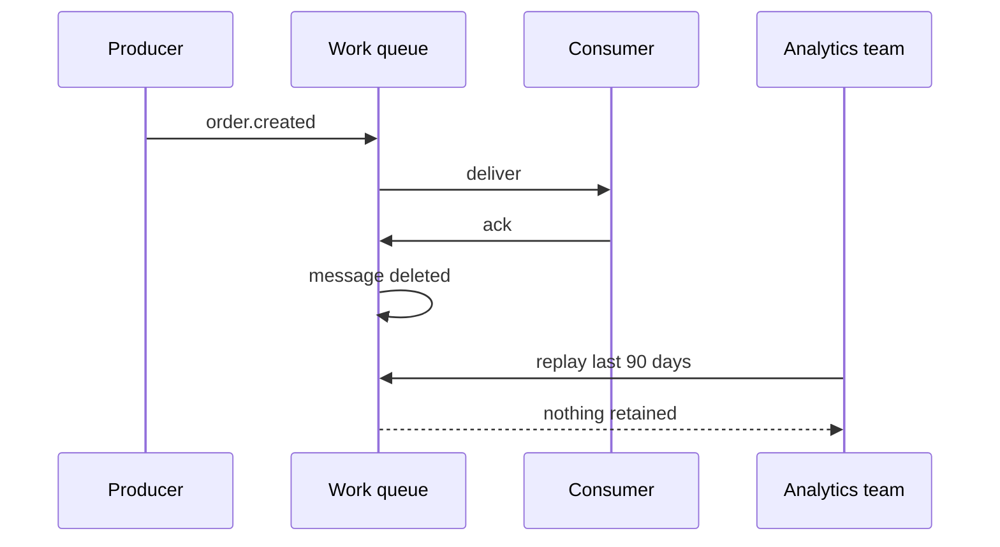
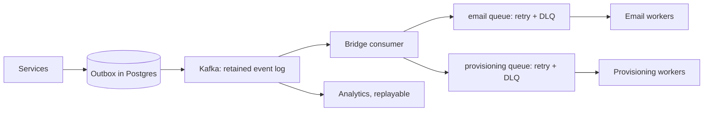

> **Scenario** — A team builds order processing on RabbitMQ because it was already running. Eighteen months later, analytics needs to rebuild a derived table from the last 90 days of order events. The messages were acked and deleted the moment they were processed. The only recovery path is a database backfill script that takes four days to write and does not reproduce the event stream faithfully.

## Why it matters

- Queues and streams solve different problems. A queue distributes work and forgets; a stream retains an ordered log and lets you replay it.
- Choosing wrong is expensive to reverse: producers, consumers, delivery assumptions, and operational tooling all change.
- Replay is the single most valuable recovery tool in async systems, and a work queue gives you none of it.
- Conversely, using a stream for simple job distribution imports partition management, offset handling, and consumer group semantics you did not need.
- The wrong choice usually surfaces years later, when a new consumer needs history that was never kept.

## Symptoms

| Signal | What you observe |
|---|---|
| Backfill requests | "Can we replay last month?" answered with "no" |
| Consumer additions | Adding a subscriber requires the producer to change |
| Partition pressure | A job queue with 200 partitions to get 200 concurrent workers |
| Offset confusion | Teams manually resetting offsets to reprocess a single bad message |
| Retention surprises | Messages disappearing after 7 days that someone assumed were permanent |
| Head-of-line blocking | One slow record stalls an entire partition of unrelated work |

## How it breaks

A work queue destroys the message on ack. That is not a bug — it is what makes queues efficient, and it is why depth is a meaningful metric. But it means the message is the only copy, so a consumer bug that acks incorrectly loses data permanently. A stream keeps records for a retention window and tracks position per consumer group, so a bug is fixable by rewinding.

The mirrored failure: teams pick Kafka for a job queue, then discover they need per-job retry, per-job delay, and per-job DLQ routing. Kafka has none of these natively, because a partition is a sequential log, not a set of independently retryable items. Retrying one record while continuing means either committing past a failure (data loss) or blocking the partition (stall).



## Root causes

1. Choosing based on what is already deployed rather than on retention and replay requirements.
2. Conflating "asynchronous" with "queue" — async is a property of the call, not of the transport.
3. No stated requirement for how long events must remain replayable.
4. Assuming future consumers will be known at design time.
5. Using partition count as a concurrency dial, which couples throughput to storage layout.
6. Treating commands (do this once) and events (this happened) as the same kind of message.

## How to solve it

### 1. Decide with three questions

- **Does anyone need to read this again?** If yes — even hypothetically, even for analytics — you need a stream or an outbox with durable history.
- **Is this a command or an event?** `SendWelcomeEmail` is a command: exactly one handler, retryable, deletable. `UserSignedUp` is an event: many readers, retained.
- **Is per-item retry required?** Per-item retry with independent progress is a queue capability. In a log, position is shared.

### 2. Model the message accordingly

```ts
// Command: imperative, single handler, safe to delete after success
type SendWelcomeEmail = {
  kind: 'command'
  name: 'send_welcome_email'
  userId: string
  idempotencyKey: string
}

// Event: past tense, immutable fact, retained for replay
type UserSignedUp = {
  kind: 'event'
  name: 'user.signed_up'
  eventId: string
  occurredAt: string
  userId: string
  plan: 'free' | 'pro'
}
```

### 3. Run both, deliberately

The common mature architecture is a stream as the system of record plus queues for work distribution. A bridge consumer reads the stream and enqueues commands.

```ts
await consumer.run({
  eachMessage: async ({ message }) => {
    const event = parse(message.value)
    if (event.name !== 'user.signed_up') return
    await queue.add('send_welcome_email', {
      userId: event.userId,
      idempotencyKey: `welcome:${event.eventId}`,
    }, { attempts: 5, backoff: { type: 'exponential', delay: 2000 } })
  },
})
```

The stream gives replay; the queue gives per-job retry and DLQ. Neither is asked to do the other's job.

### 4. Set retention against the real recovery requirement

```yaml
# kafka topic config
retention.ms: 2592000000        # 30 days
cleanup.policy: delete
min.insync.replicas: 2
```

For entity state rather than a history of changes, log compaction keeps the latest value per key indefinitely:

```yaml
cleanup.policy: compact
min.cleanable.dirty.ratio: 0.1
```

### 5. Size partitions for consumers, not for throughput alone

Partition count sets your maximum consumer parallelism and cannot be reduced. Pick `max_expected_consumers × 1.5`, not 200 "just in case" — every partition costs file handles, replication traffic, and rebalance time.

### 6. If you already chose wrong, add an outbox

An outbox table with long retention gives replay on top of a work queue without migrating everything. It is not a stream, but it answers "what happened last month" for the price of one table.

## Target design



## Tradeoffs

| Option | Pros | Cons | Choose when |
|---|---|---|---|
| Work queue (RabbitMQ, SQS, Redis) | Per-job retry, DLQ, delay, easy scaling | No replay, message deleted on ack | Commands, background jobs |
| Log stream (Kafka, Pulsar) | Replay, multiple readers, ordering per key | No per-record retry, partition management | Events, analytics, CDC |
| Both, bridged | Each tool used for its strength | Two systems to operate | Most mature event-driven platforms |
| Database table as queue | Transactional with business data, queryable | Polling, limited throughput | Low volume, strong consistency needs |
| Compacted topic | Latest state per key kept forever | History of intermediate changes lost | Entity snapshots, config distribution |

## Verification checklist

- [ ] Ask the analytics and data teams how far back they will need to replay, and write the number in the topic config.
- [ ] Confirm a new consumer can be added without a producer change or a deploy coordination.
- [ ] Replay 24 hours of events into a staging consumer and verify the derived state matches production.
- [ ] Check that per-job retry and DLQ exist for every command path, not just the event path.
- [ ] Verify partition count is at least the expected peak consumer count and no more than 2× it.
- [ ] Confirm retention and `min.insync.replicas` survive a broker restart test.

## Anti-patterns

- Using Kafka as a job queue and building a homegrown retry topic ladder to fake per-message retry.
- Using RabbitMQ as an event log by keeping a queue with no consumer "for history".
- Setting `retention.ms: -1` on every topic because storage seemed cheap at the time.
- Adding partitions to increase throughput after keys are already in use, which breaks ordering.
- Publishing commands to a fanout exchange so two services both execute them.
- Deciding based on team familiarity and documenting the decision as a requirement.

## Related

- [Ordered processing with partition keys](/systems/messaging-async/ordered-processing-with-partitions)
- [Fan-out topologies and duplicate control](/systems/messaging-async/fan-out-and-duplicate-control)
- [Consumer lag, autoscaling, and drain time](/systems/messaging-async/consumer-lag-and-scaling)
