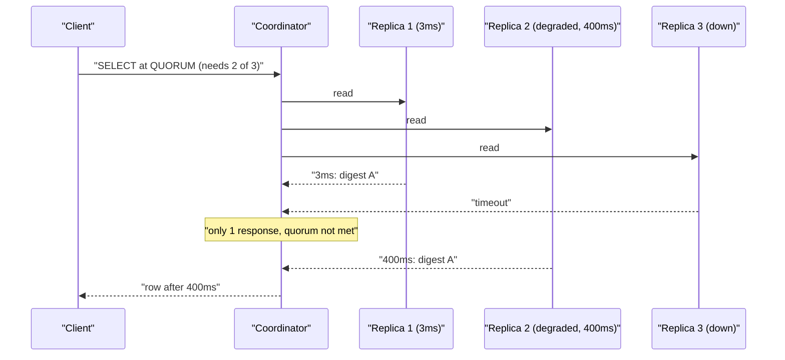
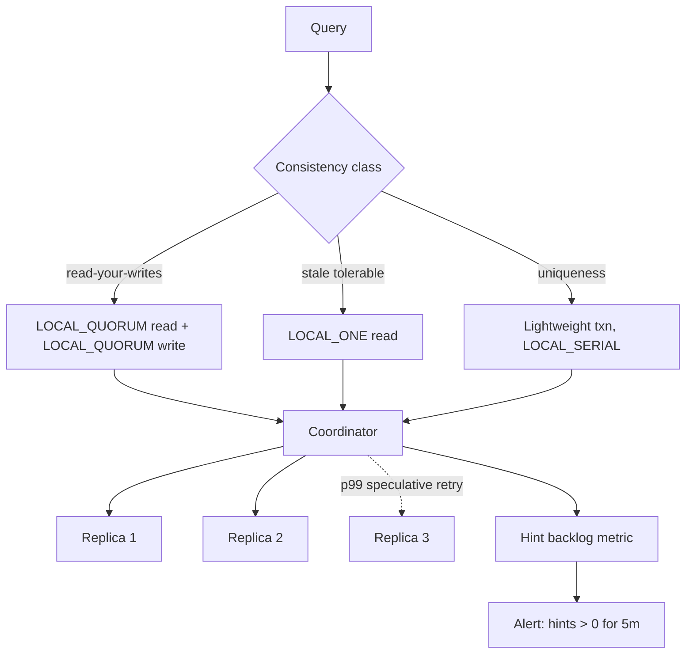

> **Scenario** — একটি Cassandra keyspace `RF=3`-এ `LOCAL_QUORUM` read ও write চালায়। firmware bug-এর পর একটি replica-র disk ৪০০ms read ফেরাতে শুরু করে। দুইটি সুস্থ replica প্রতিটি query উত্তর দিতে পারত, তবুও পুরো service-এর read p99 তিনগুণ হয়।

## Why it matters

- `R + W > N` read-your-writes-এর পাঠ্যপুস্তকীয় নিয়ম, আর সেটা দরকার কিন্তু যথেষ্ট নয়: sloppy quorum, hinted handoff আর node replacement সবই "যে R replica পড়ছেন সেগুলো যে W replica-তে লিখেছেন তার সাথে overlap করে" ধারণাটি ভাঙে।
- Quorum latency নির্ধারণ করে *quorum-এর সবচেয়ে ধীর replica*, average নয়। `RF=3, QUORUM=2`-এ আপনি তিনটির দ্বিতীয় দ্রুততমটির জন্য অপেক্ষা করেন — তাই তিনটির একটি degraded node এক-তৃতীয়াংশ request-এর p99 তোলে।
- `R` ও `W` ভুল হলে সেটা correctness bug, কিন্তু flaky test-এর মতো দেখায়: write সফল দেখায়, আর একটু পরের read প্রায় ২০-এ ১ বার পুরনো value দেয়।
- বেশিরভাগ store-এ consistency level per-query, তাই `ALL`-এ লেখা একটি analytics query কোনো node down থাকলে পুরো read path ফেলে দিতে পারে।

## Symptoms

| Signal | What you observe |
|---|---|
| Read p99 | baseline-এর ৩-৫x, অথচ p50 অপরিবর্তিত — tail একটি ধীর replica অনুসরণ করে |
| Per-replica latency | `nodetool tablehistograms`-এ এক node ৪০০ms, বাকিরা ৩ms |
| Stale read | write-এর ঠিক পরের read কয়েক শতাংশ ক্ষেত্রে আগের value দেয় |
| Hinted handoff | `nodetool netstats`-এ এক node-এর জন্য বাড়তে থাকা hint backlog |
| `UnavailableException` | ৩-এর ২ replica down হলে `QUORUM`-এ throw, যদিও ১টি জীবিত |
| Read repair | `ReadRepairStage` pending task বাড়ছে; digest mismatch বাড়ছে |
| Tombstone warning | `Read 5001 live rows and 21000 tombstone cells` — quorum read tombstone খরচ বাড়ায় |

## How it breaks

গণিতটা নিরাপদ দেখায়, runtime নয়।

`R + W > N` overlap নিশ্চিত করে **শুধু যখন replica set স্থির**। বাস্তবে: sloppy quorum (Dynamo ধরনের)-এ এমন node write নিতে পারে যে natural replica নয়, আর সেটা hint হিসেবে রাখে। আপনার `W=2` সফল, কিন্তু দুই ack-এর একটি এসেছে এমন coordinator থেকে যে এখনো অসরবরাহকৃত hint ধরে আছে। পরের `R=2` read যদি দুই natural replica-তে যায়, সে write পুরোপুরি মিস করতে পারে।

তারপর latency। `RF=3, R=2`-এ quorum read দ্বিতীয় উত্তরের জন্য অপেক্ষা করে। ধীর replica required set-এ থাকার সম্ভাবনা বেশি — তিন replica, দুই দরকার হলে ধীর node প্রায় দুই-তৃতীয়াংশ request-এর required set-এ থাকে, আর যখনই সে দ্বিতীয় উত্তরদাতা তখনই latency ঠিক করে। এ কারণেই ডজন ডজন node-এর একটি খারাপ disk পুরো service-এর p99 নাড়ায়: quorum পূর্ণ না হওয়া পর্যন্ত coordinator উত্তর দিতে পারে না।



## Root causes

1. Consistency level একবার, cluster-wide বাছাই — latency-sensitive আর correctness-critical query আলাদা করা হয়নি।
2. sloppy quorum ও hinted handoff `R + W > N` রক্ষা করে বলে ধরে নেওয়া — hint অসরবরাহ থাকা অবস্থায় করে না।
3. speculative retry নেই, তাই coordinator চতুর্থ node-কে না জিজ্ঞেস করে degraded replica-র অপেক্ষা করে।
4. Replication factor quorum size-এর সমান (`RF=2, QUORUM=2`), ফলে শূন্য failure tolerance।
5. `RF` region জুড়ে, আর `LOCAL_QUORUM`-এর বদলে `QUORUM`, তাই প্রতিটি read সমুদ্র পার হয়।
6. Health check শুধু port দেখে, read latency নয়, তাই ধীর replica read path থেকে সরে না।
7. Tombstone-ভারী table, যেখানে quorum read consulted replica সংখ্যা দিয়ে scan খরচ গুণ করে।

## How to solve it

### 1. Consistency level per query বাছুন, per cluster নয়

```python
from cassandra import ConsistencyLevel
from cassandra.query import SimpleStatement

# Correctness-critical: a uniqueness claim must see all prior writes.
claim = SimpleStatement(
    "INSERT INTO idempotency_keys (key, request_hash) VALUES (%s, %s) IF NOT EXISTS",
    consistency_level=ConsistencyLevel.LOCAL_QUORUM,
    serial_consistency_level=ConsistencyLevel.LOCAL_SERIAL,  # lightweight transaction
)

# Read-mostly feed: ONE is fine, and it is ~4x cheaper on the tail.
feed = SimpleStatement(
    "SELECT * FROM activity WHERE user_id = %s LIMIT 50",
    consistency_level=ConsistencyLevel.LOCAL_ONE,
)

# Never in application code paths: ALL means any single node loss is an outage.
```

যে জোড়ায় read-your-writes দরকার, সেখানে invariant হলো `R + W > RF`। `W=LOCAL_QUORUM (৩-এর ২)` + `R=LOCAL_QUORUM (৩-এর ২)` মানে `2 + 2 > 3`। read-কে `ONE` করলে `2 + 1 = 3`, যা 3-এর *চেয়ে বড় নয়* — ২০-এ ১ stale read এখান থেকেই আসে।

### 2. Speculative retry চালু করুন, যাতে এক ধীর replica tail দখল না করে

```sql
-- Ask an extra replica once the p99 latency threshold is crossed.
ALTER TABLE app.orders WITH speculative_retry = '99p'
  AND read_repair = 'BLOCKING'
  AND additional_write_policy = '99p';

-- Verify the effect: SpeculativeRetries should be non-zero and errors flat.
-- nodetool tablestats app.orders | grep -i speculative
```

Degraded-disk পরিস্থিতিতে এটাই সবচেয়ে বেশি লাভের পরিবর্তন: coordinator p99 চিহ্নে তৃতীয় read পাঠায় আর প্রথমে উত্তর দেওয়া দুই replica থেকে জবাব দেয়।

### 3. Quorum এক datacenter-এর ভেতরে রাখুন

```sql
-- Three replicas per DC; LOCAL_QUORUM = 2 within the local DC only.
ALTER KEYSPACE app WITH replication = {
  'class': 'NetworkTopologyStrategy',
  'dc-use1': '3',
  'dc-euc1': '3'
};
-- QUORUM here means 4 of 6 and always crosses the Atlantic. Use LOCAL_QUORUM.
```

### 4. Hint backlog ও per-replica latency দৃশ্যমান করুন

```bash
# Undelivered hints break the R + W > N assumption while they exist.
nodetool netstats | grep -A3 'Hints'
nodetool tpstats | grep -E 'MutationStage|ReadStage|Hints'

# Per-replica read latency — find the one bad node before it moves service p99.
for host in $(nodetool status | awk '/^UN/ {print $2}'); do
  echo -n "$host "
  nodetool -h "$host" tablehistograms app.orders | awk '/^99%/ {print $4"us read"}'
done
```

```promql
# Alert when any single replica is more than 10x the median read latency.
max by (instance) (cassandra_table_read_latency_99p)
  / quantile(0.5, cassandra_table_read_latency_99p) > 10
```

### 5. Failure tolerance RF-এ রাখুন, CL-এ নয়

`RF=3, QUORUM=2` একটি node হারানো সহ্য করে। `RF=5, QUORUM=3` দুইটি সহ্য করে, কিন্তু প্রতিটি write পাঁচ node-এ যায়। যত failure tolerance দরকার সেই অনুযায়ী RF বাছুন, তারপর consistency-র জন্য CL — উল্টোটা নয়। `RF=2` + `QUORUM` হলো ফাঁদ: quorum ২, তাই একটি node হারালেই partition unavailable, অথচ RF=3-এর কোনো সুবিধা নেই।

## Target design



## Tradeoffs

| Option | Pros | Cons | Choose when |
|---|---|---|---|
| `R=W=QUORUM` (RF ৩) | read-your-writes, এক node হারানো সহ্য | tail দ্বিতীয়-ধীর replica-তে বাঁধা | correctness-sensitive table-এর default |
| `W=QUORUM, R=ONE` | দ্রুত read, কম tail | stale read সম্ভব; R+W>N ভাঙে | feed, timeline, analytics |
| `W=ALL, R=ONE` | শক্ত guarantee-সহ সস্তা read | যেকোনো node হারালে সব write আটকায় | read-heavy, প্রায় অপরিবর্তনীয় config |
| `W=ONE, R=ALL` | সস্তা write | যেকোনো node হারালে সব read আটকায় | প্রায় কখনো নয় |
| RF ৫ + QUORUM ৩ | দুই failure সহ্য | ৫x write amplification, বেশি storage | বড় cluster, ঘন ঘন node হারানো |
| Lightweight transaction | আসল compare-and-set | ৪ round trip; স্বাভাবিক write-এর ~১০x latency | uniqueness, idempotency claim |

## Verification checklist

- [ ] প্রতিটি table-এর documented `(R, W, RF)` ত্রয়ী, যেখানে read-your-writes প্রতিশ্রুত সেখানে `R + W > RF` মানে।
- [ ] latency-sensitive table-এ `speculative_retry` percentile-এ সেট (`NONE` নয়) আর `SpeculativeRetries` শূন্য নয়।
- [ ] Cross-region keyspace `LOCAL_QUORUM` ব্যবহার করে; codebase grep-এ খালি `QUORUM` বা `ALL` নেই।
- [ ] Hint backlog alert আছে আর স্বাভাবিক অবস্থায় শূন্য।
- [ ] Per-replica p99 read latency export করা আর median-এর ১০x-এ alert।
- [ ] Game day-তে একটি replica মারলে `LOCAL_QUORUM`-এ read ও write দুটোই চলে।
- [ ] এক node-এ slow-disk injection (`tc` বা `dm-delay`) test-এ service p99 ২০%-এর কম বাড়ে।

## Anti-patterns

- "নিরাপদ থাকতে" `ALL` ব্যবহার — প্রতিটি node-কে single point of failure বানিয়েছেন।
- `RF=2` + `QUORUM` চালানো, যা `RF=3`-এর চেয়ে কঠোরভাবে খারাপ: failure tolerance নেই, quorum-এর সমান write খরচ।
- `R + W` ঠিক না করে client-এ `sleep(200)` দিয়ে stale read সারানো।
- hinted handoff consistency রক্ষা করে ভাবা; সে durability রক্ষা করে, read overlap নয়।
- `speculative_retry = NONE` রেখে tail latency-র দোষ "network"-কে দেওয়া।
- Peak-এ tombstone-ভারী table-এ ad-hoc analytics query `QUORUM`-এ চালাতে দেওয়া।

## Related

- [PACELC: the latency price of consistency](/systems/distributed-systems/pacelc-latency-consistency)
- [Designing UX for eventual consistency](/systems/distributed-systems/eventual-consistency-user-experience)
- [Raft in practice: what the paper leaves out](/systems/distributed-systems/consensus-raft-in-practice)
