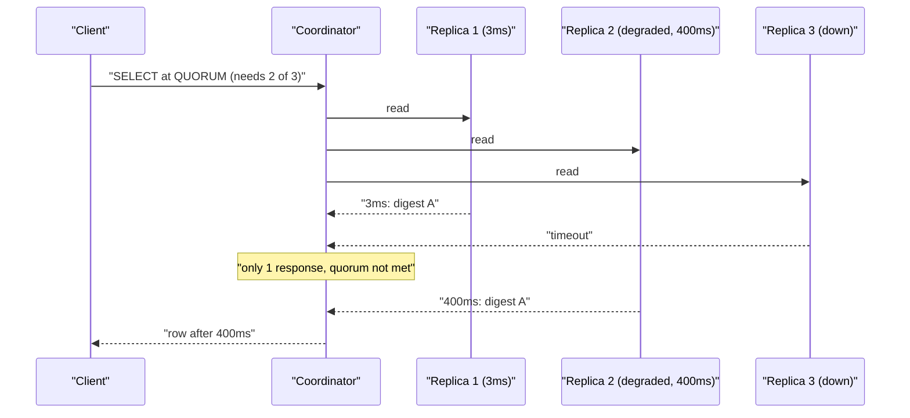
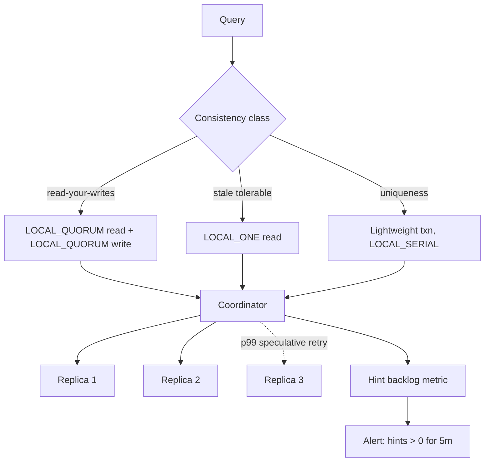

> **Scenario** — A Cassandra keyspace runs `RF=3` with `LOCAL_QUORUM` reads and writes. A single replica's disk starts returning 400ms reads after a firmware bug. Read p99 across the whole service triples, even though two healthy replicas could have answered every query.

## Why it matters

- `R + W > N` is the textbook rule for read-your-writes, and it is necessary but not sufficient: sloppy quorums, hinted handoff, and node replacement all break the assumption that the R replicas you read overlap the W replicas you wrote.
- Quorum latency is set by the *slowest replica in the quorum*, not the average. With `RF=3, QUORUM=2`, you wait for the second-fastest of three — so one degraded node out of three raises p99 for a third of requests.
- Getting `R` and `W` wrong is a correctness bug that looks like a flaky test: writes appear to succeed, and a read a moment later returns the old value about 1 in 20 times.
- Consistency level is per-query in most stores, so a single badly written analytics query at `ALL` can take down the whole read path when any node is down.

## Symptoms

| Signal | What you observe |
|---|---|
| Read p99 | 3-5x baseline while p50 is unchanged — the tail follows one slow replica |
| Per-replica latency | `nodetool tablehistograms` shows one node at 400ms, peers at 3ms |
| Stale reads | A read immediately after a write returns the previous value a few percent of the time |
| Hinted handoff | `nodetool netstats` shows a growing hint backlog for one node |
| `UnavailableException` | Thrown at `QUORUM` when 2 of 3 replicas are down, even though 1 is alive |
| Read repair | `ReadRepairStage` pending tasks climbing; digest mismatches rising |
| Tombstone warnings | `Read 5001 live rows and 21000 tombstone cells` — quorum reads amplify tombstone cost |

## How it breaks

The arithmetic looks safe and the runtime is not.

`R + W > N` guarantees overlap **only when the replica set is fixed**. In practice: with sloppy quorums (Dynamo-style), a write can be accepted by a node that is not a natural replica and stored as a hint. Your `W=2` succeeded, but one of those two acknowledgements came from a coordinator holding a hint that has not yet been delivered. A subsequent `R=2` read against the two natural replicas can miss the write entirely.

Then there is latency. A quorum read at `RF=3, R=2` waits for the second response. The probability that a given request touches the slow replica and needs it to reach quorum is high — with three replicas and two required, the slow node is in the required set for roughly two thirds of requests, and it determines latency whenever it is the second to answer. This is why one bad disk out of dozens of nodes moves service-wide p99: the coordinator cannot answer until the quorum is satisfied.



## Root causes

1. Consistency level chosen once, globally, without separating latency-sensitive from correctness-critical queries.
2. Sloppy quorum and hinted handoff assumed to preserve `R + W > N` — they do not while hints are undelivered.
3. No speculative retry, so the coordinator waits for a degraded replica instead of asking a fourth node.
4. Replication factor equal to the quorum size (`RF=2, QUORUM=2`), leaving zero failure tolerance.
5. `RF` spread across regions with `QUORUM` instead of `LOCAL_QUORUM`, so every read crosses an ocean.
6. Slow replicas not ejected from the read path because health checks only test the port, not read latency.
7. Tombstone-heavy tables where quorum reads multiply the scan cost by the number of replicas consulted.

## How to solve it

### 1. Choose the consistency level per query, not per cluster

```python
from cassandra import ConsistencyLevel
from cassandra.query import SimpleStatement

# Correctness-critical: a uniqueness claim must see all prior writes.
claim = SimpleStatement(
    "INSERT INTO idempotency_keys (key, request_hash) VALUES (%s, %s) IF NOT EXISTS",
    consistency_level=ConsistencyLevel.LOCAL_QUORUM,
    serial_consistency_level=ConsistencyLevel.LOCAL_SERIAL,  # lightweight transaction
)

# Read-mostly feed: ONE is fine, and it is ~4x cheaper on the tail.
feed = SimpleStatement(
    "SELECT * FROM activity WHERE user_id = %s LIMIT 50",
    consistency_level=ConsistencyLevel.LOCAL_ONE,
)

# Never in application code paths: ALL means any single node loss is an outage.
```

The invariant to hold is `R + W > RF` for the pairs that need read-your-writes. `W=LOCAL_QUORUM (2 of 3)` plus `R=LOCAL_QUORUM (2 of 3)` gives `2 + 2 > 3`. Dropping the read to `ONE` gives `2 + 1 = 3`, which is *not* greater than 3 — that is where the 1-in-20 stale read comes from.

### 2. Turn on speculative retry so one slow replica cannot own your tail

```sql
-- Ask an extra replica once the p99 latency threshold is crossed.
ALTER TABLE app.orders WITH speculative_retry = '99p'
  AND read_repair = 'BLOCKING'
  AND additional_write_policy = '99p';

-- Verify the effect: SpeculativeRetries should be non-zero and errors flat.
-- nodetool tablestats app.orders | grep -i speculative
```

This is the single highest-leverage change for the degraded-disk scenario: the coordinator sends a third read at the p99 mark and answers from whichever two replicas respond first.

### 3. Keep the quorum inside one datacenter

```sql
-- Three replicas per DC; LOCAL_QUORUM = 2 within the local DC only.
ALTER KEYSPACE app WITH replication = {
  'class': 'NetworkTopologyStrategy',
  'dc-use1': '3',
  'dc-euc1': '3'
};
-- QUORUM here means 4 of 6 and always crosses the Atlantic. Use LOCAL_QUORUM.
```

### 4. Make hint backlog and per-replica latency visible

```bash
# Undelivered hints break the R + W > N assumption while they exist.
nodetool netstats | grep -A3 'Hints'
nodetool tpstats | grep -E 'MutationStage|ReadStage|Hints'

# Per-replica read latency — find the one bad node before it moves service p99.
for host in $(nodetool status | awk '/^UN/ {print $2}'); do
  echo -n "$host "
  nodetool -h "$host" tablehistograms app.orders | awk '/^99%/ {print $4"us read"}'
done
```

```promql
# Alert when any single replica is more than 10x the median read latency.
max by (instance) (cassandra_table_read_latency_99p)
  / quantile(0.5, cassandra_table_read_latency_99p) > 10
```

### 5. Give yourself failure tolerance in the RF, not the CL

`RF=3, QUORUM=2` tolerates one node loss. `RF=5, QUORUM=3` tolerates two but makes every write fan out to five nodes. Pick RF for the failure tolerance you need, then set CL for consistency — not the other way around. `RF=2` with `QUORUM` is the trap: quorum is 2, so a single node loss makes the partition unavailable while giving you none of the benefits of RF=3.

## Target design



## Tradeoffs

| Option | Pros | Cons | Choose when |
|---|---|---|---|
| `R=W=QUORUM` (RF 3) | Read-your-writes, tolerates one node loss | Tail bound by second-slowest replica | Default for correctness-sensitive tables |
| `W=QUORUM, R=ONE` | Fast reads, low tail | Stale reads possible; violates R+W>N | Feeds, timelines, analytics |
| `W=ALL, R=ONE` | Cheapest reads with strong guarantee | Any node loss blocks all writes | Read-heavy, rarely written config |
| `W=ONE, R=ALL` | Cheapest writes | Any node loss blocks all reads | Almost never |
| RF 5 with QUORUM 3 | Two-failure tolerance | 5x write amplification, more storage | Large clusters, frequent node loss |
| Lightweight transactions | Real compare-and-set | 4 round trips; ~10x latency of a normal write | Uniqueness, idempotency claims |

## Verification checklist

- [ ] For every table, the documented `(R, W, RF)` triple satisfies `R + W > RF` wherever read-your-writes is promised.
- [ ] `speculative_retry` is set to a percentile (not `NONE`) on latency-sensitive tables and `SpeculativeRetries` is non-zero.
- [ ] Cross-region keyspaces use `LOCAL_QUORUM`; a grep of the codebase finds no bare `QUORUM` or `ALL`.
- [ ] Hint backlog alert exists and is normally zero.
- [ ] Per-replica p99 read latency is exported and alerted at 10x the median.
- [ ] Killing one replica in a game day leaves both reads and writes working at `LOCAL_QUORUM`.
- [ ] A slow-disk injection test (`tc` or `dm-delay` on one node) shows service p99 rising less than 20%.

## Anti-patterns

- Using `ALL` "to be safe" — you have made every node a single point of failure.
- Running `RF=2` with `QUORUM`, which is strictly worse than `RF=3`: no failure tolerance, same write cost as a quorum.
- Fixing stale reads by adding a `sleep(200)` in the client instead of correcting `R + W`.
- Assuming hinted handoff preserves consistency; it preserves durability, not read overlap.
- Leaving `speculative_retry = NONE` and then attributing tail latency to "the network".
- Letting an ad-hoc analytics query run at `QUORUM` against a tombstone-heavy table during peak.

## Related

- [PACELC: the latency price of consistency](/systems/distributed-systems/pacelc-latency-consistency)
- [Designing UX for eventual consistency](/systems/distributed-systems/eventual-consistency-user-experience)
- [Raft in practice: what the paper leaves out](/systems/distributed-systems/consensus-raft-in-practice)
