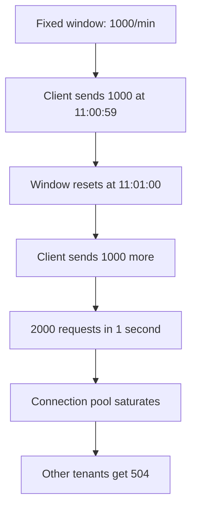
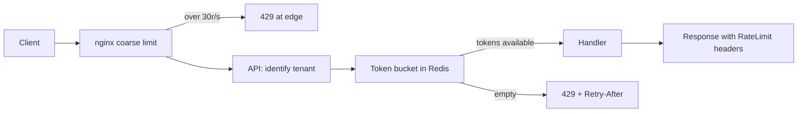

> **Scenario** - আপনার public API প্রতি tenant-কে মিনিটে ১,০০০ request দেয়। এক partner-এর nightly sync প্রতি মিনিটের প্রথম ৩০০ms-এ ১,০০০ request ছুড়ে তারপর ঘুমায়। Limiter বলছে তারা quota-র ভেতরেই আছে। আপনার database burst-এ ৩,৩০০ rps দেখে, connection pool ভরে যায়, আর কারিগরিভাবে নিখুঁত limiter-এর কারণে বাকি সব tenant 504 পায়।

## Why it matters

- যে quota শুধু মোট গোনে সে instantaneous load নিয়ে কিছুই বলে না, অথচ সেটাই database ভাঙে।
- একটি noisy tenant চল্লিশটি শান্ত tenant-এর কেনা capacity খেয়ে ফেলতে পারে।
- `Retry-After` ও quota header ছাড়া ভদ্র client "ধীরে চলো" আর "তুমি নষ্ট" আলাদা করতে পারে না, তাই আরও জোরে retry করে।
- Scraper, credential stuffing ও পাগলা client bug-এর বিরুদ্ধে rate limit সবচেয়ে সস্তা প্রতিরক্ষা।
- ভুল layer-এ (edge-এর বদলে app-এ) limit বসালে যে resource বাঁচাতে চেয়েছিলেন সেটাই খরচ হয়।

## Symptoms

| Signal | What you observe |
| --- | --- |
| Boundary spike | প্রতি মিনিটের প্রথম সেকেন্ডে request rate তিন গুণ |
| Unfair starvation | এক tenant-এর `429` rate ০%, বাকিদের ৪০% |
| Retry amplification | `429` বাড়ে, সাথে মোট traffic-ও বাড়ে |
| Counter drift | একই tenant-এর remaining quota দুই pod ভিন্ন বলে |
| Redis hot key | একটি `ratelimit:*` key Redis CPU-র ১৫% খায় |

## How it breaks

সাধারণ শুরু হয় fixed window counter দিয়ে: `count:tenant:minute` increment, limit ছাড়ালে reject, key expire। সস্তা, কিন্তু boundary-তে ভুল। 11:00:59-এ ১,০০০ আর 11:01:00-এ আরও ১,০০০ পাঠানো client এক সেকেন্ডে ২,০০০ request পাঠিয়েছে অথচ "মিনিটে ১,০০০" কখনো ছাড়ায়নি।

দ্বিতীয় সমস্যা: rate limit মানে concurrency limit নয়। সমানভাবে ছড়ানো মিনিটে দশ হাজার request মানে ১৬৭ rps; একই quota এক burst-এ এলে সেটা average-এর জন্য বানানো connection pool-এর বিরুদ্ধে thundering herd।



## Root causes

1. Fixed window boundary-তে limit-এর দ্বিগুণ পাস করতে দেয়।
2. Rate সীমিত হয়, কিন্তু burst ও concurrency নয়।
3. Counter per-pod, তাই কার্যকর limit `limit × pod_count`।
4. Authentication, database lookup ও JSON parsing-এর পরে limit enforce হয়।
5. Response header-এ remaining quota ও reset time নেই।
6. সব endpoint একই limit ভাগ করে, তাই সস্তা `GET` ও দামি report একই খরচ।

## How to solve it

### 1. চারটি algorithm জানুন

| Algorithm | Memory per key | Burst behaviour | Boundary correctness |
| --- | --- | --- | --- |
| Fixed window | ১ counter | তাৎক্ষণিক পূর্ণ limit | প্রান্তে ২x দেয় |
| Sliding log | N timestamp | নিখুঁত | নিখুঁত, তবে memory N-এর সাথে বাড়ে |
| Sliding window counter | ২ counter | আনুমানিক | ভালো approximation |
| Token bucket | ২ field (tokens, ts) | configurable burst | সঠিক |
| Leaky bucket | ২ field (level, ts) | burst নেই, output মসৃণ | সঠিক |

API-র default পছন্দ token bucket: এটি নিয়ন্ত্রিত burst (bucket capacity) দেয় আর দীর্ঘমেয়াদি rate (refill rate) ধরে রাখে। Downstream-এর *মসৃণ* stream দরকার হলে leaky bucket - payment processor ও SMS gateway সাধারণত তাই চায়।

### 2. Redis-এ atomic token bucket

```lua
-- token_bucket.lua
-- KEYS[1] bucket key
-- ARGV[1] capacity, ARGV[2] refill per second, ARGV[3] now (ms), ARGV[4] cost
local capacity   = tonumber(ARGV[1])
local refill     = tonumber(ARGV[2])
local now        = tonumber(ARGV[3])
local cost       = tonumber(ARGV[4])

local state  = redis.call('HMGET', KEYS[1], 'tokens', 'ts')
local tokens = tonumber(state[1])
local ts     = tonumber(state[2])

if tokens == nil then
  tokens = capacity
  ts = now
end

local elapsed = math.max(0, now - ts) / 1000
tokens = math.min(capacity, tokens + elapsed * refill)

local allowed = 0
local retry_after = 0

if tokens >= cost then
  tokens = tokens - cost
  allowed = 1
else
  retry_after = math.ceil((cost - tokens) / refill)
end

redis.call('HMSET', KEYS[1], 'tokens', tokens, 'ts', now)
redis.call('PEXPIRE', KEYS[1], math.ceil((capacity / refill) * 1000) + 1000)

return { allowed, math.floor(tokens), retry_after }
```

### 3. সৎ header সহ Laravel middleware

```php
<?php

namespace App\Http\Middleware;

use Closure;
use Illuminate\Http\Request;
use Illuminate\Support\Facades\Redis;
use Symfony\Component\HttpFoundation\Response;

class TokenBucketLimiter
{
    private const SCRIPT = __DIR__.'/../../../resources/lua/token_bucket.lua';

    public function handle(Request $request, Closure $next, string $tier = 'default'): Response
    {
        [$capacity, $refill] = match ($tier) {
            'search'  => [20, 5],    // burst 20, 5 rps sustained
            'reports' => [2, 0.1],   // burst 2, 1 per 10s
            default   => [100, 16],  // burst 100, ~1000/min
        };

        $key = sprintf('rl:%s:%s', $tier, $request->user()->tenant_id);
        $cost = (int) $request->attributes->get('request_cost', 1);

        [$allowed, $remaining, $retryAfter] = Redis::eval(
            file_get_contents(self::SCRIPT),
            1,
            $key,
            $capacity,
            $refill,
            (int) (microtime(true) * 1000),
            $cost,
        );

        if (! $allowed) {
            return response()->json([
                'error' => 'rate_limited',
                'tier'  => $tier,
            ], 429)
                ->header('Retry-After', (string) max(1, $retryAfter))
                ->header('RateLimit-Limit', (string) $capacity)
                ->header('RateLimit-Remaining', '0')
                ->header('RateLimit-Reset', (string) max(1, $retryAfter));
        }

        return $next($request)
            ->header('RateLimit-Limit', (string) $capacity)
            ->header('RateLimit-Remaining', (string) $remaining);
    }
}
```

### 4. সস্তা traffic edge-এ ঝরিয়ে দিন

Application-level limiting-এও একটি PHP worker খরচ হয়। স্পষ্ট abuse যেন app পর্যন্ত না আসে সেজন্য nginx-এ মোটা দাগের limit দিন, আর সূক্ষ্ম per-tenant যুক্তি app-এ রাখুন:

```nginx
limit_req_zone $http_x_api_key zone=api_key:20m rate=30r/s;
limit_req_status 429;

location /v1/ {
    limit_req zone=api_key burst=60 nodelay;
    add_header Retry-After 2 always;
    proxy_pass http://api_upstream;
}
```

### 5. Endpoint-এর আলাদা দাম রাখুন

প্রতিটি route-এ cost বসান - `GET /v1/orders/{id}` = ১, `POST /v1/reports` = ৫০ - আর সেই cost bucket থেকে কাটুন। তখন একটিমাত্র quota সংখ্যা ভিন্নধর্মী API জুড়ে অর্থবহ হয়।

## Target design



## Tradeoffs

| Option | Pros | Cons | Choose when |
| --- | --- | --- | --- |
| Fixed window | তুচ্ছ সরল, এক counter | প্রান্তে ২x burst | internal, সহনশীল limit |
| Sliding log | নিখুঁত | request count-এর সাথে memory বাড়ে | কম volume, বেশি মূল্যের endpoint |
| Token bucket | নিয়ন্ত্রিত burst + স্থির rate | atomic script দরকার | public API, default পছন্দ |
| Leaky bucket | downstream output মসৃণ | বৈধ burst reject করে | SMS, payment, email vendor |
| শুধু edge limiting | সবচেয়ে সস্তা, app বাঁচায় | per-tenant fairness নেই | DDoS ও scraper প্রতিরোধ |

## Verification checklist

- [ ] এক burst-এ limit-এর ২x পাঠিয়ে দেখুন ঠিক `capacity` পাস করে, বাকিরা যুক্তিসঙ্গত `Retry-After` সহ `429` পায়।
- [ ] মিনিট boundary-র দুই পাশে দুটি burst দিয়ে যাচাই করুন ২x পাস *হয় না*।
- [ ] API ২ থেকে ৬ pod-এ scale করে কার্যকর limit অপরিবর্তিত আছে কিনা দেখুন।
- [ ] এক window-এ `RateLimit-Remaining` monotonically কমছে - assert করুন।
- [ ] একটি `429` app time ৫ms-এর কম নেয় (বা edge-এ serve হয়) কিনা দেখুন।
- [ ] Peak load-এ কোনো একক Redis key instance CPU-র ~১% ছাড়ায় না তা নিশ্চিত করুন।

## Anti-patterns

- Database-backed auth-এর *পরে* application middleware-এ limit বসানো, ফলে abusive traffic তবু database-এ পৌঁছায়।
- Per-pod in-memory counter, যা চুপচাপ limit-কে replica সংখ্যা দিয়ে গুণ করে।
- `429`-এর বদলে `503` ফেরানো, যা client-কে throttling-কে outage ভেবে জোরে retry করতে শেখায়।
- `Retry-After` বাদ দিয়ে client-কে আন্দাজে ফেলা।
- সব endpoint-এ একটি global limit, ফলে report export health check-কে অনাহারে রাখে।
- CDN বা NAT-এর পেছনে IP দিয়ে rate limit, যা হাজারো user-কে এক bucket-এ ফেলে।

## Related

- [Retry with jitter, budgets, and honest error classes](/systems/api-integration/retry-with-jitter-strategy)
- [GraphQL query depth and the N+1 tax](/systems/api-integration/graphql-depth-and-n-plus-one)
- [Pagination at scale: offsets, cursors, and drift](/systems/api-integration/pagination-at-scale)
