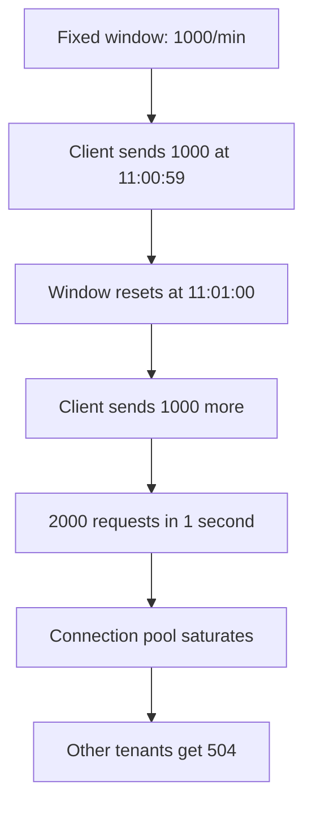
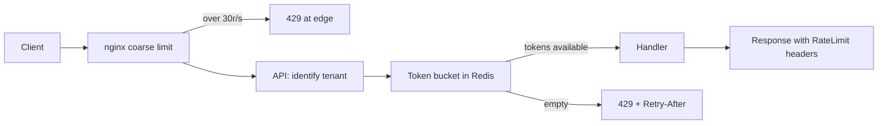

> **Scenario** — Your public API allows 1,000 requests per minute per tenant. A partner's nightly sync fires 1,000 requests in the first 300ms of every minute, then sleeps. The limiter says they are within quota. Your database sees 3,300 rps in bursts, connection pool saturates, and every other tenant gets 504s from a limiter that is technically working perfectly.

## Why it matters

- A quota that only measures totals says nothing about instantaneous load, which is what actually breaks the database.
- One noisy tenant can consume the capacity you sold to forty quiet ones.
- Without `Retry-After` and quota headers, well-behaved clients cannot distinguish "slow down" from "you are broken", so they retry harder.
- Rate limits are your cheapest defence against scrapers, credential stuffing, and runaway client bugs.
- Limits applied in the wrong layer (app instead of edge) still consume the resources you were trying to protect.

## Symptoms

| Signal | What you observe |
| --- | --- |
| Boundary spikes | Request rate triples in the first second of every minute |
| Unfair starvation | One tenant's `429` rate is 0% while others sit at 40% |
| Retry amplification | `429` responses climb and total traffic climbs with them |
| Counter drift | Two API pods report different remaining quota for the same tenant |
| Redis hot key | A single `ratelimit:*` key accounts for 15% of Redis CPU |

## How it breaks

The fixed window counter is the usual starting point: increment `count:tenant:minute`, reject above the limit, let the key expire. It is cheap and it is wrong at the boundary. A client sending 1,000 requests at 11:00:59 and another 1,000 at 11:01:00 has sent 2,000 requests in one second while never exceeding "1,000 per minute".

The second problem is that a rate limit is not a concurrency limit. Ten thousand requests per minute spread evenly is 167 rps; the same quota delivered in one burst is a thundering herd against a connection pool sized for the average.



## Root causes

1. Fixed windows allow 2x the limit across a boundary.
2. Rate is limited but burst and concurrency are not.
3. Counters are per-pod, so the effective limit is `limit × pod_count`.
4. Limits are enforced after authentication, database lookups, and JSON parsing.
5. Response headers omit remaining quota and reset time.
6. All endpoints share one limit, so a cheap `GET` and an expensive report cost the same.

## How to solve it

### 1. Know the four algorithms

| Algorithm | Memory per key | Burst behaviour | Boundary correctness |
| --- | --- | --- | --- |
| Fixed window | 1 counter | Full limit instantly | Allows 2x at edges |
| Sliding log | N timestamps | Exact | Exact, but memory grows with N |
| Sliding window counter | 2 counters | Approximate | Good approximation |
| Token bucket | 2 fields (tokens, ts) | Configurable burst | Correct |
| Leaky bucket | 2 fields (level, ts) | No burst, smooths output | Correct |

Token bucket is the default choice for APIs: it allows a controlled burst (bucket capacity) while enforcing a long-run rate (refill rate). Leaky bucket is the choice when the downstream needs a *smooth* stream — payment processors and SMS gateways usually do.

### 2. Token bucket in Redis, atomically

```lua
-- token_bucket.lua
-- KEYS[1] bucket key
-- ARGV[1] capacity, ARGV[2] refill per second, ARGV[3] now (ms), ARGV[4] cost
local capacity   = tonumber(ARGV[1])
local refill     = tonumber(ARGV[2])
local now        = tonumber(ARGV[3])
local cost       = tonumber(ARGV[4])

local state  = redis.call('HMGET', KEYS[1], 'tokens', 'ts')
local tokens = tonumber(state[1])
local ts     = tonumber(state[2])

if tokens == nil then
  tokens = capacity
  ts = now
end

local elapsed = math.max(0, now - ts) / 1000
tokens = math.min(capacity, tokens + elapsed * refill)

local allowed = 0
local retry_after = 0

if tokens >= cost then
  tokens = tokens - cost
  allowed = 1
else
  retry_after = math.ceil((cost - tokens) / refill)
end

redis.call('HMSET', KEYS[1], 'tokens', tokens, 'ts', now)
redis.call('PEXPIRE', KEYS[1], math.ceil((capacity / refill) * 1000) + 1000)

return { allowed, math.floor(tokens), retry_after }
```

### 3. Laravel middleware with honest headers

```php
<?php

namespace App\Http\Middleware;

use Closure;
use Illuminate\Http\Request;
use Illuminate\Support\Facades\Redis;
use Symfony\Component\HttpFoundation\Response;

class TokenBucketLimiter
{
    private const SCRIPT = __DIR__.'/../../../resources/lua/token_bucket.lua';

    public function handle(Request $request, Closure $next, string $tier = 'default'): Response
    {
        [$capacity, $refill] = match ($tier) {
            'search'  => [20, 5],    // burst 20, 5 rps sustained
            'reports' => [2, 0.1],   // burst 2, 1 per 10s
            default   => [100, 16],  // burst 100, ~1000/min
        };

        $key = sprintf('rl:%s:%s', $tier, $request->user()->tenant_id);
        $cost = (int) $request->attributes->get('request_cost', 1);

        [$allowed, $remaining, $retryAfter] = Redis::eval(
            file_get_contents(self::SCRIPT),
            1,
            $key,
            $capacity,
            $refill,
            (int) (microtime(true) * 1000),
            $cost,
        );

        if (! $allowed) {
            return response()->json([
                'error' => 'rate_limited',
                'tier'  => $tier,
            ], 429)
                ->header('Retry-After', (string) max(1, $retryAfter))
                ->header('RateLimit-Limit', (string) $capacity)
                ->header('RateLimit-Remaining', '0')
                ->header('RateLimit-Reset', (string) max(1, $retryAfter));
        }

        return $next($request)
            ->header('RateLimit-Limit', (string) $capacity)
            ->header('RateLimit-Remaining', (string) $remaining);
    }
}
```

### 4. Shed the cheap traffic at the edge

Application-level limiting still costs a PHP worker. Put a coarse limit in nginx so obvious abuse never reaches the app, and keep the precise per-tenant logic in the app:

```nginx
limit_req_zone $http_x_api_key zone=api_key:20m rate=30r/s;
limit_req_status 429;

location /v1/ {
    limit_req zone=api_key burst=60 nodelay;
    add_header Retry-After 2 always;
    proxy_pass http://api_upstream;
}
```

### 5. Price endpoints differently

Assign a cost to each route — `GET /v1/orders/{id}` costs 1, `POST /v1/reports` costs 50 — and deduct that cost from the bucket. A single quota number then means something across a heterogeneous API.

## Target design



## Tradeoffs

| Option | Pros | Cons | Choose when |
| --- | --- | --- | --- |
| Fixed window | Trivial, one counter | 2x burst at boundaries | Internal, forgiving limits |
| Sliding log | Exact | Memory grows with request count | Low-volume, high-value endpoints |
| Token bucket | Controlled burst plus steady rate | Needs atomic script | Public APIs, the default |
| Leaky bucket | Smooth downstream output | Rejects legitimate bursts | Feeding SMS, payment, email vendors |
| Edge-only limiting | Cheapest, protects the app | No per-tenant fairness | DDoS and scraper defence |

## Verification checklist

- [ ] Send 2x the limit in one burst and confirm exactly `capacity` requests pass, then `429` with a sane `Retry-After`.
- [ ] Straddle a minute boundary with two bursts and verify you do *not* get 2x through.
- [ ] Scale the API from 2 to 6 pods and confirm the effective limit does not change.
- [ ] Assert `RateLimit-Remaining` decreases monotonically within a window.
- [ ] Check that a `429` costs under 5ms of app time (or is served at the edge).
- [ ] Confirm no single Redis key exceeds ~1% of instance CPU under peak load.

## Anti-patterns

- Limiting in application middleware placed *after* database-backed auth, so abusive traffic still hits the database.
- In-memory counters per pod, which silently multiply the limit by the replica count.
- Returning `503` instead of `429`, teaching clients to treat throttling as an outage and retry aggressively.
- Omitting `Retry-After`, forcing clients to guess.
- One global limit across all endpoints, so a report export starves the health check.
- Rate limiting by IP behind a CDN or NAT, which lumps thousands of users into one bucket.

## Related

- [Retry with jitter, budgets, and honest error classes](/systems/api-integration/retry-with-jitter-strategy)
- [GraphQL query depth and the N+1 tax](/systems/api-integration/graphql-depth-and-n-plus-one)
- [Pagination at scale: offsets, cursors, and drift](/systems/api-integration/pagination-at-scale)
